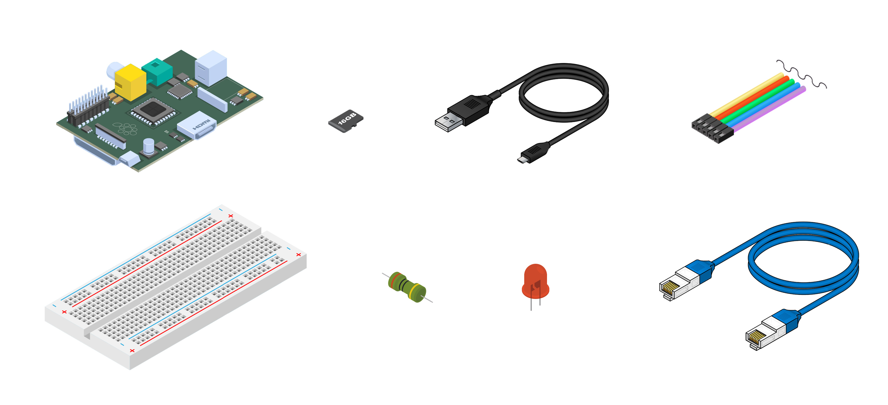
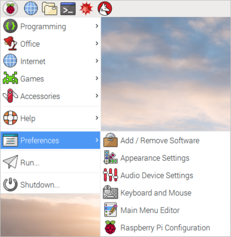
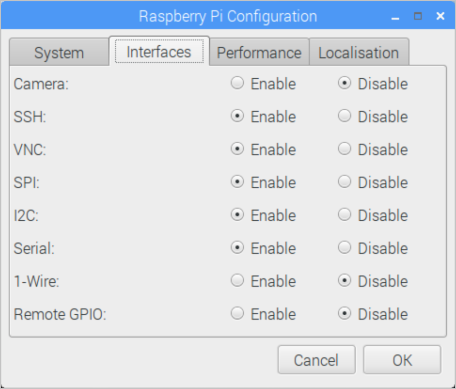
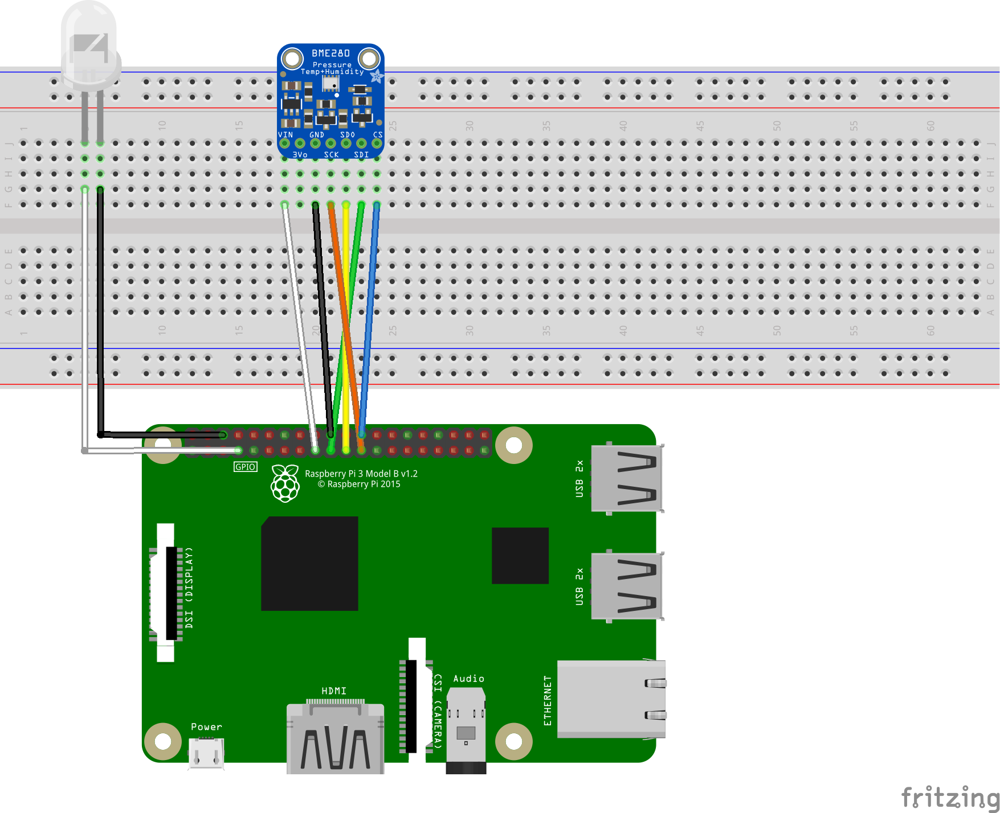
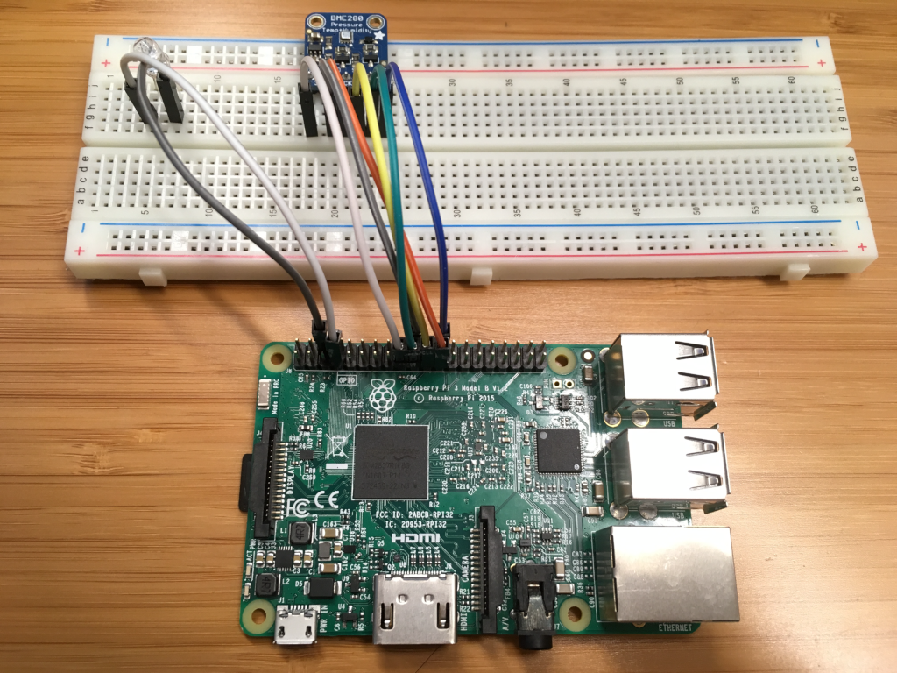
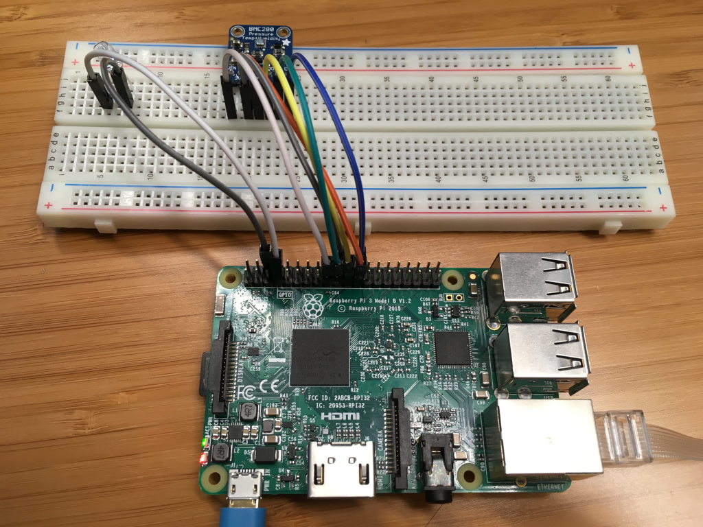
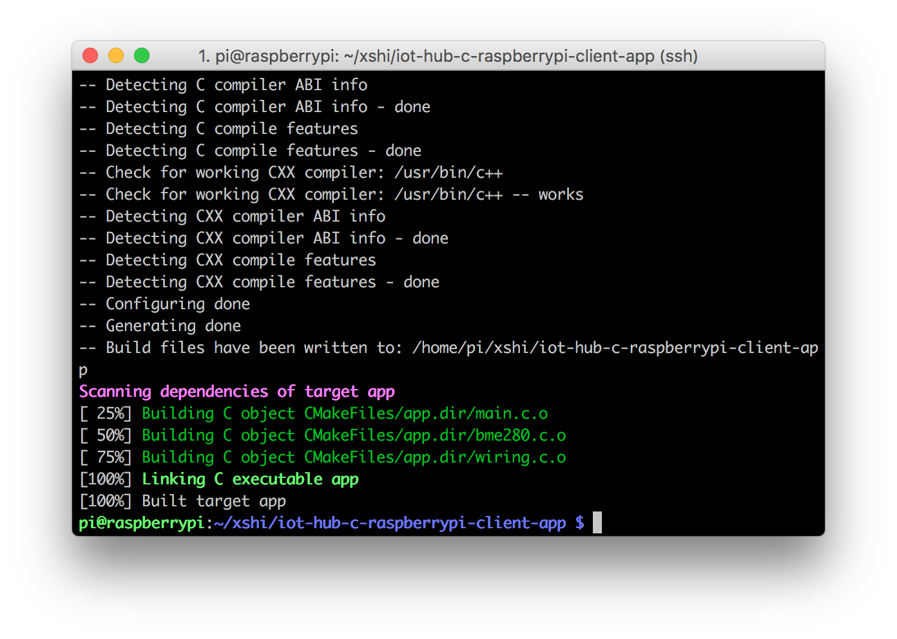

# Connect Raspberry Pi to Azure IoT Hub (C)

[!INCLUDE [iot-hub-get-started-device-selector](../../includes/iot-hub-get-started-device-selector.md)]

In this tutorial, you begin by learning the basics of working with Raspberry Pi that's running Raspberry Pi OS. You then learn how to seamlessly connect your devices to the cloud by using [Azure IoT Hub](about-iot-hub.md). For Windows 10 IoT Core samples, go to the [Windows Dev Center](https://www.windowsondevices.com/).

Don't have a kit yet? Try [Raspberry Pi online simulator](iot-hub-raspberry-pi-web-simulator-get-started.md). Or buy a new kit [here](https://azure.microsoft.com/develop/iot/starter-kits).

## What you do

* Create an IoT hub.

* Register a device for Pi in your IoT hub.

* Setup Raspberry Pi.

* Run a sample application on Pi to send sensor data to your IoT hub.

Connect Raspberry Pi to an IoT hub that you create. Then you run a sample application on Pi to collect temperature and humidity data from a BME280 sensor. Finally, you send the sensor data to your IoT hub.

## What you learn

* How to create an Azure IoT hub and get your new device connection string.

* How to connect Pi with a BME280 sensor.

* How to collect sensor data by running a sample application on Pi.

* How to send sensor data to your IoT hub.

## What you need



* The Raspberry Pi 2 or Raspberry Pi 3 board.

* An active Azure subscription. If you don't have an Azure account, [create a free Azure trial account](https://azure.microsoft.com/free/) in just a few minutes.

* A monitor, a USB keyboard, and mouse that connect to Pi.

* A Mac or a PC that is running Windows or Linux.

* An Internet connection.

* A 16 GB or above microSD card.

* A USB-SD adapter or microSD card to burn the operating system image onto the microSD card.

* A 5-volt 2-amp power supply with the 6-foot micro USB cable.

The following items are optional:

* An assembled Adafruit BME280 temperature, pressure, and humidity sensor.

* A breadboard.

* 6 F/M jumper wires.

* A diffused 10-mm LED.

> [!NOTE]
> These items are optional because the code sample supports simulated sensor data.
>

## Create an IoT hub

[!INCLUDE [iot-hub-include-create-hub](../../includes/iot-hub-include-create-hub.md)]

## Register a new device in the IoT hub

[!INCLUDE [iot-hub-include-create-device](../../includes/iot-hub-include-create-device.md)]

## Set up Raspberry Pi

Now set up the Raspberry Pi.

### Install the Raspberry Pi OS

Prepare the microSD card for installation of the Raspberry Pi OS image.

1. Download Raspberry Pi OS.

   1. [Download Raspberry Pi OS with Desktop](https://www.raspberrypi.org/software/) (the .zip file).

   2. Extract the image to a folder on your computer.

2. Install Raspberry Pi OS to the microSD card.

   1. [Download and install the Etcher SD card burner utility](https://etcher.io/).

   2. Run Etcher and select the Raspberry Pi OS image that you extracted in step 1.

   3. Select the microSD card drive. Note that Etcher may have already selected the correct drive.

   4. Click Flash to install Raspberry Pi OS to the microSD card.

   5. Remove the microSD card from your computer when installation is complete. It's safe to remove the microSD card directly because Etcher automatically ejects or unmounts the microSD card upon completion.

   6. Insert the microSD card into Pi.

### Enable SSH and SPI

1. Connect Pi to the monitor, keyboard and mouse, start Pi and then sign in to Raspberry Pi OS by using `pi` as the user name and `raspberry` as the password.
 
2. Click the Raspberry icon > **Preferences** > **Raspberry Pi Configuration**.

   

3. On the **Interfaces** tab, set **SPI** and **SSH** to **Enable**, and then click **OK**. If you don't have physical sensors and want to use simulated sensor data, this step is optional.

   

> [!NOTE]
> To enable SSH and SPI, you can find more reference documents on [raspberrypi.org](https://www.raspberrypi.org/documentation/remote-access/ssh/) and [RASPI-CONFIG](https://www.raspberrypi.org/documentation/configuration/raspi-config.md).
>

### Connect the sensor to Pi

Use the breadboard and jumper wires to connect an LED and a BME280 to Pi as follows. If you don’t have the sensor, [skip this section](#connect-pi-to-the-network).



The BME280 sensor can collect temperature and humidity data. And the LED will blink if there is a communication between device and the cloud.

For sensor pins, use the following wiring:

| Start (Sensor & LED)     | End (Board)            | Cable Color   |
| -----------------------  | ---------------------- | ------------: |
| LED VDD (Pin 5G)         | GPIO 4 (Pin 7)         | White cable   |
| LED GND (Pin 6G)         | GND (Pin 6)            | Black cable   |
| VDD (Pin 18F)            | 3.3V PWR (Pin 17)      | White cable   |
| GND (Pin 20F)            | GND (Pin 20)           | Black cable   |
| SCK (Pin 21F)            | SPI0 SCLK (Pin 23)     | Orange cable  |
| SDO (Pin 22F)            | SPI0 MISO (Pin 21)     | Yellow cable  |
| SDI (Pin 23F)            | SPI0 MOSI (Pin 19)     | Green cable   |
| CS (Pin 24F)             | SPI0 CS (Pin 24)       | Blue cable    |

Click to view [Raspberry Pi 2 & 3 Pin mappings](/windows/iot-core/learn-about-hardware/pinmappings/pinmappingsrpi) for your reference.

After you've successfully connected BME280 to your Raspberry Pi, it should be like below image.



### Connect Pi to the network

Turn on Pi by using the micro USB cable and the power supply. Use the Ethernet cable to connect Pi to your wired network or follow the [instructions from the Raspberry Pi Foundation](https://www.raspberrypi.org/documentation/configuration/wireless/) to connect Pi to your wireless network. After your Pi has been successfully connected to the network, you need to take a note of the [IP address of your Pi](https://www.raspberrypi.org/documentation/remote-access/ip-address.md).



## Run a sample application on Pi

### Sign into your Raspberry Pi

1. Use one of the following SSH clients from your host computer to connect to your Raspberry Pi.
   
   **Windows Users**
   1. Download and install [PuTTY](https://www.putty.org/) for Windows. 
   1. Copy the IP address of your Pi into the Host name (or IP address) section and select SSH as the connection type.
   
   

   **Mac and Ubuntu Users**

   Use the built-in SSH client on Ubuntu or macOS. You might need to run `ssh pi@<ip address of pi>` to connect Pi via SSH.
   > [!NOTE]
   > The default username is `pi` , and the password is `raspberry`.


### Configure the sample application

1. Clone the sample application by running the following command:

   ```bash
   git clone https://github.com/Azure-Samples/iot-hub-c-raspberrypi-client-app.git
   ```

2. A setup script is provided with the sample to prepare the development environment, and build the sample. Run setup script:

   ```bash
   cd ./iot-hub-c-raspberrypi-client-app
   sudo chmod u+x setup.sh
   sudo ./setup.sh
   ```

   > [!NOTE] 
   > If you **don't have a physical BME280**, you can use '--simulated-data' as command line parameter to simulate temperature&humidity data. `sudo ./setup.sh --simulated-data`
   >

### Build and run the sample application

1. The setup script should have already built the sample. However, if you make changes and need to rebuild the sample application, run the following command:

   ```bash
   cmake . && make
   ```
   
   

1. Run the sample application by running the following command:

   ```bash
   sudo ./app '<DEVICE CONNECTION STRING>'
   ```

   > [!NOTE] 
   > Make sure you copy-paste the device connection string into the single quotes.
   >

You should see the following output that shows the sensor data and the messages that are sent to your IoT hub.


## Read the messages received by your hub

One way to monitor messages received by your IoT hub from your device is to use the Azure IoT Hub extension for Visual Studio Code. To learn more, see [Use the Azure IoT Hub extension for Visual Studio Code to send and receive messages between your device and IoT Hub](iot-hub-vscode-iot-toolkit-cloud-device-messaging.md).

For more ways to process data sent by your device, continue on to the next section.

## Clean up resources

You can use the resources created in this topic with other tutorials and quickstarts in this document set. If you plan to continue on to work with other quickstarts or with the tutorials, do not clean up the resources created in this topic. If you do not plan to continue, use the following steps to delete all resources created by this topic in the Azure portal.

1. From the left-hand menu in the Azure portal, select **All resources** and then select the IoT Hub you created. 
1. At the top of the IoT Hub overview pane, click **Delete**.
1. Enter your hub name and click **Delete** again to confirm permanently deleting the IoT hub.


## Next steps

You’ve run a sample application to collect sensor data and send it to your IoT hub.

[!INCLUDE [iot-hub-get-started-next-steps](../../includes/iot-hub-get-started-next-steps.md)]