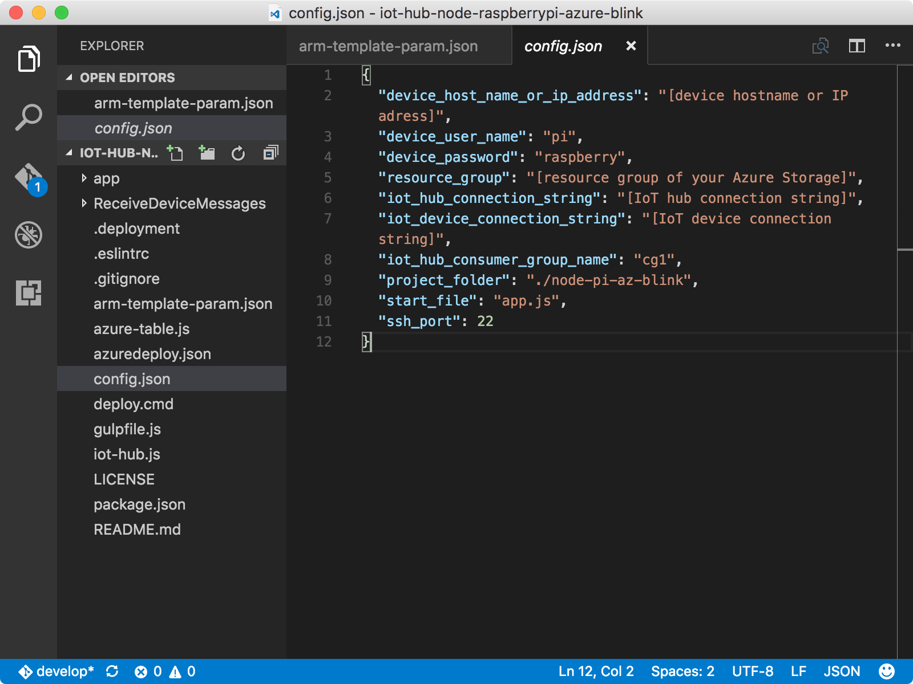
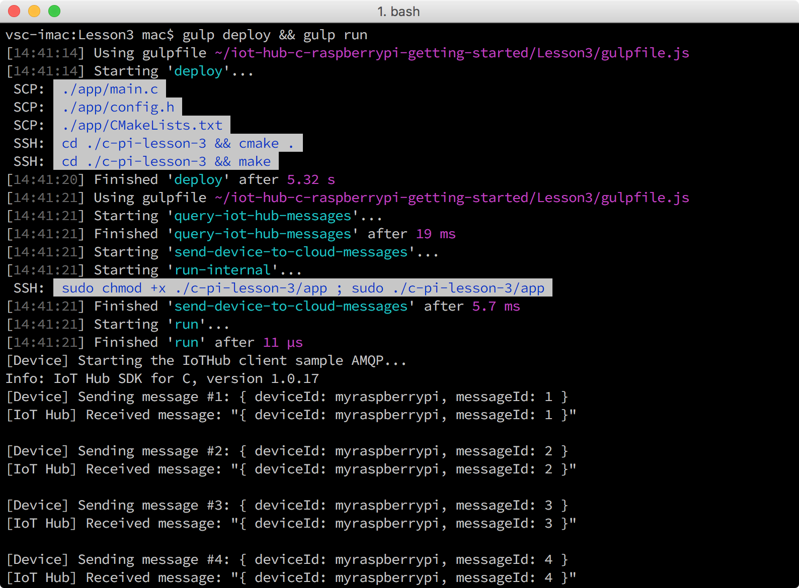

# Run a sample application to send device-to-cloud messages
## What you will do
This article will show you how to deploy and run a sample application on Raspberry Pi 3 that sends messages to your IoT hub. If you have any problems, look for solutions on the [troubleshooting page](iot-hub-raspberry-pi-kit-c-troubleshooting.md).

## What you will learn
You will learn how to use the gulp tool to deploy and run the sample Node.js application on Pi.

## What you need
* Before you start this task, you must have successfully completed [Create an Azure function app and a storage account to process and store IoT hub messages](iot-hub-raspberry-pi-kit-c-lesson3-deploy-resource-manager-template.md).

## Get your IoT hub and device connection strings
The device connection string is used by your Pi to connect to your IoT hub. The IoT hub connection string is used to connect to the identity registry in your IoT hub to manage the devices that are allowed to connect to your IoT hub. 

* List all your IoT hubs in your resource group by running the following Azure CLI command:

```bash
az iot hub list -g iot-sample --query [].name
```

Use `iot-sample` as the value of `{resource group name}` if you didn't change the value.

* Get the IoT hub connection string by running the following Azure CLI command:

```bash
az iot hub show-connection-string --name {my hub name} -g iot-sample
```

`{my hub name}` is the name that you specified when you created your IoT hub and registered Pi.

* Get the device connection string by running the following command:

```bash
az iot device show-connection-string --hub-name {my hub name} --device-id myraspberrypi -g iot-sample
```

Use `myraspberrypi` as the value of `{device id}` if you didn't change the value.

## Configure the device connection
1. Initialize the configuration file by running the following commands:
   
   ```bash
   npm install
   gulp init
   ```

> [!NOTE]
> Run **gulp install-tools** as well, if you haven't done it in Lesson 1.

2. Open the device configuration file `config-raspberrypi.json` in Visual Studio Code by running the following command:
   
   ```bash
   # For Windows command prompt
   code %USERPROFILE%\.iot-hub-getting-started\config-raspberrypi.json
   
   # For MacOS or Ubuntu
   code ~/.iot-hub-getting-started/config-raspberrypi.json
   ```
   
   
3. Make the following replacements in the `config-raspberrypi.json` file:
   
   * Replace **[device hostname or IP address]** with the device IP address or host name you got from `device-discovery-cli` or with the value inherited when you configured your device.
   * Replace **[IoT device connection string]** with the `device connection string` you obtained.
   * Replace **[IoT hub connection string]** with the `iot hub connection string` you obtained.

> [!NOTE]
> You don't need `azure_storage_connection_string` in this article. Keep it as is.

Update the `config-raspberrypi.json` file so that you can deploy the sample application from your computer.

## Deploy and run the sample application
Deploy and run the sample application on Pi by running the following command:

```bash
gulp deploy && gulp run
```

## Verify that the sample application works
You should see the LED that is connected to Pi blinking every two seconds. Every time the LED blinks, the sample application sends a message to your IoT hub and verifies that the message has been successfully sent to your IoT hub. In addition, each message received by the IoT hub is printed in the console window. The sample application terminates automatically after sending 20 messages.



## Summary
You've deployed and run the new blink sample application on Pi to send device-to-cloud messages to your IoT hub. You now monitor your messages as they are written to the storage account.

## Next steps
[Read messages persisted in Azure Storage](iot-hub-raspberry-pi-kit-c-lesson3-read-table-storage.md)

