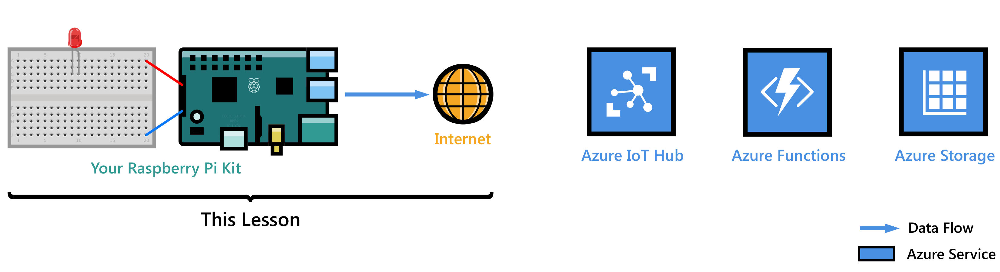
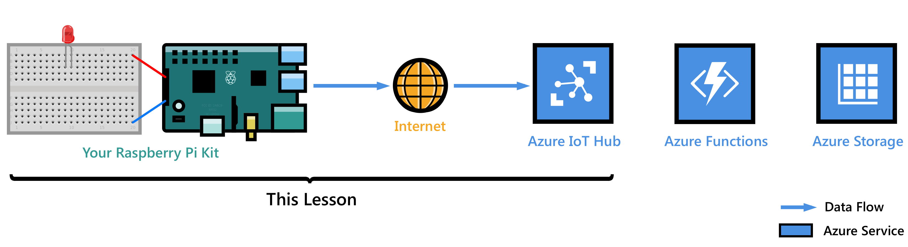
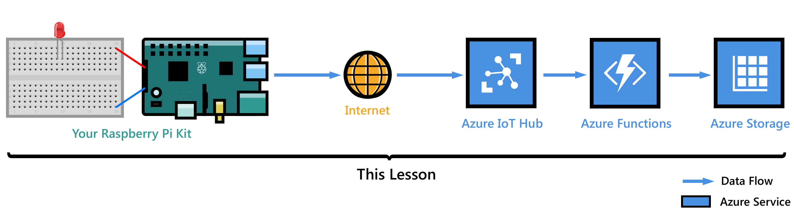

<properties
 pageTitle="Get Started with Raspberry Pi 3 | Microsoft Azure"
 description="Get Started with Raspberry Pi 3, Create your Azure IoT Hub and connect your Pi to the IoT hub"
 services="iot-hub"
 documentationCenter=""
 authors="shizn"
 manager="timlt"
 tags=""
 keywords=""/>

<tags
 ms.service="iot-hub"
 ms.devlang="multiple"
 ms.topic="article"
 ms.tgt_pltfrm="na"
 ms.workload="na"
 ms.date="10/21/2016"
 ms.author="xshi"/>

# Get Started with Raspberry Pi 3

In this tutorial, you begin by learning the basics of working with Raspberry Pi 3 that running Raspbian. You then learn how to seamlessly connect your devices to the cloud with [Azure IoT Hub](iot-hub-what-is-iot-hub.md). For Windows 10 IoT Core samples, visit [windowsondevices.com](http://www.windowsondevices.com/).

## Lesson 1: Configure your device

In this lesson, you configure your Raspberry Pi 3 device with an operating system, set up your development environment, and deploy an application to the Pi.

### Configure your device

Configure your Raspberry Pi 3 for first-time use and install the Raspbian OS, a free operating system that is optimized for the Raspberry Pi hardware.

*Estimated time to complete: 30 minutes* 

[Go to 'Configure your device'](iot-hub-raspberry-pi-kit-node-lesson1-configure-your-device.md)

### Get the tools
Download the tools and software to build and deploy your first application for the Raspberry Pi 3.

*Estimated time to complete: 20 minutes* 

[Go to 'Get the tools'](iot-hub-raspberry-pi-kit-node-lesson1-get-the-tools-win32.md)

### Create and deploy the blink application

Clone the sample Node.js application from Github, and gulp to deploy this application to your Raspberry Pi 3 board. This sample application blinks the LED connected to the board every two seconds.

*Estimated time to complete: 5 minutes* 

[Go to 'Create and deploy the blink application'](iot-hub-raspberry-pi-kit-node-lesson1-deploy-blink-app.md)

## Lesson 2: Create your IoT hub

In this lesson, you create your free Azure account, provision your Azure IoT hub and create your first device in Azure IoT hub.

Complete Lesson 1 before you start this lesson.

### Get the Azure tools

Install Azure Command-Line Interface (Azure CLI).

*Estimated time to complete: 10 minutes* 

[Go to 'Get Azure tools'](iot-hub-raspberry-pi-kit-node-lesson2-get-azure-tools-win32.md)

### Create your IoT hub and register your Raspberry Pi 3

Create your resource group, provision your first Azure IoT hub, and add your first device to the Azure IoT Hub using Azure CLI. 

*Estimated time to complete: 10 minutes* 

[Go to 'Create your IoT hub and register your Raspberry Pi 3'](iot-hub-raspberry-pi-kit-node-lesson2-prepare-azure-iot-hub.md)

## Lesson 3: Send device-to-cloud messages

In this lesson, you send messages from your Pi to your IoT hub. You also create an Azure function app that picks up incoming messages from your IoT hub and writes them to Azure table storage.

Complete Lessons 1 and 2 before you start this lesson.

### Create an Azure function app and Azure Storage account

Use an Azure Resource Manager template to create an Azure function app and an Azure Storage account.

*Estimated time to complete: 10 minutes* 

[Go to 'Create an Azure function app and Azure Storage account'](iot-hub-raspberry-pi-kit-node-lesson3-deploy-resource-manager-template.md)

### Run sample application to send device-to-cloud messages

Deploy and run a sample application to your Raspberry Pi 3 device that sends messages to IoT hub.

*Estimated time to complete: 10 minutes* 

[Go to 'Run sample application to send device-to-cloud messages'](iot-hub-raspberry-pi-kit-node-lesson3-run-azure-blink.md)

### Read messages persisted in Azure Storage
Monitor the device-to-cloud messages as they are written to your Azure Storage.

*Estimated time to complete: 5 minutes* 

[Go to 'Read messages persisted in Azure Storage'](iot-hub-raspberry-pi-kit-node-lesson3-read-table-storage.md)

## Lesson 4: Send cloud-to-device messages

This lesson demos how to send messages from your Azure IoT hub to your Raspberry Pi 3. The messages control the on and off behavior of the LED that is connected to your Pi. A sample application is prepared for you to achieve this task.

Complete Lessons 1, 2 and 3 before you start this lesson.

### Run the sample application to receive cloud-to-device messages

The sample application in Lesson 4 runs on your Pi and monitors incoming messages from your IoT hub. A new gulp task sends messages to your Pi from your IoT hub to blink the LED.

*Estimated time to complete: 10 minutes* 

[Go to 'Run the sample application to receive cloud-to-device messages'](iot-hub-raspberry-pi-kit-node-lesson4-send-cloud-to-device-messages.md)

### Optional section: Change the on and off behavior of the LED

Customize the messages to change the LED’s on and off behavior.

*Estimated time to complete: 10 minutes* 

[Go to 'Optional section: Change the on and off behavior of the LED'](iot-hub-raspberry-pi-kit-node-lesson4-change-led-behavior.md)

## Troubleshooting

If you meet any troubles during the lessons, you can seek solutions in this page.

[Go to 'Troubleshooting'](iot-hub-raspberry-pi-kit-node-troubleshooting.md)
