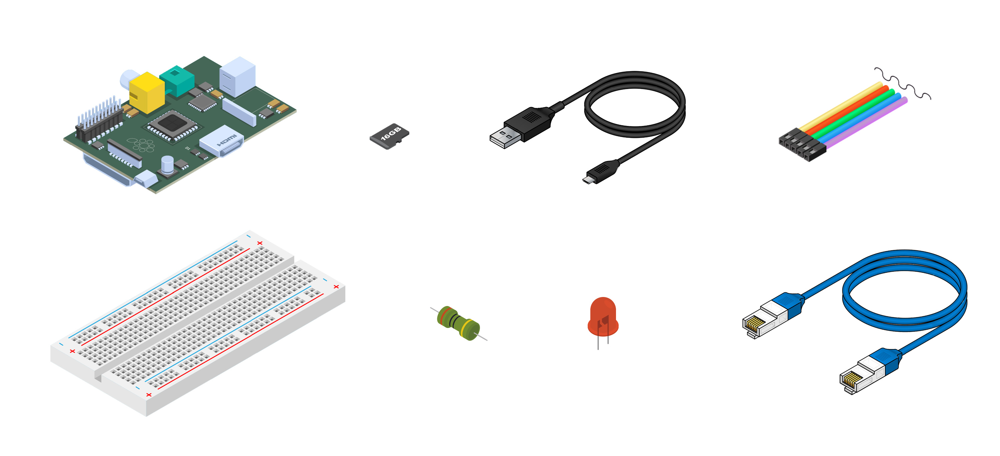
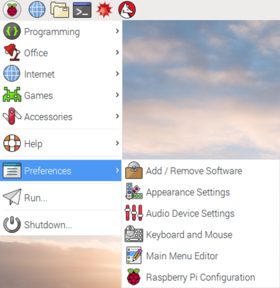
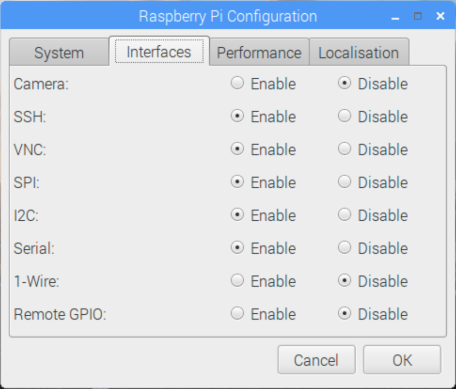
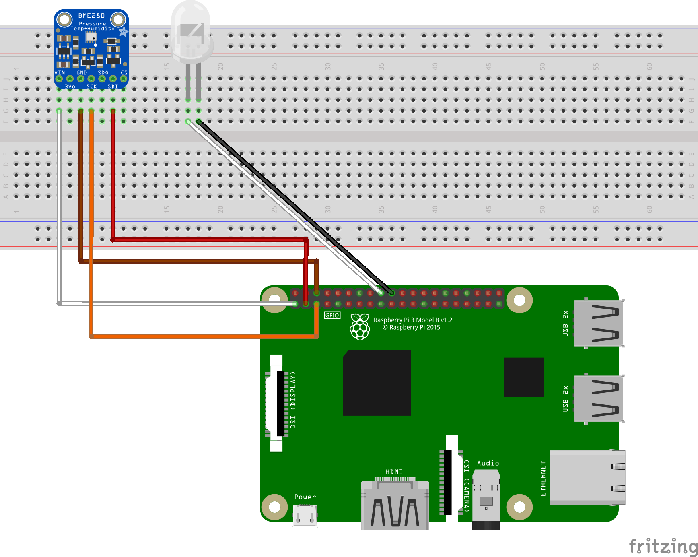
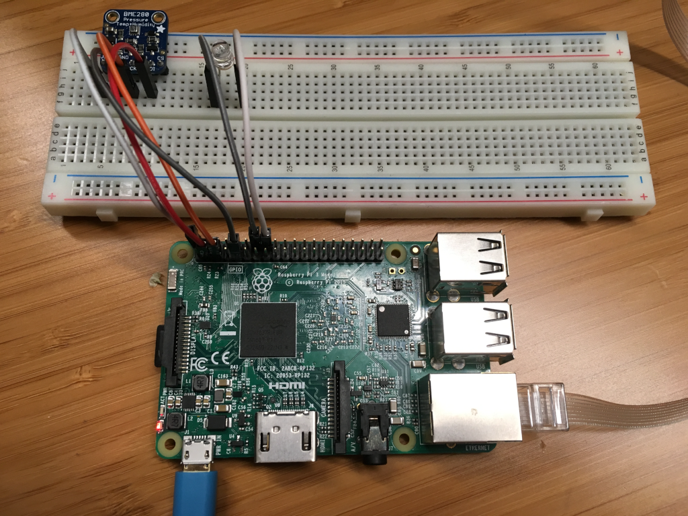
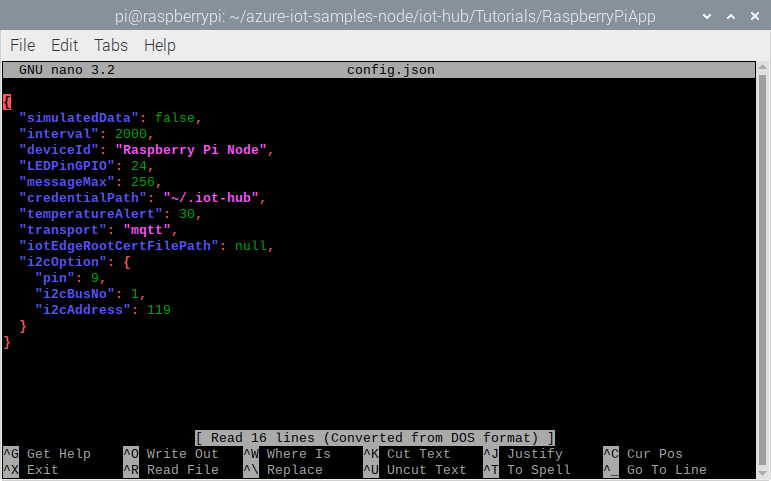

# Connect Raspberry Pi to Azure IoT Hub (Node.js)

[!INCLUDE [iot-hub-get-started-device-selector](../../includes/iot-hub-get-started-device-selector.md)]

In this tutorial, you begin by learning the basics of working with Raspberry Pi that's running Raspbian. You then learn how to seamlessly connect your devices to the cloud by using [Azure IoT Hub](about-iot-hub.md). For Windows 10 IoT Core samples, go to the [Windows Dev Center](https://www.windowsondevices.com/).

Don't have a kit yet? Try [Raspberry Pi online simulator](iot-hub-raspberry-pi-web-simulator-get-started.md). Or buy a new kit [here](https://azure.microsoft.com/develop/iot/starter-kits).

## What you do

* Create an IoT hub.

* Register a device for Pi in your IoT hub.

* Set up Raspberry Pi.

* Run a sample application on Pi to send sensor data to your IoT hub.

## What you learn

* How to create an Azure IoT hub and get your new device connection string.

* How to connect Pi with a BME280 sensor.

* How to collect sensor data by running a sample application on Pi.

* How to send sensor data to your IoT hub.

## What you need



* A Raspberry Pi 2 or Raspberry Pi 3 board.

* An Azure subscription. If you don't have an Azure subscription, create a [free account](https://azure.microsoft.com/free/?WT.mc_id=A261C142F) before you begin.

* A monitor, a USB keyboard, and mouse that connects to Pi.

* A Mac or PC that is running Windows or Linux.

* An internet connection.

* A 16 GB or above microSD card.

* A USB-SD adapter or microSD card to burn the operating system image onto the microSD card.

* A 5-volt 2-amp power supply with the 6-foot micro USB cable.

The following items are optional:

* An assembled Adafruit BME280 temperature, pressure, and humidity sensor.

* A breadboard.

* 6 F/M jumper wires.

* A diffused 10-mm LED.

> [!NOTE]
> If you don't have the optional items, you can use simulated sensor data.

## Create an IoT hub

[!INCLUDE [iot-hub-include-create-hub](../../includes/iot-hub-include-create-hub.md)]

## Register a new device in the IoT hub

[!INCLUDE [iot-hub-include-create-device](../../includes/iot-hub-include-create-device.md)]

## Set up Raspberry Pi

### Install the Raspbian operating system for Pi

Prepare the microSD card for installation of the Raspbian image.

1. Download Raspbian.

   a. [Raspbian Buster with desktop](https://www.raspberrypi.org/downloads/raspbian/) (the .zip file).

   b. Extract the Raspbian image to a folder on your computer.

2. Install Raspbian to the microSD card.

   a. [Download and install the Etcher SD card burner utility](https://etcher.io/).

   b. Run Etcher and select the Raspbian image that you extracted in step 1.

   c. Select the microSD card drive. Etcher may have already selected the correct drive.

   d. Click Flash to install Raspbian to the microSD card.

   e. Remove the microSD card from your computer when installation is complete. It's safe to remove the microSD card directly because Etcher automatically ejects or unmounts the microSD card upon completion.

   f. Insert the microSD card into Pi.

### Enable SSH and I2C

1. Connect Pi to the monitor, keyboard, and mouse.

2. Start Pi and then sign into Raspbian by using `pi` as the user name and `raspberry` as the password.

3. Click the Raspberry icon > **Preferences** > **Raspberry Pi Configuration**.

   

4. On the **Interfaces** tab, set **I2C** and **SSH** to **Enable**, and then click **OK**. If you don't have physical sensors and want to use simulated sensor data, this step is optional.

   

> [!NOTE]
> To enable SSH and I2C, you can find more reference documents on [raspberrypi.org](https://www.raspberrypi.org/documentation/remote-access/ssh/) and [Adafruit.com](https://learn.adafruit.com/adafruits-raspberry-pi-lesson-4-gpio-setup/configuring-i2c).

### Connect the sensor to Pi

Use the breadboard and jumper wires to connect an LED and a BME280 to Pi as follows. If you don't have the sensor, [skip this section](#connect-pi-to-the-network).



The BME280 sensor can collect temperature and humidity data. The LED blinks when the device sends a message to the cloud.

For sensor pins, use the following wiring:

| Start (Sensor & LED)     | End (Board)            | Cable Color   |
| -----------------------  | ---------------------- | ------------: |
| VDD (Pin 5G)             | 3.3V PWR (Pin 1)       | White cable   |
| GND (Pin 7G)             | GND (Pin 6)            | Brown cable   |
| SDI (Pin 10G)            | I2C1 SDA (Pin 3)       | Red cable     |
| SCK (Pin 8G)             | I2C1 SCL (Pin 5)       | Orange cable  |
| LED VDD (Pin 18F)        | GPIO 24 (Pin 18)       | White cable   |
| LED GND (Pin 17F)        | GND (Pin 20)           | Black cable   |

Click to view [Raspberry Pi 2 & 3 pin mappings](/windows/iot-core/learn-about-hardware/pinmappings/pinmappingsrpi) for your reference.

After you've successfully connected BME280 to your Raspberry Pi, it should be like below image.


### Connect Pi to the network

Turn on Pi by using the micro USB cable and the power supply. Use the Ethernet cable to connect Pi to your wired network or follow the [instructions from the Raspberry Pi Foundation](https://www.raspberrypi.org/documentation/configuration/wireless/) to connect Pi to your wireless network. After your Pi has been successfully connected to the network, you need to take a note of the [IP address of your Pi](https://www.raspberrypi.org/documentation/remote-access/ip-address.md).



> [!NOTE]
> Make sure that Pi is connected to the same network as your computer. For example, if your computer is connected to a wireless network while Pi is connected to a wired network, you might not see the IP address in the devdisco output.

## Run a sample application on Pi

### Clone sample application and install the prerequisite packages

1. Connect to your Raspberry Pi with one of the following SSH clients from your host computer:

   **Windows Users**

   a. Download and install [PuTTY](https://www.putty.org/) for Windows.

   b. Copy the IP address of your Pi into the Host name (or IP address) section and select SSH as the connection type.

   

   **Mac and Ubuntu Users**

   Use the built-in SSH client on Ubuntu or macOS. You might need to run `ssh pi@<ip address of pi>` to connect Pi via SSH.

   > [!NOTE]
   > The default username is `pi` and the password is `raspberry`.

2. Install Node.js and NPM to your Pi.

   First check your Node.js version.

   ```bash
   node -v
   ```

   If the version is lower than 10.x, or if there is no Node.js on your Pi, install the latest version.

   ```bash
   curl -sL https://deb.nodesource.com/setup_10.x | sudo -E bash
   sudo apt-get -y install nodejs
   ```

3. Clone the sample application.

   ```bash
   git clone https://github.com/Azure-Samples/azure-iot-samples-node.git
   ```

4. Install all packages for the sample. The installation includes Azure IoT device SDK, BME280 Sensor library, and Wiring Pi library.

   ```bash
   cd azure-iot-samples-node/iot-hub/Tutorials/RaspberryPiApp
   npm install
   ```

   > [!NOTE]
   >It might take several minutes to finish this installation process depending on your network connection.

### Configure the sample application

1. Open the config file by running the following commands:

   ```bash
   nano config.json
   ```

   

   There are two items in this file you can configure. The first one is `interval`, which defines the time interval (in milliseconds) between messages sent to the cloud. The second one is `simulatedData`, which is a Boolean value for whether to use simulated sensor data or not.

   If you **don't have the sensor**, set the `simulatedData` value to `true` to make the sample application create and use simulated sensor data.

   *Note: The i2c address used in this tutorial is 0x77 by default. Depending on your configuration it might also be 0x76: if you encounter an i2c error, try to change the value to 118 and see if that works better. To see what address is used by your sensor, run `sudo i2cdetect -y 1` in a shell on the raspberry pi*

2. Save and exit by typing Control-O > Enter > Control-X.

### Run the sample application

Run the sample application by running the following command:

   ```bash
   sudo node index.js '<YOUR AZURE IOT HUB DEVICE CONNECTION STRING>'
   ```

   > [!NOTE]
   > Make sure you copy-paste the device connection string into the single quotes.

You should see the following output that shows the sensor data and the messages that are sent to your IoT hub.


## Read the messages received by your hub

One way to monitor messages received by your IoT hub from your device is to use the Azure IoT Tools for Visual Studio Code. To learn more, see [Use Azure IoT Tools for Visual Studio Code to send and receive messages between your device and IoT Hub](iot-hub-vscode-iot-toolkit-cloud-device-messaging.md).

For more ways to process data sent by your device, continue on to the next section.

## Next steps

You've run a sample application to collect sensor data and send it to your IoT hub.

[!INCLUDE [iot-hub-get-started-next-steps](../../includes/iot-hub-get-started-next-steps.md)]
