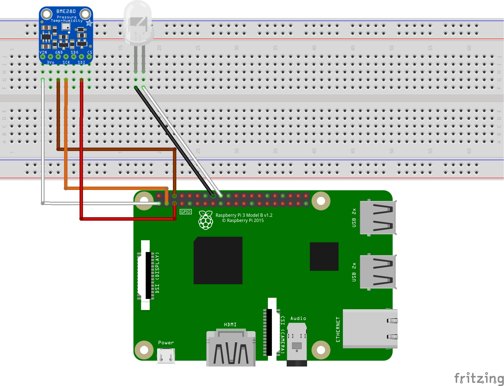
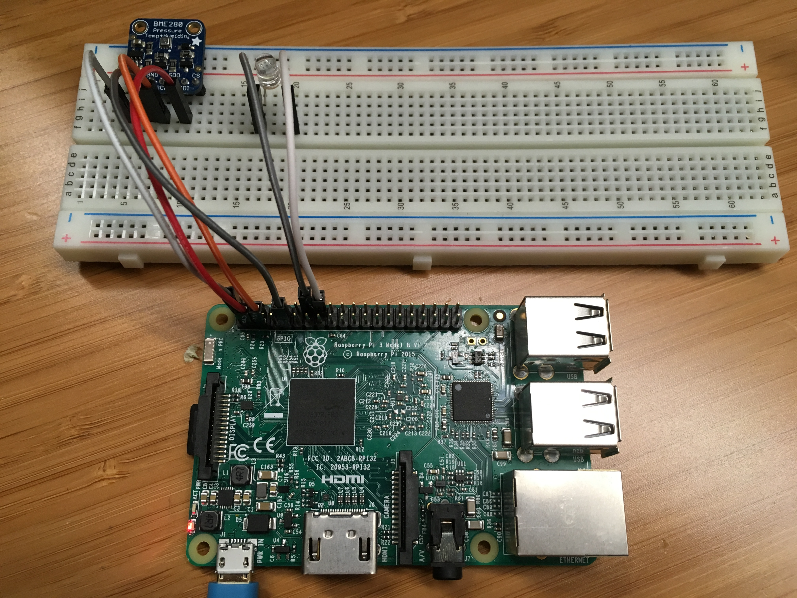
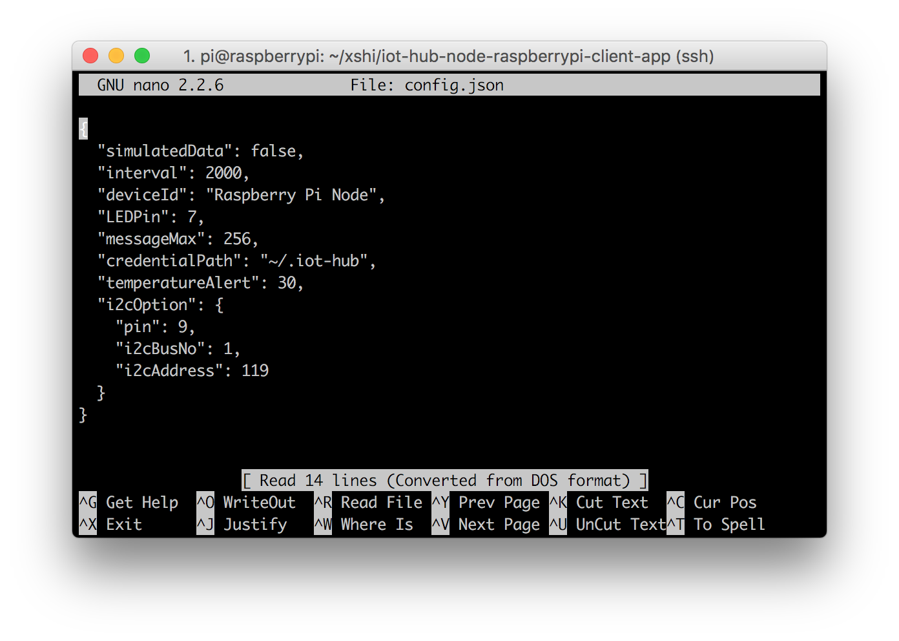
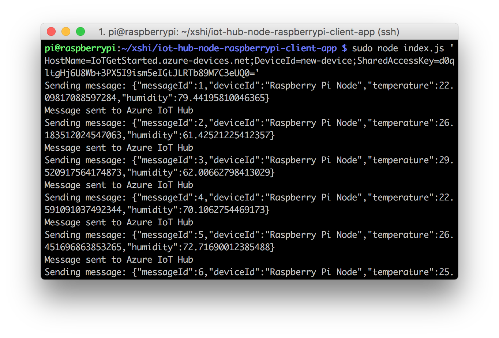

# Connect Raspberry Pi to Azure IoT Hub (Node.js)

[!INCLUDE [iot-hub-get-started-device-selector](../../includes/iot-hub-get-started-device-selector.md)]

In this tutorial, you begin by learning the basics of working with Raspberry Pi that's running Raspbian. You then learn how to seamlessly connect your devices to the cloud by using [Azure IoT Hub](iot-hub-what-is-iot-hub.md). For Windows 10 IoT Core samples, go to the [Windows Dev Center](http://www.windowsondevices.com/).

Don't have a kit yet? Try [Raspberry Pi online simulator](iot-hub-raspberry-pi-web-simulator-get-started.md). Or buy a new kit [here](https://azure.microsoft.com/develop/iot/starter-kits).


## What you do

* Setup Raspberry Pi.
* Create an IoT hub.
* Register a device for Pi in your IoT hub.
* Run a sample application on Pi to send sensor data to your IoT hub.

Connect Raspberry Pi to an IoT hub that you create. Then you run a sample application on Pi to collect temperature and humidity data from a BME280 sensor. Finally, you send the sensor data to your IoT hub.

## What you learn

* How to create an Azure IoT hub and get your new device connection string.
* How to connect Pi with a BME280 sensor.
* How to collect sensor data by running a sample application on Pi.
* How to send sensor data to your IoT hub.

## What you need


* The Raspberry Pi 2 or Raspberry Pi 3 board.
* An active Azure subscription. If you don't have an Azure account, [create a free Azure trial account](https://azure.microsoft.com/free/) in just a few minutes.
* A monitor, a USB keyboard, and mouse that connect to Pi.
* A Mac or a PC that is running Windows or Linux.
* An Internet connection.
* A 16 GB or above microSD card.
* A USB-SD adapter or microSD card to burn the operating system image onto the microSD card.
* A 5-volt 2-amp power supply with the 6-foot micro USB cable.

The following items are optional:

* An assembled Adafruit BME280 temperature, pressure, and humidity sensor.
* A breadboard.
* 6 F/M jumper wires.
* A diffused 10-mm LED.


> [!NOTE] 
These items are optional because the code sample support simulated sensor data.

[!INCLUDE [iot-hub-get-started-create-hub-and-device](../../includes/iot-hub-get-started-create-hub-and-device.md)]

## Setup Raspberry Pi

### Install the Raspbian operating system for Pi

Prepare the microSD card for installation of the Raspbian image.

1. Download Raspbian.
   1. [Download Raspbian Jessie with Pixel](https://www.raspberrypi.org/downloads/raspbian/) (the .zip file).
   1. Extract the Raspbian image to a folder on your computer.
1. Install Raspbian to the microSD card.
   1. [Download and install the Etcher SD card burner utility](https://etcher.io/).
   1. Run Etcher and select the Raspbian image that you extracted in step 1.
   1. Select the microSD card drive. Note that Etcher may have already selected the correct drive.
   1. Click Flash to install Raspbian to the microSD card.
   1. Remove the microSD card from your computer when installation is complete. It's safe to remove the microSD card directly because Etcher automatically ejects or unmounts the microSD card upon completion.
   1. Insert the microSD card into Pi.

### Enable SSH and I2C

1. Connect Pi to the monitor, keyboard and mouse, start Pi and then log in Raspbian by using `pi` as the user name and `raspberry` as the password.
1. Click the Raspberry icon > **Preferences** > **Raspberry Pi Configuration**.

   

1. On the **Interfaces** tab, set **I2C** and **SSH** to **Enable**, and then click **OK**. If you don't have physical sensors and want to use simulated sensor data, this step is optional.

   

> [!NOTE] 
To enable SSH and I2C, you can find more reference documents on [raspberrypi.org](https://www.raspberrypi.org/documentation/remote-access/ssh/) and [Adafruit.com](https://learn.adafruit.com/adafruits-raspberry-pi-lesson-4-gpio-setup/configuring-i2c).

### Connect the sensor to Pi

Use the breadboard and jumper wires to connect an LED and a BME280 to Pi as follows. If you don’t have the sensor, skip this section.



The BME280 sensor can collect temperature and humidity data. And the LED will blink if there is a communication between device and the cloud. 

For sensor pins, use the following wiring:

| Start (Sensor & LED)     | End (Board)            | Cable Color   |
| -----------------------  | ---------------------- | ------------: |
| VDD (Pin 5G)             | 3.3V PWR (Pin 1)       | White cable   |
| GND (Pin 7G)             | GND (Pin 6)            | Brown cable   |
| SCK (Pin 8G)             | I2C1 SDA (Pin 3)       | Orange cable  |
| SDI (Pin 10G)            | I2C1 SCL (Pin 5)       | Red cable     |
| LED VDD (Pin 18F)        | GPIO 24 (Pin 18)       | White cable   |
| LED GND (Pin 17F)        | GND (Pin 20)           | Black cable   |

Click to view [Raspberry Pi 2 & 3 Pin mappings](https://developer.microsoft.com/windows/iot/docs/pinmappingsrpi) for your reference.

After you've successfully connected BME280 to your Raspberry Pi, it should be like below image.



### Connect Pi to the network

Turn on Pi by using the micro USB cable and the power supply. Use the Ethernet cable to connect Pi to your wired network or follow the [instructions from the Raspberry Pi Foundation](https://www.raspberrypi.org/learning/software-guide/wifi/) to connect Pi to your wireless network. After your Pi has been successfully connected to the network, you need to take a note of the [IP address of your Pi](https://learn.adafruit.com/adafruits-raspberry-pi-lesson-3-network-setup/finding-your-pis-ip-address).


> [!NOTE]
> Make sure that Pi is connected to the same network as your computer. For example, if your computer is connected to a wireless network while Pi is connected to a wired network, you might not see the IP address in the devdisco output.

## Run a sample application on Pi

### Clone sample application and install the prerequisite packages

1. Use one of the following SSH clients from your host computer to connect to your Raspberry Pi.
    - [PuTTY](http://www.putty.org/) for Windows. You need the IP address of your Pi to connect it via SSH.
    - The built-in SSH client on Ubuntu or macOS. You might need run `ssh pi@<ip address of pi>` to connect Pi via SSH.

   > [!NOTE] 
   The default username is `pi` , and the password is `raspberry`.

1. Install Node.js and NPM to your Pi.
   
   First you should check your Node.js version with the following command. 
   
   ```bash
   node -v
   ```

   If the version is lower than 4.x or there is no Node.js on your Pi, then run the following command to install or update Node.js.

   ```bash
   curl -sL http://deb.nodesource.com/setup_4.x | sudo -E bash
   sudo apt-get -y install nodejs
   ```

1. Clone the sample application by running the following command:

   ```bash
   git clone https://github.com/Azure-Samples/iot-hub-node-raspberrypi-client-app
   ```

1. Install all packages by the following command. It includes Azure IoT device SDK, BME280 Sensor library and Wiring Pi library.

   ```bash
   cd iot-hub-node-raspberrypi-client-app
   sudo npm install
   ```
   > [!NOTE] 
   It might take several minutes to finish this installation process denpening on your network connection.

### Configure the sample application

1. Open the config file by running the following commands:

   ```bash
   nano config.json
   ```

   

   There are two items in this file you can configurate. The first one is `interval`, which defines the time interval between two messages that send to cloud. The second one `simulatedData`,which is a Boolean value for whether to use simulated sensor data or not.

   If you **don't have the sensor**, set the `simulatedData` value to `true` to make the sample application create and use simulated sensor data.

1. Save and exit by pressing Control-O > Enter > Control-X.

### Run the sample application

1. Run the sample application by running the following command:

   ```bash
   sudo node index.js '<your Azure IoT hub device connection string>'
   ```

   > [!NOTE] 
   Make sure you copy-paste the device connection string into the single quotes.


You should see the following output that shows the sensor data and the messages that are sent to your IoT hub.



## Next steps

You’ve run a sample application to collect sensor data and send it to your IoT hub.

[!INCLUDE [iot-hub-get-started-next-steps](../../includes/iot-hub-get-started-next-steps.md)]
