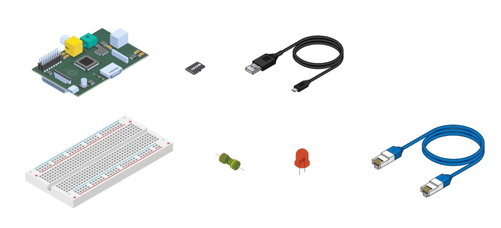
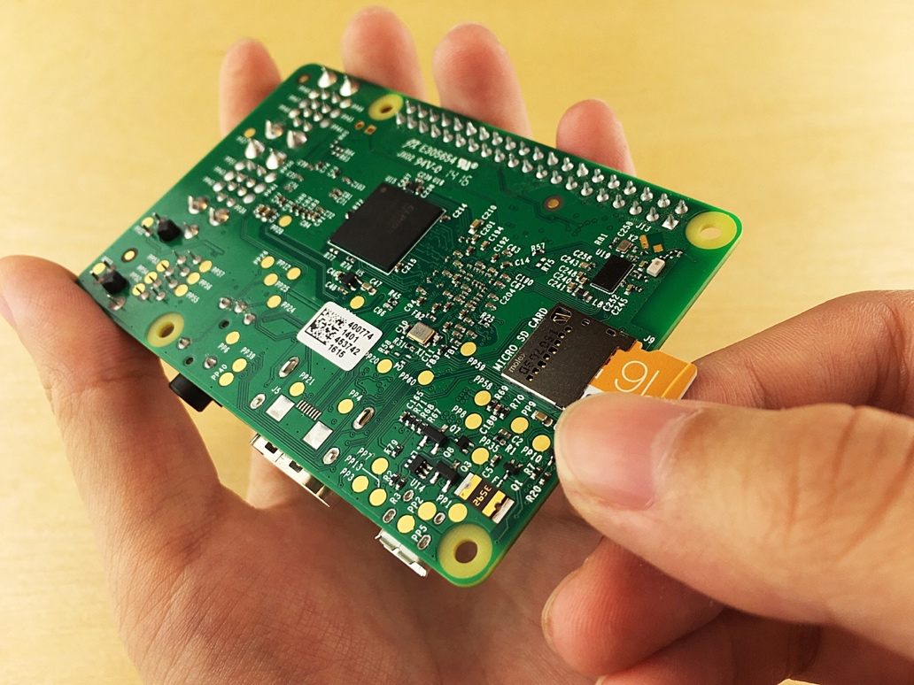
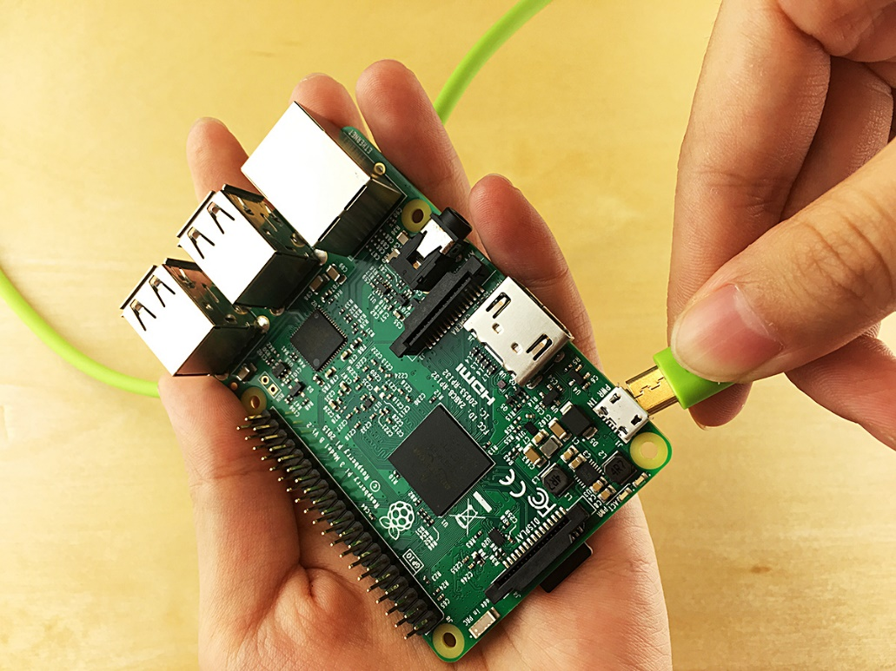
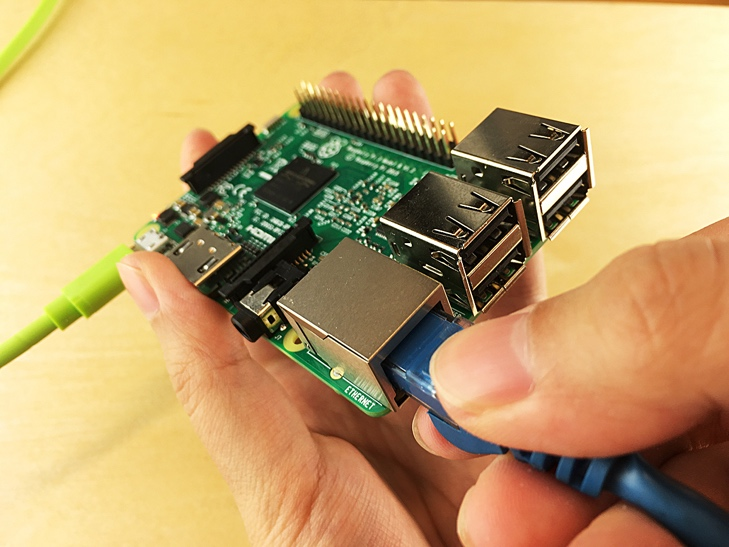
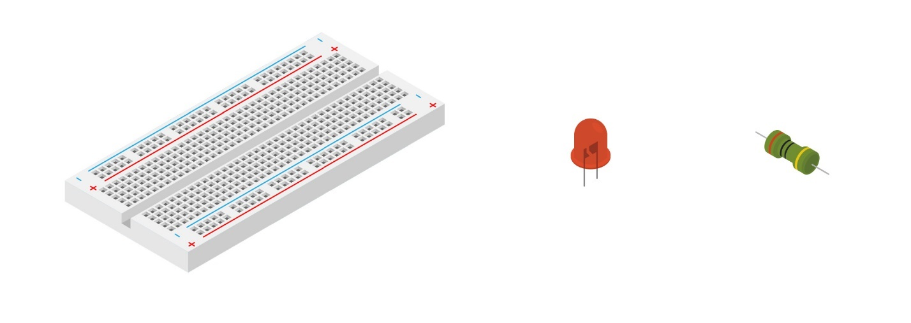
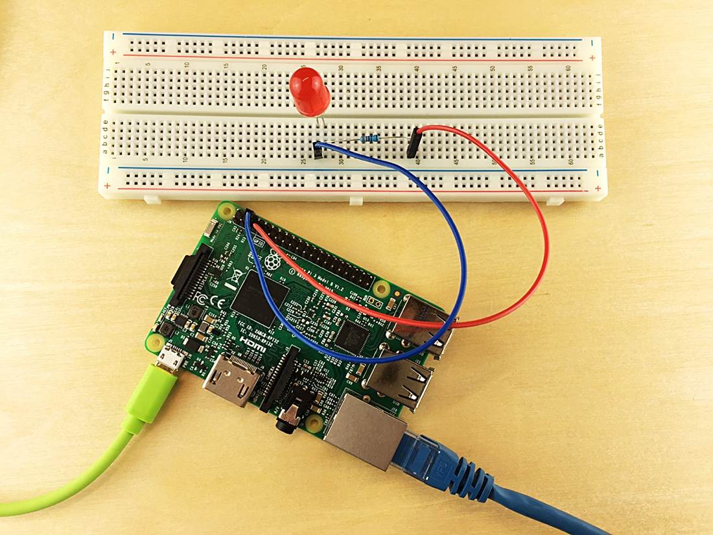

<properties
 pageTitle="Configure your device | Microsoft Azure"
 description="Configure your Raspberry Pi 3 for first time use and install the Raspbian OS, a free operating system that is optimized for the Raspberry Pi hardware."
 services="iot-hub"
 documentationCenter=""
 authors="shizn"
 manager="timlt"
 tags=""
 keywords=""/>

<tags
 ms.service="iot-hub"
 ms.devlang="multiple"
 ms.topic="article"
 ms.tgt_pltfrm="na"
 ms.workload="na"
 ms.date="10/21/2016"
 ms.author="xshi"/>

# 1.1 Configure your device

## 1.1.1 What you will do

Configure your Pi for the first time use and install the Raspbian operating system, a free operating system that is optimized for the Raspberry Pi hardware. If you meet any problems, seek solutions in the [troubleshooting page](iot-hub-raspberry-pi-kit-node-troubleshooting.md).

## 1.1.2 What you will learn

In this section, you will learn:

- How to install Raspbian on your Pi
- How to power up your Pi using a USB cable
- How to connect your Pi to the network using an Ethernet cable or Wi-Fi
- How to add an LED to the breadboard and connect it to your Pi

## 1.1.3 What you need

To complete this section, you need the following parts from your Raspberry Pi 3 Starter Kit:

- The Raspberry Pi 3 board
- The 16GB MicroSD card
- The 5V 2A power supply with the six foot micro USB cable
- The breadboard
- Connector wires
- A 560 Ohm resistor
- A diffused 10mm LED
- The Ethernet cable

You also need:

- A wired or wireless connection for your Pi to connect to
- An USB-SD adapter or mini-SD card to burn the OS image into the MicroSD card.
- A computer running Windows, Mac, or Linux. The computer is used to install Raspbian on the MicroSD card.
- An Internet connection to download the necessary tools and software

## 1.1.4 Install Raspbian on the MicroSD card

Prepare the MicroSD card to write the Raspbian image to.

1. Download Raspbian.
  1. [Download](https://www.raspberrypi.org/downloads/raspbian/) the zip file for Raspbian Jessie with Pixel.
  2. Extract the Raspbian image into a folder on your computer.
2. Install Raspbian to the MicroSD card.
  1. [Download](https://www.etcher.io) and install the Etcher SD card burner utility.
  2. Run Etcher and select the Raspbian image that you extracted in step 1.
  3. Select the MicroSD card drive.
    Note: Etcher may have already selected the correct drive.
  4. Click Flash to install Raspbian to the MicroSD card.
  5. Remove the MicroSD card from your computer once complete.
    Note: It is safe to remove the MicroSD card directly because Etcher automatically ejects or unmounts the MicroSD card upon completion.
  6. Insert the MicroSD card into your Pi.

## 1.1.5 Power on your Pi

Power on your Pi by using the micro USB cable and the power supply.

> [AZURE.NOTE] It is important to use the power supply in the kit that is at least 2A to make sure that your Raspberry is fed with enough power to work correctly.

## 1.1.6 Connect your Raspberry Pi 3 to the network

You can connect your Pi to a wired network or to a wireless network. Make sure that your Pi is connected to the same network as your computer. For example, you can connect your Pi to the same switch that your computer is connected to.

### 1.1.6.1 Connect to a wired network

Use the Ethernet cable to connect your Pi to your wired network. The two LEDs on your Pi turn on if the connection is established.

### 1.1.6.2	Connect to a wireless network

Follow the [instructions](https://www.raspberrypi.org/learning/software-guide/wifi/) from the Raspberry Pi Foundation to connect your Pi to your wireless network. These instructions require you to first connect a monitor and a keyboard to your Pi.

## 1.1.7 Connect the LED to your Pi

To complete this task, use the [breadboard](https://learn.sparkfun.com/tutorials/how-to-use-a-breadboard), the connector wires, the LED, and the resistor. You connect them to the [general-purpose input/output](https://www.raspberrypi.org/documentation/usage/gpio/) (GPIO) ports of your Pi. 

1. Connect the shorter leg of the LED to **GPIO GND (Pin 6)**.
2. Connect the longer leg of the LED to one leg of the resistor.
3. Connect the other leg of the resistor to **GPIO 4 (Pin 7)**.

Note that the LED polarity is important. This polarity setting is commonly known as Active Low.

Congratulation! You've successfully configured your Pi.

## 1.1.8 Summary

In this section, you’ve learned how to configure your Pi by installing Raspbian, connecting your Pi to a network, and connecting an LED to your Pi. Note that the LED doesn't yet light up. In the next section, you install the necessary tools and software in preparation for running a sample application on your Pi.

## Next Steps

[1.2 Get the tools](iot-hub-raspberry-pi-kit-node-lesson1-get-the-tools-win32.md)
