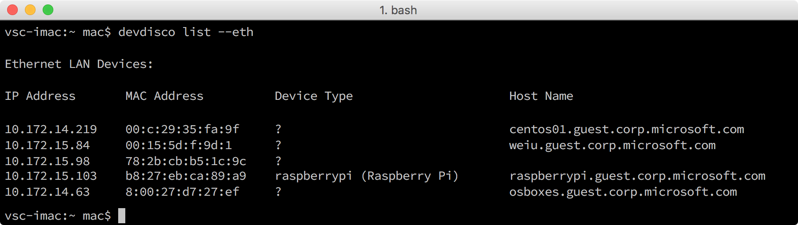
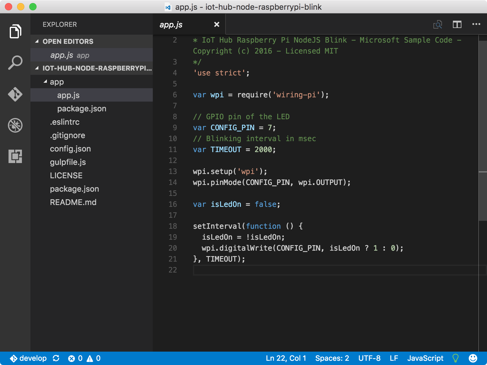
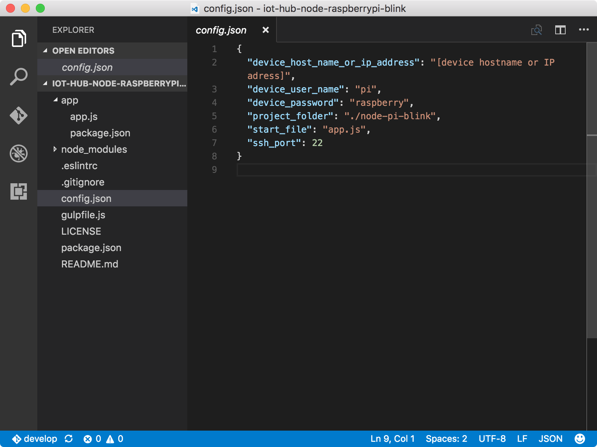
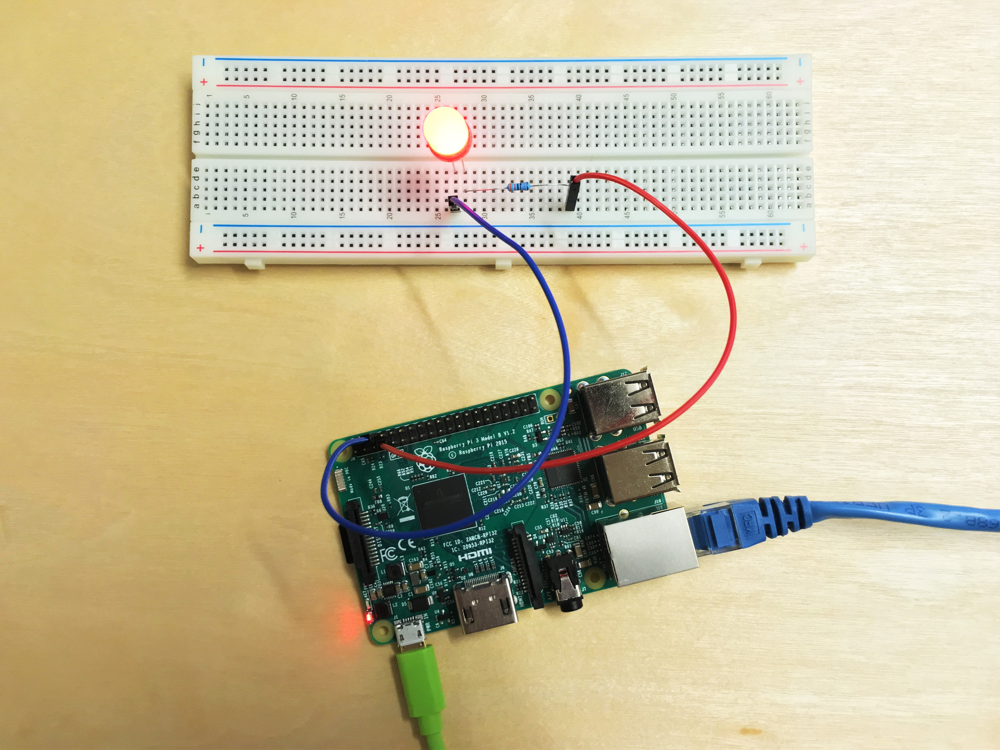

# Create and deploy the blink application
## What you will do
Clone the sample Node.js application from GitHub and use the gulp tool to deploy the sample application to your Raspberry Pi 3. The sample application blinks the LED connected to the board every two seconds. If you have any problems, look for solutions on the [troubleshooting page](iot-hub-raspberry-pi-kit-node-troubleshooting.md).

## What you will learn
In this article, you will learn:

* How to use the `device-discover-cli` tool to retrieve networking information about Pi.
* How to deploy and run the sample application on Pi.
* How to deploy and debug applications running remotely on Pi.

## What you need
You must have successfully completed the following operations:

* [Configure your device](iot-hub-raspberry-pi-kit-node-lesson1-configure-your-device.md)
* [Get the tools](iot-hub-raspberry-pi-kit-node-lesson1-get-the-tools-win32.md)

## Obtain the IP address and host name of Pi
Open a command prompt in Windows or a terminal in macOS or Ubuntu, and then run the following command:

```bash
devdisco list --eth
```

You should see an output that is similar to the following:



Take note of the `IP address` and `hostname` of Pi. You need this information later in this article.

> [!NOTE]
> Make sure that Pi is connected to the same network as your computer. For example, if your computer is connected to a wireless network while Pi is connected to a wired network, you might not see the IP address in the devdisco output.

## Clone the sample application
To open the sample code, follow these steps:

1. Clone the sample repository from GitHub by running the following command:
   
   ```bash
   git clone https://github.com/Azure-Samples/iot-hub-node-raspberrypi-getting-started.git
   ```
2. Open the sample application in Visual Studio Code by running the following commands:
   
   ```bash
   cd iot-hub-node-raspberrypi-getting-started
   cd Lesson1
   code .
   ```



The `app.js` file in the `app` subfolder is the key source file that contains the code to control the LED.

### Install application dependencies
Install the libraries and other modules you need for the sample application by running the following command:

```bash
npm install
```

## Configure the device connection
To configure the device connection, follow these steps:

1. Generate the device configuration file by running the following command:
   
   ```bash
   gulp init
   ```
   
   The configuration file `config-raspberrypi.json` contains the user credentials you use to log in to Pi. To avoid the leak of user credentials, the configuration file is generated in the subfolder `.iot-hub-getting-started` of the home folder on your computer.

2. Open the device configuration file in Visual Studio Code by running the following command:
   
   ```bash
   # For Windows command prompt
   code %USERPROFILE%\.iot-hub-getting-started\config-raspberrypi.json
   
   # For macOS or Ubuntu
   code ~/.iot-hub-getting-started/config-raspberrypi.json
   ```
   
3. Replace the placeholder `[device hostname or IP address]` with the IP address or the host name that you got previously in "Obtain the IP address and host name of Pi."
   
   

> [!NOTE]
> You can use SSH key instead of user name and password when connecting to Raspberry Pi. 
> In order to do this you will have to generate the key using **ssh-keygen** and **ssh-copy-id pi@\<device address\>**.
>
> On Windows these commands are available in **Git Bash**.
>
> On MacOS you need to run **brew install ssh-copy-id**.
>
> After successfully uploading the key to the Raspberry Pi, replace **device_password** with **device_key_path** property in **config-raspberrypi.json**.
>
> Updated lines should look as below:
> ```javascript
> "device_user_name": "pi",
> "device_key_path": "id_rsa",
> ```

Congratulations! You've successfully created the first sample application for Pi.

## Deploy and run the sample application
### Install Node.js and NPM on Pi
Install Node.js and NPM on Pi by running the following command:

```bash
gulp install-tools
```

This task might take 10 minutes to complete the first time you run it.

### Deploy and run the sample app
Deploy and run the sample application by running the following command:

```bash
gulp deploy && gulp run
```

### Verify the app works
You should now see the LED on Pi blinking every two seconds.  If you don’t see the LED blinking, see the [troubleshooting guide](iot-hub-raspberry-pi-kit-node-troubleshooting.md) for solutions to common problems.


## Summary
You've installed the required tools to work with Pi and deployed a sample application to Pi to blink the LED. You can now create, deploy, and run another sample application that connects Pi to Azure IoT Hub to send and receive messages.

## Next steps
[Get the Azure tools](iot-hub-raspberry-pi-kit-node-lesson2-get-azure-tools-win32.md)

