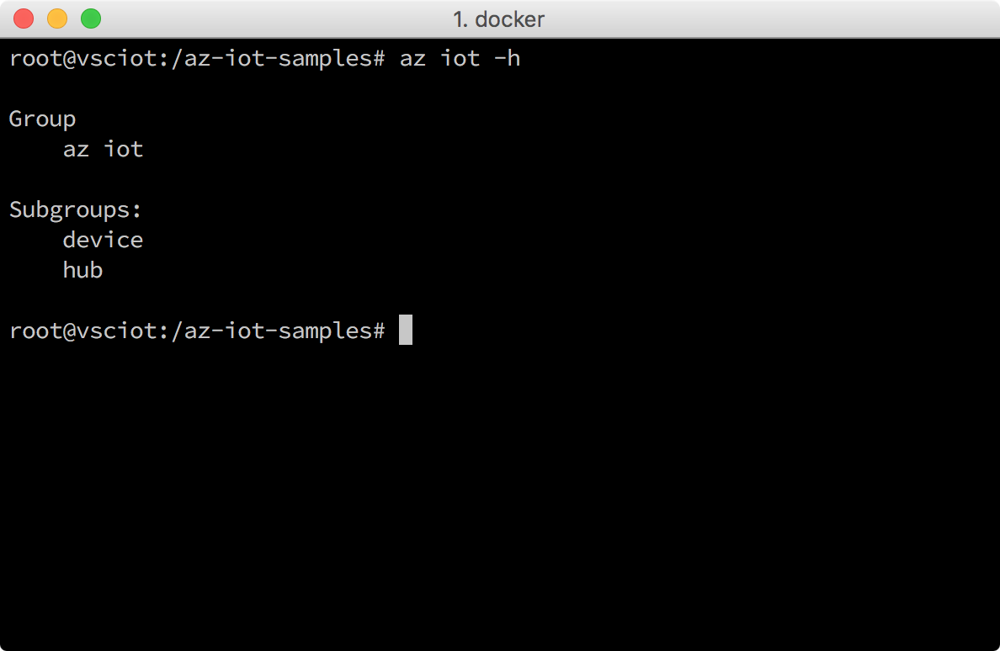

<properties
 pageTitle="Get Azure tools (macOS 10.10) | Microsoft Azure"
 description="Install Python and Azure Command-Line Interface (Azure CLI) on macOS."
 services="iot-hub"
 documentationCenter=""
 authors="shizn"
 manager="timlt"
 tags=""
 keywords=""/>

<tags
 ms.service="iot-hub"
 ms.devlang="multiple"
 ms.topic="article"
 ms.tgt_pltfrm="na"
 ms.workload="na"
 ms.date="10/21/2016"
 ms.author="xshi"/>

# 2.1 Get Azure tools (macOS 10.10)

> [AZURE.SELECTOR]
- [Windows 7 +](iot-hub-raspberry-pi-kit-node-lesson2-get-azure-tools-win32.md)
- [Ubuntu 16.04](iot-hub-raspberry-pi-kit-node-lesson2-get-azure-tools-ubuntu.md)
- [macOS 10.10](iot-hub-raspberry-pi-kit-node-lesson2-get-azure-tools-mac.md)

## 2.1.1 What you will do

Install the Azure Command-Line Interface (Azure CLI). If you meet any problems, seek solutions in the [troubleshooting page](iot-hub-raspberry-pi-kit-node-troubleshooting.md).

## 2.1.2 What you will learn

- How to install Azure CLI.
- How to add the IoT subgroup of Azure CLI.

## 2.1.3 What you need

- A Mac with Internet connection
- An active Azure subscription. If you don't have an account, you can create a [free account](https://azure.microsoft.com/free/) in just a couple of minutes.

## 2.1.4 Install Python

Although macOS comes with Python 2.7 out of the box, it is recommended to install Python through Homebrew. See [Installing Python on macOS](http://docs.python-guide.org/en/latest/starting/install/osx/).

Install Python and pip by running the following command:

```bash
brew install python
```

## 2.1.5 Install the Azure CLI

The Azure CLI provides a multiplatform command-line experience for Azure, enabling you to work directly from your command line to provision and manage resources. 

To install the latest Azure CLI, follow these steps:

1. Run the following commands in a Terminal window. It might take five minutes to install Azure CLI.

    ```bash
    pip install azure-cli-core==0.1.0b7 azure-cli-vm==0.1.0b7 azure-cli-storage==0.1.0b7 azure-cli-role==0.1.0b7 azure-cli-resource==0.1.0b7 azure-cli-profile==0.1.0b7 azure-cli-network==0.1.0b7 azure-cli-iot==0.1.0b7 azure-cli-feedback==0.1.0b7 azure-cli-configure==0.1.0b7 azure-cli-component==0.1.0b7 azure-cli==0.1.0b7
    ```

2. Verify installation by running the following command:

    ```bash
    az iot -h
    ```
  
You should see the following output if the installation is successful.



## 2.1.5 Summary

You've installed Azure CLI. Continue to the next section to create your Azure IoT Hub and device identity using the Azure CLI.

## Next Steps

[2.2 Create your IoT hub and register your Raspberry Pi 3](iot-hub-raspberry-pi-kit-node-lesson2-prepare-azure-iot-hub.md)
