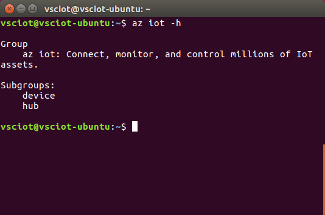

# Get Azure tools (Ubuntu 16.04)
> [!div class="op_single_selector"]
> * [Windows 7 and later](iot-hub-raspberry-pi-kit-node-lesson2-get-azure-tools-win32.md)
> * [Ubuntu 16.04](iot-hub-raspberry-pi-kit-node-lesson2-get-azure-tools-ubuntu.md)
> * [macOS 10.10](iot-hub-raspberry-pi-kit-node-lesson2-get-azure-tools-mac.md)

## What you will do
Install the Azure command-line interface (Azure CLI). If you have any problems, look for solutions on the [troubleshooting page](iot-hub-raspberry-pi-kit-node-troubleshooting.md).

## What you will learn
In this article, you will learn:
* How to install the Azure CLI.
* How to add an IoT subgroup of the Azure CLI.

## What you need
* An Ubuntu computer with an Internet connection.
* An active Azure subscription. If you don't have an account, you can create a [free trial account](http://azure.microsoft.com/pricing/free-trial/) in just a few minutes.

## Install the Azure CLI
The Azure CLI provides a multiplatform command-line experience for Azure, enabling you to work directly from your command-line to provision and manage resources.

To install the latest Azure CLI, follow these steps:

1. Run the following commands in a terminal window. It might take five minutes to install the Azure CLI.

   ```bash
   sudo apt-get update
   sudo apt-get install -y libssl-dev libffi-dev
   sudo apt-get install -y python-dev
   sudo apt-get install -y build-essential
   sudo apt-get install -y python-pip
   sudo pip install --upgrade azure-cli
   sudo pip install --upgrade azure-cli-iot
   ```
2. Verify the installation by running the following command:

   ```bash
   az iot -h
   ```

You should see the following output if the installation is successful.



## Summary
You've installed the Azure CLI. Your next task is to create your Azure IoT hub and device identity using the Azure CLI.

## Next steps
[Create your IoT hub and register Raspberry Pi 3](iot-hub-raspberry-pi-kit-node-lesson2-prepare-azure-iot-hub.md)

