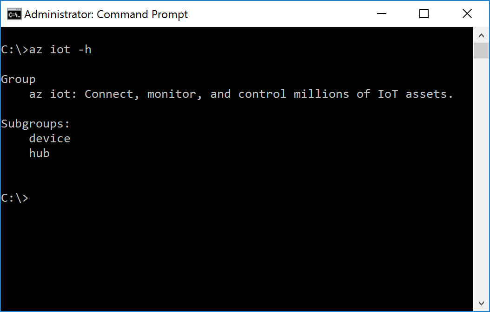

# Get Azure tools (Windows 7 and later)
> [!div class="op_single_selector"]
> * [Windows 7 and later](iot-hub-raspberry-pi-kit-node-lesson2-get-azure-tools-win32.md)
> * [Ubuntu 16.04](iot-hub-raspberry-pi-kit-node-lesson2-get-azure-tools-ubuntu.md)
> * [macOS 10.10](iot-hub-raspberry-pi-kit-node-lesson2-get-azure-tools-mac.md)

## What you will do
Install Python and the Azure command-line interface (Azure CLI). If you have any problems, look for solutions on the [troubleshooting page](iot-hub-raspberry-pi-kit-node-troubleshooting.md).

## What you will learn
In this article, you will learn:
* How to install Python.
* How to install the Azure CLI.

## What you need
* A Windows computer with an Internet connection.
* An active Azure subscription. If you don't have an Azure account, create a [free Azure trial account](http://azure.microsoft.com/pricing/free-trial/) in just a few minutes.

## Install Python
[Install Python](https://www.python.org/downloads/) on your Windows computer. You can install Python 2.7, 3.4 or 3.5. This tutorial is based on Python 2.7. If you've already installed Python, go to the next section and install the Azure CLI.

You also need to add the path of the folders where python.exe and pip.exe are installed to the system `PATH` environment variable. By default, python.exe is installed in `C:\Python27` and pip.exe is installed in `C:\Python27\Scripts`.

## Install the Azure CLI
The Azure CLI provides a multiplatform command-line experience for Azure. You work directly from your command-line to provision and manage resources.

To install the Azure CLI, follow these steps:

1. Open a Command Prompt window as an administrator.
2. Run the following commands:

   ```bash
   pip install --upgrade azure-cli
   pip install --upgrade azure-cli-iot
   ```
3. Verify the installation by running the following command:

   ```bash
   az iot -h
   ```

You see the following output if the installation is successful.



## Summary
You've installed the Azure CLI. Your next task to create your Azure IoT hub and device identity by using the Azure CLI.

## Next steps
[Create your IoT hub and register Raspberry Pi 3](iot-hub-raspberry-pi-kit-node-lesson2-prepare-azure-iot-hub.md)

