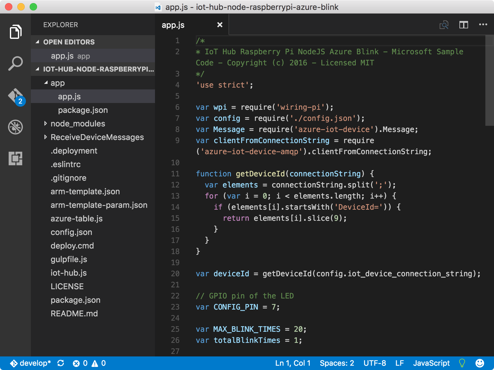
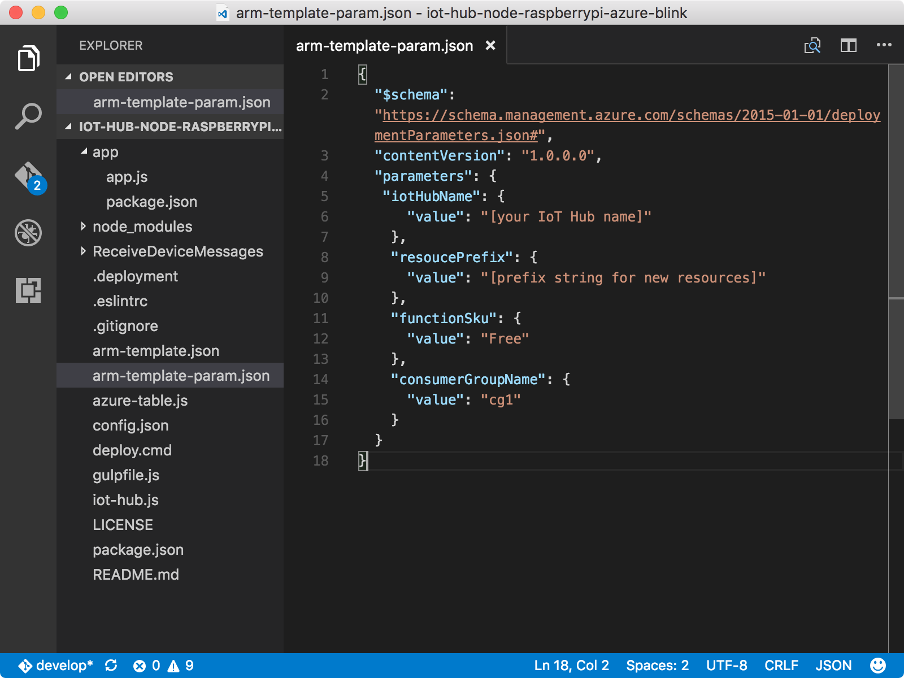

# Create an Azure function app and Azure storage account
[Azure Functions](../azure-functions/functions-overview.md) is a solution for easily running *functions* (small pieces of code) in the cloud. An Azure function app hosts the execution of your functions in Azure.

## What you will do
Use an Azure Resource Manager template to create an Azure function app and an Azure storage account. The Azure function app listens to Azure IoT hub events, processes incoming messages, and writes them to Azure Table storage. If you have any problems, seek solutions on the [troubleshooting page](iot-hub-raspberry-pi-kit-node-troubleshooting.md).

## What you will learn
In this article, you will learn:

* How to use [Azure Resource Manager](../azure-resource-manager/resource-group-overview.md) to deploy Azure resources.
* How to use an Azure function app to process IoT hub messages and write them to a table in Azure Table storage.

## What you need
You must have successfully completed:
* [Get started with Raspberry Pi 3](iot-hub-raspberry-pi-kit-node-get-started.md)
* [Create your Azure IoT hub](iot-hub-raspberry-pi-kit-node-get-started.md)

## Open the sample app
Open the sample project in Visual Studio Code by running the following commands:

```bash
cd Lesson3
code .
```



* The `app.js` file in the `app` subfolder is the key source file. This source file contains the code to send a message 20 times to your IoT hub and blink the LED for each message it sends.
* The `arm-template.json` file is the Azure Resource Manager template that contains an Azure function app and an Azure storage account.
* The `arm-template-param.json` file is the configuration file used by the Azure Resource Manager template.
* The `ReceiveDeviceMessages` subfolder contains the Node.js code for the Azure function.

## Configure Azure Resource Manager templates and create resources in Azure
Update the `arm-template-param.json` file in Visual Studio Code.



* Replace **[your IoT Hub name]** with **{my hub name}** that you specified when you [created your IoT hub and registered Raspberry Pi 3](iot-hub-raspberry-pi-kit-node-lesson2-prepare-azure-iot-hub.md).
* Replace **[prefix string for new resources]** with any prefix you want. The prefix ensures that the resource name is globally unique to avoid conflict. Do not use a dash or number initial in the prefix.

After you update the `arm-template-param.json` file, deploy the resources to Azure by running the following command:

```bash
az group deployment create --template-file arm-template.json --parameters @arm-template-param.json -g iot-sample
```

It takes about five minutes to create these resources. While the resource creation is in progress, you can move on to the next article.

## Summary
You've created your Azure function app to process IoT hub messages and an Azure storage account to store these messages. You can now deploy and run the sample to send device-to-cloud messages on Pi.

## Next steps
[Run a sample application to send device-to-cloud messages on Raspberry Pi 3](iot-hub-raspberry-pi-kit-node-lesson3-run-azure-blink.md)

