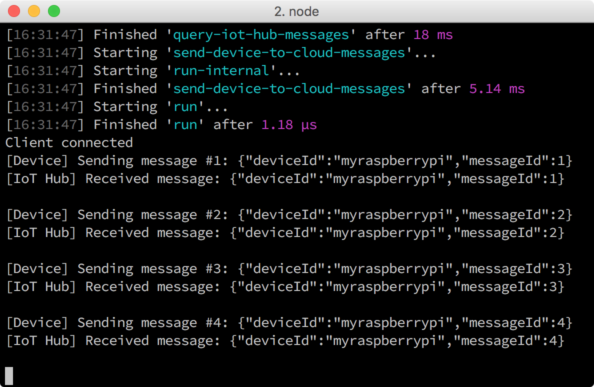

<properties
 pageTitle="Read messages persisted in Azure Storage | Microsoft Azure"
 description="Monitor the device-to-cloud messages as they are written to your Azure Table storage."
 services="iot-hub"
 documentationCenter=""
 authors="shizn"
 manager="timlt"
 tags=""
 keywords=""/>

<tags
 ms.service="iot-hub"
 ms.devlang="multiple"
 ms.topic="article"
 ms.tgt_pltfrm="na"
 ms.workload="na"
 ms.date="10/21/2016"
 ms.author="xshi"/>

# Read messages persisted in Azure Storage

## What you will do

Monitor the device-to-cloud messages that are sent from your Raspberry Pi 3 to your IoT hub as the messages are written to your Azure Table storage. If you have any problems, look for solutions on the [troubleshooting page](iot-hub-raspberry-pi-kit-node-troubleshooting.md).

## What you will learn

In this section, you will learn how to use the gulp read-message task to read messages persisted in your Azure Table storage.

## What you need

Before starting this process, you must have successfully completed the previous section [Run the Azure blink sample application on your Raspberry Pi 3](iot-hub-raspberry-pi-kit-node-lesson3-run-azure-blink.md).

## Read new messages from your storage account

In the previous section, you ran a sample application on your Pi. The sample application sent messages to your Azure IoT hub. The messages sent to your IoT hub are stored into your Azure Table storage via the Azure function app. You need the Azure storage connection string to read messages from your Azure Table storage.

To read messages stored in your Azure Table storage, follow these steps:

1. Get the connection string by running the following commands:

    ```bash
    az storage account list -g iot-sample --query [].name
    az storage account show-connection-string -g iot-sample -n {storage name}
    ```

    The first command retrieves the `storage name` that is used in the second command to get the connection string. `iot-sample` is the default value of `{resource group name}` if you didn't change the value in Lesson 2.

2. Open the configuration file `config-raspberrypi.json` in Visual Studio Code by running the following command:

    ```bash
    # For Windows command prompt
    code %USERPROFILE%\.iot-hub-getting-started\config-raspberrypi.json

    # For macOS or Ubuntu
    code ~/.iot-hub-getting-started/config-raspberrypi.json
    ```

3. Replace `[Azure storage connection string]` with the connection string you got in Step 1.
4. Save the `config-raspberrypi.json` file.
5. Send messages again and read them from your Azure Table storage by running the following command:

    ```bash
    gulp run --read-storage
    ```

    The logic for reading from Azure table storage is in the `azure-table.js` file.

    

## Summary

You've successfully connected your Pi to your IoT hub in the cloud and used the blink sample application to send device-to-cloud messages. You also used the Azure function app to store incoming IoT hub messages to your Azure Table storage. You can move on to the next lesson about how to send cloud-to-device messages from your IoT hub to your Pi.

## Next steps

[Lesson 4: Send cloud-to-device messages](iot-hub-raspberry-pi-kit-node-lesson4-send-cloud-to-device-messages.md)
