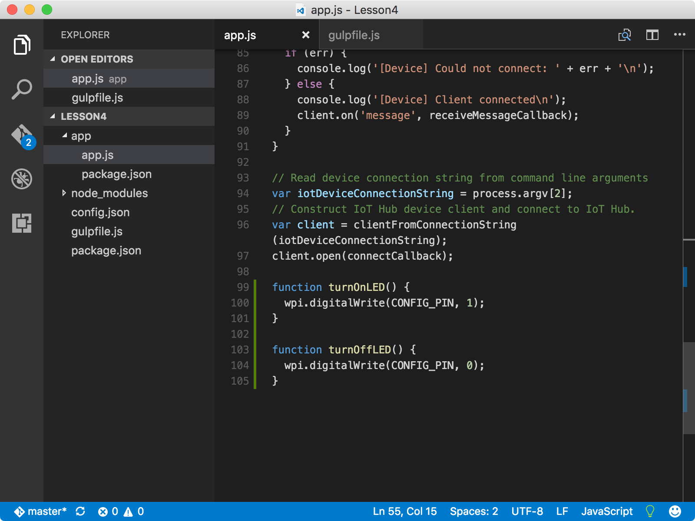
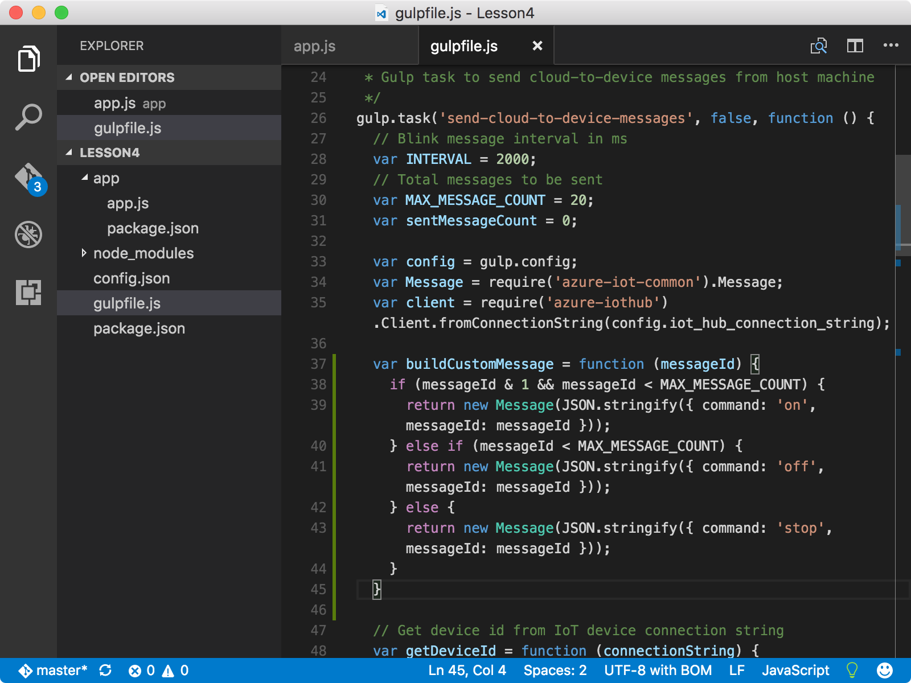

<properties
 pageTitle="Optional section - Change the on and off behavior of the LED | Microsoft Azure"
 description="Customize the messages to change the LED’s on and off behavior."
 services="iot-hub"
 documentationCenter=""
 authors="shizn"
 manager="timlt"
 tags=""
 keywords=""/>

<tags
 ms.service="iot-hub"
 ms.devlang="multiple"
 ms.topic="article"
 ms.tgt_pltfrm="na"
 ms.workload="na"
 ms.date="10/21/2016"
 ms.author="xshi"/>

# 4.2 Optional section: Change the on and off behavior of the LED

## 4.2.1 What you will do

Customize the messages to change the LED’s on and off behavior. If you meet any problems, seek solutions in the [troubleshooting page](iot-hub-raspberry-pi-kit-node-troubleshooting.md).

## 4.2.2 What you will learn

Use additional Node.js functions to change the LED’s on and off behavior.

## 4.2.3 What you need

You must have successfully completed [4.1 Run a sample application on your Raspberry Pi to receive cloud to device messages](iot-hub-raspberry-pi-kit-node-lesson4-send-cloud-to-device-messages.md).

## 4.2.4 Add Node.js functions

1. Open the sample application in Visual Studio code by running the following commands:

    ```bash
    cd Lesson4
    code .
    ```

2. Open the `app.js` file, and then add the following functions at the end:

    ```javascript
    function turnOnLED() {
      wpi.digitalWrite(CONFIG_PIN, 1);
    }

    function turnOffLED() {
      wpi.digitalWrite(CONFIG_PIN, 0);
    }
    ```

    

3. Add the following conditions before the default one in the switch-case block of the `receiveMessageCallback` function:

    ```javascript
    case 'on':
      turnOnLED();
      break;
    case 'off':
      turnOffLED();
      break;
    ```

    Now you’ve configured the sample application to respond to more instructions through messages. The "on" instruction turns on the LED and the "off" instruction turns off the LED.

4. Open the gulpfile.js file, and then add a new function before the function `sendMessage`:

    ```javascript
    var buildCustomMessage = function (messageId) {
      if ((messageId & 1) && (messageId < MAX_MESSAGE_COUNT)) {
        return new Message(JSON.stringify({ command: 'on', messageId: messageId }));
      } else if (messageId < MAX_MESSAGE_COUNT) {
        return new Message(JSON.stringify({ command: 'off', messageId: messageId }));
      } else {
        return new Message(JSON.stringify({ command: 'stop', messageId: messageId }));
      }
    }
    ```

    

5. In the `sendMessage` function, replace the line `var message = buildMessage(sentMessageCount);` with the new line shown in the following snippet:

    ```javascript
    var message = buildCustomMessage(sentMessageCount);
    ```

6. Save all the changes.

### 4.2.5 Deploy and run the sample application

Deploy and run the sample application on your Pi by running the following command:

```bash
gulp
```

You should see the LED turned on for two seconds, and then turned off for another two seconds. The last "stop" message stops the sample application from running.


Congratulations! You’ve successfully customized the messages that are sent to the Pi from your IoT hub.

### 4.2.7 Summary

This optional section demos how to customize the messages so that the sample application can control the on and off behavior of the LED in a different way.

