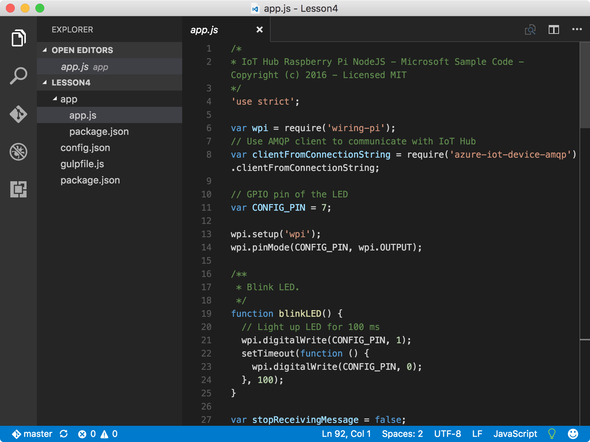
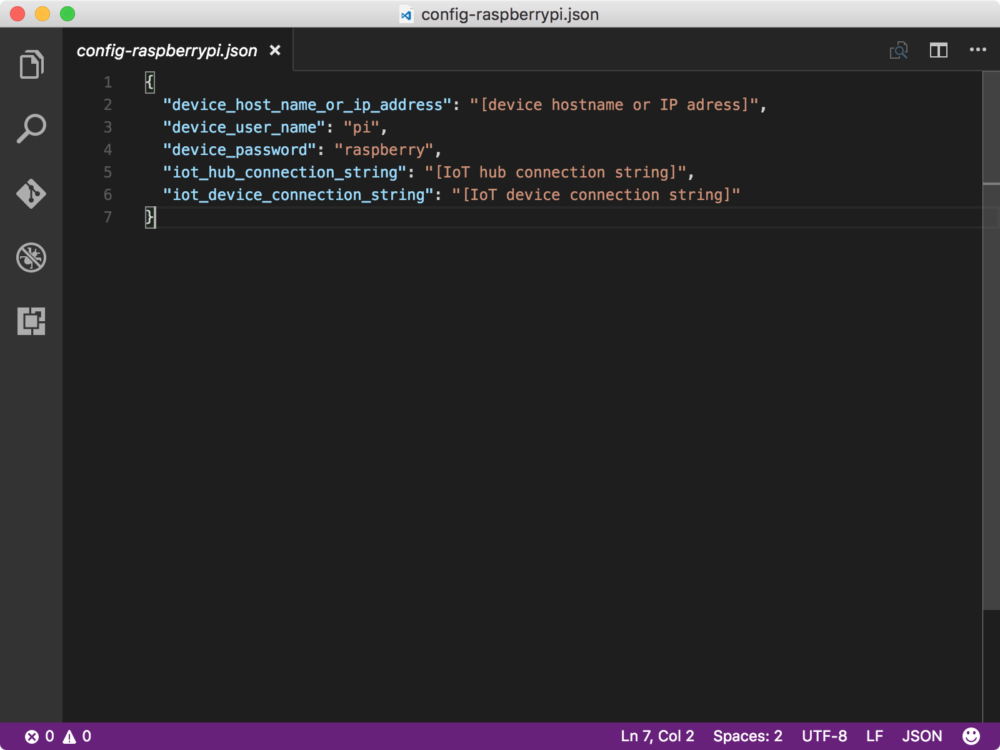
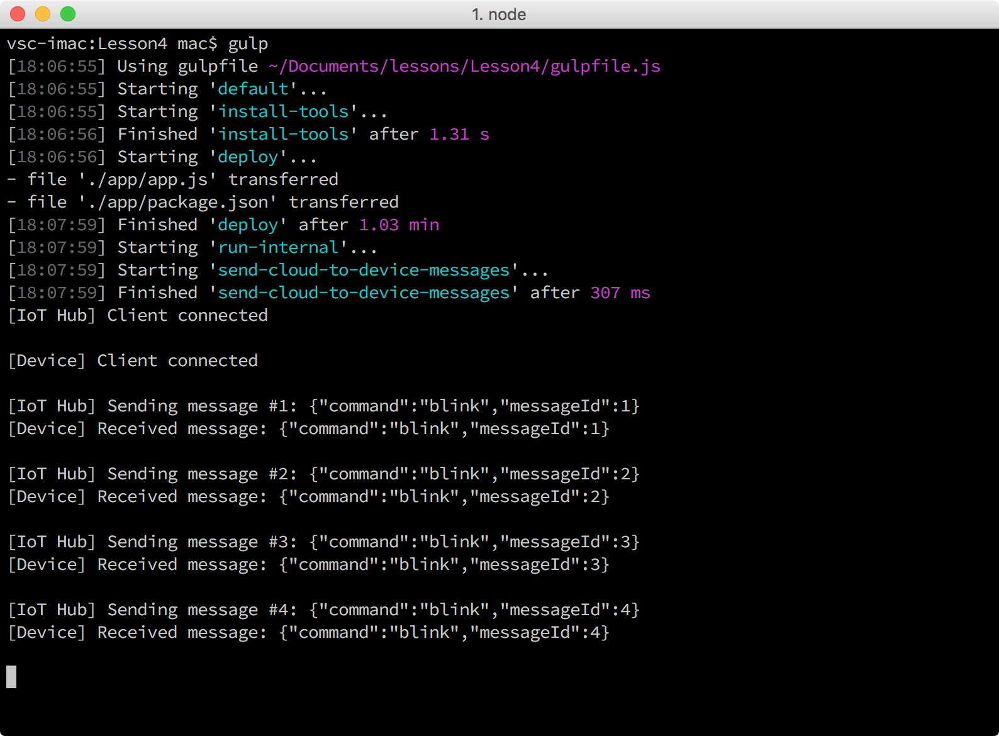

<properties
 pageTitle="Run the sample application to receive cloud-to-device messages | Microsoft Azure"
 description="The sample application in Lesson 4 runs on your Pi and monitors incoming messages from your IoT hub. A new gulp task sends messages to your Pi from your IoT hub to blink the LED."
 services="iot-hub"
 documentationCenter=""
 authors="shizn"
 manager="timlt"
 tags=""
 keywords=""/>

<tags
 ms.service="iot-hub"
 ms.devlang="multiple"
 ms.topic="article"
 ms.tgt_pltfrm="na"
 ms.workload="na"
 ms.date="10/21/2016"
 ms.author="xshi"/>

# 4.1 Run the sample application to receive cloud-to-device messages

In this section, you deploy a sample application on your Raspberry Pi 3. The sample application monitors incoming messages from your IoT hub. You also run a gulp task on your computer to send messages to your Pi from your IoT hub. Upon receiving the messages, the sample application blinks the LED. If you meet any problems, seek solutions in the [troubleshooting page](iot-hub-raspberry-pi-kit-node-troubleshooting.md).

## 4.1.1 What you will do

- Connect the sample application to your IoT hub.
- Deploy and run the sample application.
- Send messages from your IoT hub to your Pi to blink the LED.

## 4.1.2 What you will learn

- How to monitor incoming messages from your IoT hub.
- How to send cloud-to-device messages from your IoT hub to your Pi. 

## 4.1.3 What do you need

- A Raspberry Pi 3 that is set up for use. To learn how to set up your Pi, see [Lesson 1: Get started with your Raspberry Pi 3 device](iot-hub-raspberry-pi-kit-node-get-started.md)
- An IoT hub that is created in your Azure subscription. To learn how to create your Azure IoT Hub, see [Lesson 2: Create your Azure IoT Hub](iot-hub-raspberry-pi-kit-node-get-started.md)

## 4.1.4 Connect the sample application to your IoT hub

1. Make sure you are in the repo folder `iot-hub-node-raspberrypi-getting-started`. Open the sample application in Visual Studio Code by running the following commands:

    ```bash
    cd Lesson4
    code .
    ```

    Notice the `app.js` file in the `app` subfolder. The `app.js` file is the key source file that contains the code to monitor incoming messages from IoT Hub. The `blinkLED` function blinks the LED.

    

2. Initialize the configuration file with the following commands:

    ```bash
    npm install
    gulp init
    ```

    If you've completed Lesson 3 on this computer, all the configurations are inherited so you can skip to step 4.1.5. If you completed Lesson 3 on a different computer, you need to replace the placeholders in the `config-raspberrypi.json` file. The `config-raspberrypi.json` file is in the subfolder of your home folder.

    

- Replace **[device hostname or IP address]** with your Pi’s IP address or hostname that you get by running the command `devdisco list --eth`
- Replace **[IoT device connection string]** with the device connection string that you get by running the command `az iot hub show-connection-string --name {my hub name} --resource-group {resource group name}`.
- Replace **[IoT hub connection string]** with the IoT hub connection string that you get by running the command `az iot device show-connection-string --hub {my hub name} --device-id {device id} --resource-group {resource group name}`.

## 4.1.5 Deploy and run the sample application

Deploy and run the sample application on your Pi by running the following commands:
  
```
gulp
```

The gulp command runs the install-tools task first. Then it deploys the sample application to your Pi. Finally, it runs the application on your Pi and a separate task on your host computer to send 20 blink messages to your Pi from your IoT hub.

Once the sample application runs, it starts listening messages from your IoT hub. Meanwhile, the gulp task sends several of "blink" messages from your IoT Hub to your Pi. For each of the blink message received, the sample application calls the blinkLED function to blink the LED.

You should see the LED blinking every two seconds as the gulp task is sending 20 messages from your IoT hub to your Pi. The last one is a "stop" message that tells the application to stop running.



## 4.1.6 Summary

You’ve successfully sent messages from your IoT hub to your Pi to blink the LED. Next section is optional section that shows you how to change the on and off behavior of the LED.

## Next Steps

[Optional section: Change the on and off behavior of the LED](iot-hub-raspberry-pi-kit-node-lesson4-change-led-behavior.md)