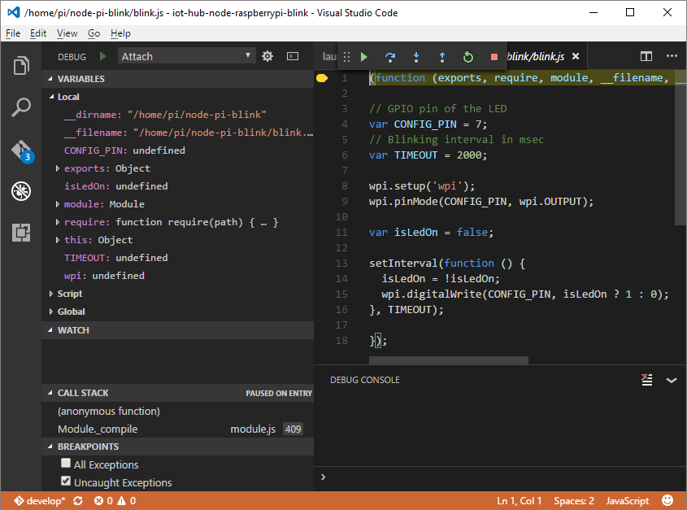

# Troubleshooting
## Hardware issues
### The application runs well but the LED is not blinking
This issue is always related to hardware circuit connectivity. Use the following steps to identify problems:

1. Check that you chose the correct **GPIO** on your board. The two ports should be **GPIO GND (Pin 6)** and **GPIO 04 (Pin 7)**.
2. Check that the polarity of your LED is correct. The longer leg should indicate the **positive**, anode pin.
3. Use the **3.3V Pin** and **GND Pin** on Raspberry Pi 3. Treat Pi as the DC power. Check that the LED works fine.


### Other hardware issues
For information about solving common problems on Raspberry Pi 3, see the [official troubleshooting page](http://elinux.org/R-Pi_Troubleshooting).

## Node.js package issues
### No response during gulp tasks
If you encounter problems in running gulp tasks, you can add the `--verbose` option for debugging. Try to terminate current gulp tasks by using Ctrl + C, and then run the following command in your console window to see debug messages. You might see detailed error messages in your console output.

```bash
gulp --verbose
```

### Device discovery issues
For help in troubleshooting common problems with the `devdisco` command, check the [readme](https://github.com/Azure/device-discovery-cli/blob/develop/readme.md).

### npm issues
Try to update your npm package by using the following command:

```bash
npm install -g npm
```

If the problem still exists, leave your comments at the end of this article or create a GitHub issue in our [sample repository](https://github.com/Azure-Samples/iot-hub-node-raspberrypi-getting-started).

## Remote debugging
### Run the sample application in debug mode
```bash
gulp run --debug
```

When the debug engine is ready, you should see ```Debugger listening on port 5858``` in the console output.

### Configure Visual Studio Code to connect to the remote device
1. Open the **Debug** panel on the left side.
2. Click the green **Start Debugging** (F5) button. Visual Studio Code opens a launch.json file.
3. Update the launch.json file with the following content. Replace `[device hostname or IP address]` with the actual device IP address or host name.

> [!NOTE]
> To learn more about the Visual Studio Debugging, please refer to [Debugging in Visual Studio Code](https://code.visualstudio.com/Docs/editor/debugging#_launchjson-attributes).


```json
{
    "version": "0.2.0",
    "configurations": [
        {
            "name": "Attach",
            "type": "node",
            "request": "attach",
            "port": 5858,
            "address": "[device hostname or IP address]",
            "restart": false,
            "sourceMaps": false,
            "outDir": null,
            "localRoot": "${workspaceRoot}",
            "remoteRoot": null
        }
    ]
}
```


### Attach to the remote application
Click the green **Start Debugging** (F5) button to start debugging.

Read [JavaScript in VS Code](https://code.visualstudio.com/docs/languages/javascript#_debugging) to learn more about the debugger.



## Azure CLI issues
The Azure command-line interface (Azure CLI) is a preview build. To seek solutions, you can use the [Preview Install Guide](https://github.com/Azure/azure-cli/blob/master/doc/preview_install_guide.md).

If you encounter any bugs with the tool, file an [issue](https://github.com/Azure/azure-cli/issues) in the **Issues** section of the GitHub repo.

For help in troubleshooting common problems, check the [readme](https://github.com/Azure/azure-cli/blob/master/README.rst).

## Python installation issues
### Legacy installation issues (macOS)
When you're installing pip, a permission error is thrown when older packages are installed with **su** permissions. This situation occurs because a previous installation of Python using brew (macOS) is not uninstalled completely. Some pip packages from a previous installation were created by root, which causes the permission error. The solution is to remove those packages installed by root. Use the following steps to complete this task:

1. Go to: /usr/local/lib/python2.7/site-packages
2. List packages created by root: `ls -l | grep root`
3. Uninstall packages from step 2: `sudo rm -rf {package name}`
4. Reinstall Python.

## Azure IoT Hub issues
If you've successfully provisioned your Azure IoT hub with Azure CLI, and you need a tool to manage the devices that are connecting to your IoT hub, try the following tools.

### Device explorer
The [Device explorer](https://github.com/Azure/azure-iot-sdk-csharp/blob/master/tools/DeviceExplorer) tool runs on your Windows local machine and connects to your IoT hub in Azure. It communicates with the following [IoT Hub endpoints](iot-hub-devguide.md):


* *Device identity management* to provision and manage devices registered with your IoT hub.
* *Receive device-to-cloud* so you can monitor messages sent from your device to your IoT hub.
* *Send cloud-to-device* so you can send messages to your devices from your IoT hub.

Configure your IoT hub connection string within this tool to use all its capabilities.

### iothub-explorer
[iothub-explorer](https://github.com/Azure/iothub-explorer) is a sample multiplatform CLI tool to manage devices. You can use the tool to manage the devices in the identity registry, monitor device-to-cloud messages, and send cloud-to-device messages.

To install the latest (prerelease) version of the iothub-explorer tool, run the following command in your command-line environment:

```bash
npm install -g iothub-explorer@latest
```

You can use the following command to get additional help about all the iothub-explorer commands and their parameters:

```bash
iothub-explorer help
```

### Azure portal
A full CLI experience helps you create and manage all your Azure resources. You might also want to use the [Azure portal](../azure-portal-overview.md) to help provision, manage, and debug your Azure resources.

## Azure Storage issues
[Microsoft Azure Storage Explorer (preview)](http://storageexplorer.com) is a standalone app from Microsoft that you can use to work with Azure Storage data on Windows, macOS, and Linux. By using this tool, you can connect to your table and see the data in it. You can use this tool to troubleshoot your Azure Storage issues.

