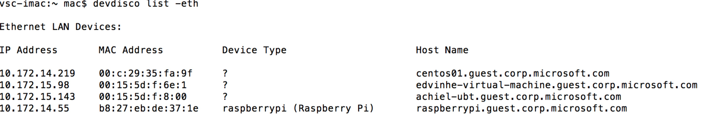

<properties
 pageTitle="Create and deploy the blink sample application"
 description="Clone the sample Node.js application from Github, and gulp to deploy this application to your Raspberry Pi 3 board. This sample application blinks the LED connected to the board every two seconds."
 services="iot-hub"
 documentationCenter=""
 authors="shizn"
 manager="timlt"
 tags=""
 keywords=""/>

<tags
 ms.service="iot-hub"
 ms.devlang="multiple"
 ms.topic="article"
 ms.tgt_pltfrm="na"
 ms.workload="na"
 ms.date="09/28/2016" 
 ms.author="xshi"/>

# 1.3 Create and deploy the blink sample application

## 1.3.1 What you will do
Clone the sample Node.js application from Github, and gulp to deploy this application to your Raspberry Pi 3 board. This sample application blinks the LED connected to the board every two seconds.

## 1.3.2 What you will learn
In this section, you will learn:

- How to use the `device-discover-cli` tool to retrieve networking information about your connected Raspberry Pi 3 device
- How to deploy and run the sample application on the Pi
- How to deploy and debug applications running remotely on your Pi


## 1.3.3 What you need
- You must have successfully completed the previous sections, [Configure your device](iot-hub-raspberry-pi-node-lesson1_configure-your-device.md) and [Get the tools](iot-hub-raspberry-pi-node-lesson1-get-the-tools-win32.md), in this lesson.

## 1.3.4 Obtain IP address of your Raspberry Pi 3 device
Open a command prompt (Windows) or a terminal window (OS X / Ubuntu) and run the following command:

```bash
devdisco list --eth
```

You should see output similar to the following:



Take a note of the `IP Address` of your Raspberry Pi 3 device. You need this information later in this section.

    > [AZURE.NOTE] Make sure that your Raspberry Pi 3 device is connected to the same network as your computer. For example, if your computer is connected to your work wireless network, and your Pi is using a wired connection, you may not be able to see it in the devdisco output.


## 1.3.5 Clone the sample code
To get started, create your workspace directory (az-iot-samples) in your home directory and clone the sample blink application from Github:

```bash
mkdir az-iot-samples
cd az-iot-samples
git clone https://github.com/Azure-Samples/iot-hub-node-raspberrypi-blink.git
```

Run the following command to open the sample project in VS Code:

```bash
code iot-hub-node-raspberrypi-blink
```


`app.js` in the `app` sub-folder is the key source file that contains the code controlling the LED.

### 1.3.6 Install application dependencies
Now install the libraries and other modules you need for the sample:

```bash
cd iot-hub-node-raspberrypi-blink && npm install --save
```

## 1.3.7 Configure the device connection
Update your device configuration file `config.json` in the sample folder with VS Code so you can deploy the sample application from your host machine:


Replace `[device hostname or IP address]` with the device IP address or hostname you made a note of in the "Obtain IP address of your Raspberry Pi 3 device" step.

Congratulations! You have successfully created your first Raspberry Pi 3 application.

## 1.3.8 Deploy and run the blink sample application

### 1.3.8.1 Install Node on the Raspberry Pi 3
Install Node.js and NPM on your Pi using gulp so you can run the sample application once it’s deployed:

```bash
gulp install-tools
```
### 1.3.8.2 Deploy and run the sample application
Deploy the sample application to your Pi and run it:

```bash
gulp deploy && gulp run
```

### 1.3.8.3 Verify the application is working
You should now see the LED on your Pi blinking every two seconds.  If you don’t see the LED flashing, take a look at the [Troubleshooting](iot-hub-raspberry-pi-node-troubleshooting.md) guide for solutions to common problems.


    > [AZURE.NOTE] You can use `Ctrl - C` to terminate the application.

## 1.3.9 Summary
You have now installed all of the required tools you need to work with your Raspberry Pi 3 and deployed a simple app to your Pi to blink an LED. Now you can move to the next lesson to deploy, build, and run an application that connects your Pi to Azure IoT Hub to send and receive messages.

## Next Steps
[Lesson 2 Create your Azure IoT hub](iot-hub-raspberry-pi-node-lesson2.md)
