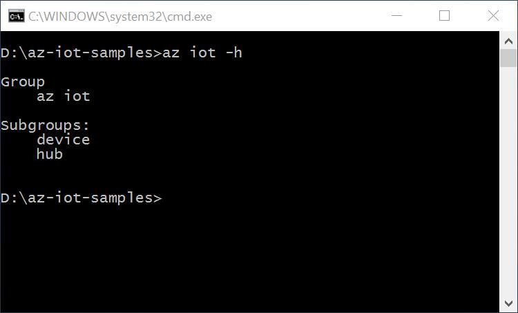

<properties
 pageTitle="Get Azure tools (Windows 7+)"
 description="Install Azure Command-Line Interface (Azure CLI). You might need 10 minutes to complete this section."
 services="iot-hub"
 documentationCenter=""
 authors="shizn"
 manager="timlt"
 tags=""
 keywords=""/>

<tags
 ms.service="iot-hub"
 ms.devlang="multiple"
 ms.topic="article"
 ms.tgt_pltfrm="na"
 ms.workload="na"
 ms.date="09/28/2016" 
 ms.author="xshi"/>

# 2.1 Get Azure tools (Windows 7+)

> [AZURE.SELECTOR]
- [Windows 7 +](iot-hub-raspberry-pi-node-lesson2-get-azure-tools-win32.md)
- [OS X 10.10](iot-hub-raspberry-pi-node-lesson2-get-azure-tools-mac.md)
- [Ubuntu 16.04](iot-hub-raspberry-pi-node-lesson2-get-azure-tools-ubuntu.md)

## 2.1.1 What you will do
Install Python and Azure Command-Line Interface (Azure CLI). You might need 10 minutes to complete this section.

## 2.1.2 What you will learn
In this section, you will learn:
- How to install Python
- How to install Azure CLI

## 2.1.3 What you need
- A Windows PC with Internet connection
- An active Azure subscription. If you don't have an account, you can create a free trial account in just a couple of minutes. For details, see [Azure Free Trial](http://azure.microsoft.com/pricing/free-trial/)

## 2.1.4 Install Python
Install Python on your Windows PC. You can choose Python 2.7, 3.4 or 3.5. Here we choose Python 2.7. If you already have installed python on your PC, you can go to section 2.2.5.

[Get Python for Windows](https://www.python.org/downloads/)

You also need to add your Python folder (where python.exe is installed) to the system `PATH` environment variable. 

## 2.1.5 Install the Azure Command-Line Interface (CLI)
The Azure CLI provides a multiplatform command line experience for Azure, enabling you to work directly from your command line to provision and manage resources.

Run the following from a command prompt, it might take 5 minutes to install Azure CLI.

```bash
pip install azure-cli
pip install azure-cli-iot
```

Try below command to verify installation is successful.

```bash
az iot -h
```

You should see the following output if installation is successful.



## 2.1.6 Summary
You have now installed Azure CLI. Continue to the next section to create your Azure IoT Hub and device identity using the Azure CLI. 

## Next Steps
[2.2 Create your Azure IoT Hub and the register your Raspberry Pi 3 device](iot-hub-raspberry-pi-node-lesson2-prepare-azure-iot-hub.md)
