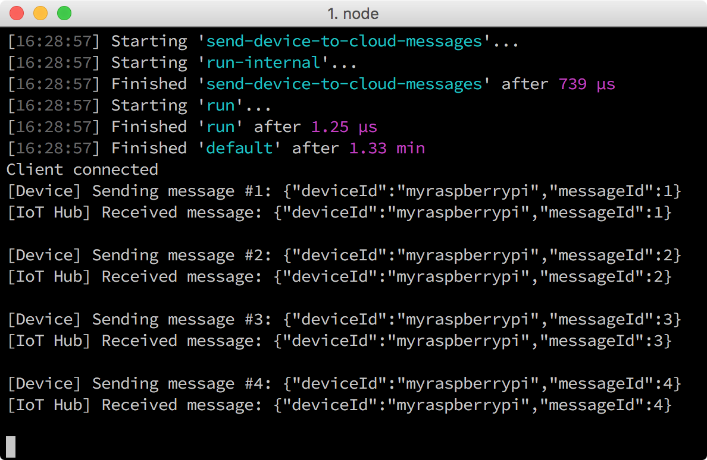

<properties
 pageTitle="Run the Azure blink sample application on your Raspberry Pi 3"
 description="Deploy and run a sample application to your Raspberry Pi 3 device that sends messages to IoT hub."
 services="iot-hub"
 documentationCenter=""
 authors="shizn"
 manager="timlt"
 tags=""
 keywords=""/>

<tags
 ms.service="iot-hub"
 ms.devlang="multiple"
 ms.topic="article"
 ms.tgt_pltfrm="na"
 ms.workload="na"
 ms.date="09/28/2016" 
 ms.author="xshi"/>

# 3.2 Run the Azure blink sample application on your Raspberry Pi 3
## 3.2.1 What you will do
Deploy and run a sample application to your Raspberry Pi 3 device that sends messages to IoT hub.

## 3.2.2 What you will learn
- How to use gulp to deploy and run the sample Node.js application with your Raspberry Pi 3

## 3.2.3 What you need
- You must have successfully completed the previous section, Create an Azure function app and a storage account to process and store IoT hub messages, in this lesson.

## 3.2.4 Get your IoT hub connection string and device connection string
You can get your IoT hub connection string from Azure-cli. Run the following command to show the IoT hub connection string. The `{my hub name}` is the one you specified in Lesson 2. And the default value of `{resource group name}` should be `iot-sample` 

```bash
az iot hub show-connection-string --name {my hub name} --resource-group {resource group name}
```

You also need to get the device connection string to connect the Pi to your IoT hub. Run the following command to show the device connection string. The parameters `{my hub name}` and `{resource group name}` are the same as the ones above. The default value of `{device id}` should be `myraspberrypi` 

```bash
az iot device show-connection-string --hub {my hub name} --device-id {device id} --resource-group {resource group name}
```

## 3.2.5 Configure the device connection
Update your device configuration file `config.json` using VS Code so you can deploy the sample application from your computer:


1. Replace **[device hostname or IP address]** with the device IP address or hostname you got from device-discovery-cli. 
2. Replace **[IoT device connection string]** with the `device connection string` you obtained.
3. Replace **[IoT hub connection string]** with the `iot hub connection string` you obtained. 
4. Replace **[resource group of your Azure Storage]** with the `resource group` you specified in [in Lesson 2](iot-hub-raspberry-pi-node-lesson2-prepare-azure-iot-hub.md). The default value should be `iot-sample`.

## 3.2.6 Deploy and run the sample application
Use the following command to deploy the sample application to your Pi and run it:

```bash
npm install
gulp
```

> [AZURE.NOTE] The default gulp task runs `install-tools`, `deploy`, and `run` tasks sequentially. In [Lesson 1](iot-hub-raspberry-pi-node-lesson1-depoly-blink-app.md), you ran these tasks one after another manually.

## 3.2.7 Verify the application is working
You should now see the LED on your Pi flashing every two seconds. Every time the LED flashes, it sends a message to your IoT hub and verifies that the message has been sent to IoT hub. In addition, every time a message is received by the IoT hub, it will be printed in the console window. This application terminates automatically after sending 20 messages.



## 3.2.8 Summary
You have now deployed the Azure blink sample application on your Raspberry Pi 3 and ran it to send device-to-cloud messages to your IoT hub. You can move to the next section to monitor your messages as they are written to the storage account.

## Next Steps
[3.3 Read messages persisted in Azure Storage](iot-hub-raspberry-pi-node-lesson3-read-table-storage.md)