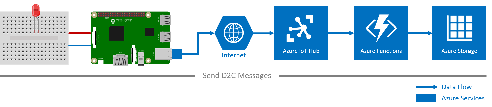

# Lesson 3 - Send device-to-cloud messages
In this lesson, you deploy a sample application to you Raspberry Pi 3 to send messages from your Pi to your Azure IoT hub. You also create an Azure function app that picks up incoming messages from your IoT hub and writes them to Azure table storage.

## Prerequisites
- [Lesson 1 - Get started with your Raspberry Pi 3 device](iot-hub-raspberry-pi-node-lesson1.md)
- [Lesson 2 - Create your Azure IoT Hub](iot-hub-raspberry-pi-node-lesson2.md)

## Create an Azure function app and a storage account to process and store IoT hub messages
Use an Azure Resource Manager (ARM) template to create an Azure function app and a storage account.

[Estimated time to complete: 10 minutes. Go to 'Create an Azure function app and a storage account to process and store IoT hub messages' >](iot-hub-raspberry-pi-node-lesson3-deploy-arm-template.md)

## Run the Azure blink sample application on your Raspberry Pi 3
Deploy and run a sample application to your Raspberry Pi 3 device that sends messages to IoT hub.

[Estimated time to complete: 10 minutes. Go to 'Run the Azure blink sample application on your Raspberry Pi 3' >](iot-hub-raspberry-pi-node-lesson3-run-azure-blink.md)

## Read messages persisted in Azure Storage
Monitor the device-to-cloud messages as they are written to your Azure storage.

[Estimated time to complete: 5 minutes. Go to 'Read messages persisted in Azure Storage' >](iot-hub-raspberry-pi-node-lesson3-read-table-storage.md)
