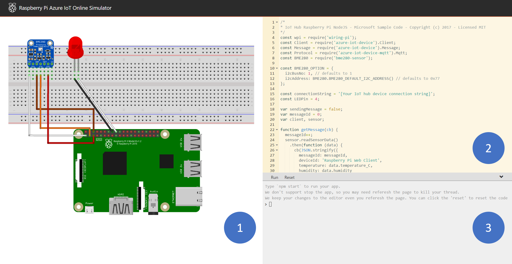
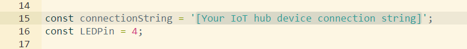
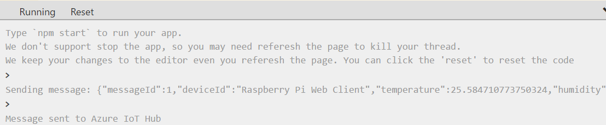

# Connect Raspberry Pi online simulator to Azure IoT Hub (Node.js)

[!INCLUDE [iot-hub-get-started-device-selector](../../includes/iot-hub-get-started-device-selector.md)]

In this tutorial, you begin by learning the basics of working with Raspberry Pi online simulator. You then learn how to seamlessly connect the Pi simulator to the cloud by using [Azure IoT Hub](iot-hub-what-is-iot-hub.md). 

If you have physical devices, visit [Connect Raspberry Pi to Azure IoT Hub](iot-hub-raspberry-pi-kit-node-get-started.md) to get started. 

## What you do

* Learn the basics of Raspberry Pi online simulator.
* Create an IoT hub.
* Register a device for Pi in your IoT hub.
* Run a sample application on Pi to send simulated sensor data to your IoT hub.

Connect simulated Raspberry Pi to an IoT hub that you create. Then you run a sample application with the simulator to generate sensor data. Finally, you send the sensor data to your IoT hub.

## What you learn

* How to create an Azure IoT hub and get your new device connection string. If you don't have an Azure account, [create a free Azure trial account](https://azure.microsoft.com/free/) in just a few minutes.
* How to work with Raspberry Pi online simulator.
* How to send sensor data to your IoT hub.

## Overview of Raspberry Pi web simulator

Click the button to launch Raspberry Pi online simulator.

> [!div class="button"]
[Start Raspberry Pi simulator](https://azure-samples.github.io/raspberry-pi-web-simulator/)

There are three areas in the web simulator.
* Assembly area - The default circuit is that a Pi connects with a BME280 sensor and an LED. The area is locked in preview version so currently you cannot do customization.
* Coding area - An online code editor for you to code with Raspberry Pi. The default sample application helps to collect sensor data from BME280 sensor and sends to your Azure IoT Hub. The application is fully compatible with real Pi devices. 
* Integrated console window - It shows the output of your code. At the top of this window, there are three buttons.
   * **Run** - Run the application in the coding area.
   * **Reset** - Reset the coding area to the default sample application.
   * **Fold/Expand** - On the right side there is a button for you to fold/expand the console window.

> [!NOTE] 
The Raspberry Pi web simulator is now available in preview version. We'd like to hear your voice in the [Gitter Chatroom](https://gitter.im/Microsoft/raspberry-pi-web-simulator). The source code is public on [Github](https://github.com/Azure-Samples/raspberry-pi-web-simulator).

[!INCLUDE [iot-hub-get-started-create-hub-and-device](../../includes/iot-hub-get-started-create-hub-and-device.md)]

## Run a sample application on Pi web simulator

1. In coding area, make sure you are working on the default sample application. Replace the placeholder in Line 15 with the Azure IoT hub device connection string.
   

2. Click **Run** or type `npm start` to run the application.

You should see the following output that shows the sensor data and the messages that are sent to your IoT hub

## Next steps

You’ve run a sample application to collect sensor data and send it to your IoT hub.

[!INCLUDE [iot-hub-get-started-next-steps](../../includes/iot-hub-get-started-next-steps.md)]
