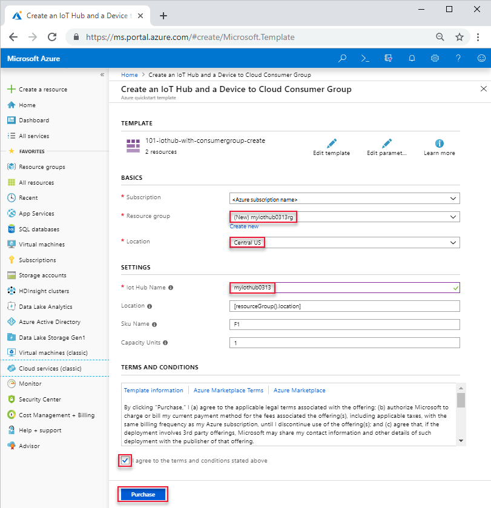

---
title: Create an Azure IoT Hub using a template | Microsoft Docs
description: How to use an Azure Resource Manager template to create an IoT Hub.
author: robinsh
manager: philmea
ms.author: robin.shahan
ms.service: iot-hub
services: iot-hub
ms.topic: conceptual
ms.date: 03/13/2019
---

# Create an IoT hub using Azure Resource Manager template

[!INCLUDE [iot-hub-resource-manager-selector](../../includes/iot-hub-resource-manager-selector.md)]

Learn how to use an Azure Resource Manager template to create an IoT Hub and a consumer group. Resource Manager templates are JSON files that define the resources you need to deploy for your solution. For more information about developing Resource Manager templates, see [Azure Resource Manager documentation](https://docs.microsoft.com/azure/azure-resource-manager/).

If you don't have an Azure subscription, [create a free account](https://azure.microsoft.com/free/) before you begin.

## Create an IoT hub

The Resource Manager template used in this quickstart is from [Azure Quickstart templates](https://azure.microsoft.com/resources/templates/101-iothub-with-consumergroup-create/). Here is a copy of the template:

[!code-json[iothub-creation](~/quickstart-templates/101-iothub-with-consumergroup-create/azuredeploy.json)]

The template creates an Azure Iot hub with three endpoints (eventhub, cloud-to-device, and messaging), and a consumer group. For more template samples, see [Azure Quickstart templates](https://azure.microsoft.com/resources/templates/?resourceType=Microsoft.Devices&pageNumber=1&sort=Popular). The Iot Hub template schema can be found  [here](https://docs.microsoft.com/azure/templates/microsoft.devices/iothub-allversions).

1. Select the following image to sign in to Azure and open the template. 

    

2. Select or enter the following values.  

    

    Unless it is specified, use the default value to create the Iot Hub and the consumer group.

    * **Subscription**: select an Azure subscription.
    * **Resource group**: select **Create new**, enter a unique name for the resource group, and then click **OK**. 
    * **Location**: select a location.  For example, **Central US**.
    * **Iot Hub Name**: enter a unique name for the Iot Hub.  
    * **I agree to the terms and conditions state above**: Select.
3. Select **Purchase**.

## Next steps

Now you have deployed an IoT hub by using an Azure Resource Manager template, you may want to explore further:

* Read about the capabilities of the [IoT Hub resource provider REST API][lnk-rest-api].
* Read [Azure Resource Manager overview][lnk-azure-rm-overview] to learn more about the capabilities of Azure Resource Manager.
* For the JSON syntax and properties to use in templates, see [Microsoft.Devices resource types](/azure/templates/microsoft.devices/iothub-allversions).

To learn more about developing for IoT Hub, see the following articles:

* [Introduction to C SDK][lnk-c-sdk]
* [Azure IoT SDKs][lnk-sdks]

To further explore the capabilities of IoT Hub, see:

* [Deploying AI to edge devices with Azure IoT Edge][lnk-iotedge]

<!-- Links -->
[lnk-free-trial]: https://azure.microsoft.com/pricing/free-trial/
[lnk-azure-portal]: https://portal.azure.com/
[lnk-status]: https://azure.microsoft.com/status/
[lnk-powershell-install]: /powershell/azure/install-Az-ps
[lnk-rest-api]: https://docs.microsoft.com/rest/api/iothub/iothubresource
[lnk-azure-rm-overview]: ../azure-resource-manager/resource-group-overview.md
[lnk-powershell-arm]: ../azure-resource-manager/manage-resources-powershell.md

[lnk-c-sdk]: iot-hub-device-sdk-c-intro.md
[lnk-sdks]: iot-hub-devguide-sdks.md

[lnk-iotedge]: ../iot-edge/tutorial-simulate-device-linux.md
