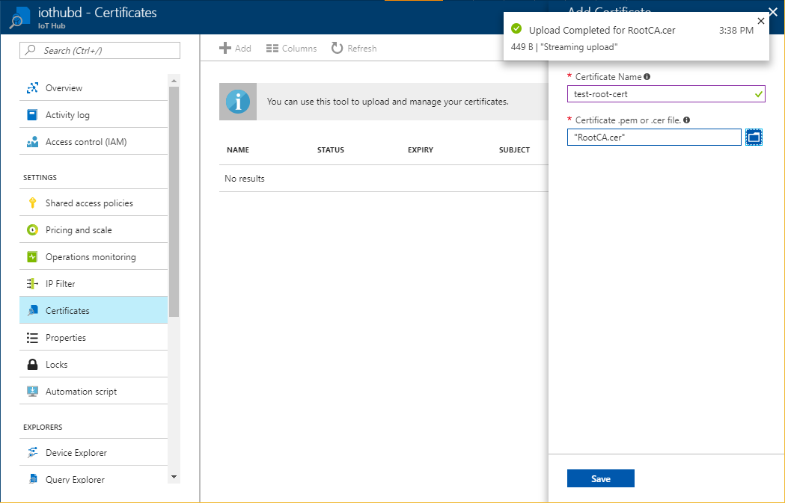
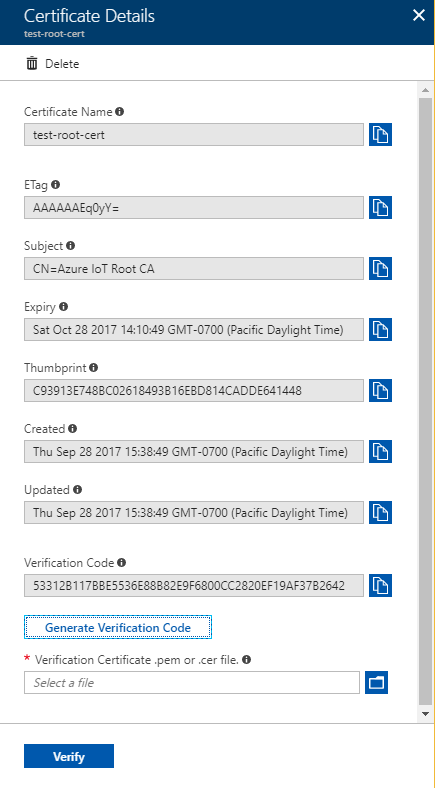
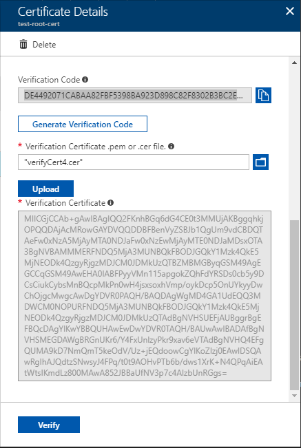
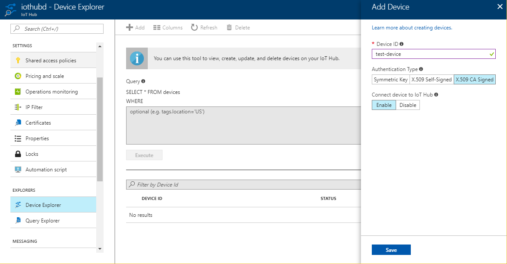
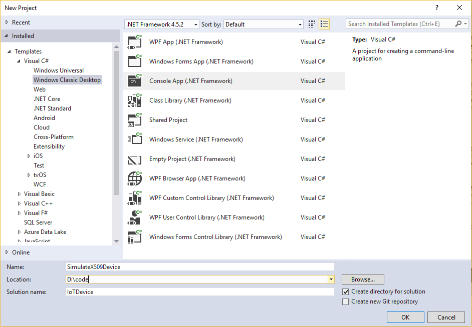

# Set up X.509 security in your Azure IoT hub

This tutorial simulates the steps you need to secure your Azure IoT hub using the *X.509 Certificate Authentication*. For the purpose of illustration, we will show how to use the open source tool OpenSSL to create certificates locally on your Windows machine. We recommend that you use this tutorial for test purposes only. For production environment, you should purchase the certificates from a *root certificate authority (CA)*. 

## Prerequisites
This tutorial requires that you have the following resources ready:

- You have created an IoT hub with your Azure subscription. See [Create an IoT hub through portal](iot-hub-create-through-portal.md) for detailed steps. 
- You have [Visual Studio 2015 or Visual Studio 2017](https://www.visualstudio.com/vs/) installed on your machine. 

<a id="getcerts"></a>

## Get X.509 CA certificates
The X.509 certificate-based security in the IoT Hub requires you to start with an [X.509 certificate chain](https://en.wikipedia.org/wiki/X.509#Certificate_chains_and_cross-certification), which includes the root certificate as well as any intermediate certificates up until the leaf certificate. 

You may choose either of the following ways to get your certificates:
- Purchase X.509 certificates from a *root certificate authority (CA)*. This is recommended for production environments.
OR,
- Create your own X.509 certificates using a third party tool such as [OpenSSL](https://www.openssl.org/). This will be fine for test and development purposes. See [Managing test CA certificates for samples and tutorials](https://github.com/Azure/azure-iot-sdk-c/blob/master/tools/CACertificates/CACertificateOverview.md) for information about generating test CA certificates using PowerShell or Bash. The rest of this tutorial uses test CA certificates generated by following the instructions in [Managing test CA certificates for samples and tutorials](https://github.com/Azure/azure-iot-sdk-c/blob/master/tools/CACertificates/CACertificateOverview.md).


<a id="registercerts"></a>

## Register X.509 CA certificates to your IoT hub

These steps show you how to add a new Certificate Authority to your IoT hub through the portal.

1. In the Azure portal, navigate to your IoT hub and open the **SETTINGS** > **Certificates** menu. 
2. Click **Add** to add a new certificate.
3. Enter a friendly display name to your certificate. Select the root certificate file named *RootCA.cer* created in the previous section, from your machine. Click **Upload**.
4. Once you get a notification that your certificate is successfully uploaded, click **Save**.

      

   This will show your certificate in the **Certificate Explorer** list. Note the **STATUS** of this certificate is *Unverified*.

5. Click on the certificate that you added in the previous step.

6. In the **Certificate Details** blade, click **Generate Verification Code**.

7. It creates a **Verification Code** to validate the certificate ownership. Copy the code to your clipboard. 

     

8. Now, you need to sign this *Verification Code* with the private key associate with your X.509 CA certificate, which generates a signature. There are tools available to perform this signing process, for example, OpenSSL. This is known as the [Proof of possession](https://tools.ietf.org/html/rfc5280#section-3.1). Step 3 in [Managing test CA certificates for samples and tutorials](https://github.com/Azure/azure-iot-sdk-c/blob/master/tools/CACertificates/CACertificateOverview.md) generates a verification code.
 
9. Upload the resulting signature from step 8 above to your IoT hub in the portal. In the **Certificate Details** blade on the Azure portal, navigate to the **Verification Certificate .pem or .cer file**, and select the signature, for example, *VerifyCert4.cer* created by the sample PowerShell command using the _File Explorer_ icon besides it.

10. Once the certificate is successfuly uploaded, click **Verify**. The **STATUS** of your certificate changes to **_Verified_** in the **Certificates** blade. Click **Refresh** if it does not update automatically.

     


<a id="createdevice"></a>

## Create an X.509 device for your IoT hub

1. In the Azure portal, navigate to your IoT hub's **Explorers > IoT devices** page.

2. Click **+ Add** to add a new device.

3. Give a friendly display name for the **Device ID**, and select **_X.509 CA Signed_** as the **Authentication Type**. Click **Save**.

   


<a id="authenticatedevice"></a>

## Authenticate your X.509 device with the X.509 certificates

To authenticate your X.509 device, you need to first sign the device with the CA certificate. Signing of leaf devices is normally done at the manufacturing plant, where manufacturing tools have been enabled accordingly. As the device goes from one manufacturer to another, each manufacturer’s signing action is captured as an intermediate certificate within the chain. The end result is a certificate chain from the CA certificate to the device’s leaf certificate. Step 4 in [Managing test CA certificates for samples and tutorials](https://github.com/Azure/azure-iot-sdk-c/blob/master/tools/CACertificates/CACertificateOverview.md) generates a device certificate.

Next, we will show you how to create a C# application to simulate the X.509 device registered for your IoT hub. We will send temperature and humidity values from the simulated device to your hub. Note that in this tutorial, we will create only the device application. It is left as an exercise to the readers to create the IoT Hub service application that will send response to the events sent by this simulated device. The C# application assumes that you have followed the steps in [Managing test CA certificates for samples and tutorials](https://github.com/Azure/azure-iot-sdk-c/blob/master/tools/CACertificates/CACertificateOverview.md).

1. In Visual Studio, create a new Visual C# Windows Classic Desktop project by using the Console Application project template. Name the project **SimulateX509Device**.
   

2. In Solution Explorer, right-click the **SimulateX509Device** project, and then click **Manage NuGet Packages...**. In the NuGet Package Manager window, select **Browse** and search for **microsoft.azure.devices.client**. Select **Install** to install the **Microsoft.Azure.Devices.Client** package, and accept the terms of use. This procedure downloads, installs, and adds a reference to the Azure IoT device SDK NuGet package and its dependencies.
   

3. Add the following lines of code at the top of the *Program.cs* file:
    
    ```CSharp
        using Microsoft.Azure.Devices.Client;
        using Microsoft.Azure.Devices.Shared;
        using System.Security.Cryptography.X509Certificates;
    ```

4. Add the following lines of code inside the **Program** class:
    
    ```CSharp
        private static int MESSAGE_COUNT = 5;
        private const int TEMPERATURE_THRESHOLD = 30;
        private static String deviceId = "<your-device-id>";
        private static float temperature;
        private static float humidity;
        private static Random rnd = new Random();
    ```
   Use the friendly device name you used in the preceding section in place of _<your_device_id>_ placeholder.

5. Add the following function to create random numbers for temperature and humidity and send these values to the hub:
    ```CSharp
    static async Task SendEvent(DeviceClient deviceClient)
    {
        string dataBuffer;
        Console.WriteLine("Device sending {0} messages to IoTHub...\n", MESSAGE_COUNT);

        for (int count = 0; count < MESSAGE_COUNT; count++)
        {
            temperature = rnd.Next(20, 35);
            humidity = rnd.Next(60, 80);
            dataBuffer = string.Format("{{\"deviceId\":\"{0}\",\"messageId\":{1},\"temperature\":{2},\"humidity\":{3}}}", deviceId, count, temperature, humidity);
            Message eventMessage = new Message(Encoding.UTF8.GetBytes(dataBuffer));
            eventMessage.Properties.Add("temperatureAlert", (temperature > TEMPERATURE_THRESHOLD) ? "true" : "false");
            Console.WriteLine("\t{0}> Sending message: {1}, Data: [{2}]", DateTime.Now.ToLocalTime(), count, dataBuffer);

            await deviceClient.SendEventAsync(eventMessage);
        }
    }
    ```

6. Finally, add the following lines of code to the **Main** function, replacing the placeholders _device-id_, _your-iot-hub-name_ and _absolute-path-to-your-device-pfx-file_ as required by your setup.
    ```CSharp
    try
    {
        var cert = new X509Certificate2(@"<absolute-path-to-your-device-pfx-file>", "1234");
        var auth = new DeviceAuthenticationWithX509Certificate("<device-id>", cert);
        var deviceClient = DeviceClient.Create("<your-iot-hub-name>.azure-devices.net", auth, TransportType.Amqp_Tcp_Only);

        if (deviceClient == null)
        {
            Console.WriteLine("Failed to create DeviceClient!");
        }
        else
        {
            Console.WriteLine("Successfully created DeviceClient!");
            SendEvent(deviceClient).Wait();
        }

        Console.WriteLine("Exiting...\n");
    }
    catch (Exception ex)
    {
        Console.WriteLine("Error in sample: {0}", ex.Message);
    }
    ```
   This code connects to your IoT hub by creating the connection string for your X.509 device. Once successfully connected, it then sends temperature and humidity events to the hub, and waits for its response. 
7. Since this application accesses a *.pfx* file, you may need to execute this in *Admin* mode. Build the Visual Studio solution. Open a new command window as an **Administrator**, and navigate to the folder containing this solution. Navigate to the *bin/Debug* path within the solution folder. Run the application **SimulateX509Device.exe** from the _Admin_ command window. You should see your device successfully connecting to the hub and sending the events. 
   

## See also
To learn more about securing your IoT solution, see:

* [IoT Security Best Practices][lnk-security-best-practices]
* [IoT Security Architecture][lnk-security-architecture]
* [Secure your IoT deployment][lnk-security-deployment]

To further explore the capabilities of IoT Hub, see:

* [Deploying AI to edge devices with Azure IoT Edge][lnk-iotedge]

[lnk-security-best-practices]: ../iot-fundamentals/iot-security-best-practices.md
[lnk-security-architecture]: ../iot-fundamentals/iot-security-architecture.md
[lnk-security-deployment]: ../iot-fundamentals/iot-security-deployment.md

[lnk-iotedge]: ../iot-edge/tutorial-simulate-device-linux.md
