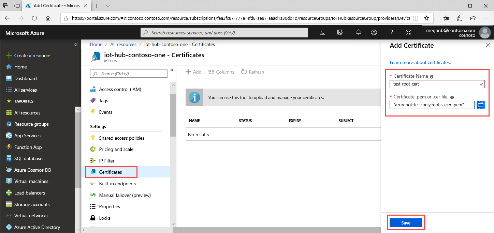
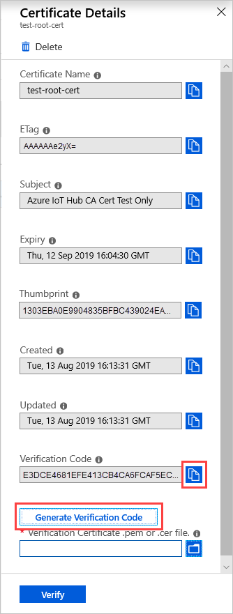
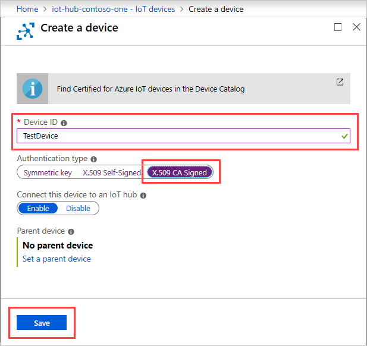
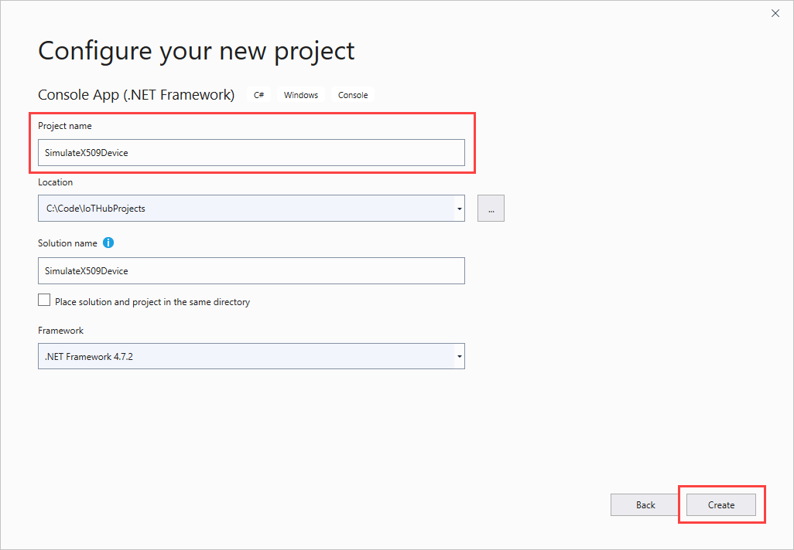
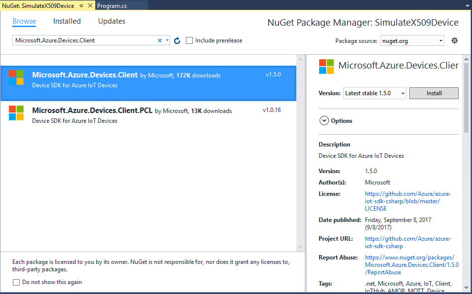
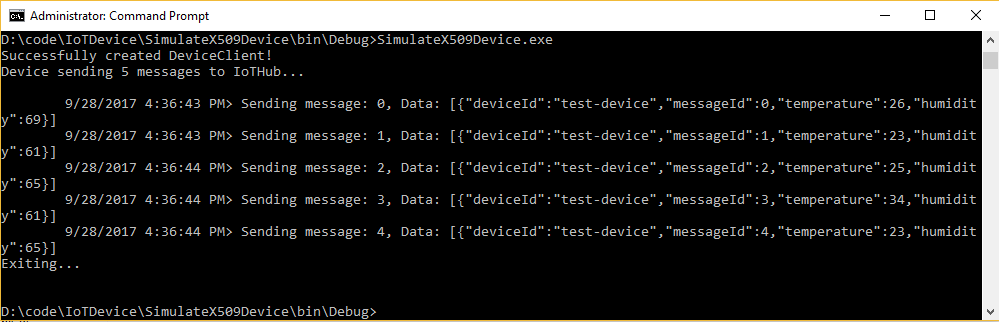

# Set up X.509 security in your Azure IoT hub

This tutorial shows the steps you need to secure your Azure IoT hub using the *X.509 Certificate Authentication*. For the purpose of illustration, we use the open-source tool OpenSSL to create certificates locally on your Windows machine. We recommend that you use this tutorial for test purposes only. For production environment, you should purchase the certificates from a *root certificate authority (CA)*.

## Prerequisites

This tutorial requires that you have the following resources ready:

* You have created an IoT hub with your Azure subscription. See [Create an IoT hub through portal](iot-hub-create-through-portal.md) for detailed steps.

* You have [Visual Studio 2017 or Visual Studio 2019](https://www.visualstudio.com/vs/) installed.

## Get X.509 CA certificates

The X.509 certificate-based security in the IoT Hub requires you to start with an [X.509 certificate chain](https://en.wikipedia.org/wiki/X.509#Certificate_chains_and_cross-certification), which includes the root certificate as well as any intermediate certificates up until the leaf certificate.

You may choose any of the following ways to get your certificates:

* Purchase X.509 certificates from a *root certificate authority (CA)*. This method is recommended for production environments.

* Create your own X.509 certificates using a third-party tool such as [OpenSSL](https://www.openssl.org/). This technique is fine for test and development purposes. See [Managing test CA certificates for samples and tutorials](https://github.com/Azure/azure-iot-sdk-c/blob/master/tools/CACertificates/CACertificateOverview.md) for information about generating test CA certificates using PowerShell or Bash. The rest of this tutorial uses test CA certificates generated by following the instructions in [Managing test CA certificates for samples and tutorials](https://github.com/Azure/azure-iot-sdk-c/blob/master/tools/CACertificates/CACertificateOverview.md).

* Generate an [X.509 intermediate CA certificate](iot-hub-x509ca-overview.md#sign-devices-into-the-certificate-chain-of-trust) signed by an existing root CA certificate and upload it to the hub. Once the intermediate certificate is uploaded and verified, as instructed below, it can be used in the place of a root CA certificate mentioned below. Tools like OpenSSL ([openssl req](https://www.openssl.org/docs/man1.1.0/man1/req.html) and [openssl ca](https://www.openssl.org/docs/man1.1.0/man1/ca.html)) can be used to generate and sign an intermediate CA certificate.

> [!NOTE]
> Do not upload the 3rd party root if it is not unique to you because that would enable other customers of the 3rd party to connect their devices to your IoT Hub.

## Register X.509 CA certificates to your IoT hub

These steps show you how to add a new Certificate Authority to your IoT hub through the portal.

1. In the Azure portal, navigate to your IoT hub and select **Settings** > **Certificates** for the hub.

1. Select **Add** to add a new certificate.

1. In **Certificate Name**, enter a friendly display name, and select the certificate file you created in the previous section from your computer.

1. Once you get a notification that your certificate is successfully uploaded, select **Save**.

      

   Your certificate appears in the certificates list with status of **Unverified**.

1. Select the certificate that you just added to display **Certificate Details**, and then select **Generate Verification Code**.

     

1. Copy the **Verification Code** to the clipboard. You use it to validate the certificate ownership.

1. Follow Step 3 in [Managing test CA certificates for samples and tutorials](https://github.com/Azure/azure-iot-sdk-c/blob/master/tools/CACertificates/CACertificateOverview.md).  This process signs your verification code with the private key associate with your X.509 CA certificate, which generates a signature. There are tools available to perform this signing process, for example, OpenSSL. This process is known as the [Proof of possession](https://tools.ietf.org/html/rfc5280#section-3.1).

1. In **Certificate Details**, under **Verification Certificate .pem or .cer file**, find and open the signature file. Then select **Verify**.

   The status of your certificate changes to **Verified**. Select **Refresh** if the certificate does not update automatically.

## Create an X.509 device for your IoT hub

1. In the Azure portal, navigate to your IoT hub, and then select **Explorers** > **IoT devices**.

1. Select **New** to add a new device.

1. In **Device ID**, enter a friendly display name. For **Authentication type**, choose **X.509 CA Signed**, and then select **Save**.

   

## Authenticate your X.509 device with the X.509 certificates

To authenticate your X.509 device, you need to first sign the device with the CA certificate. Signing of leaf devices is normally done at the manufacturing plant, where manufacturing tools have been enabled accordingly. As the device goes from one manufacturer to another, each manufacturer's signing action is captured as an intermediate certificate within the chain. The result is a certificate chain from the CA certificate to the device's leaf certificate. Step 4 in [Managing test CA certificates for samples and tutorials](https://github.com/Azure/azure-iot-sdk-c/blob/master/tools/CACertificates/CACertificateOverview.md) generates a device certificate.

Next, we will show you how to create a C# application to simulate the X.509 device registered for your IoT hub. We will send temperature and humidity values from the simulated device to your hub. In this tutorial, we will create only the device application. It is left as an exercise to the readers to create the IoT Hub service application that will send response to the events sent by this simulated device. The C# application assumes that you have followed the steps in [Managing test CA certificates for samples and tutorials](https://github.com/Azure/azure-iot-sdk-c/blob/master/tools/CACertificates/CACertificateOverview.md).

1. Open Visual Studio, select **Create a new project**, and then choose the **Console App (.NET Framework)** project template. Select **Next**.

1. In **Configure your new project**, name the project *SimulateX509Device*, and then select **Create**.

   

1. In Solution Explorer, right-click the **SimulateX509Device** project, and then select **Manage NuGet Packages**.

1. In the **NuGet Package Manager**, select **Browse** and search for and choose **Microsoft.Azure.Devices.Client**. Select **Install**.

   

    This step downloads, installs, and adds a reference to the Azure IoT device SDK NuGet package and its dependencies.

1. Add the following `using` statements at the top of the **Program.cs** file:

    ```csharp
        using Microsoft.Azure.Devices.Client;
        using Microsoft.Azure.Devices.Shared;
        using System.Security.Cryptography.X509Certificates;
    ```

1. Add the following fields to the **Program** class:

    ```csharp
        private static int MESSAGE_COUNT = 5;
        private const int TEMPERATURE_THRESHOLD = 30;
        private static String deviceId = "<your-device-id>";
        private static float temperature;
        private static float humidity;
        private static Random rnd = new Random();
    ```

    Use the friendly device name you used in the preceding section in place of _<your_device_id>_.

1. Add the following function to create random numbers for temperature and humidity and send these values to the hub:

    ```csharp
    static async Task SendEvent(DeviceClient deviceClient)
    {
        string dataBuffer;
        Console.WriteLine("Device sending {0} messages to IoTHub...\n", MESSAGE_COUNT);

        for (int count = 0; count < MESSAGE_COUNT; count++)
        {
            temperature = rnd.Next(20, 35);
            humidity = rnd.Next(60, 80);
            dataBuffer = string.Format("{{\"deviceId\":\"{0}\",\"messageId\":{1},\"temperature\":{2},\"humidity\":{3}}}", deviceId, count, temperature, humidity);
            Message eventMessage = new Message(Encoding.UTF8.GetBytes(dataBuffer));
            eventMessage.Properties.Add("temperatureAlert", (temperature > TEMPERATURE_THRESHOLD) ? "true" : "false");
            Console.WriteLine("\t{0}> Sending message: {1}, Data: [{2}]", DateTime.Now.ToLocalTime(), count, dataBuffer);

            await deviceClient.SendEventAsync(eventMessage);
        }
    }
    ```

1. Finally, add the following lines of code to the **Main** function, replacing the placeholders _device-id_, _your-iot-hub-name_, and _absolute-path-to-your-device-pfx-file_ as required by your setup.

    ```csharp
    try
    {
        var cert = new X509Certificate2(@"<absolute-path-to-your-device-pfx-file>", "1234");
        var auth = new DeviceAuthenticationWithX509Certificate("<device-id>", cert);
        var deviceClient = DeviceClient.Create("<your-iot-hub-name>.azure-devices.net", auth, TransportType.Amqp_Tcp_Only);

        if (deviceClient == null)
        {
            Console.WriteLine("Failed to create DeviceClient!");
        }
        else
        {
            Console.WriteLine("Successfully created DeviceClient!");
            SendEvent(deviceClient).Wait();
        }

        Console.WriteLine("Exiting...\n");
    }
    catch (Exception ex)
    {
        Console.WriteLine("Error in sample: {0}", ex.Message);
    }
    ```

   This code connects to your IoT hub by creating the connection string for your X.509 device. Once successfully connected, it then sends temperature and humidity events to the hub, and waits for its response.

1. Run the app. Because this application accesses a *.pfx* file, you may need to run this app as an administrator.

   1. Build the Visual Studio solution.

   1. Open a new Command Prompt window by using **Run as administrator**.  

   1. Navigate to the folder that contains your solution, then navigate to the *bin/Debug* path within the solution folder.

   1. Run the application **SimulateX509Device.exe** from the command prompt.

   You should see your device successfully connecting to the hub and sending the events.

   

## Next steps

To learn more about securing your IoT solution, see:

* [IoT Security Best Practices](../iot-fundamentals/iot-security-best-practices.md)

* [IoT Security Architecture](../iot-fundamentals/iot-security-architecture.md)

* [Secure your IoT deployment](../iot-fundamentals/iot-security-deployment.md)

To further explore the capabilities of IoT Hub, see:

* [Deploying AI to edge devices with Azure IoT Edge](../iot-edge/tutorial-simulate-device-linux.md)
