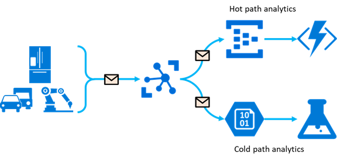
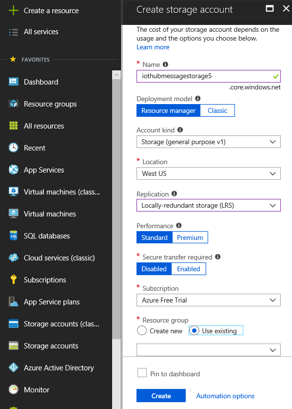
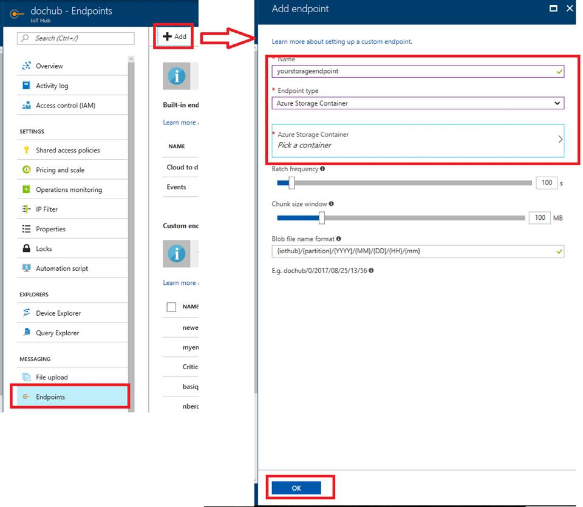
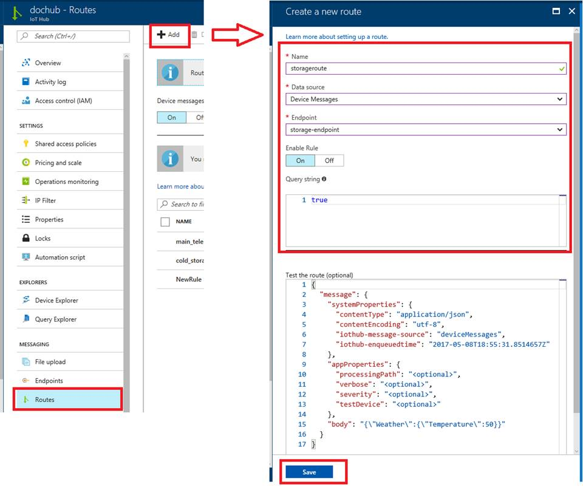
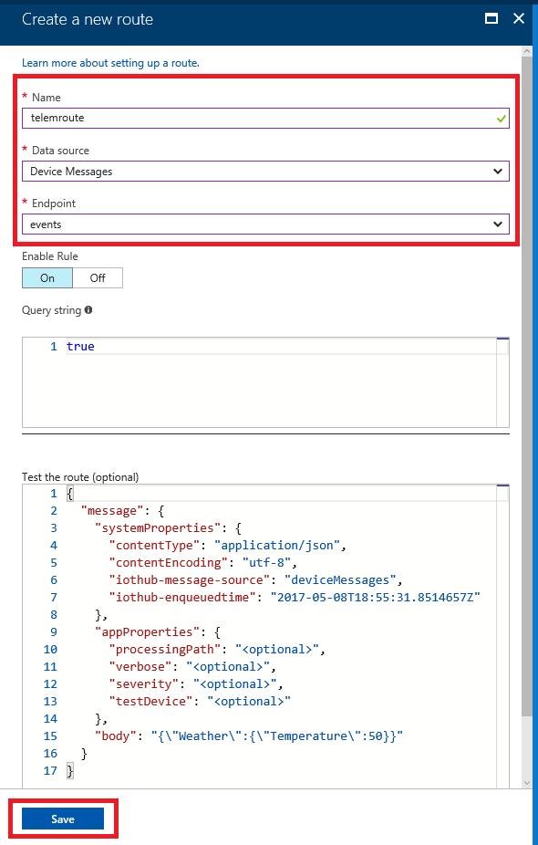
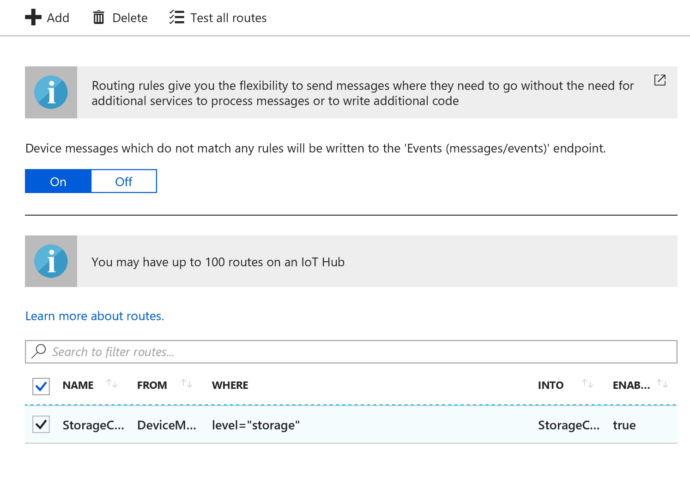
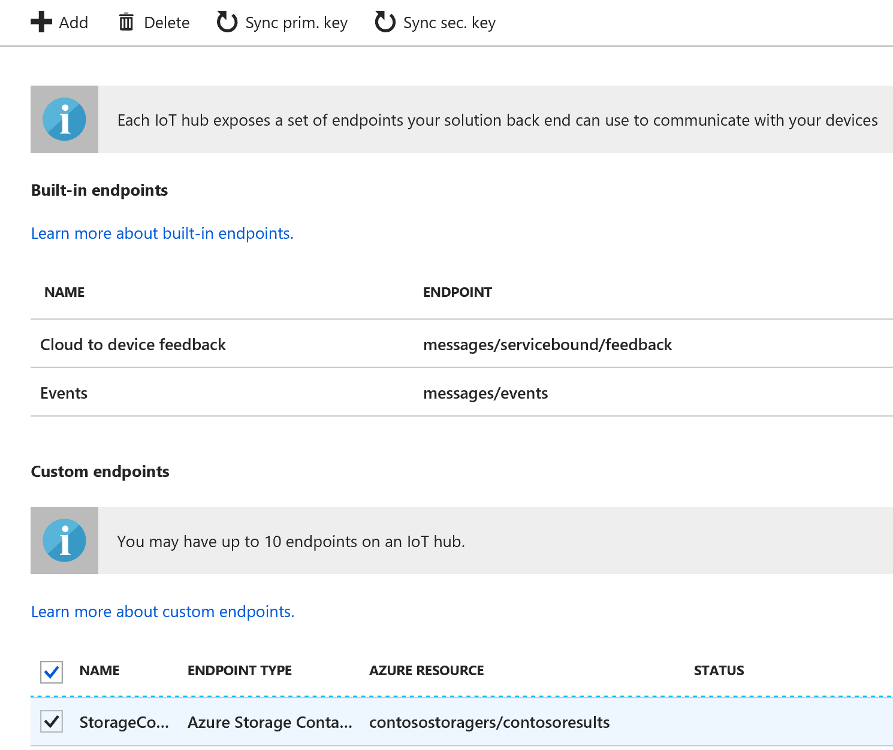
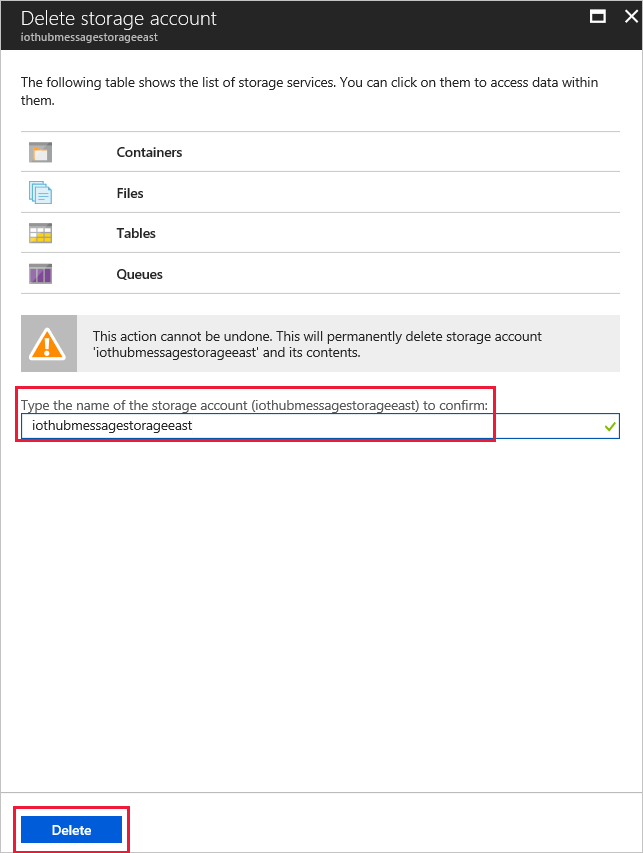

# Save IoT hub messages that contain sensor data to your Azure blob storage

[!INCLUDE [iot-hub-get-started-note](../../includes/iot-hub-get-started-note.md)]

## What you learn

You learn how to create an Azure storage account and an Azure function app to store IoT hub messages in Azure Blob storage.

## What you do

- Create an Azure storage account.
- Set up your IoT hub to route messages to storage.

## What you need

- [Set up your device](iot-hub-raspberry-pi-kit-node-get-started.md) to cover the following requirements:
  - An active Azure subscription
  - An IoT hub under your subscription 
  - A running application that sends messages to your IoT hub

## Create an Azure storage account

1. In the [Azure portal](https://portal.azure.com/), click **Create a resource** > **Storage** > **Storage account**.

2. Enter the necessary information for the storage account:

   

   * **Name**: The name of the storage account. The name must be globally unique.

   * **Account Kind**: Choose `Storage (general purpose v1)`.

   * **Location**: Choose the same location that your IoT hub uses.

   * **Replication**: Choose `Locally-redundant storage (LRS)`.

   * **Performance**: Choose `Standard`.

   * **Secure transfer required**: Choose `Disabled`.

   * **Subscription**: Select your Azure subscription.

   * **Resource group**: Use the same resource group that your IoT hub uses.

   * **Pin to dashboard**: Select this option for easy access to your IoT hub from the dashboard.

3. Click **Create**.

## Prepare your IoT hub to route messages to storage

IoT Hub natively supports routing messages to Azure storage as blobs. To know more about the Azure IoT Hub custom endpoints, you can refer to [List of built-in IoT Hub endpoints](https://docs.microsoft.com/azure/iot-hub/iot-hub-devguide-endpoints#custom-endpoints).

### Add storage as a custom endpoint

1. Navigate to your IoT hub in the Azure portal. 

2. Click **Endpoints** > **Add**. 

3. Name the endpoint and select **Azure Storage Container** as the endpoint type. 

4. Use the picker to select the storage account you created in the previous section. Create a storage container and select it, then click **OK**.

   

### Add a route to route data to storage

1. Click **Routes** > **Add** and enter a name for the route. 

2. Select **Device Messages** as the data source, and select the storage endpoint you just created as the endpoint in the route. 

3. Enter `true` as the query string, then click **Save**.

   
  
### Add a route for hot path telemetry (optional)

By default, IoT Hub routes all messages which do not match any other routes to the built-in endpoint. Since all telemetry messages now match the rule which routes the messages to storage, you need to add another route for messages to be written to the built-in endpoint. There is no additional charge to route messages to multiple endpoints.

> [!NOTE]
> You can skip this step if you are not doing additional processing on your telemetry messages.

1. Click **Add** from the Routes pane and enter a name for the route. 

2. Select **Device Messages** as the data source and **events** as the endpoint. 

3. Enter `true` as the query string, then click **Save**.

  

## Verify your message in your storage container

1. Run the sample application on your device to send messages to your IoT hub.

2. [Download and install Azure Storage Explorer](http://storageexplorer.com/).

3. Open Storage Explorer, click **Add an Azure Account** > **Sign in**, and then sign in to your Azure account.

4. Click your Azure subscription > **Storage Accounts** > your storage account > **Blob Containers** > your container.

   You should see messages sent from your device to your IoT hub logged in the blob container.

## Clean up resources 

In this tutorial, you added a storage account, and then added routing for messages from the IoT Hub to be written to the storage account. To clean up the resources you created, you remove the routing information and then delete the storage account. 

1. Log into the [Azure portal](https://portal.azure.com).

2. Click **Resource groups** and select the resource group you used. The list of resources in the group is displayed. 

   > [!NOTE]
   > If you want to remove all of the resources in the resource group, click **Delete** to delete the resource group, then follow the directions. This will remove everything in that resource group, so you're finished cleaning up the resources and can skip to the next section.

3. Click on the IoT hub you used for this tutorial. 

4. In the IoT Hub pane, click **Routes**. Click the checkbox next to the routing rule you added, then click **Delete**. When asked if you're sure you want to delete that route, click **Yes**.

   

   Close the Routing pane. You are returned to the Resource Group pane.

5. Click on the IoT hub again. 

6. In the IoT Hub pane, click **Endpoints**. Click the checkbox next to the endpoint you added for the storage container, then click **Delete**. When asked if you're sure you want to delete the selected endpoint, click **Yes**.

    

    Close the Endpoints pane. You are returned to the Resource Group pane. 

7.  Click on the storage account you set up for this tutorial. 

8.  On the Storage account pane, click **Delete** to remove the storage account. You are taken to the **Delete storage account** pane.

   

8.  Type in the storage account name, then click **Delete** at the bottom of the pane. 

## Next steps

You’ve successfully created your Azure storage account and routed messages from IoT Hub to a blob container in that storage account.

[!INCLUDE [iot-hub-get-started-next-steps](../../includes/iot-hub-get-started-next-steps.md)]
