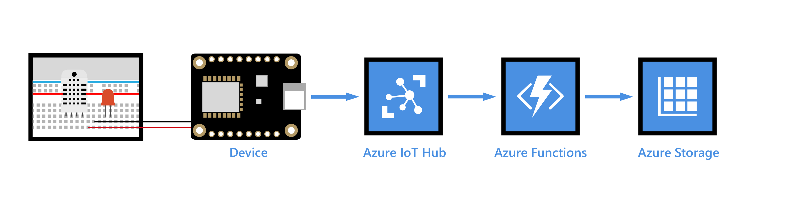

# Save IoT hub messages that contain sensor data to your Azure table storage



[!INCLUDE [iot-hub-get-started-note](../../includes/iot-hub-get-started-note.md)]

## What you learn

You learn how to create an Azure storage account and an Azure function app to store IoT hub messages in your table storage.

## What you do

- Create an Azure storage account.
- Prepare your IoT hub connection to read messages.
- Create and deploy an Azure function app.

## What you need

- [Set up your device](iot-hub-raspberry-pi-kit-node-get-started.md) to cover the following requirements:
  - An active Azure subscription
  - An Iot hub under your subscription 
  - A running application that sends messages to your IoT hub

## Create an Azure storage account

1. In the [Azure portal](https://portal.azure.com/), click **New** > **Storage** > **Storage account**.

2. Enter the necessary information for the storage account:

   

   * **Name**: The name of the storage account. The name must be globally unique.

   * **Resource group**: Use the same resource group that your IoT hub uses.

   * **Pin to dashboard**: Select this option for easy access to your IoT hub from the dashboard.

3. Click **Create**.

## Prepare your IoT hub connection to read messages

IoT hub exposes a built-in event hub-compatible endpoint to enable applications to read IoT hub messages. Meanwhile, applications use consumer groups to read data from your IoT hub. Before you create an Azure function app to read data from your IoT hub, do the following:

- Get the connection string of your IoT hub endpoint.
- Create a consumer group for your IoT hub.

### Get the connection string of your IoT hub endpoint

1. Open your IoT hub.

2. On the **IoT Hub** pane, under **Messaging**, click **Endpoints**.

3. In the right pane, under **Built-in endpoints**, click **Events**.

4. In the **Properties** pane, note the following values:
   - Event hub-compatible endpoint
   - Event hub-compatible name

   

5. In the **IoT Hub** pane, under **Settings**, click **Shared access policies**.

6. Click **iothubowner**.

7. Note the **Primary key** value.

8. Create the connection string of your IoT hub endpoint as follows:

   `Endpoint=<Event Hub-compatible endpoint>;SharedAccessKeyName=iothubowner;SharedAccessKey=<Primary key>`

   > [!NOTE]
   > Replace `<Event Hub-compatible endpoint>` and `<Primary key>` with the values that you noted earlier.

### Create a consumer group for your IoT hub

1. Open your IoT hub.

2. In the **IoT Hub** pane, under **Messaging**, click **Endpoints**.

3. In the right pane, under **Built-in endpoints**, click **Events**.

4. In the **Properties** pane, under **Consumer groups**, enter a name, and then make a note of it.

5. Click **Save**.

## Create and deploy an Azure function app

1. In the [Azure portal](https://portal.azure.com/), click **New** > **Compute** > **Function App**.

2. Enter the necessary information for the function app.

   

   * **App name**: The name of the function app. The name must be globally unique.

   * **Resource group**: Use the same resource group that your IoT hub uses.

   * **Storage Account**: The storage account that you created.

   * **Pin to dashboard**: Check this option for easy access to the function app from the dashboard.

3. Click **Create**.

4. After the function app has been created, open it.

5. In the function app, create a new function by doing the following:

   a. Click **New Function**.

   b. Select **JavaScript** for **Language**, and **Data Processing** for **Scenario**.

   c. Click **Create this function**, and then click **New Function**.

   d. Select **JavaScript** for the language, and **Data Processing** for the scenario.

   e. Click the **EventHubTrigger-JavaScript** template.

   f. Enter the necessary information for the template.

      * **Name your function**: The name of the function.

      * **Event Hub name**: The event hub-compatible name that you noted earlier.

      * **Event Hub connection**: To add the connection string of the IoT hub endpoint that you created, click **New**.

   g. Click **Create**.

6. Configure an output of the function by doing the following:

   a. Click **Integrate** > **New Output** > **Azure Table Storage** > **Select**.

      

   b. Enter the necessary information.

      * **Table parameter name**: Use `outputTable`, which will be used in the Azure Function code.
      
      * **Table name**: Use `deviceData`.

      * **Storage account connection**: Click **New**, and then select or enter your storage account. If the storage account is not displayed, see [Storage account requirements](https://docs.microsoft.com/azure/azure-functions/functions-create-function-app-portal#storage-account-requirements).
      
   c. Click **Save**.

7. Under **Triggers**, click **Azure Event Hub (myEventHubTrigger)**.

8. Under **Event Hub consumer group**, enter the name of the consumer group that you created, and then click **Save**.

9. Click **Develop**, and then click **View files**.

10. Replace the code in `index.js` with the following:

   ```javascript
   'use strict';

   // This function is triggered each time a message is received in the IoT hub.
   // The message payload is persisted in an Azure storage table
 
   module.exports = function (context, iotHubMessage) {
    context.log('Message received: ' + JSON.stringify(iotHubMessage));
    var date = Date.now();
    var partitionKey = Math.floor(date / (24 * 60 * 60 * 1000)) + '';
    var rowKey = date + '';
    context.bindings.outputTable = {
     "partitionKey": partitionKey,
     "rowKey": rowKey,
     "message": JSON.stringify(iotHubMessage)
    };
    context.done();
   };
   ```

11. Click **Save**.

You have now created the function app. It stores messages that your IoT hub receives in your table storage.

> [!NOTE]
> You can use the **Run** button to test the function app. When you click **Run**, the test message is sent to your IoT hub. The arrival of the message should trigger the function app to start and then save the message to your table storage. The **Logs** pane records the details of the process.

## Verify your message in your table storage

1. Run the sample application on your device to send messages to your IoT hub.

2. [Download and install Azure Storage Explorer](http://storageexplorer.com/).

3. Open Storage Explorer, click **Add an Azure Account** > **Sign in**, and then sign in to your Azure account.

4. Click your Azure subscription > **Storage Accounts** > your storage account > **Tables** > **deviceData**.

   You should see messages sent from your device to your IoT hub logged in the `deviceData` table.

## Next steps

You’ve successfully created your Azure storage account and Azure function app, which stores messages that your IoT hub receives in your table storage.

[!INCLUDE [iot-hub-get-started-next-steps](../../includes/iot-hub-get-started-next-steps.md)]
