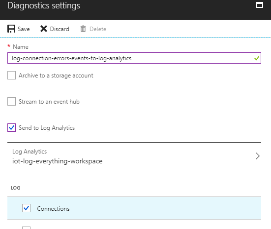
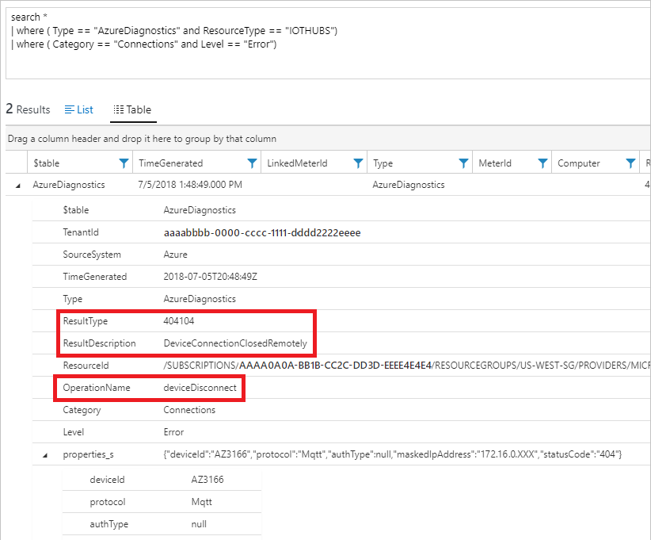

# Monitor, diagnose, and troubleshoot disconnects with Azure IoT Hub

Connectivity issues for IoT devices can be difficult to troubleshoot because there are many possible points of failure. Application logic, physical networks, protocols, hardware, IoT Hub, and other cloud services can all cause problems. The ability to detect and pinpoint the source of an issue is critical. However, an IoT solution at scale could have thousands of devices, so it's not practical to check individual devices manually. To help you detect, diagnose, and troubleshoot these issues at scale, use the monitoring capabilities IoT Hub provides through Azure Monitor. These capabilities are limited to what IoT Hub can observe, so we also recommend that you follow monitoring best practices for your devices and other Azure services.

## Get alerts and error logs

Use Azure Monitor to get alerts and write logs when devices disconnect.

### Turn on diagnostic logs

To log device connection events and errors, turn on diagnostics for IoT Hub. We recommend turning on these logs as early as possible, because if diagnostic logs aren't enabled, when device disconnects occur, you won't have any information to troubleshoot the problem with.

1. Sign in to the [Azure portal](https://portal.azure.com).

2. Browse to your IoT hub.

3. Select **Diagnostics settings**.

4. Select **Turn on diagnostics**.

5. Enable **Connections** logs to be collected.

6. For easier analysis, turn on **Send to Log Analytics** ([see pricing](https://azure.microsoft.com/pricing/details/log-analytics/)). See the example under [Resolve connectivity errors](#resolve-connectivity-errors).

   

To learn more, see [Monitor the health of Azure IoT Hub and diagnose problems quickly](iot-hub-monitor-resource-health.md).

### Set up alerts for device disconnect at scale

To get alerts when devices disconnect, configure alerts on the **Connected devices (preview)** metric.

1. Sign in to the [Azure portal](https://portal.azure.com).

2. Browse to your IoT hub.

3. Select **Alerts**.

4. Select **New alert rule**.

5. Select **Add condition**, then select "Connected devices (preview)".

6. Set up threshold and alerting by following prompts.

To learn more, see [What are alerts in Microsoft Azure?](../azure-monitor/platform/alerts-overview.md).

#### Detecting individual device disconnects

To detect *per-device* disconnects, such as when you need to know a factory just went offline, [configure device disconnect events with Event Grid](iot-hub-event-grid.md).

## Resolve connectivity errors

When you turn on diagnostic logs and alerts for connected devices, you get alerts when errors occur. This section describes how to look for common issues when you receive an alert. The steps below assume you've set up Azure Monitor logs for your diagnostic logs.

1. Sign in to the [Azure portal](https://portal.azure.com).

1. Browse to your IoT hub.

1. Select **Logs**.

1. To isolate connectivity error logs for IoT Hub, enter the following query and then select **Run**:

    ```kusto
    AzureDiagnostics
    | where ( ResourceType == "IOTHUBS" and Category == "Connections" and Level == "Error")
    ```

1. If there are results, look for `OperationName`, `ResultType` (error code), and `ResultDescription` (error message) to get more detail on the error.

   

1. Follow the problem resolution guides for the most common errors:

    - **[404104 DeviceConnectionClosedRemotely](iot-hub-troubleshoot-error-404104-deviceconnectionclosedremotely.md)**
    - **[401003 IoTHubUnauthorized](iot-hub-troubleshoot-error-401003-iothubunauthorized.md)**
    - **[409002 LinkCreationConflict](iot-hub-troubleshoot-error-409002-linkcreationconflict.md)**
    - **[500001 ServerError](iot-hub-troubleshoot-error-500xxx-internal-errors.md)**
    - **[500008 GenericTimeout](iot-hub-troubleshoot-error-500xxx-internal-errors.md)**

## I tried the steps, but they didn't work

If the previous steps didn't help, try:

* If you have access to the problematic devices, either physically or remotely (like SSH), follow the [device-side troubleshooting guide](https://github.com/Azure/azure-iot-sdk-node/wiki/Troubleshooting-Guide-Devices) to continue troubleshooting.

* Verify that your devices are **Enabled** in the Azure portal > your IoT hub > IoT devices.

* If your device uses MQTT protocol, verify that port 8883 is open. For more information, see [Connecting to IoT Hub (MQTT)](iot-hub-mqtt-support.md#connecting-to-iot-hub).

* Get help from [Microsoft Q&A question page for Azure IoT Hub](https://docs.microsoft.com/answers/topics/azure-iot-hub.html), [Stack Overflow](https://stackoverflow.com/questions/tagged/azure-iot-hub), or [Azure support](https://azure.microsoft.com/support/options/).

To help improve the documentation for everyone, leave a comment in the feedback section below if this guide didn't help you.

## Next steps

* To learn more about resolving transient issues, see [Transient fault handling](/azure/architecture/best-practices/transient-faults).

* To learn more about Azure IoT SDK and managing retries, see [How to manage connectivity and reliable messaging using Azure IoT Hub device SDKs](iot-hub-reliability-features-in-sdks.md#connection-and-retry).
