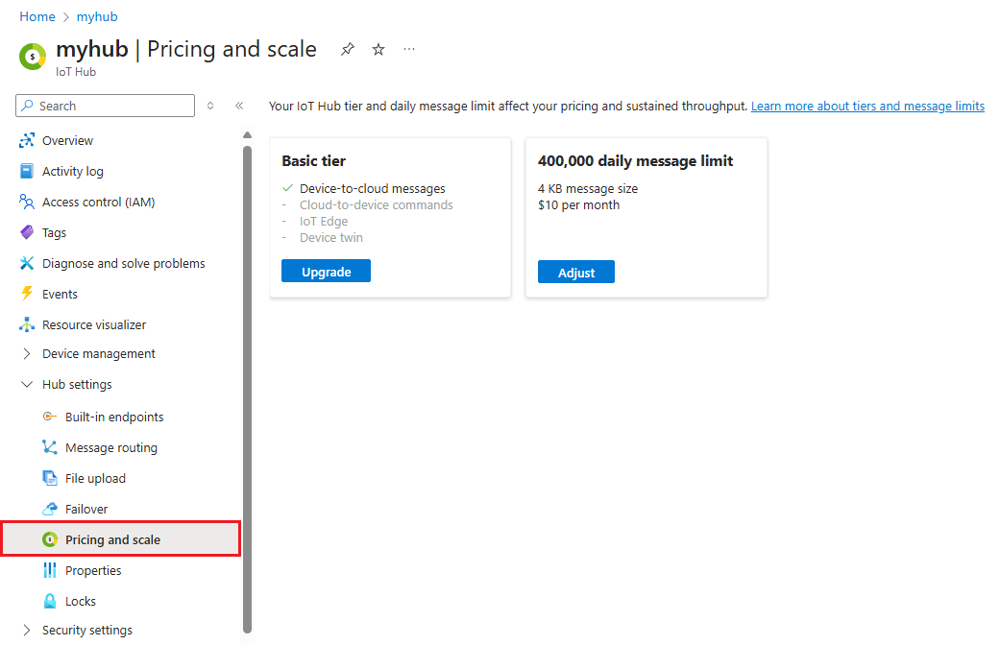
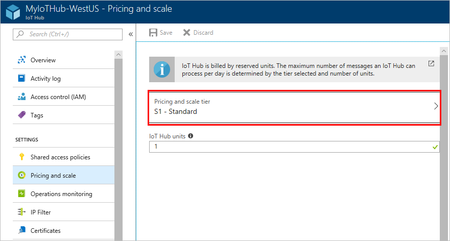

# How to upgrade your IoT hub

As your IoT solution grows, Azure IoT Hub is ready to help you scale up. Azure IoT Hub offers two tiers, basic (B) and standard (S), to accommodate customers that want to use different features. Within each tier are three sizes (1, 2, and 3) that determine the number of messages that can be sent each day.

When you have more devices and need more capabilities, there are three ways to adjust your IoT hub to suit your needs:

* Add units within the IoT hub. For example, each additional unit in a B1 IoT hub allows for an additional 400,000 messages per day.

* Change the size of the IoT hub. For example, migrate from the B1 tier to the B2 tier to increase the number of messages that each unit can support per day.

* Upgrade to a higher tier. For example, upgrade from the B1 tier to the S1 tier for access to advanced features with the same messaging capacity.

These changes can all occur without interrupting existing operations.

If you want to downgrade your IoT hub, you can remove units and reduce the size of the IoT hub but you cannot downgrade to a lower tier. For example, you can move from the S2 tier to the S1 tier, but not from the S2 tier to the B1 tier. Only one type of [Iot Hub edition](https://azure.microsoft.com/pricing/details/iot-hub/) within a tier can be chosen per IoT Hub. For example, you can create an IoT Hub with multiple units of S1, but not with a mix of units from different editions, such as S1 and B3, or S1 and S2.

These examples are meant to help you understand how to adjust your IoT hub as your solution changes. For specific information about each tier's capabilities, you should always refer to [Azure IoT Hub pricing](https://azure.microsoft.com/pricing/details/iot-hub/).

## Upgrade your existing IoT hub

1. Sign in to the [Azure portal](https://portal.azure.com/) and navigate to your IoT hub.

2. Select **Pricing and scale**.

   

3. To change the tier for your hub, select **Pricing and scale tier**. Choose the new tier, then click **select**.

   

4. To change the number of units in your hub, enter a new value under **IoT Hub units**.

5. Select **Save** to save your changes.

Your IoT hub is now adjusted, and your configurations are unchanged.

The maximum partition limit for basic tier IoT Hub and standard tier IoT Hub is 32. Most IoT Hubs only need 4 partitions. The partition limit is chosen when IoT Hub is created, and relates the device-to-cloud messages to the number of simultaneous readers of these messages. This value remains unchanged when you migrate from basic tier to standard tier.

## Next steps

Get more details about [How to choose the right IoT Hub tier](iot-hub-scaling.md).