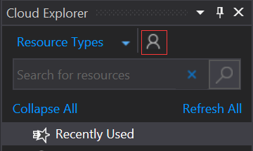
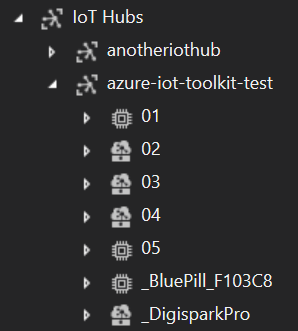
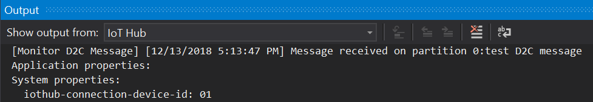
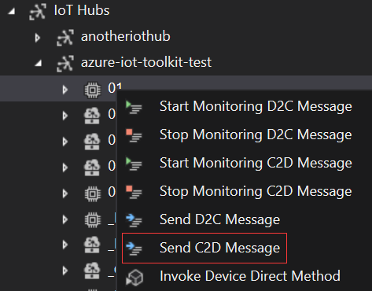
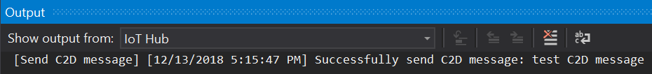

# Use Cloud Explorer for Visual Studio to send and receive messages between your device and IoT Hub

[Cloud Explorer](https://marketplace.visualstudio.com/items?itemName=ms-azuretools.CloudExplorerForVS) is a useful Visual Studio extension that enables you to view your Azure resources, inspect their properties and perform key developer actions from within Visual Studio. This article focuses on how to use Cloud Explorer to send and receive messages between your device and your IoT Hub.

[!INCLUDE [iot-hub-basic](../../includes/iot-hub-basic-partial.md)]

## What you will learn

You will learn how to use Cloud Explorer for Visual Studio to monitor device-to-cloud messages and to send cloud-to-device messages. Device-to-cloud messages could be sensor data that your device collects and then sends to your IoT Hub. Cloud-to-device messages could be commands that your IoT Hub sends to your device. For example, blink an LED that is connected to your device.

## What you will do

- Use Cloud Explorer for Visual Studio to monitor device-to-cloud messages.
- Use Cloud Explorer for Visual Studio to send cloud-to-device messages.

## What you need

- An active Azure subscription.
- An Azure IoT Hub under your subscription.
- Microsoft Visual Studio 2017 Update 8 or later
- Cloud Explorer component from Visual Studio Installer (selected by default with Azure Workload)

## Update Cloud Explorer to latest version

The Cloud Explorer component from Visual Studio Installer only supports monitoring device-to-cloud and cloud-to-device messages. In order to send messages to device or cloud, you download and install the latest [Cloud Explorer](https://marketplace.visualstudio.com/items?itemName=ms-azuretools.CloudExplorerForVS).

## Sign in to access your IoT Hub

1. In Visual Studio **Cloud Explorer** window, click the Account Management icon. You can open the Cloud Explorer window from **View** > **Cloud Explorer** menu.

    

2. Click **Manage Accounts** in Cloud Explorer.

3. Click **Add an account...** in the new window to sign in to Azure for the first time.

4. After you sign in, your Azure subscription list will be shown. Select the Azure subscriptions you want to view and click **Apply**.

5. Expand **Your subscription** > **IoT Hubs** > **Your IoT Hub**, the device list will be shown under your IoT Hub node.

    

## Monitor device-to-cloud messages

To monitor messages that are sent from your device to your IoT Hub, follow these steps:

1. Right-click your IoT Hub or device and select **Start Monitoring D2C Message**.

    

2. The monitored messages will be shown in the **IoT Hub** output pane.

    

3. To stop monitoring, right-click on any IoT Hub or device and select **Stop Monitoring D2C Message**.

## Send cloud-to-device messages

To send a message from your IoT Hub to your device, follow these steps:

1. Right-click your device and select **Send C2D Message**.

    

2. Enter the message in input box.

3. Results will be shown in the **IoT Hub** output pane.

    

## Next steps

You’ve learned how to monitor device-to-cloud messages and send cloud-to-device messages between your IoT device and Azure IoT Hub.

[!INCLUDE [iot-hub-get-started-next-steps](../../includes/iot-hub-get-started-next-steps.md)]