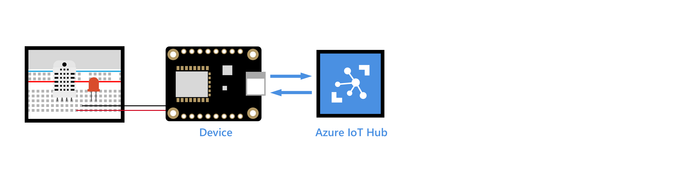
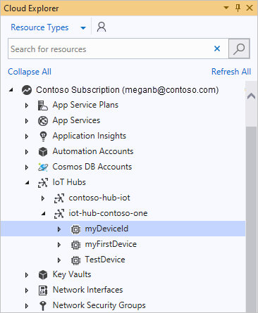
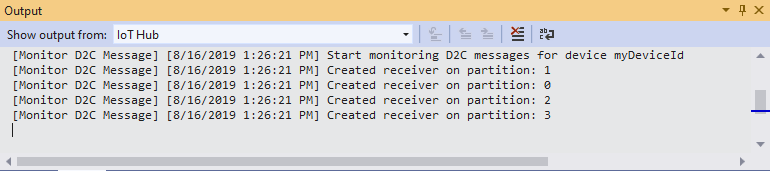
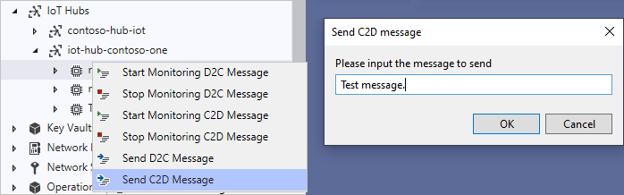
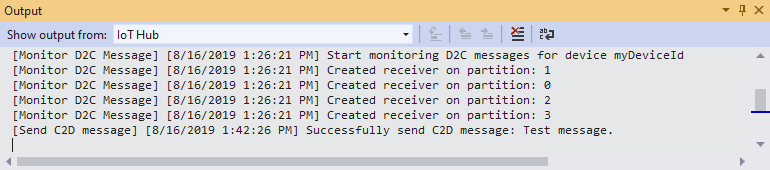

# Use Cloud Explorer for Visual Studio to send and receive messages between your device and IoT Hub

In this article, you learn how to use Cloud Explorer for Visual Studio to monitor device-to-cloud messages and to send cloud-to-device messages. Device-to-cloud messages could be sensor data that your device collects and then sends to your IoT Hub. Cloud-to-device messages could be commands that your IoT Hub sends to your device. For example, blink an LED that is connected to your device.

[Cloud Explorer](https://marketplace.visualstudio.com/items?itemName=ms-azuretools.CloudExplorerForVS) is a useful Visual Studio extension that enables you to view your Azure resources, inspect their properties and perform key developer actions from within Visual Studio. This article focuses on how to use Cloud Explorer to send and receive messages between your device and your hub.

[!INCLUDE [iot-hub-basic](../../includes/iot-hub-basic-partial.md)]

## Prerequisites

- An active Azure subscription.

- An Azure IoT Hub under your subscription.

- Microsoft Visual Studio 2017 Update 9 or later. This article uses [Visual Studio 2019](https://www.visualstudio.com/vs/).

- The Cloud Explorer component from Visual Studio Installer, which is selected by default with Azure Workload.

## Update Cloud Explorer to latest version

The Cloud Explorer component from Visual Studio Installer for Visual Studio 2017 only supports monitoring device-to-cloud and cloud-to-device messages. To use Visual Studio 2017, download and install the latest [Cloud Explorer](https://marketplace.visualstudio.com/items?itemName=ms-azuretools.CloudExplorerForVS).

## Sign in to access your hub

To access your hub, follow these steps:

1. In Visual Studio, select **View** > **Cloud Explorer** to open Cloud Explorer.

1. Select the Account Management icon to show your subscriptions.

    

1. If you are signed in to Azure, your accounts appear. To sign into Azure for the first time, choose **Add an account**.

1. Select the Azure subscriptions you want to use and choose **Apply**.

1. Expand your subscription, then expand **IoT Hubs**.  Under each hub, you can see your devices for that hub.

    

## Monitor device-to-cloud messages

To monitor messages that are sent from your device to your IoT Hub, follow these steps:

1. Right-click your IoT Hub or device and select **Start Monitoring D2C Message**.

    

1. The monitored messages appear under **Output**.

    

1. To stop monitoring, right-click on any IoT Hub or device and select **Stop Monitoring D2C Message**.

## Send cloud-to-device messages

To send a message from your IoT Hub to your device, follow these steps:

1. Right-click your device and select **Send C2D Message**.

1. Enter the message in input box.

    

    Results appear under **Output**.

    

## Next steps

You’ve learned how to monitor device-to-cloud messages and send cloud-to-device messages between your IoT device and Azure IoT Hub.

[!INCLUDE [iot-hub-get-started-next-steps](../../includes/iot-hub-get-started-next-steps.md)]