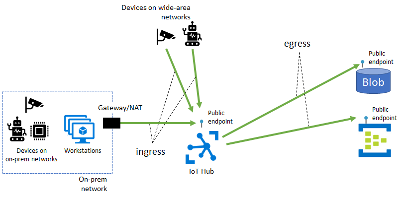
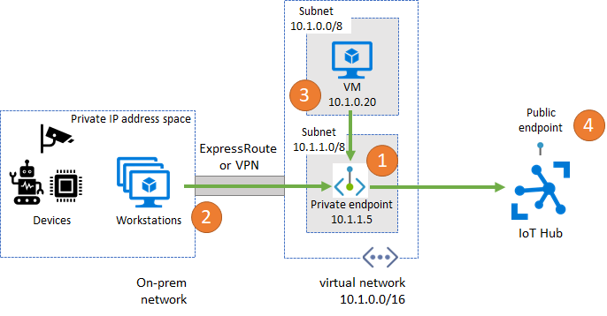

# IoT Hub Support for VNET's

This article introduces the VNET connectivity pattern and elaborates on how to set up a private connectivity experience to an IoT Hub through a customer-owned Azure VNET.

> [!NOTE]
> The IoT hub features and functionalities described in this article is currenlty available to IoT Hub created in East US, South Central US, and West US 2 regions.


## Introduction

By default, IoT Hub hostnames map to a public endpoint with a publicly routable IP address over the Internet. As shown in the illustration below, this IoT Hub public endpoint is shared among hubs owned by different customers and can be accessed by IoT devices over wide-area networks as well as on-prem networks alike.

Several IoT Hub features including [message routing](./iot-hub-devguide-messages-d2c.md), [file upload](./iot-hub-devguide-file-upload.md), and [bulk device import/export](./iot-hub-bulk-identity-mgmt.md) similarly require connectivity from IoT Hub to a customer-owned Azure resource over its public endpoint. As illustrated below, these connectivity paths collectively constitute the egress traffic from IoT Hub to customer resources.



For several reasons, customers may wish to restrict connectivity to their Azure resources (including IoT Hub) through a VNET that they own and operate. These reasons include:

* Introducing additional layers of security via network level isolation for your IoT Hub by preventing connectivity exposure to your hub over the public Internet.

* Enabling a private connectivity experience from your on-prem network assets ensuring that your data and traffic 
is transmitted directly to Azure backbone network.

* Preventing exfiltration attacks from sensitive on-prem networks. 

* Following established Azure-wide connectivity patterns using [private endpoints](../private-link/private-endpoint-overview.md).


This article describes how to achieve these goals using [private endpoints](../private-link/private-endpoint-overview.md) for ingress connectivity to IoT Hub, as using Azure trusted first party services exception for egress connectivity from IoT Hub to other Azure resources.


## Ingress connectivity to IoT Hub using private endpoints

A private endpoint is a private IP address allocated inside a customer-owned VNET via which an Azure resource is reachable. By having a private endpoint for your IoT Hub, you will be able to allow services operating inside your VNET to reach IoT Hub without requiring traffic to be sent to IoT Hub's public endpoint. Similarly, devices that operate in your on-prem can use [Virtual Private Network (VPN)](https://docs.microsoft.com/azure/vpn-gateway/vpn-gateway-about-vpngateways) or [ExpressRoute](https://azure.microsoft.com/services/expressroute/) Private Peering to gain connectivity to your VNET in Azure and subsequently to your IoT Hub (via its private endpoint). As a result, customers who wish to restrict connectivity to their IoT Hub's public endpoints (or possibly completely block it off) can achieve this goal by using [IoT Hub firewall rules](./iot-hub-ip-filtering.md) while retaining connectivity to their Hub using the private endpoint.

> [!NOTE]
> The main focus of this setup is for devices inside an on-prem network. This setup is not advised for devices deployed in a wide-area network. 



Before proceeding ensure that the following prerequisites are met:

* Your IoT hub must be provisioned in one of the [supported regions](#regional-availability-private-endpoints).

* You have provisioned an Azure VNET with a subnet in which the private endpoint will be created. See [create a virtual network using Azure CLI](../virtual-network/quick-create-cli.md) for more details.

* For devices that operate inside of on-prem networks, set up [Virtual Private Network (VPN)](https://docs.microsoft.com/azure/vpn-gateway/vpn-gateway-about-vpngateways) or [ExpressRoute](https://azure.microsoft.com/services/expressroute/) private peering into your Azure VNET.


### Regional availability (private endpoints)

Private endpoints supported in IoT Hub's created in the following regions:

* East US

* South Central US

* West US 2


### Set up a private endpoint for IoT Hub ingress

To set up a private endpoint, follow these steps:

* Navigate to the _Private endpoint connections_ tab in your IoT Hub portal (this tab is only available for in IoT Hubs in the [supported regions](#regional-availability-private-endpoints)), and click the _+_ sign to add a new private endpoint.

* Provide the subscription, resource group, name and region to create the new private endpoint in (ideally, private endpoint should be created in the same region as your hub; see [regional availability section](#regional-availability-private-endpoints) for more details).

* Click _Next: Resource_, and provide the subscription for your IoT Hub resource, and select _"Microsoft.Devices/IotHubs"_ as resource type, your IoT Hub name as _resource_, and _iotHub_ as target sub-resource.

* Click _Next: Configuration_ and provide your virtual network and subnet to create the private endpoint in. Select the option to integrate with Azure private DNS zone, if desired.

* Click _Next: Tags_, and optionally provide any tags for your resource.

* Click _Review + create_ to create your private endpoint resource.


### Pricing (private endpoints)

For pricing details, see [Azure Private Link pricing](https://azure.microsoft.com/pricing/details/private-link).


## Egress connectivity from IoT Hub to other Azure resources

IoT Hub needs access to your Azure blob storage, event hubs, service bus resources for [message routing](./iot-hub-devguide-messages-d2c.md), [file upload](./iot-hub-devguide-file-upload.md), and [bulk device import/export](./iot-hub-bulk-identity-mgmt.md), which typically takes place over the resources' public endpoint. In the event that you bind your storage account, event hubs or service bus resource to a VNET, the advised configuration will block connectivity to the resource by default. Consequently, this will impede IoT Hub's functionality that requires access to those resources.

To alleviate this situation, you need to enable connectivity from your IoT Hub resource to your storage account, event hubs or service bus resources via the _Azure first party trusted services_ option.

The prerequisites are as follows:

* Your IoT hub must be provisioned in one of the [supported regions](#regional-availability-trusted-microsoft-first-party-services).

* Your IoT Hub must be assigned a managed service identity at hub provisioning time. Follow instruction on how to [create a hub with managed service identity](#create-a-hub-with-managed-service-identity).


### Regional availability (trusted Microsoft first party services)

Azure trusted first party services exception to bypass firewall restrictions to Azure storage, event hubs and service bus resources is only supported for IoT Hubs in the following regions:

* East US

* South Central US

* West US 2


### Pricing (trusted Microsoft first party services)

Trusted Microsoft first party services exception feature is free of charge in IoT Hubs in the [supported regions](#regional-availability-trusted-microsoft-first-party-services). Charges for the provisioned storage accounts, event hubs, or service bus resources apply separately.


### Create a hub with managed service identity

A managed service identity can be assigned to your hub at resource provisioning time (this feature is not currently supported for existing hubs). For this purpose, you need to use the ARM resource template below:

```json
{
    "$schema": "https://schema.management.azure.com/schemas/2015-01-01/deploymentTemplate.json#",
    "contentVersion": "1.0.0.0",
    "resources": [
        {
            "type": "Microsoft.Devices/IotHubs",
            "apiVersion": "2020-03-01",
            "name": "<provide-a-valid-resource-name>",
            "location": "<any-of-supported-regions>",
            "identity": { "type": "SystemAssigned" },
            "properties": { "minTlsVersion": "1.2" },
            "sku": {
                "name": "<your-hubs-SKU-name>",
                "tier": "<your-hubs-SKU-tier>",
                "capacity": 1
            }
        },
        {
            "type": "Microsoft.Resources/deployments",
            "apiVersion": "2018-02-01",
            "name": "updateIotHubWithKeyEncryptionKey",
            "dependsOn": [ "<provide-a-valid-resource-name>" ],
            "properties": {
                "mode": "Incremental",
                "template": {
                    "$schema": "https://schema.management.azure.com/schemas/2019-04-01/deploymentTemplate.json#",
                    "contentVersion": "0.9.0.0",
                    "resources": [
                        {
                            "type": "Microsoft.Devices/IotHubs",
                            "apiVersion": "2020-03-01",
                            "name": "<provide-a-valid-resource-name>",
                            "location": "<any-of-supported-regions>",
                            "identity": { "type": "SystemAssigned" },
                            "properties": { "minTlsVersion": "1.2" },
                            "sku": {
                                "name": "<your-hubs-SKU-name>",
                                "tier": "<your-hubs-SKU-tier>",
                                "capacity": 1
                            }
                        }
                    ]
                }
            }
        }
    ]
}
```

After substituting the values for your resource `name`, `location`, `SKU.name` and `SKU.tier`, you can use Azure CLI to deploy the resource in an existing resource group using:

```azurecli-interactive
az group deployment create --name <deployment-name> --resource-group <resource-group-name> --template-file <template-file.json>
```

After the resource is created, you can retrieve the managed service identity assigned to your hub using Azure CLI:

```azurecli-interactive
az resource show --resource-type Microsoft.Devices/IotHubs --name <iot-hub-resource-name> --resource-group <resource-group-name>
```

Once IoT Hub with a managed service identity is provisioned, follow the corresponding section to set up routing endpoints to [storage accounts](#egress-connectivity-to-storage-account-endpoints-for-routing), [event hubs](#egress-connectivity-to-event-hubs-endpoints-for-routing), and [service bus](#egress-connectivity-to-service-bus-endpoints-for-routing) resources, or to configure [file upload](#egress-connectivity-to-storage-accounts-for-file-upload) and [bulk device import/export](#egress-connectivity-to-storage-accounts-for-bulk-device-importexport).


### Egress connectivity to storage account endpoints for routing

IoT Hub can be configured to route messages to a customer-owned storage account. To allow the routing functionality to access a storage account while firewall restrictions are in place, your IoT Hub needs to have a managed service identity (see how to [create a hub with managed service identity](#create-a-hub-with-managed-service-identity)). Once a managed service identity is provisioned, follow the steps below to give RBAC permission to your hub's resource identity to access your storage account.

* In the Azure portal, navigate to your storage account's _Access control (IAM)_ tab and click _Add_ under the _Add a role assignment_ section.

* Select _"Storage Blob Data Contributor"_ as _role_, _"Azure AD user, group, or service principal"_ as _Assigning access to_ and select your IoT Hub's resource name in the drop-down list. Click the _Save_ button.

* Navigate to the _Firewalls and virtual networks_ tab in your storage account and enable _Allow access from selected networks_ option. Under the _Exceptions_ list, check the box for _Allow trusted Microsoft services to access this storage account_. Click the _Save_ button.

* On your IoT Hub's resource page, navigate to _Message routing_ tab.

* Navigate to _Custom endpoints_ section and click _Add_. Select _Storage_ as the endpoint type.

* On the page that shows up, provide a name for your endpoint, select the container that you intend to use in your blob storage, provide encoding, and file name format. Select _System Assigned_ as the _Authentication type_ to your storage endpoint. Click the _Create_ button.

Now your custom storage endpoint is set up to use your hub's system assigned identity, and it has permission to access your storage resource despite its firewall restrictions. You can now use this endpoint to set up a routing rule.


### Egress connectivity to event hubs endpoints for routing

IoT Hub can be configured to route messages to a customer-owned event hubs namespace. To allow the routing functionality to access an event hubs resource while firewall restrictions are in place, your IoT Hub needs to have a managed service identity (see how to [create a hub with managed service identity](#create-a-hub-with-managed-service-identity)). Once a managed service identity is provisioned, follow the steps below to give RBAC permission to your hub's resource identity to access your event hubs.

* In the Azure portal, navigate to your event hubs _Access control (IAM)_ tab and click _Add_ under the _Add a role assignment_ section.

* Select _"Event Hubs Data Sender"_ as _role_, _"Azure AD user, group, or service principal"_ as _Assigning access to_ and select your IoT Hub's resource name in the drop-down list. Click the _Save_ button.

* Navigate to the _Firewalls and virtual networks_ tab in your event hubs and enable _Allow access from selected networks_ option. Under the _Exceptions_ list, check the box for _Allow trusted Microsoft services to access event hubs_. Click the _Save_ button.

* On your IoT Hub's resource page, navigate to _Message routing_ tab.

* Navigate to _Custom endpoints_ section and click _Add_. Select _Event hubs_ as the endpoint type.

* On the page that shows up, provide a name for your endpoint, select your event hubs namespace and instance and click the _Create_ button.

Now your custom event hubs endpoint is set up to use your hub's system assigned identity, and it has permission to access your event hubs resource despite its firewall restrictions. You can now use this endpoint to set up a routing rule.


### Egress connectivity to service bus endpoints for routing

IoT Hub can be configured to route messages to a customer-owned service bus namespace. To allow the routing functionality to access a service bus resource while firewall restrictions are in place, your IoT Hub needs to have a managed service identity (see how to [create a hub with managed service identity](#create-a-hub-with-managed-service-identity)). Once a managed service identity is provisioned, follow the steps below to give RBAC permission to your hub's resource identity to access your service bus.

* In the Azure portal, navigate to your service bus' _Access control (IAM)_ tab and click _Add_ under the _Add a role assignment_ section.

* Select _"Service bus Data Sender"_ as _role_, _"Azure AD user, group, or service principal"_ as _Assigning access to_ and select your IoT Hub's resource name in the drop-down list. Click the _Save_ button.

* Navigate to the _Firewalls and virtual networks_ tab in your service bus and enable _Allow access from selected networks_ option. Under the _Exceptions_ list, check the box for _Allow trusted Microsoft services to access this service bus_. Click the _Save_ button.

* On your IoT Hub's resource page, navigate to _Message routing_ tab.

* Navigate to _Custom endpoints_ section and click _Add_. Select _Service bus queue_ or _Service bus topic_ (as applicable) as the endpoint type.

* On the page that shows up, provide a name for your endpoint, select your service bus' namespace and queue or topic (as applicable). Click the _Create_ button.

Now your custom service bus endpoint is set up to use your hub's system assigned identity, and it has permission to access your service bus resource despite its firewall restrictions. You can now use this endpoint to set up a routing rule.


### Egress connectivity to storage accounts for file upload

IoT Hub's file upload feature allows devices to upload files to a customer-owned storage account. To allow the file upload to function, both devices and IoT Hub need to have connectivity to the storage account. If firewall restrictions are in place on the storage account, your devices need to use any of the supported storage account's mechanism (including [private endpoints](../private-link/create-private-endpoint-storage-portal.md), [service endpoints](../virtual-network/virtual-network-service-endpoints-overview.md) or [direct firewall configuration](../storage/common/storage-network-security.md)) to gain connectivity. Similarly, if firewall restrictions are in place on the storage account, IoT Hub needs to be configured to access the storage resource via the trusted Microsoft services exception. For this purpose, your IoT Hub must have a managed service identity (see how to [create a hub with managed service identity](#create-a-hub-with-managed-service-identity)). Once a managed service identity is provisioned, follow the steps below to give RBAC permission to your hub's resource identity to access your storage account.

* In the Azure portal, navigate to your storage account's _Access control (IAM)_ tab and click _Add_ under the _Add a role assignment_ section.

* Select _"Storage Blob Data Contributor"_ as _role_, _"Azure AD user, group, or service principal"_ as _Assigning access to_ and select your IoT Hub's resource name in the drop-down list. Click the _Save_ button.

* Navigate to the _Firewalls and virtual networks_ tab in your storage account and enable _Allow access from selected networks_ option. Under the _Exceptions_ list, check the box for _Allow trusted Microsoft services to access this storage account_. Click the _Save_ button.

* On your IoT Hub's resource page, navigate to _File upload_ tab.

* On the page that shows up, select the container that you intend to use in your blob storage, configure the _File notification settings_, _SAS TTL_, _Default TTL_ and _Maximum delivery count_ as desired. Select _System Assigned_ as the _Authentication type_ to your storage endpoint. Click the _Create_ button.

Now your storage endpoint for file upload is set up to use your hub's system assigned identity, and it has permission to access your storage resource despite its firewall restrictions.


### Egress connectivity to storage accounts for bulk device import/export

IoT Hub supports the functionality to [import/export](./iot-hub-bulk-identity-mgmt.md) devices' information in bulk from/to a customer-provided storage blob. To allow bulk import/export feature to function, both devices and IoT Hub need to have connectivity to the storage account.

This functionality requires connectivity from IoT Hub to the storage account. To access a service bus resource while firewall restrictions are in place, your IoT Hub needs to have a managed service identity (see how to [create a hub with managed service identity](#create-a-hub-with-managed-service-identity)). Once a managed service identity is provisioned, follow the steps below to give RBAC permission to your hub's resource identity to access your service bus.

* In the Azure portal, navigate to your storage account's _Access control (IAM)_ tab and click _Add_ under the _Add a role assignment_ section.

* Select _"Storage Blob Data Contributor"_ as _role_, _"Azure AD user, group, or service principal"_ as _Assigning access to_ and select your IoT Hub's resource name in the drop-down list. Click the _Save_ button.

* Navigate to the _Firewalls and virtual networks_ tab in your storage account and enable _Allow access from selected networks_ option. Under the _Exceptions_ list, check the box for _Allow trusted Microsoft services to access this storage account_. Click the _Save_ button.

You can now use the Azure IoT REST API's for [creating import export jobs](https://docs.microsoft.com/rest/api/iothub/service/createimportexportjob) for information on how to use the bulk import/export functionality. Note that you will need to provide the `autheticationType="identityBased"` in your request body and use `inputBlobContainerUri="https://..."` and `outputBlobContainerUri="https://..."` as the input and output URL's of your storage account, respectively.


Azure IoT Hub SDK's also support this functionality in the service client's registry manager. The following code snippet shows how to initiate an import job or export job in using the C# SDK. Note that the `inputBlobContainerUri` and `outputBlobContainerUri` parameters must be in HTTPS URL format (with `https://` prefix).

```csharp
// Call an import job on the IoT Hub
JobProperties importJob = 
await registryManager.ImportDevicesAsync(
  JobProperties.CreateForImportJob(inputBlobContainerUri, outputBlobContainerUri, null, StorageAuthenticationType.IdentityBased), 
  cancellationToken);

// Call an export job on the IoT Hub to retrieve all devices
JobProperties exportJob = 
await registryManager.ExportDevicesAsync(
    JobProperties.CreateForExportJob(outputBlobContainerUri, true, null, StorageAuthenticationType.IdentityBased),
    cancellationToken);
```
