# Weather forecast using the sensor data from your IoT hub in Azure Machine Learning Studio (classic)

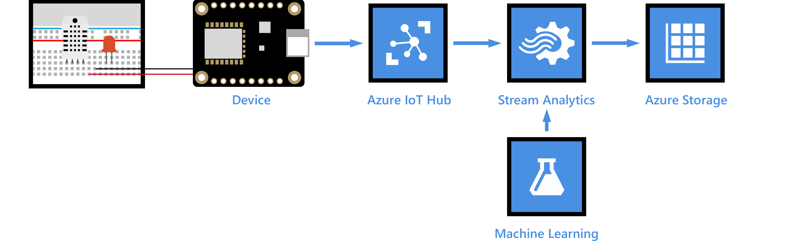

[!INCLUDE [iot-hub-get-started-note](../../includes/iot-hub-get-started-note.md)]

Machine learning is a technique of data science that helps computers learn from existing data to forecast future behaviors, outcomes, and trends. Azure Machine Learning Studio (classic) is a cloud predictive analytics service that makes it possible to quickly create and deploy predictive models as analytics solutions. In this article, you learn how to use Azure Machine Learning Studio (classic) to do weather forecasting (chance of rain) using the temperature and humidity data from your Azure IoT hub. The chance of rain is the output of a prepared weather prediction model. The model is built upon historic data to forecast chance of rain based on temperature and humidity.

## Prerequisites

- Complete the [Raspberry Pi online simulator](iot-hub-raspberry-pi-web-simulator-get-started.md) tutorial or one of the device tutorials. For example, you can go to [Raspberry Pi with node.js](iot-hub-raspberry-pi-kit-node-get-started.md) or to one of the [Send telemetry](quickstart-send-telemetry-dotnet.md) quickstarts. These articles cover the following requirements:
  - An active Azure subscription.
  - An Azure IoT hub under your subscription.
  - A client application that sends messages to your Azure IoT hub.
- An [Azure Machine Learning Studio (classic)](https://studio.azureml.net/) account.
- An [Azure Storage account](../storage/common/storage-account-overview.md?toc=%2fazure%2fstorage%2fblobs%2ftoc.json#types-of-storage-accounts), A **General-purpose v2** account is preferred, but any Azure Storage account that supports Azure Blob storage will also work.

> [!Note]
> This article uses Azure Stream Analytics and several other paid services. Extra charges are incurred in Azure Stream Analytics when data must be transferred across Azure regions. For this reason, it would be good to ensure that your Resource Group, IoT Hub, and Azure Storage account -- as well as the Machine Learning Studio (classic) workspace and Azure Stream Analytics Job added later in this tutorial -- are all located in the same Azure region. You can check regional support for Azure Machine Learning Studio (classic) and other Azure services on the [Azure product availability by region page](https://azure.microsoft.com/global-infrastructure/services/?products=machine-learning-studio&regions=all).

## Deploy the weather prediction model as a web service

In this section you get the weather prediction model from the Azure AI Library. Then you add an R-script module to the model to clean the temperature and humidity data. Lastly, you deploy the model as a predictive web service.

### Get the weather prediction model

In this section you get the weather prediction model from the Azure AI Gallery and open it in Azure Machine Learning Studio (classic).

1. Go to the [weather prediction model page](https://gallery.cortanaintelligence.com/Experiment/Weather-prediction-model-1).

   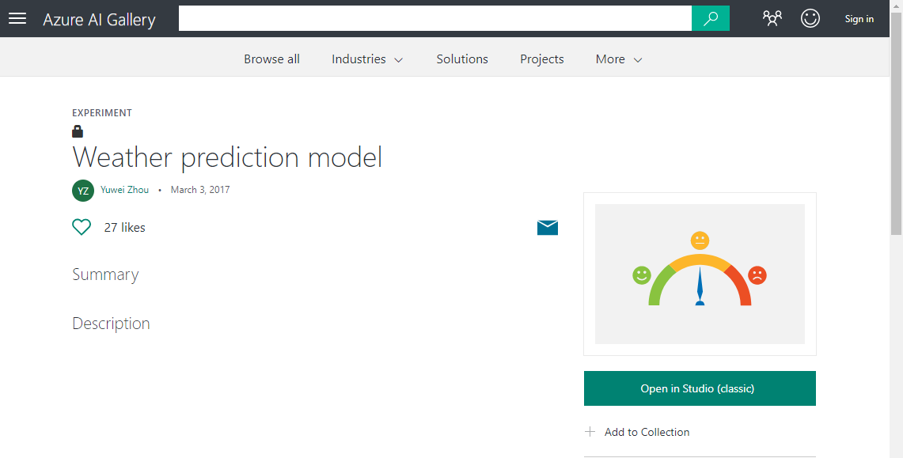

1. Select **Open in Studio (classic)** to open the model in Microsoft Azure Machine Learning Studio (classic). Select a region near your IoT hub and the correct workspace in the **Copy experiment from Gallery** pop-up.

   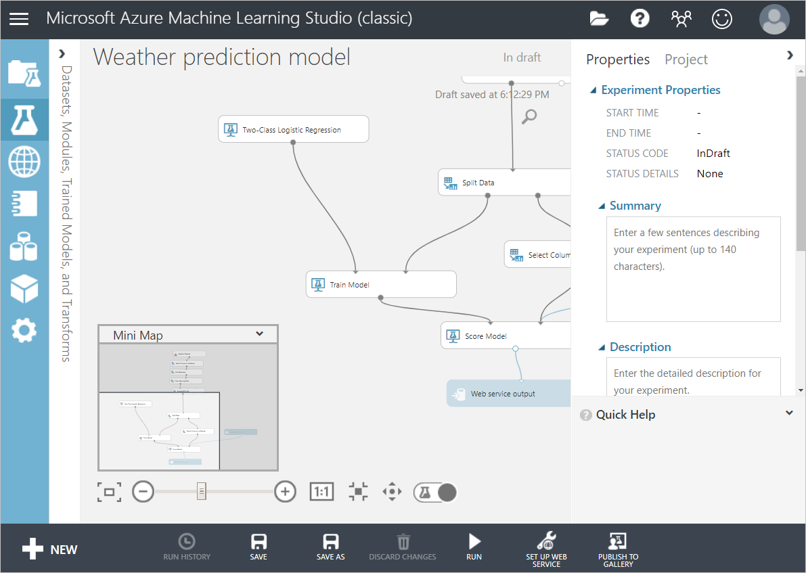

### Add an R-script module to clean temperature and humidity data

For the model to behave correctly, the temperature and humidity data must be convertible to numeric data. In this section, you add an R-script module to the weather prediction model that removes any rows that have data values for temperature or humidity that cannot be converted to numeric values.

1. On the left-side of the Azure Machine Learning Studio (classic) window, select the arrow to expand the tools panel. Enter "Execute" into the search box. Select the **Execute R Script** module.

   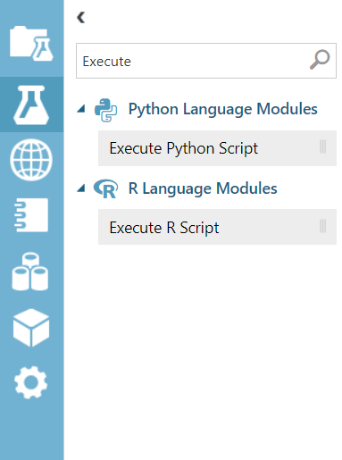

1. Drag the **Execute R Script** module near the **Clean Missing Data** module and the existing **Execute R Script** module on the diagram. Delete the connection between the **Clean Missing Data** and the **Execute R Script** modules and then connect the inputs and outputs of the new module as shown.

   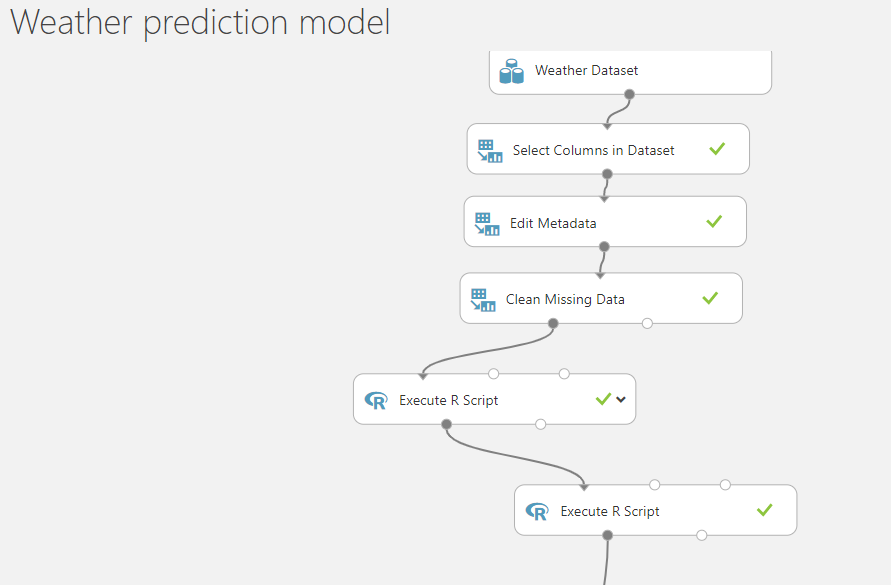

1. Select the new **Execute R Script** module to open its properties window. Copy and paste the following code into the **R Script** box.

   ```r
   # Map 1-based optional input ports to variables
   data <- maml.mapInputPort(1) # class: data.frame

   data$temperature <- as.numeric(as.character(data$temperature))
   data$humidity <- as.numeric(as.character(data$humidity))

   completedata <- data[complete.cases(data), ]

   maml.mapOutputPort('completedata')

   ```

   When you're finished, the properties window should look similar to the following:

   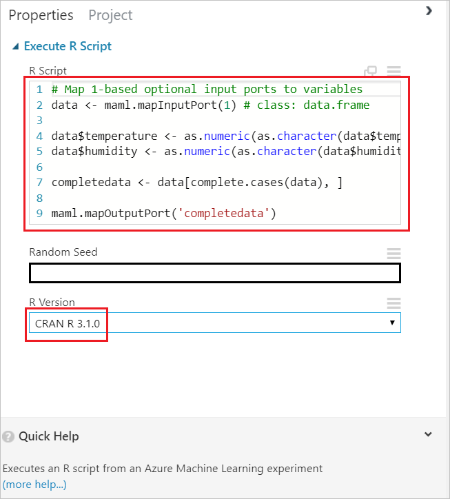

### Deploy predictive web service

In this section, you validate the model, set up a predictive web service based on the model, and then deploy the web service.

1. Select **Run** to validate the steps in the model. This step might take a few minutes to complete.

   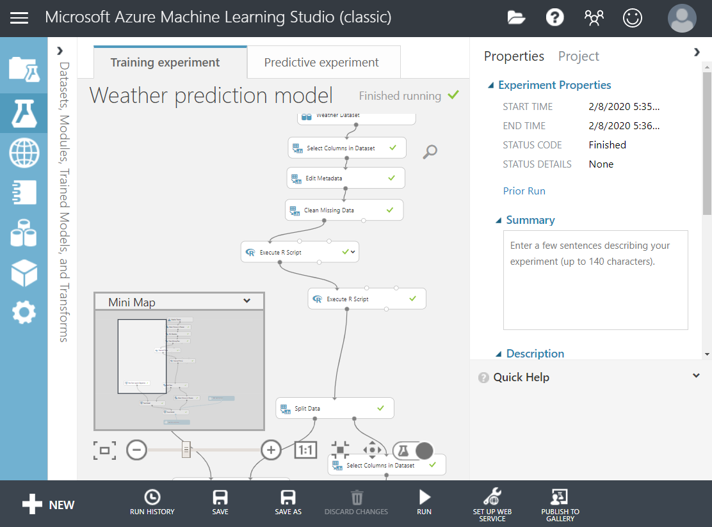

1. Select **SET UP WEB SERVICE** > **Predictive Web Service**. The predictive experiment diagram opens.

   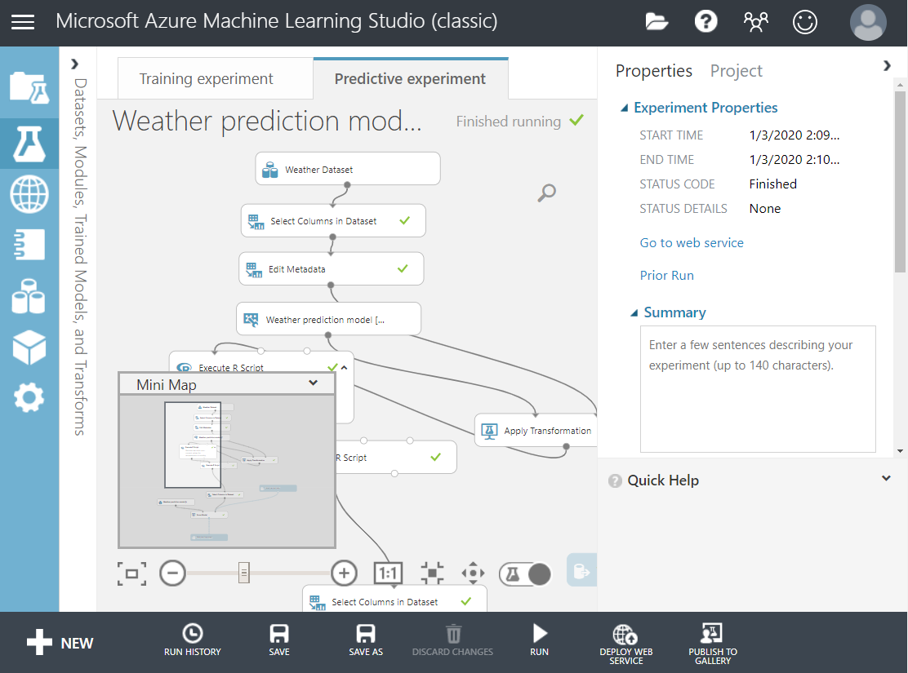

1. In the predictive experiment diagram, delete the connection between the **Web service input** module and the **Select Columns in Dataset** at the top. Then drag the **Web service input** module somewhere near the **Score Model** module and connect it as shown:

   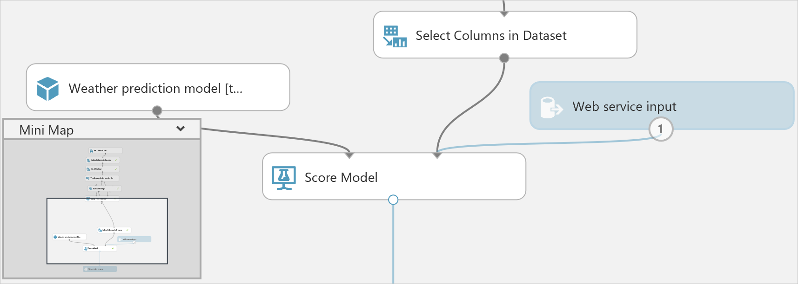

1. Select **RUN** to validate the steps in the model.

1. Select **DEPLOY WEB SERVICE** to deploy the model as a web service.

1. On the dashboard of the model, download the **Excel 2010 or earlier workbook** for **REQUEST/RESPONSE**.

   > [!Note]
   > Make sure that you download the **Excel 2010 or earlier workbook** even if you are running a later version of Excel on your computer.

   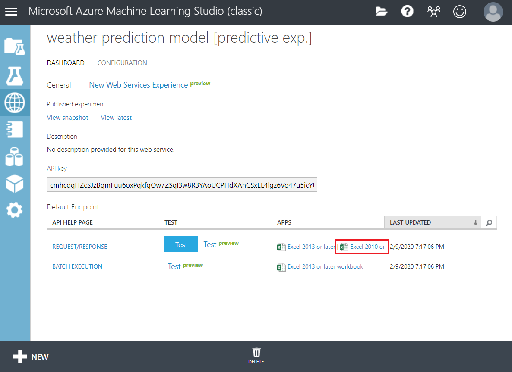

1. Open the Excel workbook, make a note of the **WEB SERVICE URL** and **ACCESS KEY**.

[!INCLUDE [iot-hub-get-started-create-consumer-group](../../includes/iot-hub-get-started-create-consumer-group.md)]

## Create, configure, and run a Stream Analytics job

### Create a Stream Analytics job

1. In the [Azure portal](https://portal.azure.com/), select **Create a resource**. Type "stream analytics job" in the Search box, and select **Stream Analytics job** from the results dropdown. When the **Stream Analytics job** pane opens, select **Create**.
1. Enter the following information for the job.

   **Job name**: The name of the job. The name must be globally unique.

   **Subscription**: Select your subscription if it is different than the default.

   **Resource group**: Use the same resource group that your IoT hub uses.

   **Location**: Use the same location as your resource group.

   Leave all other fields at their default.

   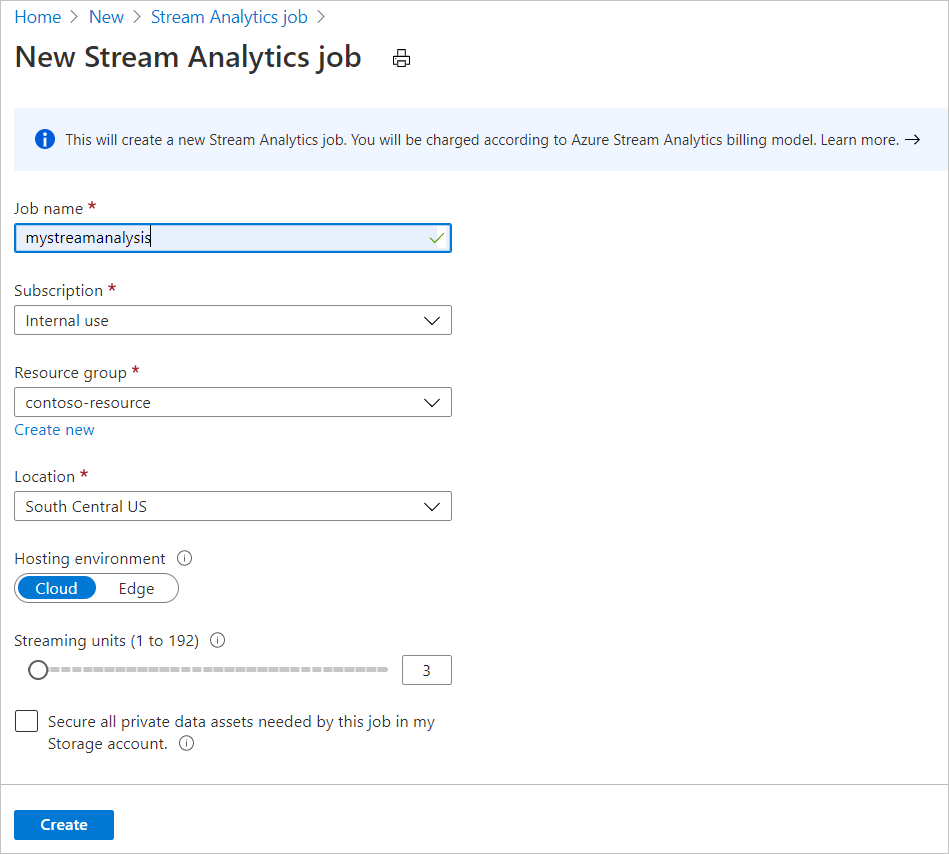

1. Select **Create**.

### Add an input to the Stream Analytics job

1. Open the Stream Analytics job.
1. Under **Job topology**, select **Inputs**.
1. In the **Inputs** pane, select **Add stream input**, and then select **IoT Hub** from the dropdown. On the **New input** pane, choose the **Select IoT Hub from your subscriptions** and enter the following information:

   **Input alias**: The unique alias for the input.

   **Subscription**: Select your subscription if it is different than the default.

   **IoT Hub**: Select the IoT hub from your subscription.

   **Shared access policy name**: Select  **service**. (You can also use **iothubowner**.)

   **Consumer group**: Select the consumer group you created.

   Leave all other fields at their default.

   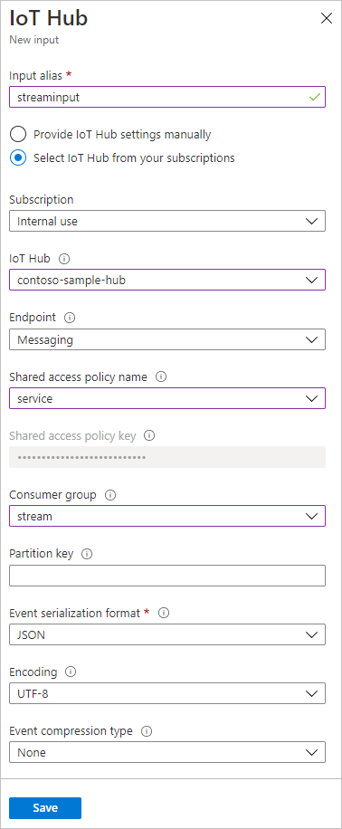

1. Select **Save**.

### Add an output to the Stream Analytics job

1. Under **Job topology**, select **Outputs**.
1. In the **Outputs** pane, select **Add**, and then select **Blob storage/Data Lake Storage** from the dropdown. On the **New output** pane, choose the **Select storage from your subscriptions** and enter the following information:

   **Output alias**: The unique alias for the output.

   **Subscription**: Select your subscription if it is different than the default.

   **Storage account**: The storage account for your blob storage. You can create a storage account or use an existing one.

   **Container**: The container where the blob is saved. You can create a container or use an existing one.

   **Event serialization format**: Select **CSV**.

   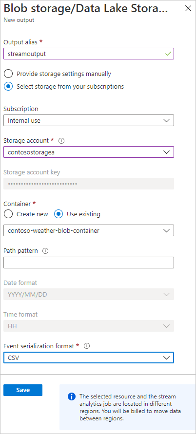

1. Select **Save**.

### Add a function to the Stream Analytics job to call the web service you deployed

1. Under **Job Topology**, select **Functions**.
1. In the **Functions** pane, select **Add**, and then select **Azure ML Studio** from the dropdown. (Make sure you select **Azure ML Studio**, not **Azure ML Service**.) On the **New function** pane, choose the **Provide Azure Machine Learning function settings manually** and enter the following information:

   **Function Alias**: Enter `machinelearning`.

   **URL**: Enter the WEB SERVICE URL that you noted down from the Excel workbook.

   **Key**: Enter the ACCESS KEY that you noted down from the Excel workbook.

   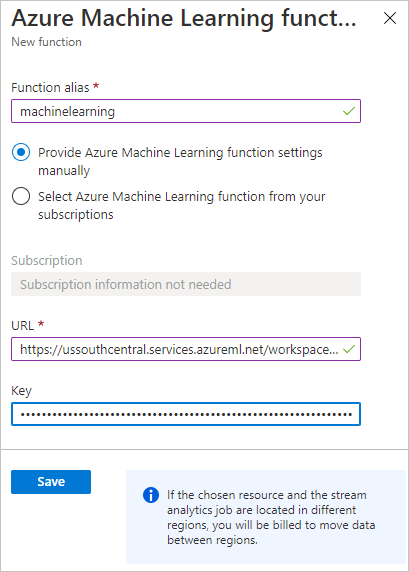

1. Select **Save**.

### Configure the query of the Stream Analytics job

1. Under **Job topology**, select **Query**.
1. Replace the existing code with the following code:

   ```sql
   WITH machinelearning AS (
      SELECT EventEnqueuedUtcTime, temperature, humidity, machinelearning(temperature, humidity) as result from [YourInputAlias]
   )
   Select System.Timestamp time, CAST (result.[temperature] AS FLOAT) AS temperature, CAST (result.[humidity] AS FLOAT) AS humidity, CAST (result.[scored probabilities] AS FLOAT ) AS 'probabalities of rain'
   Into [YourOutputAlias]
   From machinelearning
   ```

   Replace `[YourInputAlias]` with the input alias of the job.

   Replace `[YourOutputAlias]` with the output alias of the job.

1. Select **Save query**.

> [!Note]
> If you select **Test query**, you'll be presented with the following message: Query testing with Machine Learning functions is not supported. Please modify the query and try again. You can safely ignore this message and select **OK** to close the message box. Make sure you save the query before proceeding to the next section.

### Run the Stream Analytics job

In the Stream Analytics job, select **Overview** on the left pane. Then select **Start** > **Now** > **Start**. Once the job successfully starts, the job status changes from **Stopped** to **Running**.

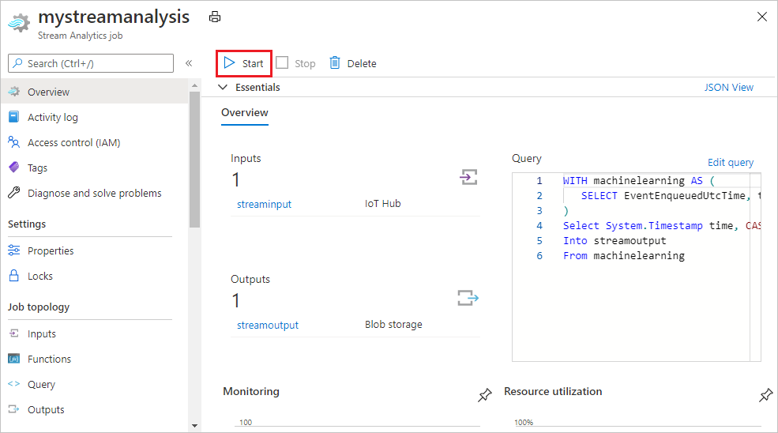

## Use Microsoft Azure Storage Explorer to view the weather forecast

Run the client application to start collecting and sending temperature and humidity data to your IoT hub. For each message that your IoT hub receives, the Stream Analytics job calls the weather forecast web service to produce the chance of rain. The result is then saved to your Azure blob storage. Azure Storage Explorer is a tool that you can use to view the result.

1. [Download and install Microsoft Azure Storage Explorer](https://storageexplorer.com/).
1. Open Azure Storage Explorer.
1. Sign in to your Azure account.
1. Select your subscription.
1. Select your subscription > **Storage Accounts** > your storage account > **Blob Containers** > your container.
1. Download a .csv file to see the result. The last column records the chance of rain.

   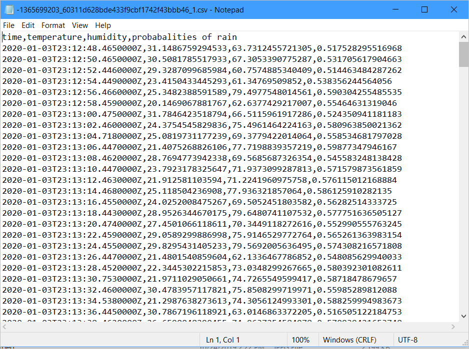

## Summary

You’ve successfully used Azure Machine Learning Studio (classic) to produce the chance of rain based on the temperature and humidity data that your IoT hub receives.

[!INCLUDE [iot-hub-get-started-next-steps](../../includes/iot-hub-get-started-next-steps.md)]