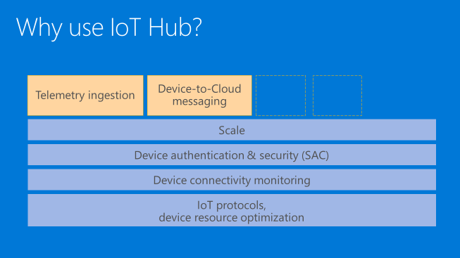

<properties
 pageTitle="What is Azure IoT Hub | Microsoft Azure"
 description="A overview of the Azure IoT Hub service including device connectivity and use cases"
 services="azure-iot"
 documentationCenter=".net"
 authors="fsautomata"
 manager="timlt"
 editor=""/>

<tags
 ms.service="azure-iot"
 ms.devlang="na"
 ms.topic="article"
 ms.tgt_pltfrm="na"
 ms.workload="tbd"
 ms.date="09/04/2015"
 ms.author="dobett"/>

 Azure IoT Hub is a fully managed service that enables reliable and secure bi-directional communications between millions of IoT devices and an application back-end. Azure IoT Hub offers reliable device-to-cloud and cloud-to-device hyper-scale messaging, enables secure communications using per-device security credentials and access control, and includes device libraries for the most popular languages and platforms.

*Picture (iot hub as a cloud gateway interfacing devices with a cloud back-end)*

# IoT device connectivity

One of the largest challenges of IoT projects is how to reliably and securely connect devices to the application back-end. IoT devices often have different characteristics compared to other clients like browsers, other servers, and even mobile apps:

-   They are often embedded systems with no human operator,

-   They can be located in remote locations, where physical access is very expensive,

-   Connectivity to the application back-end can be the only way to access the device,

-   Low power and/or processing resources,

-   Intermittent, expensive, or scarce network connectivity,

-   Use of proprietary, custom, or industry specific application protocols,

-   Large set of popular hardware and software platforms.

Any IoT solution not only has to solve the requirements above, but it also has to ensuring scale, security, and reliability. All of these aspects coalesce in a set of connectivity requirements that are hard and time-consuming to implement using traditional technologies such as web containers and messaging brokers.

# Why use Azure IoT Hub

Azure IoT Hub addresses the need of device connectivity in the following ways:

-   **Per-device authentication and secure connectivity**. Each device can use its own security key to connect, and the application back-end is able to individually whitelist and blacklist each device, enabling complete control on device access.

-   ~~**Device connectivity monitoring**. All connection activity between devices and IoT Hub is available as an event stream to the application back-end. This allows the application back-end to identify malicious attacks or problems (e.g. multiple failed attempts to authenticate for a specific device, high frequency of rejected commands) without relying on a custom connectivity monitoring infrastructure.~~

-   **An extensive set of device libraries**. Azure IoT Hub device SDKs are available and supported on a variety of languages and platforms: C for many Linux distributions, Windows, and RTOS, along with managed languages such as Java, and JavaScript.

-   **IoT protocols and extensibility**. In case your solution cannot make use of the device libraries, Azure IoT Hub exposes a public protocol that allows devices to natively use HTTP 1.1 and AMQP 1.0. Additionally, Azure IoT Protocol Gateway is an open source component that can run in the cloud or on premise, extends Azure IoT Hub to provide support for MQTT v3.1.1, and is extensible to support custom protocols.

-   **Scale**. Azure IoT Hub scales to millions of simultaneously connected devices, and millions of events per seconds.

In addition to these benefits, that are generic across many communication patterns, Azure IoT Hubs currently offers the following communication features:

-   **Event-based device-to-cloud ingestion.** Devices can reliably send millions of events per second to be processed by your hot path event processor engine, or to be stored for cold path analytics. Azure IoT Hub retains the event data for up to 7 days, in order to guarantee reliable processing and absorb peaks in the load.

-   **Reliable cloud-to-device messaging (or *commands*).** The application back-end can send reliable messages (*at-least-once* guarantee) to individual devices. Each message has an individual time-to-live, and both delivery and expiration receipts can be requested by the back-end, to ensure full visibility of the lifecycle of cloud-to-device messages.

Figure – placeholder (do not show dotted boxes! Add device libraries across platforms)

In addition to the above communication patterns, other popular ones (such as file upload and download) can be implemented by taking advantage of IoT Hub’s IoT-specific features, such as a unique, consistent device identity management, connectivity monitoring, and scale.

# Next Steps

To learn more about Azure IoT Hub see:

Dev guide – main

Guidance - root

Tutorial – hero

Device tutorial microsite

Certified devices – root

Videos
