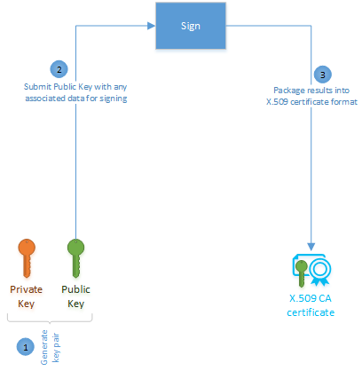
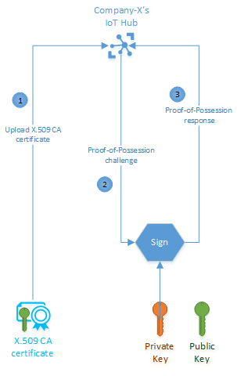
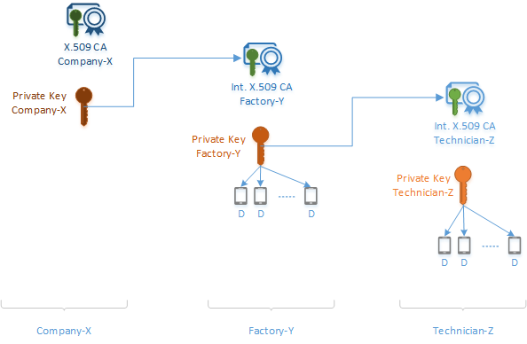
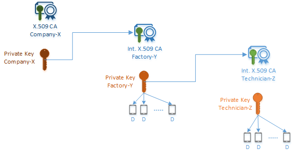

# Understanding the value of X.509 CA certificates in IoT

This article describes the value of using X.509 certificate authority (CA) certificates in IoT device manufacturing and authentication to IoT Hub.  It includes information information about supply chain setup and highlight advantages.

This article describes:

* What X.509 CA certificates are and how to get them
* How to register your X.509 CA certificate to IoT Hub
* How to setup a manufacturing supply chain for X.509 CA based authentication
* How devices from this process automatically connect to IoT Hub from the first connection attempt

## Overview

X.509 Certificate Authority (CA) authentication is an approach for authenticating devices to IoT Hub using a method that dramatically simplifies device identity creation and life-cycle management in the supply chain.

A distinguishing attribute of the X.509 CA authentication is a one-to-many relationship a CA certificate has with it's downstream devices.  This relationship enables autotomatic registration of any number of devices into IoT Hub by simply registring an X.509 CA certificate once, otherwise device unique certificates must be pre-registered for every device before a device can connect. This one-to-may relationship also simplifies device certificates life-cycle management operations.

Another important attribute of the X.509 CA authentication is simplication of supply chain logistics.  Secure authentication of devices requires that each device holds a unique secret like a key as basis for trust. In certificates based authentication, this secret is a private key. A typical device manufacturing flow involves multiple steps and custodians.  Securely managing device private keys across multiple custodians and maintaining trust is difficult and expensive.  Using certificate authorities solves this problem by signing each custodian into a crypgographic chain of trust rather than entrusting them with device private keys.  Each custodian in turn signs devices at their respective process step of the manufacutring flow.  The overall result is an optimal supply chain with built-in accountability through use of the crypgographic chain of trust.  It is worth noting that this process yields the most security when devices protect their unique private keys.  To this end we urge the use of Hardware Secure Modules (HSM) capable of internally generating private keys that will never see the light of day.

This article offers an end-to-end view of using the X.509 CA authentication, from supply chain setup to device connection, while making use of a real world example to solidify understanding.

## Introduction

The X.509 CA certificate is a digital certificate whose holder can sign other certificates.  This digital certificate is X.509 because it conforms to a certificate formatting standard precribed by IETF's RFC 5280 standard, and is a certificate authority (CA) because it's holder can sign other certificates.

The use of X.509 CA is best understood in relation to a concrete example.  Consider Company-X, a maker of Smart-X-Widgets designed for professional installation. Company-X outsources both manufacturing and installation.  It contracts manufacturer Factory-Y to manufacture the Smart-X-Widgets, and service provider Technician-Z to install. Company-X desires that Smart-X-Widget directly ships from Factory-Y to Technician-Z for installation and that it connects directly to Company-X's instance of IoT Hub after installation without further intervention from Company-X. To make this happen, Company-X need to complete a few one-time setup operations to prime Smart-X-Widget for automatic connection.  With the end-to-end scenario in mind, the rest of this article is structured as follows:

* Acquire the X.509 CA certificate

* Register X.509 CA certificate to IoT Hub

* Sign devices into a certificate chain of trust

* Device connection

## Acquire the X.509 CA certificate

Company-X has the option of purchasing an X.509 CA certificate from a public root certificate authority or creating one through a self-signed process.  One option would be optimal over the other depending on the application scenario.  Regardless of the option, the process entails two fundamental steps, generating a public/private key pair and signing the public key into a certificate.

{: .center-image }

Details on how to accomplish these steps differ with various service providers.

### Purchasing an X.509 CA certificate

Purchasing a CA certificate has the benefit of having a well-known root CA act as a trusted third party to vouch for the legitimacy of IoT devices when the devices connect. Company-X would choose this option if they intend Smart-X-Widget to interact with third party products or services after initial connection to IoT Hub.

To purchase an X.509 CA certificate, Company-X would choose a root certificates services provider. An internet search for the phrase 'Root CA' will yield good leads.  The root CA will guide Company-X on how to create the public/private key pair and how to generate a Certificate Signing Request (CSR) for their services.  A CSR is the formal process of applying for a certificate from a certificate authority.  The outcome of this purchase is a certificate for use as an authority certificate.  Given the ubiquity of X.509 certificates, the certificate is likely to have been properly formatted to IETF's RFC 5280 standard.

### Creating a Self-Signed X.509 CA certificate

The process to create a Self-Signed X.509 CA certificate is similar to purchasing with the exception of involving a third party signer like the root certificate authority.  In our example, Company-X will sign it's authority certificate instead of a root certificate authority.  Company-X may choose this option for testing until they're ready to purchase an authority certificate.  Company-X may also decide to use a self-signed X.509 CA certificate in production if Smart-X-Widget is not intended to connect to third party services outside of IoT Hub, services that may need to validate the identity of Smart-X-Widget.

## Register the X.509 certificate to IoT Hub

Company-X needs to register the X.509 CA to IoT Hub where it will serve to authenticate Smart-X-Widgets as they connect.  This is a one-time process that enables the ability to authenticate and manage any number of Smart-X-Widget devices.  This process is one-time because of a one-to-many relationship between authority certificate and devices and also constitutes one of the main advantages of using the X.509 CA authentication method.  The alternative is to upload individual certificates for each and every Smart-X-Widget device thereby adding to operational costs.

Registring the X.509 CA certificate is a two step process, the certificate upload and certificate proof-of-possession.

{: .center-image }

### X.509 CA Certificate Upload

The X.509 CA certificate upload process is just that, upload the CA certificate to IoT Hub.  IoT Hub expects the certificate in a file. Company-X simply uploads the certificate file. The certifcate file MUST NOT under any circumstances contain any private keys.  Best practices from standards governing Public Key Infrastructure (PKI) mandates that knowledge of Company-X's private in this case resides exclusively within Company-X.

### Proof-of-Possession of the Certificate

The X.509 CA certificate, just like any digital certificate, is public information that is susceptible to eavesdropping.  As such, an eavesdropper may intercept a certificate and try to upload it as their own.  In our example, IoT Hub would like to make sure that the CA certificate Company-X is uploading really belongs to Company-X. It does so by challenging Company-X to proof that they in fact possess the certificate through a proof-of-possession (PoP) flow. The proof-of-possession flow entails IoT Hub generating a random number to be signed by Company-X using it's private key.  If Company-X followed PKI best practices and protected their private key then only they would be in position to correctly respond to the proof-of-possession challenge.  IoT Hub proceeds to register the X.509 CA certificate upon a successful response of the proof-of-possession challenge.

A successful response to the proof-of-possession challenge from IoT Hub completes completes the X.509 CA registration.

## Sign Devices into a Certificate Chain of Trust

IoT requires every device to possess a unique identity.  These identities are in the form certificates for certificate based authentication schemes.  In our example, this means every Smart-X-Widget must possess a unique device certificate.  How does Company-X setup for this in it's supply chain?

One way to go about this is to pre-generate certificates for Smart-X-Widgets and entrusting knowledge of corresponding unique device private keys with supply chain partners.  For Company-X, this means entrusting Factory-Y and Technician-Z.  While this is a valid method, it comes with challenges that must be overcome to ensure trust as follows:

1. Having to share device private keys with supply chain partners, besides ignoring PKI best practicies of never sharing private keys, makes building trust in the supply chain expensive.  It means capital systems like secure rooms to house device private keys, and processes like periodic security audits need to be installed.  Both add cost to the supply chain.

2. Securely accounting for devices in the supply chain and later managing them in deployment becomes a one-to-one task for every key-to-device pair from the point of device unique certificate (hence private key) generation to device retirement. This precludes group management of devices unless the concept of groups is explicitely built into the process somehow. Secure accounting and device life-cycle management, therefore, becomes a heavy operations burden.  In our example, Company-X would bear this burden.

X.509 CA certificate authentication offers elegant solutions to afore listed challenges through the use of certificate chains.  A certificate chain results from a CA signing an intermediate CA that in turn signs another intermediate CA and so goes on until a final intermediate CA signs a device.  In our example, Company-X signs Factory-Y which in turn signs Technician-Z that finally signs Smart-X-Widget.

{: .center-image }

Above cascade of certificates in the chain presents the logical hand-off of authority.  Many supply chains follow this logical hand-off whereby each intermediate CA gets signed into the chain while receiving all upstream CA certificates, and the last intermediate CA finally signs each device and inject all the authority certificates from the chain into the device. This is common when the contract manufacturing company with a hierarchy of factories commissions a particular factory to do the manufacturing.  While the hirarchy may may be several levels deep (e.g. by geography/product type/manufacturing line), only the factory at the end gets to interact with the device but the chain is maintained from the top of the hierarchy.

Alternate chains may have different intermediate CA interact with the device in which case the CA interacting with the device injects certificate chain content at that point.  Hybrid models are also possible where only some of the CA have physical interaction with the device.

In our example, both Factory-Y and Technician-Z interact with the Smart-X-Widget.  While Company-X owns Smart-X-Widget, it actually does not physically interact with it in the entire supply chain.  The certificate chain of trust for Smart-X-Widget therefore comprise Company-X signing Factory-Y which in turn signs Technician-Z that will then provide final signature to Smart-X-Widget. The manufacture and installation of Smart-X-Widget comprise Factory-Y and Technician-Z using their respective intermediate CA certificates to sign each and every Smart-X-Widgets. The end result of this entire process are Smart-X-Widgets with unique device certificates and certificate chain of trust going up to Company-X CA certificate.

{: .center-image }

This is a good point to review teh value of the X.509 CA method.  Instead of pre-generating and handing off certificates for every Smart-X-Widget into the supply chain, Company-X only hand to sign Factory-Y once.  Instead of having to track every device throughout the devices life-cycle, Company-X may not track and manage devices through groups that naturally emergy from the supply chain process e.g. devices installed by Technician-Z after July of some year.

Last but not least, the CA method of authentication infuses secure accountability into the device manufacturing supply chain. Because of the certificate chain process, the actions of every member in the chain is cryptographically recorded and verifiable.

This process relies on certain assumptions that must be surfaced for completeness.  It requires independent creation of device unique public/private key pair and that the private key be protected within the device.  Fortunately, secure silicon chips in the form of Hardware Secure Modules (HSM) capable of internally generating keys and protecting private keys exist.  Company-X only need to add one of such chips into Smart-X-Widget's component bill of materials.

## Device Connection

Previous sections above have been building up to device connection.  By simply registring an X.509 CA certificate to IoT Hub one time, how do potentially millions of devices connect and get authenticated from the very first time?  Simple.  Through the same certificate upload and proof-of-possession flow we earlier encountered with registering the X.509 CA certificate.

Devices manufactured for X.509 CA authentication are equiped with device unique certificates and a certificate chain from their respective manufacturing supply chain.  Device connection, even for the very first time, happens in a two step process: certificate chain upload and proof-of-possession.

During the certificate chain upload, the device uploads its device unique certificate together with the certificate chain installed within it to IoT Hub.  Using the pre-registered X.509 CA certificate, IoT Hub can cryptographically validate a couple of things, that the uploaded certificate chain is internally consistent, and that the chain was originated by the valid owner of the X.509 CA certificate.  Just was with the X.509 CA registration process, IoT Hub would initiate a proof-of-possession challenge-reponse process to ascertain that the chain and hence device certificate actually belongs to the device uploading it.  It does so by generating a random challenge to be signed by the device using its private key for validation by IoT Hub.   A successful response triggers IoT Hub to accept the device as authentic and grant it connection.

In our example, each Smart-X-Widget would upload its device unique certificate together with Factory-Y and Technician-Z X.509 CA certificates and then respond to the proof-of-possession challenge from IoT Hub.

{: .center-image }

Notice that the foundation of trust rests in protecting private keys including device private keys.  We therefore cannot stress enough the importance of secure silicon chips in the form of Hardware Secure Modules (HSM) for protecting device private keys, and the overall best practice of never sharing any private keys, like one factory entrusting another with its private key.

