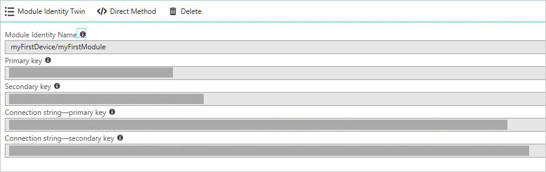

# Get started with IoT Hub module identity and module twin (Node.js)

[!INCLUDE [iot-hub-selector-module-twin-getstarted](../../includes/iot-hub-selector-module-twin-getstarted.md)]

[Module identities and module twins](iot-hub-devguide-module-twins.md) are similar to Azure IoT Hub device identity and device twin, but provide finer granularity. While Azure IoT Hub device identity and device twin enable the back-end application to configure a device and provides visibility on the device's conditions, a module identity and module twin provide these capabilities for individual components of a device. On capable devices with multiple components, such as operating system devices or firmware devices, it allows for isolated configuration and conditions for each component.

[!INCLUDE [iot-hub-basic](../../includes/iot-hub-basic-whole.md)]

At the end of this article, you have two Node.js apps:

* **CreateIdentities**: creates a device identity, a module identity, and associated security keys to connect your device and module clients.

* **UpdateModuleTwinReportedProperties**: sends updated module twin, reported properties to your IoT Hub.

> [!NOTE]
> For more information about the SDK tools available to build both device and back-end apps, see [Azure IoT SDKs](iot-hub-devguide-sdks.md).

## Prerequisites

* An IoT hub. Create one with the [CLI](iot-hub-create-using-cli.md) or the [Azure portal](iot-hub-create-through-portal.md).

* Node.js version 10.0.x or later. [Prepare your development environment](https://github.com/Azure/azure-iot-sdk-node/tree/main/doc/node-devbox-setup.md) describes how to install Node.js for this article on either Windows or Linux.

## Module authentication

You can use symmetric keys or X.509 certificates to authenticate module identities. For X.509 certificate authentication, the module's certificate *must* have its common name (CN) formatted like `CN=<deviceid>/<moduleid>`. For example:

```bash
openssl req -new -key d1m1.key.pem -out d1m1.csr -subj "/CN=device01\/module01"
```

## Get the IoT hub connection string

[!INCLUDE [iot-hub-howto-module-twin-shared-access-policy-text](../../includes/iot-hub-howto-module-twin-shared-access-policy-text.md)]

[!INCLUDE [iot-hub-include-find-registryrw-connection-string](../../includes/iot-hub-include-find-registryrw-connection-string.md)]

## Create a device identity and a module identity in IoT Hub

In this section, you create a Node.js app that creates a device identity and a module identity in the identity registry in your IoT hub. A device or module can't connect to IoT hub unless it has an entry in the identity registry. For more information, see [Understand the identity registry in your IoT hub](iot-hub-devguide-identity-registry.md). When you run this console app, it generates a unique ID and key for both device and module. The ID and key are case-sensitive. Your device and module use these values to identify itself when it sends device-to-cloud messages to IoT Hub.

1. Create a directory to hold your code.

2. Inside of that directory, first run **npm init -y** to create an empty package.json with defaults. This is the project file for your code.

3. Run **npm install -S azure-iothub\@modules-preview** to install the service SDK inside the **node_modules** subdirectory.

    > [!NOTE]
    > The subdirectory name node_modules uses the word module to mean "a node library". The term here has nothing to do with IoT Hub modules.

4. Create the following .js file in your directory. Call it **add.js**. Copy and paste your hub connection string and hub name.

    ```javascript
    var Registry = require('azure-iothub').Registry;
    var uuid = require('uuid');
    // Copy/paste your connection string and hub name here
    var serviceConnectionString = '<hub connection string from portal>';
    var hubName = '<hub name>.azure-devices.net';
    // Create an instance of the IoTHub registry
    var registry = Registry.fromConnectionString(serviceConnectionString);
    // Insert your device ID and moduleId here.
    var deviceId = 'myFirstDevice';
    var moduleId = 'myFirstModule';
    // Create your device as a SAS authentication device
    var primaryKey = new Buffer(uuid.v4()).toString('base64');
    var secondaryKey = new Buffer(uuid.v4()).toString('base64');
    var deviceDescription = {
      deviceId: deviceId,
      status: 'enabled',
      authentication: {
        type: 'sas',
        symmetricKey: {
          primaryKey: primaryKey,
          secondaryKey: secondaryKey
        }
      }
    };

    // First, create a device identity
    registry.create(deviceDescription, function(err) {
      if (err) {
        console.log('Error creating device identity: ' + err);
        process.exit(1);
      }
      console.log('device connection string = "HostName=' + hubName + ';DeviceId=' + deviceId + ';SharedAccessKey=' + primaryKey + '"');

      // Then add a module to that device
      registry.addModule({ deviceId: deviceId, moduleId: moduleId }, function(err) {
        if (err) {
          console.log('Error creating module identity: ' + err);
          process.exit(1);
        }

        // Finally, retrieve the module details from the hub so we can construct the connection string
        registry.getModule(deviceId, moduleId, function(err, foundModule) {
          if (err) {
            console.log('Error getting module back from hub: ' + err);
            process.exit(1);
          }
          console.log('module connection string = "HostName=' + hubName + ';DeviceId=' + foundModule.deviceId + ';ModuleId='+foundModule.moduleId+';SharedAccessKey=' + foundModule.authentication.symmetricKey.primaryKey + '"');
          process.exit(0);
        });
      });
    });

    ```

This app creates a device identity with ID **myFirstDevice** and a module identity with ID **myFirstModule** under device **myFirstDevice**. (If that module ID already exists in the identity registry, the code simply retrieves the existing module information.) The app then displays the primary key for that identity. You use this key in the simulated module app to connect to your IoT hub.

Run this using node add.js. It will give you a connection string for your device identity and another one for your module identity.

> [!NOTE]
> The IoT Hub identity registry only stores device and module identities to enable secure access to the IoT hub. The identity registry stores device IDs and keys to use as security credentials. The identity registry also stores an enabled/disabled flag for each device that you can use to disable access for that device. If your application needs to store other device-specific metadata, it should use an application-specific store. There is no enabled/disabled flag for module identities. For more information, see [Understand the identity registry in your IoT Hub in the IoT Hub developer guide](iot-hub-devguide-identity-registry.md).

## Update the module twin using Node.js device SDK

In this section, you create a Node.js app on your simulated device that updates the module twin reported properties.

1. Get your module connection string. Sign in to the [Azure portal](https://portal.azure.com/). Navigate to your IoT Hub and select **IoT devices**. Find myFirstDevice, open it and you see myFirstModule was successfully created. Copy the module connection string. It is needed in the next step.

   

2. Similar to what you did in the previous section, create a directory for your device code and use NPM to initialize it and install the device SDK (**npm install -S azure-iot-device-amqp\@modules-preview**).

   > [!NOTE]
   > The npm install command may feel slow. Be patient; it's pulling down lots of code from the package repository.

   > [!NOTE]
   > If you see an error that says npm ERR! registry error parsing json, this is safe to ignore. If you see an error that says npm ERR! registry error parsing json, this is safe to ignore.

3. Create a file called twin.js. Copy and paste your module identity string.

    ```javascript
    var Client = require('azure-iot-device').Client;
    var Protocol = require('azure-iot-device-amqp').Amqp;
    // Copy/paste your module connection string here.
    var connectionString = '<insert module connection string here>';
    // Create a client using the Amqp protocol.
    var client = Client.fromConnectionString(connectionString, Protocol);
    client.on('error', function (err) {
      console.error(err.message);
    });
    // connect to the hub
    client.open(function(err) {
      if (err) {
        console.error('error connecting to hub: ' + err);
        process.exit(1);
      }
      console.log('client opened');
    // Create device Twin
      client.getTwin(function(err, twin) {
        if (err) {
          console.error('error getting twin: ' + err);
          process.exit(1);
        }
        // Output the current properties
        console.log('twin contents:');
        console.log(twin.properties);
        // Add a handler for desired property changes
        twin.on('properties.desired', function(delta) {
            console.log('new desired properties received:');
            console.log(JSON.stringify(delta));
        });
        // create a patch to send to the hub
        var patch = {
          updateTime: new Date().toString(),
          firmwareVersion:'1.2.1',
          weather:{
            temperature: 72,
            humidity: 17
          }
        };
        // send the patch
        twin.properties.reported.update(patch, function(err) {
          if (err) throw err;
          console.log('twin state reported');
        });
      });
    });
    ```

4. Now, run this using the command **node twin.js**.

   ```cmd/sh
   F:\temp\module_twin>node twin.js
   ```

   You will then see:

   ```console
   client opened
   twin contents:
   { reported: { update: [Function: update], '$version': 1 },
     desired: { '$version': 1 } }
   new desired properties received:
   {"$version":1}
   twin state reported
   ```

## Next steps

To continue getting started with IoT Hub and to explore other IoT scenarios, see:

* [Getting started with device management (Node.js)](device-management-node.md)

* [Getting started with IoT Edge](../iot-edge/quickstart-linux.md)
