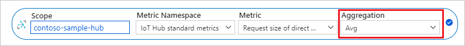

# Monitoring Azure IoT Hub data reference

To get started with Azure monitoring, see [Monitor Azure IoT Hub](monitor-iot-hub.md) to understand how to collect and analyze monitoring data for Azure IoT Hub. 

This article is a reference for implementing Azure monitoring.

The major sections in this reference article:

* [**Metrics**](monitor-iot-hub-reference.md#metrics): lists of IoT Hub platform metrics by topic
* [**Metric dimensions**](monitor-iot-hub-reference.md#metric-dimensions): dimensions for routing and Event Grid metrics
* [**Resource logs**](monitor-iot-hub-reference.md#resource-logs): logs by category types and schemas collected for Azure IoT Hub
* [**Azure Monitor Logs tables**](monitor-iot-hub-reference.md#azure-monitor-logs-tables): discusses Azure Monitor Logs Kusto tables

  Or, go directly to the [Azure Monitor Log Table Reference](/azure/azure-monitor/reference/tables/tables-resourcetype).

## Metrics

This section lists all the automatically collected platform metrics for Azure IoT Hub. The resource provider namespace for IoT Hub metrics is **Microsoft.Devices** and the type Namespace is **IoTHubs**.

The following subsections show the IoT Hub platform metrics by general category and list metrics by their display name as assigned in the Azure portal.

You can also find a single table that lists all the IoT Hub platform metrics by metric name under [Microsoft.Devices/IotHubs](../azure-monitor/essentials/metrics-supported.md#microsoftdevicesiothubs) in the Azure Monitor documentation. This table doesn't provide all information, like [supported aggregations](#supported-aggregations) for some metrics, available in this article.

To learn about metrics supported by other Azure services, see [Supported metrics with Azure Monitor](../azure-monitor/essentials/metrics-supported.md).

**Topics in this section**

Select a topic to jump to its information on this page.

- [Supported aggregations](#supported-aggregations)
- [Cloud to device command metrics](#cloud-to-device-command-metrics)
- [Cloud to device direct methods metrics](#cloud-to-device-direct-methods-metrics)
- [Cloud to device twin operations metrics](#cloud-to-device-twin-operations-metrics)
- [Configurations metrics](#configurations-metrics)
- [Daily quota metrics](#daily-quota-metrics)
- [Device metrics](#device-metrics)
- [Device telemetry metrics](#device-telemetry-metrics)
- [Device to cloud twin operations metrics](#device-to-cloud-twin-operations-metrics)
- [Event Grid metrics](#event-grid-metrics)
- [Jobs metrics](#jobs-metrics)
- [Routing metrics](#routing-metrics)
- [Twin query metrics](#twin-query-metrics)

### Supported aggregations

The **Aggregation Type** column in each table corresponds to the default aggregation that is used when the metric is selected for a chart or alert.

   

For most metrics, all aggregation types are valid; however, for count metrics with a **Unit** column value of **Count**, only some aggregations are valid. Count metrics can be one of two types:

* For **Single-point** count metrics, IoT Hub registers a single data point (essentially a 1) every time the measured operation occurs. Azure Monitor then sums these data points over the specified granularity. Examples of **Single-point** metrics are *Telemetry messages sent* and *C2D message deliveries completed*. For these metrics, the only relevant aggregation type is Total (Sum). The portal allows you to choose minimum, maximum, and average; however, these values will always be 1.

* For **Snapshot** count metrics, IoT Hub registers a total count when the measured operation occurs. Currently, there are three **Snapshot** metrics emitted by IoT Hub: *Total number of messages used*, *Total devices*, and *Connected devices*. Because these metrics present a "total" quantity every time they're emitted, summing them over the specified granularity makes no sense. Azure Monitor limits you to selecting average, minimum, and maximum for the aggregation type for these metrics.

### Cloud to device command metrics

|Metric Display Name|Metric|Unit|Aggregation Type|Description|Dimensions|
|---|---|---|---|---|---|
|C2D Messages Expired|C2DMessagesExpired|Count|Total|Number of expired cloud-to-device messages|None|
|C2D message deliveries completed|c2d.commands.egress.complete.success|Count|Total|Number of cloud-to-device message deliveries completed successfully by the device|None|
|C2D messages abandoned|c2d.commands.egress.abandon.success|Count|Total|Number of cloud-to-device messages abandoned by the device|None|
|C2D messages rejected|c2d.commands.egress.reject.success|Count|Total|Number of cloud-to-device messages rejected by the device|None|

For metrics with a **Unit** value of **Count**, only total (sum) aggregation is valid. Minimum, maximum, and average aggregations always return 1. For more information, see [Supported aggregations](#supported-aggregations).

### Cloud to device direct methods metrics

|Metric Display Name|Metric|Unit|Aggregation Type|Description|Dimensions|
|---|---|---|---|---|---|
|Failed direct method invocations|c2d.methods.failure|Count|Total|The count of all failed direct method calls.|None|
|Request size of direct method invocations|c2d.methods.requestSize|Bytes|Average|The count of all successful direct method requests.|None|
|Response size of direct method invocations|c2d.methods.responseSize|Bytes|Average|The count of all successful direct method responses.|None|
|Successful direct method invocations|c2d.methods.success|Count|Total|The count of all successful direct method calls.|None|

For metrics with a **Unit** value of **Count** only total (sum) aggregation is valid. Minimum, maximum, and average aggregations always return 1. For more information, see [Supported aggregations](#supported-aggregations).

### Cloud to device twin operations metrics

|Metric Display Name|Metric|Unit|Aggregation Type|Description|Dimensions|
|---|---|---|---|---|---|
|Failed twin reads from back end|c2d.twin.read.failure|Count|Total|The count of all failed back-end-initiated twin reads.|None|
|Failed twin updates from back end|c2d.twin.update.failure|Count|Total|The count of all failed back-end-initiated twin updates.|None|
|Response size of twin reads from back end|c2d.twin.read.size|Bytes|Average|The count of all successful back-end-initiated twin reads.|None|
|Size of twin updates from back end|c2d.twin.update.size|Bytes|Average|The total size of all successful back-end-initiated twin updates.|None|
|Successful twin reads from back end|c2d.twin.read.success|Count|Total|The count of all successful back-end-initiated twin reads.|None|
|Successful twin updates from back end|c2d.twin.update.success|Count|Total|The count of all successful back-end-initiated twin updates.|None|

For metrics with a **Unit** value of **Count**, only total (sum) aggregation is valid. Minimum, maximum, and average aggregations always return 1. For more information, see [Supported aggregations](#supported-aggregations).

### Configurations metrics

|Metric Display Name|Metric|Unit|Aggregation Type|Description|Dimensions|
|---|---|---|---|---|---|
|Configuration Metrics|configurations|Count|Total|Number of total CRUD operations performed for device configuration and IoT Edge deployment, on a set of target devices. Included are the number of operations that modify the device twin or module twin because of these configurations.|None|

For metrics with a **Unit** value of **Count**, only total (sum) aggregation is valid. Minimum, maximum, and average aggregations always return 1. For more information, see [Supported aggregations](#supported-aggregations).

### Daily quota metrics

|Metric Display Name|Metric|Unit|Aggregation Type|Description|Dimensions|
|---|---|---|---|---|---|
|Total device data usage|deviceDataUsage|Bytes|Total|Bytes transferred to and from any devices connected to IotHub|None|
|Total device data usage (preview)|deviceDataUsageV2|Bytes|Total|Bytes transferred to and from any devices connected to IotHub|None|
|Total number of messages used|dailyMessageQuotaUsed|Count|Average|Number of total messages used today. A cumulative value that is reset to zero at 00:00 UTC every day.|None|

For *Total number of messages used*, only minimum, maximum, and average aggregations are supported. For more information, see [Supported aggregations](#supported-aggregations).

### Device metrics

|Metric Display Name|Metric|Unit|Aggregation Type|Description|Dimensions|
|---|---|---|---|---|---|
|Total devices (deprecated)|devices.totalDevices|Count|Total|Number of devices registered to your IoT hub|None|
|Connected devices (deprecated)|devices.connectedDevices.allProtocol|Count|Total|Number of devices connected to your IoT hub|None|
|Total devices|totalDeviceCount|Count|Average|Number of devices registered to your IoT hub|None|
|Connected devices|connectedDeviceCount|Count|Average|Number of devices connected to your IoT hub|None|

For *Total devices (deprecated)* and *Connected devices (deprecated)*, only total (sum) aggregation is valid. Minimum, maximum, and average aggregations always return 1. For more information, see [Supported aggregations](#supported-aggregations).

For *Total devices* and *Connected devices*, only minimum, maximum, and average aggregations are valid. For more information, see [Supported aggregations](#supported-aggregations).

*Total devices* and *Connected devices* aren't exportable via diagnostic settings.

### Device telemetry metrics

|Metric Display Name|Metric|Unit|Aggregation Type|Description|Dimensions|
|---|---|---|---|---|---|
|Number of throttling errors|d2c.telemetry.ingress.sendThrottle|Count|Total|Number of throttling errors due to device throughput throttles|None|
|Telemetry 'message send' attempts|d2c.telemetry.ingress.allProtocol|Count|Total|Number of device-to-cloud telemetry messages attempted to be sent to your IoT hub|None|
|Telemetry messages sent|d2c.telemetry.ingress.success|Count|Total|Number of device-to-cloud telemetry messages sent successfully to your IoT hub|None|

For metrics with a **Unit** value of **Count**, only total (sum) aggregation is valid. Minimum, maximum, and average aggregations always return 1. For more information, see [Supported aggregations](#supported-aggregations).

### Device to cloud twin operations metrics

|Metric Display Name|Metric|Unit|Aggregation Type|Description|Dimensions|
|---|---|---|---|---|---|
|Failed twin reads from devices|d2c.twin.read.failure|Count|Total|The count of all failed device-initiated twin reads.|None|
|Failed twin updates from devices|d2c.twin.update.failure|Count|Total|The count of all failed device-initiated twin updates.|None|
|Response size of twin reads from devices|d2c.twin.read.size|Bytes|Average|The number of all successful device-initiated twin reads.|None|
|Size of twin updates from devices|d2c.twin.update.size|Bytes|Average|The total size of all successful device-initiated twin updates.|None|
|Successful twin reads from devices|d2c.twin.read.success|Count|Total|The count of all successful device-initiated twin reads.|None|
|Successful twin updates from devices|d2c.twin.update.success|Count|Total|The count of all successful device-initiated twin updates.|None|

For metrics with a **Unit** value of **Count**, only total (sum) aggregation is valid. Minimum, maximum, and average aggregations always return 1. For more information, see [Supported aggregations](#supported-aggregations).

### Event Grid metrics

|Metric Display Name|Metric|Unit|Aggregation Type|Description|Dimensions|
|---|---|---|---|---|---|
|Event Grid deliveries|EventGridDeliveries|Count|Total|The number of IoT Hub events published to Event Grid. Use the Result dimension for the number of successful and failed requests. EventType dimension shows the type of event (https://aka.ms/ioteventgrid).|Result,<br/>EventType<br>*For more information, see [Metric dimensions](#metric-dimensions)*.|
|Event Grid latency|EventGridLatency|Milliseconds|Average|The average latency (milliseconds) from when the Iot Hub event was generated to when the event was published to Event Grid. This number is an average between all event types. Use the EventType dimension to see latency of a specific type of event.|EventType<br>*For more information, see [Metric dimensions](#metric-dimensions)*.|

For metrics with a **Unit** value of **Count**, only total (sum) aggregation is valid. Minimum, maximum, and average aggregations always return 1. For more information, see [Supported aggregations](#supported-aggregations).

### Jobs metrics

|Metric Display Name|Metric|Unit|Aggregation Type|Description|Dimensions|
|---|---|---|---|---|---|
|Completed jobs|jobs.completed|Count|Total|The count of all completed jobs.|None|
|Failed calls to list jobs|jobs.listJobs.failure|Count|Total|The count of all failed calls to list jobs.|None|
|Failed creations of method invocation jobs|jobs.createDirectMethodJob.failure|Count|Total|The count of all failed creation of direct method invocation jobs.|None|
|Failed creations of twin update jobs|jobs.createTwinUpdateJob.failure|Count|Total|The count of all failed creation of twin update jobs.|None|
|Failed job cancellations|jobs.cancelJob.failure|Count|Total|The count of all failed calls to cancel a job.|None|
|Failed job queries|jobs.queryJobs.failure|Count|Total|The count of all failed calls to query jobs.|None|
|Failed jobs|jobs.failed|Count|Total|The count of all failed jobs.|None|
|Successful calls to list jobs|jobs.listJobs.success|Count|Total|The count of all successful calls to list jobs.|None|
|Successful creations of method invocation jobs|jobs.createDirectMethodJob.success|Count|Total|The count of all successful creation of direct method invocation jobs.|None|
|Successful creations of twin update jobs|jobs.createTwinUpdateJob.<br>success|Count|Total|The count of all successful creation of twin update jobs.|None|
|Successful job cancellations|jobs.cancelJob.success|Count|Total|The count of all successful calls to cancel a job.|None|
|Successful job queries|jobs.queryJobs.success|Count|Total|The count of all successful calls to query jobs.|None|

For metrics with a **Unit** value of **Count**, only total (sum) aggregation is valid. Minimum, maximum, and average aggregations always return 1. For more information, see [Supported aggregations](#supported-aggregations).

### Routing metrics

|Metric Display Name|Metric|Unit|Aggregation Type|Description|Dimensions|
|---|---|---|---|---|---|
| Routing Deliveries (preview) |RoutingDeliveries | Count | Total |The routing delivery metric. Use the dimensions to identify the delivery status for a specific endpoint or for a specific routing source.| Result,<br>RoutingSource,<br>EndpointType,<br>FailureReasonCategory,<br>EndpointName<br>*For more information, see [Metric dimensions](#metric-dimensions)*. |
| Routing Delivery Message Size In Bytes (preview)|RoutingDataSizeInBytesDelivered| Bytes | Total |The total number of bytes routed by IoT Hub to custom endpoint and built-in endpoint. Use the dimensions to identify data size routed to a specific endpoint or for a specific routing source.| RoutingSource,<br>EndpointType<br>EndpointName<br>*For more information, see [Metric dimensions](#metric-dimensions)*.|
| Routing Delivery Latency (preview) |RoutingDeliveryLatency| Milliseconds | Average |The routing delivery latency metric. Use the dimensions to identify the latency for a specific endpoint or for a specific routing source.| RoutingSource,<br>EndpointType,<br>EndpointName<br>*For more information, see [Metric dimensions](#metric-dimensions)*.|
|Routing: blobs delivered to storage|d2c.endpoints.egress.storage.blobs|Count|Total|The number of times IoT Hub routing delivered blobs to storage endpoints.|None|
|Routing: data delivered to storage|d2c.endpoints.egress.storage.bytes|Bytes|Total|The amount of data (bytes) IoT Hub routing delivered to storage endpoints.|None|
|Routing: message latency for Event Hubs|d2c.endpoints.latency.eventHubs|Milliseconds|Average|The average latency (milliseconds) between message ingress to IoT Hub and message ingress into custom endpoints of type Event Hubs. Messages routes to built-in endpoint (events) aren't included.|None|
|Routing: message latency for Service Bus Queue|d2c.endpoints.latency.serviceBusQueues|Milliseconds|Average|The average latency (milliseconds) between message ingress to IoT Hub and message ingress into a Service Bus queue endpoint.|None|
|Routing: message latency for Service Bus Topic|d2c.endpoints.latency.serviceBusTopics|Milliseconds|Average|The average latency (milliseconds) between message ingress to IoT Hub and message ingress into a Service Bus topic endpoint.|None|
|Routing: message latency for messages/events|d2c.endpoints.latency.builtIn.events|Milliseconds|Average|The average latency (milliseconds) between message ingress to IoT Hub and message ingress into the built-in endpoint (messages/events) and fallback route.|None|
|Routing: message latency for storage|d2c.endpoints.latency.storage|Milliseconds|Average|The average latency (milliseconds) between message ingress to IoT Hub and message ingress into a storage endpoint.|None|
|Routing: messages delivered to Event Hubs|d2c.endpoints.egress.eventHubs|Count|Total|The number of times IoT Hub routing successfully delivered messages to custom endpoints of type Event Hubs. Messages routes to built-in endpoint (events) aren't included.|None|
|Routing: messages delivered to Service Bus Queue|d2c.endpoints.egress.serviceBusQueues|Count|Total|The number of times IoT Hub routing successfully delivered messages to Service Bus queue endpoints.|None|
|Routing: messages delivered to Service Bus Topic|d2c.endpoints.egress.serviceBusTopics|Count|Total|The number of times IoT Hub routing successfully delivered messages to Service Bus topic endpoints.|None|
|Routing: messages delivered to fallback|d2c.telemetry.egress.fallback|Count|Total|The number of times IoT Hub routing delivered messages to the endpoint associated with the fallback route.|None|
|Routing: messages delivered to messages/events|d2c.endpoints.egress.builtIn.events|Count|Total|The number of times IoT Hub routing successfully delivered messages to the built-in endpoint (messages/events) and fallback route.|None|
|Routing: messages delivered to storage|d2c.endpoints.egress.storage|Count|Total|The number of times IoT Hub routing successfully delivered messages to storage endpoints.|None|
|Routing: telemetry messages delivered|d2c.telemetry.egress.success|Count|Total|The number of times messages were successfully delivered to all endpoints using IoT Hub routing. If a message is routed to multiple endpoints, this value increases by one for each successful delivery. If a message is delivered to the same endpoint multiple times, this value increases by one for each successful delivery.|None|
|Routing: telemetry messages dropped |d2c.telemetry.egress.dropped|Count|Total|The number of times messages were dropped by IoT Hub routing due to dead endpoints. This value doesn't count messages delivered to fallback route as dropped messages aren't delivered there.|None|
|Routing: telemetry messages incompatible|d2c.telemetry.egress.invalid|Count|Total|The number of times IoT Hub routing failed to deliver messages due to an incompatibility with the endpoint. A message is incompatible with an endpoint when Iot Hub attempts to deliver the message to an endpoint and it fails with a non-transient error. Invalid messages aren't retried. This value doesn't include retries.|None|
|Routing: telemetry messages orphaned |d2c.telemetry.egress.orphaned|Count|Total|The number of times messages were orphaned by IoT Hub routing because they didn't match any routing query, when fallback route is disabled.|None|

For metrics with a **Unit** value of **Count**, only total (sum) aggregation is valid. Minimum, maximum, and average aggregations always return 1. For more information, see [Supported aggregations](#supported-aggregations).

### Twin query metrics

|Metric Display Name|Metric|Unit|Aggregation Type|Description|Dimensions|
|---|---|---|---|---|---|
|Failed twin queries|twinQueries.failure|Count|Total|The count of all failed twin queries.|None|
|Successful twin queries|twinQueries.success|Count|Total|The count of all successful twin queries.|None|
|Twin queries result size|twinQueries.resultSize|Bytes|Average|The total of the result size of all successful twin queries.|None|

For metrics with a **Unit** value of **Count**, only total (sum) aggregation is valid. Minimum, maximum, and average aggregations always return 1. For more information, see [Supported aggregations](#supported-aggregations).

## Metric dimensions

Azure IoT Hub has the following dimensions associated with some of its routing and Event Grid metrics.

|Dimension Name | Description|
|---|---|
||
|**EndpointName**| The endpoint name|
|**EndpointType**|**eventHubs**, **serviceBusQueues**, **cosmosDB**, **serviceBusTopics**. **builtin**, or **blobStorage**|
|**EventType**| **Microsoft.Devices.DeviceCreated**. **Microsoft.Devices.DeviceDeleted**, **Microsoft.Devices.DeviceConnected**, **Microsoft.Devices.DeviceDisconnected**, or **Microsoft.Devices.DeviceTelemetry** <br>For more information, see [Event types](iot-hub-event-grid.md#event-types).|
|**FailureReasonCategory**| One of the following: **invalid**, **dropped**, **orphaned**, or **null**.|
|**Result**| Either **success** or **failure**|
|**RoutingSource**| Device Messages<br>Twin Change Events<br>Device Lifecycle Events|

To learn more about metric dimensions, see [Multi-dimensional metrics](../azure-monitor/essentials/data-platform-metrics.md#multi-dimensional-metrics).

## Resource logs

This section lists all the resource log category types and schemas collected for Azure IoT Hub. The resource provider and type for all IoT Hub logs is [Microsoft.Devices/IotHubs](../azure-monitor/essentials/resource-logs-categories.md#microsoftdevicesiothubs). Events are emitted only for errors in some categories.

**Topics in this section**

- [Connections](#connections)
- [Device telemetry](#device-telemetry)
- [Cloud-to-device commands](#cloud-to-device-commands)
- [Device identity operations](#device-identity-operations)
- [File upload operations](#file-upload-operations)
- [Routes](#routes)
- [Device-to-cloud twin operations](#device-to-cloud-twin-operations)
- [Cloud-to-device twin operations](#cloud-to-device-twin-operations)
- [Twin queries](#twin-queries)
- [Jobs operations](#jobs-operations)
- [Direct Methods](#direct-methods)
- [Distributed Tracing (Preview)](#distributed-tracing-preview)
  - [IoT Hub D2C (device-to-cloud) logs](#iot-hub-d2c-device-to-cloud-logs)
  - [IoT Hub ingress logs](#iot-hub-ingress-logs)
  - [IoT Hub egress logs](#iot-hub-egress-logs)
- [Configurations](#configurations)
- [Device Streams (Preview)](#device-streams-preview)

### Connections

The connections category tracks device connect and disconnect events from an IoT hub and errors. This category is useful for identifying unauthorized connection attempts and or alerting when you lose connection to devices.

For reliable connection status of devices, see [Monitor device connection status](monitor-device-connection-state.md).

```json
{
   "records":
   [
        {
            "time": " UTC timestamp",
            "resourceId": "Resource Id",
            "operationName": "deviceConnect",
            "category": "Connections",
            "level": "Information",
            "properties": "{\"deviceId\":\"<deviceId>\",\"sdkVersion\":\"<sdkVersion>\",\"protocol\":\"<protocol>\",\"authType\":\"{\\\"scope\\\":\\\"device\\\",\\\"type\\\":\\\"sas\\\",\\\"issuer\\\":\\\"iothub\\\",\\\"acceptingIpFilterRule\\\":null}\",\"maskedIpAddress\":\"<maskedIpAddress>\"}",
            "location": "Resource location"
        }
    ]
}
```

For detailed information about using connections logs to monitor device connectivity, see [Monitor, diagnose, and troubleshoot device connectivity to Azure IoT Hub](iot-hub-troubleshoot-connectivity.md).

### Device telemetry

The device telemetry category tracks errors that occur at the IoT hub and are related to the telemetry pipeline. This category includes errors that occur when sending telemetry events (such as throttling) and receiving telemetry events (such as unauthorized reader). This category can't catch errors caused by code running on the device itself.

```json
{
    "records":
    [
        {
            "time": "UTC timestamp",
            "resourceId": "Resource Id",
            "operationName": "ingress",
            "category": "DeviceTelemetry",
            "level": "Error",
            "resultType": "Event status",
            "resultDescription": "MessageDescription",
            "properties": "{\"deviceId\":\"<deviceId>\",\"batching\":\"0\",\"messageSizeInBytes\":\"<messageSizeInBytes>\",\"EventProcessedUtcTime\":\"<UTC timestamp>\",\"EventEnqueuedUtcTime\":\"<UTC timestamp>\",\"partitionId\":\"1\"}", 
            "location": "Resource location"
        }
    ]
}
```

### Cloud-to-device commands

The cloud-to-device commands category tracks errors that occur at the IoT hub and are related to the cloud-to-device message pipeline. This category includes errors that occur from:

* Sending cloud-to-device messages (like unauthorized sender errors),
* Receiving cloud-to-device messages (like delivery count exceeded errors), and
* Receiving cloud-to-device message feedback (like feedback expired errors).

This category doesn't catch errors when the cloud-to-device message is delivered successfully but then improperly handled by the device.

```json
{
    "records":
    [
        {
            "time": " UTC timestamp",
            "resourceId": "Resource Id",
            "operationName": "messageExpired",
            "category": "C2DCommands",
            "level": "Error",
            "resultType": "Event status",
            "resultDescription": "MessageDescription",
            "properties": "{\"deviceId\":\"<deviceId>\",\"messageId\":\"<messageId>\",\"messageSizeInBytes\":\"<messageSize>\",\"protocol\":\"Amqp\",\"deliveryAcknowledgement\":\"<None, NegativeOnly, PositiveOnly, Full>\",\"deliveryCount\":\"0\",\"expiryTime\":\"<timestamp>\",\"timeInSystem\":\"<timeInSystem>\",\"ttl\":<ttl>, \"EventProcessedUtcTime\":\"<UTC timestamp>\",\"EventEnqueuedUtcTime\":\"<UTC timestamp>\", \"maskedIpAddress\": \"<maskedIpAddress>\", \"statusCode\": \"4XX\"}",
            "location": "Resource location"
        }
    ]
}
```

### Device identity operations

The device identity operations category tracks errors that occur when you attempt to create, update, or delete an entry in your IoT hub's identity registry. Tracking this category is useful for provisioning scenarios.

```json
{
    "records":
    [
        {
            "time": "UTC timestamp",
            "resourceId": "Resource Id",
            "operationName": "get",
            "category": "DeviceIdentityOperations",
            "level": "Error",
            "resultType": "Event status",
            "resultDescription": "MessageDescription",
            "properties": "{\"maskedIpAddress\":\"<maskedIpAddress>\",\"deviceId\":\"<deviceId>\", \"statusCode\":\"4XX\"}",
            "location": "Resource location"
        }
    ]
}
```

### File upload operations

The file upload category tracks errors that occur at the IoT hub and are related to file upload functionality. This category includes:

* Errors that occur with the SAS URI, such as when it expires before a device notifies the hub of a completed upload.

* Failed uploads reported by the device.

* Errors that occur when a file isn't found in storage during IoT Hub notification message creation.

This category can't catch errors that directly occur while the device is uploading a file to storage.

```json
{
    "records":
    [
        {
            "time": "UTC timestamp",
            "resourceId": "Resource Id",
            "operationName": "ingress",
            "category": "FileUploadOperations",
            "level": "Error",
            "resultType": "Event status",
            "resultDescription": "MessageDescription",
            "durationMs": "1",
            "properties": "{\"deviceId\":\"<deviceId>\",\"protocol\":\"<protocol>\",\"authType\":\"{\\\"scope\\\":\\\"device\\\",\\\"type\\\":\\\"sas\\\",\\\"issuer\\\":\\\"iothub\\\",\\\"acceptingIpFilterRule\\\":null}\",\"blobUri\":\"http//bloburi.com\"}",
            "location": "Resource location"
        }
    ]
}
```

### Routes

The [message routing](./iot-hub-devguide-messages-d2c.md) category tracks errors that occur during message route evaluation and endpoint health as perceived by IoT Hub. This category includes events such as:

* A rule evaluates to "undefined",
* IoT Hub marks an endpoint as dead, or
* Any errors received from an endpoint.

This category doesn't include specific errors about the messages themselves (like device throttling errors), which are reported under the "device telemetry" category.

```json
{
    "records":
    [
        {
            "time":"2019-12-12T03:25:14Z",
            "resourceId":"/SUBSCRIPTIONS/91R34780-3DEC-123A-BE2A-213B5500DFF0/RESOURCEGROUPS/ANON-TEST/PROVIDERS/MICROSOFT.DEVICES/IOTHUBS/ANONHUB1",
            "operationName":"endpointUnhealthy",
            "category":"Routes",
            "level":"Error",
            "resultType":"403004",
            "resultDescription":"DeviceMaximumQueueDepthExceeded",
            "properties":"{\"deviceId\":null,\"endpointName\":\"anon-sb-1\",\"messageId\":null,\"details\":\"DeviceMaximumQueueDepthExceeded\",\"routeName\":null,\"statusCode\":\"403\"}",
            "location":"westus"
        }
    ]
}
```

Here are more details on routing resource logs:

* [List of routing resource log error codes](troubleshoot-message-routing.md#diagnostics-error-codes)
* [List of routing resource logs operationNames](troubleshoot-message-routing.md#diagnostics-operation-names)

### Device-to-cloud twin operations

The device-to-cloud twin operations category tracks device-initiated events on device twins. These operations can include **get twin**, **update reported properties**, and **subscribe to desired properties**.

```json
{
    "records":
    [
        {
            "time": "UTC timestamp",
            "resourceId": "Resource Id",
            "operationName": "update",
            "category": "D2CTwinOperations",
            "level": "Information",
            "durationMs": "1",
            "properties": "{\"deviceId\":\"<deviceId>\",\"protocol\":\"<protocol>\",\"authenticationType\":\"{\\\"scope\\\":\\\"device\\\",\\\"type\\\":\\\"sas\\\",\\\"issuer\\\":\\\"iothub\\\",\\\"acceptingIpFilterRule\\\":null}\"}",
            "location": "Resource location"
        }
    ]
}
```

### Cloud-to-device twin operations

The cloud-to-device twin operations category tracks service-initiated events on device twins. These operations can include get twin, update or replace tags, and update or replace desired properties.

```json
{
    "records":
    [
        {
            "time": "UTC timestamp",
            "resourceId": "Resource Id",
            "operationName": "read",
            "category": "C2DTwinOperations",
            "level": "Information",
            "durationMs": "1",
            "properties": "{\"deviceId\":\"<deviceId>\",\"sdkVersion\":\"<sdkVersion>\",\"messageSize\":\"<messageSize>\"}",
            "location": "Resource location"
        }
    ]
}
```

### Twin queries

The twin queries category reports on query requests for device twins that are initiated in the cloud.

```json
{
    "records":
    [
        {
            "time": "UTC timestamp",
            "resourceId": "Resource Id",
            "operationName": "query",
            "category": "TwinQueries",
            "level": "Information",
            "durationMs": "1",
            "properties": "{\"query\":\"<twin query>\",\"sdkVersion\":\"<sdkVersion>\",\"messageSize\":\"<messageSize>\",\"pageSize\":\"<pageSize>\", \"continuation\":\"<true, false>\", \"resultSize\":\"<resultSize>\"}",
            "location": "Resource location"
        }
    ]
}
```

### Jobs operations

The jobs operations category reports on job requests to update device twins or invoke direct methods on multiple devices. These requests are initiated in the cloud.

```json
{
    "records":
    [
        {
            "time": "UTC timestamp",
            "resourceId": "Resource Id",
            "operationName": "jobCompleted",
            "category": "JobsOperations",
            "level": "Information",
            "durationMs": "1",
            "properties": "{\"jobId\":\"<jobId>\", \"sdkVersion\": \"<sdkVersion>\",\"messageSize\": <messageSize>,\"filter\":\"DeviceId IN ['1414ded9-b445-414d-89b9-e48e8c6285d5']\",\"startTimeUtc\":\"Wednesday, September 13, 2017\",\"duration\":\"0\"}",
            "location": "Resource location"
        }
    ]
}
```

### Direct Methods

The direct methods category tracks request-response interactions sent to individual devices. These requests are initiated in the cloud.

```json
{
    "records":
    [
        {
            "time": "UTC timestamp",
            "resourceId": "Resource Id",
            "operationName": "send",
            "category": "DirectMethods",
            "level": "Information",
            "durationMs": "1",
            "properties": "{\"deviceId\":<messageSize>, \"RequestSize\": 1, \"ResponseSize\": 1, \"sdkVersion\": \"2017-07-11\"}",
            "location": "Resource location"
        }
    ]
}
```

### Distributed Tracing (Preview)

The distributed tracing category tracks the correlation IDs for messages that carry the trace context header. To fully enable these logs, client-side code must be updated by following [Analyze and diagnose IoT applications end-to-end with IoT Hub distributed tracing (preview)](iot-hub-distributed-tracing.md).

The `correlationId` conforms to the [W3C Trace Context](https://github.com/w3c/trace-context) proposal, where it contains a `trace-id` and a `span-id`.

#### IoT Hub D2C (device-to-cloud) logs

IoT Hub records this log when a message containing valid trace properties arrives at IoT Hub.

```json
{
    "records":
    [
        {
            "time": "UTC timestamp",
            "resourceId": "Resource Id",
            "operationName": "DiagnosticIoTHubD2C",
            "category": "DistributedTracing",
            "correlationId": "00-8cd869a412459a25f5b4f31311223344-0144d2590aacd909-01",
            "level": "Information",
            "resultType": "Success",
            "resultDescription":"Receive message success",
            "durationMs": "",
            "properties": "{\"messageSize\": 1, \"deviceId\":\"<deviceId>\", \"callerLocalTimeUtc\": : \"2017-02-22T03:27:28.633Z\", \"calleeLocalTimeUtc\": \"2017-02-22T03:27:28.687Z\"}",
            "location": "Resource location"
        }
    ]
}
```

Here, `durationMs` isn't calculated as IoT Hub's clock might not be in sync with the device clock, and thus a duration calculation can be misleading. We recommend writing logic using the timestamps in the `properties` section to capture spikes in device-to-cloud latency.

| Property | Type | Description |
|--------------------|-----------------------------------------------|------------------------------------------------------------------------------------------------|
| **messageSize** | Integer | The size of device-to-cloud message in bytes |
| **deviceId** | String of ASCII 7-bit alphanumeric characters | The identity of the device |
| **callerLocalTimeUtc** | UTC timestamp | The creation time of the message as reported by the device local clock |
| **calleeLocalTimeUtc** | UTC timestamp | The time of message arrival at the IoT Hub's gateway as reported by IoT Hub service side clock |

#### IoT Hub ingress logs

IoT Hub records this log when message containing valid trace properties writes to internal or built-in Event Hubs.

```json
{
    "records":
    [
        {
            "time": "UTC timestamp",
            "resourceId": "Resource Id",
            "operationName": "DiagnosticIoTHubIngress",
            "category": "DistributedTracing",
            "correlationId": "00-8cd869a412459a25f5b4f31311223344-349810a9bbd28730-01",
            "level": "Information",
            "resultType": "Success",
            "resultDescription":"Ingress message success",
            "durationMs": "10",
            "properties": "{\"isRoutingEnabled\": \"true\", \"parentSpanId\":\"0144d2590aacd909\"}",
            "location": "Resource location"
        }
    ]
}
```

In the `properties` section, this log contains additional information about message ingress.

| Property | Type | Description |
|--------------------|-----------------------------------------------|------------------------------------------------------------------------------------------------|
| **isRoutingEnabled** | String | Either true or false, indicates whether or not message routing is enabled in the IoT Hub |
| **parentSpanId** | String | The [span-id](https://w3c.github.io/trace-context/#parent-id) of the parent message, which would be the D2C message trace in this case |

#### IoT Hub egress logs

IoT Hub records this log when [routing](iot-hub-devguide-messages-d2c.md) is enabled and the message is written to an [endpoint](iot-hub-devguide-endpoints.md). If routing isn't enabled, IoT Hub doesn't record this log.

```json
{
    "records":
    [
        {
            "time": "UTC timestamp",
            "resourceId": "Resource Id",
            "operationName": "DiagnosticIoTHubEgress",
            "category": "DistributedTracing",
            "correlationId": "00-8cd869a412459a25f5b4f31311223344-98ac3578922acd26-01",
            "level": "Information",
            "resultType": "Success",
            "resultDescription":"Egress message success",
            "durationMs": "10",
            "properties": "{\"endpointType\": \"EventHub\", \"endpointName\": \"myEventHub\", \"parentSpanId\":\"349810a9bbd28730\"}",
            "location": "Resource location"
        }
    ]
}
```

In the `properties` section, this log contains additional information about message ingress.

| Property | Type | Description |
|--------------------|-----------------------------------------------|------------------------------------------------------------------------------------------------|
| **endpointName** | String | The name of the routing endpoint |
| **endpointType** | String | The type of the routing endpoint |
| **parentSpanId** | String | The [span-id](https://w3c.github.io/trace-context/#parent-id) of the parent message, which would be the IoT Hub ingress message trace in this case |

### Configurations

IoT Hub configuration logs track events and error for the Automatic Device Management feature set.

```json
{
    "records":
    [
         {
             "time": "2019-09-24T17:21:52Z",
             "resourceId": "Resource Id",
             "operationName": "ReadManyConfigurations",
             "category": "Configurations",
             "resultType": "",
             "resultDescription": "",
             "level": "Information",
             "durationMs": "17",
             "properties": "{\"configurationId\":\"\",\"sdkVersion\":\"2018-06-30\",\"messageSize\":\"0\",\"statusCode\":null}",
             "location": "southcentralus"
         }
    ]
}
```

### Device Streams (Preview)

The device streams category tracks request-response interactions sent to individual devices.

```json
{
    "records":
    [
         {
             "time": "2019-09-19T11:12:04Z",
             "resourceId": "Resource Id",
             "operationName": "invoke",
             "category": "DeviceStreams",
             "resultType": "",
             "resultDescription": "",    
             "level": "Information",
             "durationMs": "74",
             "properties": "{\"deviceId\":\"myDevice\",\"moduleId\":\"myModule\",\"sdkVersion\":\"2019-05-01-preview\",\"requestSize\":\"3\",\"responseSize\":\"5\",\"statusCode\":null,\"requestName\":\"myRequest\",\"direction\":\"c2d\"}",
             "location": "Central US"
         }
    ]
}
```

## Azure Monitor Logs tables
<!-- REQUIRED. Please keep heading in this order -->

This section refers to all of the Azure Monitor Logs Kusto tables relevant to Azure IoT Hub and available for query by Log Analytics. For a  list of these tables and links to more information for the IoT Hub resource type, see [IoT Hub](/azure/azure-monitor/reference/tables/tables-resourcetype#iot-hub) in the Azure Monitor Logs table reference.

For a reference of all Azure Monitor Logs / Log Analytics tables, see the [Azure Monitor Log Table Reference](/azure/azure-monitor/reference/tables/tables-resourcetype).

## See Also

* See [Monitor Azure IoT Hub](monitor-iot-hub.md) for a description of monitoring Azure IoT Hub.
* See [Monitoring Azure resources with Azure Monitor](../azure-monitor/essentials/monitor-azure-resource.md) for details on monitoring Azure resources.
