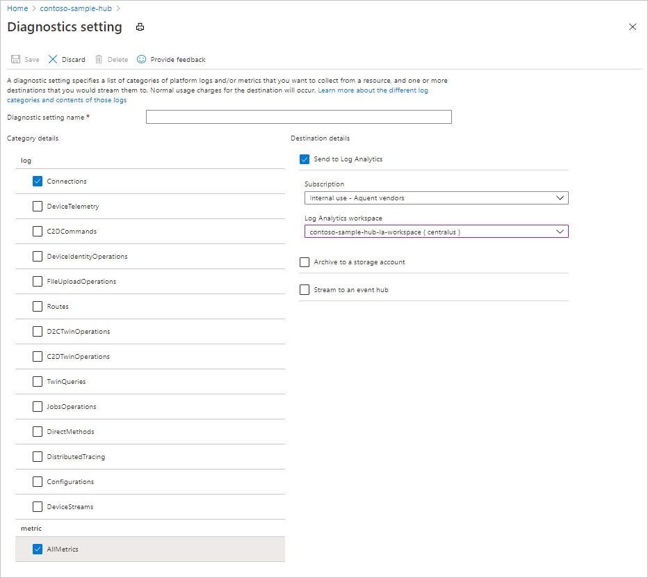
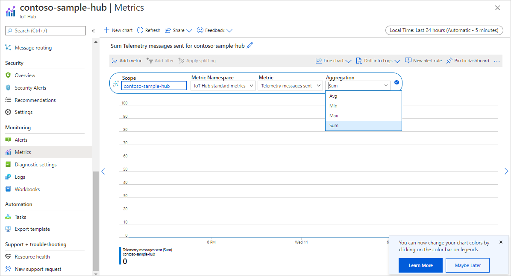
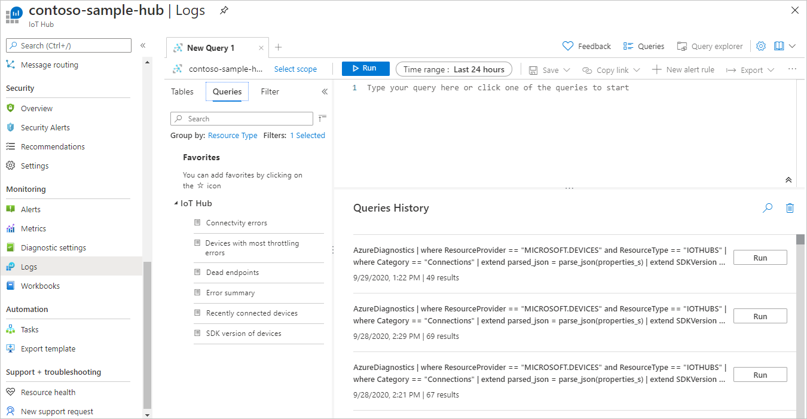

<!-- VERSION 2
Template for the main monitoring article for Azure services. Keep the required sections and add/modify any content for any information specific to your service. 

This article should be in the How-To Guides section of your TOC with the name *monitor-[TODO-replace-with-service-name].md* and the TOC title "Monitor [TODO-replace-with-service-name]". Keep the headings in this order. 

Put accompanying reference information into an article in the Reference section of your TOC with the name *monitor-[service-name]-reference.md* and the TOC title "Monitoring data". -->

<!-- IMPORTANT STEP 1.  Do a search and replace of [TODO-replace-with-service-name] with the name of your service. That will make the template easier to read -->

# Monitoring Azure IoT Hub

When you have critical applications and business processes relying on Azure resources, you want to monitor those resources for their availability, performance, and operation. This article describes the monitoring data generated by Azure IoT Hub and how you can use the features of Azure Monitor to analyze and alert on this data.

## Monitor overview

The **Overview** page in the Azure portal for each IoT hub includes charts that provide some usage metrics, such as the number of messages used and the number of devices connected to the IoT hub. This information is useful, but represents only a small amount of the monitoring data that is available for an IoT hub. Some monitoring data is collected automatically and is available for analysis as soon as you create your IoT hub. You can enable additional types of data collection with some configuration.

## What is Azure Monitor?

Azure IoT Hub creates monitoring data using [Azure Monitor](/azure/azure-monitor/overview), which is a full stack monitoring service in Azure that provides a complete set of features to monitor your Azure resources in addition to resources in other clouds and on-premises.

Start with the article [Monitoring Azure resources with Azure Monitor](/azure/azure-monitor/insights/monitor-azure-resource), which describes the following concepts:

- What is Azure Monitor?
- Costs associated with monitoring
- Monitoring data collected in Azure
- Configuring data collection
- Standard tools in Azure for analyzing and alerting on monitoring data

The following sections build on this article by describing the specific data gathered for Azure IoT Hub and providing examples for configuring data collection and analyzing this data with Azure tools.

## Monitoring data

Azure IoT Hub collects the same kinds of monitoring data as other Azure resources that are described in [Monitoring data from Azure resources](/azure/azure-monitor/insights/monitor-azure-resource#monitoring-data-from-Azure-resources).

See [Monitoring Azure IoT Hub data reference](monitor-service-reference.md) for detailed information on the metrics and logs created by Azure IoT Hub.

> [!IMPORTANT]
> The events emitted by the IoT Hub service using Azure Monitor resource logs are not guaranteed to be reliable or ordered. Some events might be lost or delivered out of order. Resource logs also aren't meant to be real-time, and it may take several minutes for events to be logged to your choice of destination.

## Collection and routing

Platform metrics and the Activity log are collected and stored automatically, but can be routed to other locations by using a diagnostic setting.  

When routing platform metrics to other locations, be aware that:

- The following platform metrics are not exportable via diagnostic settings: *Connected devices (preview)* and *Total devices (preview)*.

- Multi-dimensional metrics, for example some [routing metrics](monitor-service-reference.md#routing-metrics), are currently exported as flattened single dimensional metrics aggregated across dimension values. For more detail, see [Exporting platform metrics to other locations](/azure/azure-monitor/platform/metrics-supported.md#exporting-platform-metrics-to-other-locations).

Resource Logs are not collected and stored until you create a diagnostic setting and route them to one or more locations.

<!-- Include any additional information on collecting logs.  The number of things that diagnostics settings control is expanding -->

In Azure portal, you can create diagnostic settings scoped to the logs and platform metrics emitted by your IoT hub by selecting **Diagnostic settings** under **Monitoring** on the left-pane of your IoT hub.

The following screenshot shows a diagnostic setting for routing all platform metrics and Connection operations in resource logs to a Log Analytics workspace.



Metrics and logs routed to a Log Analytics workspace can be analyzed using Azure Monitor Logs. You can also send metrics and logs to Azure Storage for archiving or to an Event Hubs endpoint where they can be read by external applications, for example, third-party SIEM tools.

See [Create diagnostic setting to collect platform logs and metrics in Azure](/azure/azure-monitor/platform/diagnostic-settings) for the detailed process for creating a diagnostic setting using the Azure portal, CLI, or PowerShell. When you create a diagnostic setting, you specify which categories of logs to collect. The categories for Azure IoT Hub are listed  under [Resource logs in the Monitoring Azure IoT Hub data reference](monitor-service-reference.md#resource-logs).

<!-- OPTIONAL: Add specific examples of configuration for this service. For example, CLI and PowerShell commands for creating diagnostic setting. Ideally, customers should set up a policy to automatically turn on collection for services. Azure monitor has Resource Manager template examples you can point to. See https://docs.microsoft.com/azure/azure-monitor/samples/resource-manager-diagnostic-settings.  Contact azmondocs@microsoft.com if you have questions.   -->

The metrics and logs you can collect are discussed in the following sections.

## Analyzing metrics

You can analyze metrics for Azure IoT Hub with metrics from other Azure services using metrics explorer by opening **Metrics** from the **Azure Monitor** menu. See [Getting started with Azure Metrics Explorer](/azure/azure-monitor/platform/metrics-getting-started) for details on using this tool.

For a list of the platform metrics collected for Azure IoT Hub, see [Metrics in the Monitoring Azure IoT Hub data reference](monitor-service-reference.md#metrics). For a list of the platform metrics collected for all Azure services, see [Supported metrics with Azure Monitor](/azure/azure-monitor/platform/metrics-supported).

On your IoT hub in Azure portal, Azure Monitor provides a metrics explorer experience scoped, by default, to the platform metrics emitted by your IoT hub. You can access this experience by selecting **Metrics** under **Monitoring** on the left-pane of your IoT hub:



In metrics explorer, you can view the metrics for your IoT hub and create custom views of your metrics.

For platform metrics that are collected in units of count, some aggregations may not be available or usable. To learn more, see [Supported aggregations in the Monitoring Azure IoT Hub data reference](monitor-service-reference.md#supported-aggregations).

Some IoT Hub metrics, like [routing metrics](monitor-service-reference.md#routing-metrics), are multi-dimensional. For these metrics, you can apply [filters](/azure-monitor/platform/metrics-charts#apply-filters-to-charts) and [splitting](/azure/azure-monitor/platform/metrics-charts#apply-splitting-to-a-chart) to your charts based on a dimension.

## Analyzing logs

<!-- REQUIRED. Please keep headings in this order
If you don't support resource logs, say so. Some services may be only onboarded to metrics and the activity log. -->

Data in Azure Monitor Logs is stored in tables where each table has its own set of unique properties. To learn more about Azure Monitor Logs, see [Azure Monitor Logs overview](/azure/azure-monitor/platform/data-platform-logs) in the Azure Monitor documentation.

To route data to Azure Monitor Logs, you must create a diagnostic setting to send resource log categories or platform metrics to a Log Analytics workspace. To learn more, see [Collection and routing](#collection-and-routing).

On your IoT hub in Azure portal, Azure Monitor provides an Azure Monitor Logs experience scoped, by default, to the logs and metrics collected (via diagnostic settings) for your IoT hub. You can access this experience by selecting **Logs** under **Monitoring** on the left-pane of your IoT hub:



For some common queries with IoT Hub, see [Sample Kusto queries](#sample-kusto-queries). For detailed information on using Log Analytics queries, see [Overview of log queries in Azure Monitor](/azure/azure-monitor/log-query/log-query-overview).

All resource logs in Azure Monitor have the same fields followed by service-specific fields. The common schema is outlined in [Azure Monitor resource log schema](https://docs.microsoft.com/azure/azure-monitor/platform/resource-logs-schema#top-level-resource-logs-schema). You can find the schema and categories of resource logs collected for Azure IoT Hub in [Resource logs in the Monitoring Azure IoT Hub data reference](monitor-service-reference.md#resource-logs).

The [Activity log](/azure/azure-monitor/platform/activity-log) is a platform log in Azure that provides insight into subscription-level events. You can view it independently or route it to Azure Monitor Logs, where you can do much more complex queries using Log Analytics.  

When using IoT Hub platform metrics in Azure Monitor Logs, be aware that:

- The following platform metrics are not exportable via diagnostic settings: *Connected devices (preview)* and *Total devices (preview)*.

- Multi-dimensional metrics, for example some [routing metrics](monitor-service-reference.md#routing-metrics), are currently exported as flattened single dimensional metrics aggregated across dimension values. For more detail, see [Exporting platform metrics to other locations](/azure/azure-monitor/platform/metrics-supported.md#exporting-platform-metrics-to-other-locations).

For a list of the tables used by Azure Monitor Logs and queryable by Log Analytics, see [Azure Monitor Logs tables in the Monitoring Azure IoT Hub data reference](monitor-service-reference.md#azure-monitor-logs-tables)  

### SDK version in IoT Hub logs

Some operations in IoT Hub resource logs return an `sdkVersion` property in their `properties` object. For these operations, when a device or backend app is using one of the Azure IoT SDKs, this property contains information about the SDK being used, the SDK version, and the platform on which the SDK is running. The following example shows the `sdkVersion` property emitted for a [`deviceConnect`](monitor-service-reference.md#connections) operation when using the Node.js device SDK: `"azure-iot-device/1.17.1 (node v10.16.0; Windows_NT 10.0.18363; x64)"`. Here's an example of the value emitted for the .NET (C#) SDK: `".NET/1.21.2 (.NET Framework 4.8.4200.0; Microsoft Windows 10.0.17763 WindowsProduct:0x00000004; X86)"`.

The following table shows the SDK name used for different Azure IoT SDKs:

| SDK name in sdkVersion property | Language |
|----------|----------|
| .NET | .NET (C#) |
| microsoft.azure.devices | .NET (C#) service SDK |
| microsoft.azure.devices.client | .NET (C#) device SDK |
| iothubclient | C or Python v1 (deprecated) device SDK |
| iothubserviceclient | C or Python v1 (deprecated) service SDK |
| azure-iot-device-iothub-py | Python device SDK |
| azure-iot-device | Node.js device SDK |
| azure-iothub | Node.js service SDK |
| com.microsoft.azure.iothub-java-client | Java device SDK |
| com.microsoft.azure.iothub.service.sdk | Java service SDK |
| com.microsoft.azure.sdk.iot.iot-device-client | Java device SDK |
| com.microsoft.azure.sdk.iot.iot-service-client | Java service SDK |
| C | Embedded C |
| C + (OSSimplified = Azure RTOS) | Azure RTOS |

You can extract the SDK version property when you perform queries against IoT Hub resource logs. For example, the following query extracts the SDK version property (and device ID) from the properties returned by Connections operations. These two properties are written to the results along with the time of the operation and the resource ID of the IoT hub that the device is connecting to.

```kusto
// SDK version of devices
// List of devices and their SDK versions that connect to IoT Hub
AzureDiagnostics
| where ResourceProvider == "MICROSOFT.DEVICES" and ResourceType == "IOTHUBS"
| where Category == "Connections"
| extend parsed_json = parse_json(properties_s) 
| extend SDKVersion = tostring(parsed_json.sdkVersion) , DeviceId = tostring(parsed_json.deviceId)
| distinct DeviceId, SDKVersion, TimeGenerated, _ResourceId
```

### Sample Kusto queries

<!-- REQUIRED if you support logs. Please keep headings in this order -->
<!-- Add sample Log Analytics Kusto queries for your service. -->

> [!IMPORTANT]
> When you select **Logs** from the IoT hub menu, Log Analytics is opened with the query scope set to the current IoT hub. This means that log queries will only include data from that resource. If you want to run a query that includes data from other IoT hubs or data from other Azure services, select **Logs** from the **Azure Monitor** menu. See [Log query scope and time range in Azure Monitor Log Analytics](/azure/azure-monitor/log-query/scope/) for details.

<!-- REQUIRED: Include queries that are helpful for figuring out the health and state of your service. Ideally, use some of these queries in the alerts section. It's possible that some of your queries may be in the Log Analytics UI (sample or example queries). Check if so.  -->

Following are queries that you can use to help you monitor your IoT hub.

<!-- Put in a code section here. -->  
```kusto
// Connectvity errors 
// Identify device connection errors. 
AzureDiagnostics
| where ResourceProvider == "MICROSOFT.DEVICES" and ResourceType == "IOTHUBS"
| where Category == "Connections" and Level == "Error"
```

```kusto
// Devices with most throttling errors 
// Identify devices that made the most requests resulting in throttling errors.
AzureDiagnostics
| where ResourceProvider == "MICROSOFT.DEVICES" and ResourceType == "IOTHUBS"
| where ResultType == "429001"
| extend DeviceId = tostring(parse_json(properties_s).deviceId)
| summarize count() by DeviceId, Category, _ResourceId
| order by count_ desc
```

```kusto
// Dead endpoints 
// Identify dead or unhealthy endpoints by the number times the issue was reported, as well as the reason why.
AzureDiagnostics
| where ResourceProvider == "MICROSOFT.DEVICES" and ResourceType == "IOTHUBS"
| where Category == "Routes" and OperationName in ("endpointDead", "endpointUnhealthy")
| extend parsed_json = parse_json(properties_s)
| extend Endpoint = tostring(parsed_json.endpointName), Reason = tostring(parsed_json.details) 
| summarize count() by Endpoint, OperationName, Reason, _ResourceId
| order by count_ desc
```

```kusto
// Error summary 
// Count of errors across all operations by type.
AzureDiagnostics
| where ResourceProvider == "MICROSOFT.DEVICES" and ResourceType == "IOTHUBS"
| where Level == "Error"
| summarize count() by ResultType, ResultDescription, Category, _ResourceId
```

```kusto
// Recently connected devices
// List of devices that IoT Hub saw connect in the specified time period.
AzureDiagnostics
| where ResourceProvider == "MICROSOFT.DEVICES" and ResourceType == "IOTHUBS"
| where Category == "Connections" and OperationName == "deviceConnect"
| extend DeviceId = tostring(parse_json(properties_s).deviceId)
| summarize max(TimeGenerated) by DeviceId, _ResourceId
```

```kusto
// SDK version of devices 
// List of devices and their SDK versions for device connections or device to cloud twin operations
AzureDiagnostics
| where ResourceProvider == "MICROSOFT.DEVICES" and ResourceType == "IOTHUBS"
| where Category == "Connections" or Category == "D2CTwinOperations"
| extend parsed_json = parse_json(properties_s) 
| extend SDKVersion = tostring(parsed_json.sdkVersion) , DeviceId = tostring(parsed_json.deviceId)
| distinct DeviceId, SDKVersion, TimeGenerated, _ResourceId
```

### Read logs from Azure Event Hubs

After you set up event logging through diagnostics settings, you can create applications that read out the logs so that you can take action based on the information in them. This sample code retrieves logs from an event hub:

```csharp
class Program
{ 
    static string connectionString = "{your AMS eventhub endpoint connection string}";
    static string monitoringEndpointName = "{your AMS event hub endpoint name}";
    static EventHubClient eventHubClient;
    //This is the Diagnostic Settings schema
    class AzureMonitorDiagnosticLog
    {
        string time { get; set; }
        string resourceId { get; set; }
        string operationName { get; set; }
        string category { get; set; }
        string level { get; set; }
        string resultType { get; set; }
        string resultDescription { get; set; }
        string durationMs { get; set; }
        string callerIpAddress { get; set; }
        string correlationId { get; set; }
        string identity { get; set; }
        string location { get; set; }
        Dictionary<string, string> properties { get; set; }
    };

    static void Main(string[] args)
    {
        Console.WriteLine("Monitoring. Press Enter key to exit.\n");
        eventHubClient = EventHubClient.CreateFromConnectionString(connectionString, monitoringEndpointName);
        var d2cPartitions = eventHubClient.GetRuntimeInformationAsync().PartitionIds;
        CancellationTokenSource cts = new CancellationTokenSource();
        var tasks = new List<Task>();
        foreach (string partition in d2cPartitions)
        {
            tasks.Add(ReceiveMessagesFromDeviceAsync(partition, cts.Token));
        }
        Console.ReadLine();
        Console.WriteLine("Exiting...");
        cts.Cancel();
        Task.WaitAll(tasks.ToArray());
    }

    private static async Task ReceiveMessagesFromDeviceAsync(string partition, CancellationToken ct)
    {
        var eventHubReceiver = eventHubClient.GetDefaultConsumerGroup().CreateReceiver(partition, DateTime.UtcNow);
        while (true)
        {
            if (ct.IsCancellationRequested)
            {
                await eventHubReceiver.CloseAsync();
                break;
            }
            EventData eventData = await eventHubReceiver.ReceiveAsync(new TimeSpan(0,0,10));
            if (eventData != null)
            {
                string data = Encoding.UTF8.GetString(eventData.GetBytes());
                Console.WriteLine("Message received. Partition: {0} Data: '{1}'", partition, data);
                var deserializer = new JavaScriptSerializer();
                //deserialize json data to azure monitor object
                AzureMonitorDiagnosticLog message = new JavaScriptSerializer().Deserialize<AzureMonitorDiagnosticLog>(result);
            }
        }
    }
}
```

## Alerts

<!-- SUGGESTED: Include useful alerts on metrics, logs, log conditions or activity log. Ask your PMs if you don't know. 
This information is the BIGGEST request we get in Azure Monitor so do not avoid it long term. People don't know what to monitor for best results. Be prescriptive  
-->

Azure Monitor alerts proactively notify you when important conditions are found in your monitoring data. They allow you to identify and address issues in your system before your customers notice them. You can set alerts on [metrics](/azure/azure-monitor/platform/alerts-metric-overview), [logs](/azure/azure-monitor/platform/alerts-unified-log), and the [activity log](/azure/azure-monitor/platform/activity-log-alerts). Different types of alerts have benefits and drawbacks.

When creating an alert rule based on platform metrics, be aware that for IoT Hub platform metrics that are collected in units of count, some aggregations may not be available or usable. To learn more, see [Supported aggregations in the Monitoring Azure IoT Hub data reference](monitor-service-reference.md#supported-aggregations).

The following table lists common and recommended alert rules for Azure IoT Hub.

<!-- Fill in the table with metric and log alerts that would be valuable for your service. Change the format as necessary to make it more readable -->
| Alert type | Condition | Description  |
|:---|:---|:---|
| | | |
| | | |

## Next steps

<!-- Add additional links. You can change the wording of these and add more if useful.   -->

- See [Azure IoT Hub monitoring data reference](monitor-service-reference.md) for a reference of the metrics, logs, and other important values created by [service name].

- See [Monitoring Azure resources with Azure Monitor](/azure/azure-monitor/insights/monitor-azure-resource) for details on monitoring Azure resources.