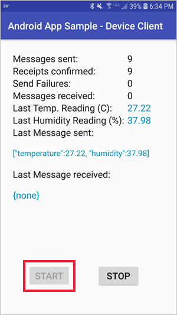
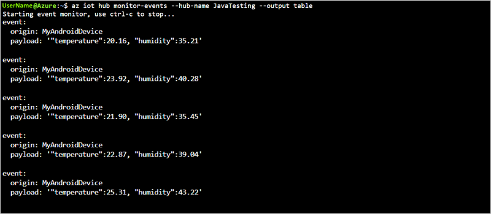
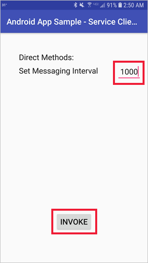
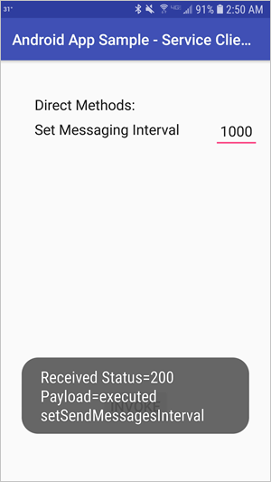

# Quickstart: Control a device connected to an IoT hub (Android)

[!INCLUDE [iot-hub-quickstarts-2-selector](../../includes/iot-hub-quickstarts-2-selector.md)]

IoT Hub is an Azure service that enables you to ingest high volumes of telemetry from your IoT devices into the cloud and manage your devices from the cloud. In this quickstart, you use a *direct method* to control a simulated device connected to your IoT hub. You can use direct methods to remotely change the behavior of a device connected to your IoT hub.

The quickstart uses two pre-written Java applications:

* A simulated device application that responds to direct methods called from a back-end service application. To receive the direct method calls, this application connects to a device-specific endpoint on your IoT hub.

* A service application that calls the direct method on the Android device. To call a direct method on a device, this application connects to service-side endpoint on your IoT hub.

[!INCLUDE [cloud-shell-try-it.md](../../includes/cloud-shell-try-it.md)]

If you don’t have an Azure subscription, create a [free account](https://azure.microsoft.com/free/?WT.mc_id=A261C142F) before you begin.

## Prerequisites

* Android studio from https://developer.android.com/studio/. For more information regarding Android Studio installation, see [android-installation](https://developer.android.com/studio/install).

* Android SDK 27 is used by the sample in this article.

* Run the following command to add the Microsoft Azure IoT Extension for Azure CLI to your Cloud Shell instance. The IOT Extension adds IoT Hub, IoT Edge, and IoT Device Provisioning Service (DPS) specific commands to Azure CLI.

   ```azurecli-interactive
   az extension add --name azure-cli-iot-ext
   ```

* Two sample applications are required by this quickstart: The [Device SDK sample Android application](https://github.com/Azure-Samples/azure-iot-samples-java/tree/master/iot-hub/Samples/device/AndroidSample) and the [Service SDK sample Android application](https://github.com/Azure-Samples/azure-iot-samples-java/tree/master/iot-hub/Samples/service/AndroidSample). Both of these samples are part of the azure-iot-samples-java repository on GitHub. Download or clone the [azure-iot-samples-java](https://github.com/Azure-Samples/azure-iot-samples-java) repository.

## Create an IoT hub

If you completed the previous [Quickstart: Send telemetry from a device to an IoT hub](quickstart-send-telemetry-android.md), you can skip this step and use the IoT hub you have already created.

[!INCLUDE [iot-hub-include-create-hub](../../includes/iot-hub-include-create-hub.md)]

## Register a device

If you completed the previous [Quickstart: Send telemetry from a device to an IoT hub](quickstart-send-telemetry-android.md), you can skip this step and use the same device registered in the previous quickstart.

A device must be registered with your IoT hub before it can connect. In this quickstart, you use the Azure Cloud Shell to register a simulated device.

1. Run the following command in Azure Cloud Shell to create the device identity.

   **YourIoTHubName**: Replace this placeholder below with the name you chose for your IoT hub.

   **MyAndroidDevice**: This value is the name given for the registered device. Use MyAndroidDevice as shown. If you choose a different name for your device, you may also need to use that name throughout this article, and update the device name in the sample applications before you run them.

    ```azurecli-interactive
    az iot hub device-identity create \
      --hub-name YourIoTHubName --device-id MyAndroidDevice
    ```

2. Run the following commands in Azure Cloud Shell to get the _device connection string_ for the device you just registered:

   **YourIoTHubName**: Replace this placeholder below with the name you choose for your IoT hub.

    ```azurecli-interactive
    az iot hub device-identity show-connection-string \
      --hub-name YourIoTHubName \
      --device-id MyAndroidDevice \
      --output table
    ```

    Make a note of the device connection string, which looks like:

   `HostName={YourIoTHubName}.azure-devices.net;DeviceId=MyAndroidDevice;SharedAccessKey={YourSharedAccessKey}`

    You use this value later in the quickstart.

## Retrieve the service connection string

You also need a _service connection string_ to enable the back-end service applications to connect to your IoT hub in order to execute methods and retrieve messages. The following command retrieves the service connection string for your IoT hub:

**YourIoTHubName**: Replace this placeholder below with the name you chose for your IoT hub.

```azurecli-interactive
az iot hub show-connection-string --name YourIoTHubName --policy-name service --output table
```

Make a note of the service connection string, which looks like:

`HostName={YourIoTHubName}.azure-devices.net;SharedAccessKeyName=service;SharedAccessKey={YourSharedAccessKey}`

You use this value later in the quickstart. The service connection string is different from the device connection string.

## Listen for direct method calls

The device SDK sample application can be run on a physical Android device or an Android emulator. The sample connects to a device-specific endpoint on your IoT hub, sends simulated telemetry, and listens for direct method calls from your hub. In this quickstart, the direct method call from the hub tells the device to change the interval at which it sends telemetry. The simulated device sends an acknowledgement back to your hub after it executes the direct method.

1. Open the GitHub sample Android project in Android Studio. The project is located in the following directory of your cloned or downloaded copy of [azure-iot-sample-java](https://github.com/Azure-Samples/azure-iot-samples-java) repository.

        \azure-iot-samples-java\iot-hub\Samples\device\AndroidSample

2. In Android Studio, open *gradle.properties* for the sample project and replace the **Device_Connection_String** placeholder with your device connection string you noted earlier.

    ```
    DeviceConnectionString=HostName={YourIoTHubName}.azure-devices.net;DeviceId=MyAndroidDevice;SharedAccessKey={YourSharedAccessKey}
    ```

3. In Android Studio, click **File** > **Sync Project with Gradle Files**. Verify the build completes.

   > [!NOTE]
   > If the project sync fails, it may be for one of the following reasons:
   >
   > * The versions of the Android Gradle plugin and Gradle referenced in the project are out of date for your version of Android Studio. Follow [these instructions](https://developer.android.com/studio/releases/gradle-plugin) to reference and install the correct versions of the plugin and Gradle for your installation.
   > * The license agreement for the Android SDK has not been signed. Follow the instructions in the Build output to sign the license agreement and download the SDK.

4. Once the build has completed, click **Run** > **Run 'app'**. Configure the app to run on a physical Android device or an Android emulator. For more information on running an Android app on a physical device or emulator, see [Run your app](https://developer.android.com/training/basics/firstapp/running-app).

5. Once the app loads, click the **Start** button to start sending telemetry to your IoT Hub:

    

This app needs to be left running on a phycial device or emulator while you execute the service SDK sample to update the telemetry interval during run-time.

## Read the telemetry from your hub

In this section, you will use the Azure Cloud Shell with the [IoT extension](https://docs.microsoft.com/cli/azure/ext/azure-cli-iot-ext/iot?view=azure-cli-latest) to monitor the device messages that are sent by the Android device.

1. Using the Azure Cloud Shell, run the following command to connect and read messages from your IoT hub:

   **YourIoTHubName**: Replace this placeholder below with the name you choose for your IoT hub.

    ```azurecli-interactive
    az iot hub monitor-events --hub-name YourIoTHubName --output table
    ```

    The following screenshot shows the output as the IoT hub receives telemetry sent by the Android device:

      

By default the telemetry app is sending telemetry from the Android device every 5 seconds. In the next section, you will use a direct method call to update the telemetry interval for the Android IoT device.

## Call the direct method

The service application connects to a service-side endpoint on your IoT Hub. The application makes direct method calls to a device through your IoT hub and listens for acknowledgements.

Run this app on a separate physical Android device or Android emulator.

An IoT Hub back-end service application typically runs in the cloud where it is easier to mitigate the risks associated with the sensitive connection string that controls all devices on an IoT Hub. In this example, we are running it as an Android app for demonstration purposes only. The other language versions of this quickstart provide other examples that align more closely with a back-end service application.

1. Open the GitHub service sample Android project in Android Studio. The project is located in the following directory of your cloned or downloaded copy of [azure-iot-sample-java](https://github.com/Azure-Samples/azure-iot-samples-java) repository.

        \azure-iot-samples-java\iot-hub\Samples\service\AndroidSample

2. In Android Studio, open *gradle.properties* for the sample project and update the value for **ConnectionString** and **DeviceId** properties with your service connection string you noted earlier and the Android device ID you registered.

    ```
    ConnectionString=HostName={YourIoTHubName}.azure-devices.net;SharedAccessKeyName=service;SharedAccessKey={YourSharedAccessKey}
    DeviceId=MyAndroidDevice
    ```

3. In Android Studio, click **File** > **Sync Project with Gradle Files**. Verify the build completes.

   > [!NOTE]
   > If the project sync fails, it may be for one of the following reasons:
   >
   > * The versions of the Android Gradle plugin and Gradle referenced in the project are out of date for your version of Android Studio. Follow [these instructions](https://developer.android.com/studio/releases/gradle-plugin) to reference and install the correct versions of the plugin and Gradle for your installation.
   > * The license agreement for the Android SDK has not been signed. Follow the instructions in the Build output to sign the license agreement and download the SDK.

4. Once the build has completed, click **Run** > **Run 'app'**. Configure the app to run on a separate physical Android device or an Android emulator. For more information on running an Android app on a physical device or emulator, see [Run your app](https://developer.android.com/training/basics/firstapp/running-app).

5. Once the app loads, update the **Set Messaging Interval** value to **1000** and click **Invoke**.

    Th telemetry messaging interval is in milliseconds. The default telemetry interval of the device sample is set for 5 seconds. This change will update the Android IoT device so that telemetry is sent every second.

    

6. The app will receive an acknowledgement indicating whether the method executed successfully or not.

    

## Clean up resources

[!INCLUDE [iot-hub-quickstarts-clean-up-resources](../../includes/iot-hub-quickstarts-clean-up-resources.md)]

## Next steps

In this quickstart, you called a direct method on a device from a back-end application, and responded to the direct method call in a simulated device application.

To learn how to route device-to-cloud messages to different destinations in the cloud, continue to the next tutorial.

> [!div class="nextstepaction"]
> [Tutorial: Route telemetry to different endpoints for processing](tutorial-routing.md)
