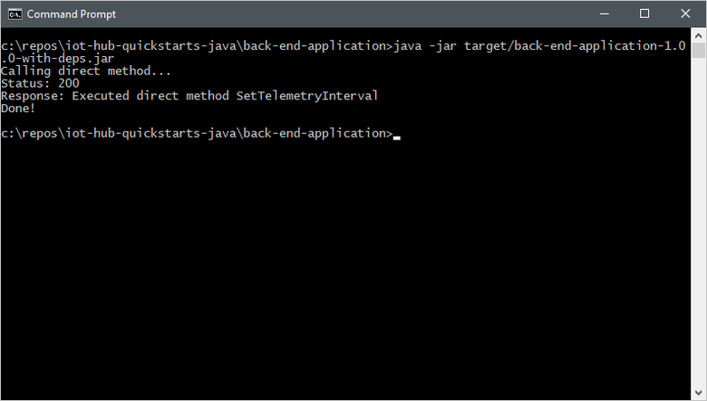
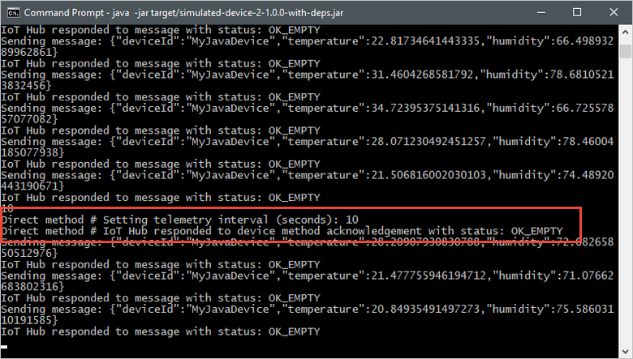

# Quickstart: Control a device connected to an IoT hub (Android)

[!INCLUDE [iot-hub-quickstarts-2-selector](../../includes/iot-hub-quickstarts-2-selector.md)]

IoT Hub is an Azure service that enables you to ingest high volumes of telemetry from your IoT devices into the cloud and manage your devices from the cloud. In this quickstart, you use a *direct method* to control a simulated device connected to your IoT hub. You can use direct methods to remotely change the behavior of a device connected to your IoT hub.

The quickstart uses two pre-written Java applications:

* A simulated device application that responds to direct methods called from a back-end application. To receive the direct method calls, this application connects to a device-specific endpoint on your IoT hub.

* A back-end application that calls the direct methods on the simulated device. To call a direct method on a device, this application connects to service-side endpoint on your IoT hub.

[!INCLUDE [cloud-shell-try-it.md](../../includes/cloud-shell-try-it.md)]

If you don’t have an Azure subscription, create a [free account](https://azure.microsoft.com/free/?WT.mc_id=A261C142F) before you begin.

## Prerequisites


* Android studio from https://developer.android.com/studio/. For more information regarding Android Studio installation, see [android-installation](https://developer.android.com/studio/install). 

* Android SDK 27 is used by the sample in this article. 

* Two sample applications are required by this quickstart: The [Device SDK sample Android application](https://github.com/Azure-Samples/azure-iot-samples-java/tree/master/iot-hub/Samples/device/AndroidSample) and the [Service SDK sample Android application](https://github.com/Azure-Samples/azure-iot-samples-java/tree/master/iot-hub/Samples/service/AndroidSample). Both of these sample are part of the azure-iot-samples-java repository on Github. Download or clone the [azure-iot-samples-java](https://github.com/Azure-Samples/azure-iot-samples-java) repository.


## Create an IoT hub

If you completed the previous [Quickstart: Send telemetry from a device to an IoT hub](quickstart-send-telemetry-android.md), you can skip this step.

[!INCLUDE [iot-hub-include-create-hub](../../includes/iot-hub-include-create-hub.md)]

## Register a device

If you completed the previous [Quickstart: Send telemetry from a device to an IoT hub](quickstart-send-telemetry-android.md), you can skip this step.

A device must be registered with your IoT hub before it can connect. In this quickstart, you use the Azure Cloud Shell to register a simulated device.

1. Run the following commands in Azure Cloud Shell to add the IoT Hub CLI extension and to create the device identity. 

   **YourIoTHubName** : Replace this placeholder below with the name you chose for your IoT hub.

   **MyAndroidDevice**  : This is the name given for the registered device. Use MyAndroidDevice as shown. If you choose a different name for your device, you may also need to use that name throughout this article, and update the device name in the sample applications before you run them.

    ```azurecli-interactive
    az extension add --name azure-cli-iot-ext
    az iot hub device-identity create \
      --hub-name YourIoTHubName --device-id MyAndroidDevice
    ```

2. Run the following commands in Azure Cloud Shell to get the _device connection string_ for the device you just registered:

   **YourIoTHubName** : Replace this placeholder below with the name you choose for your IoT hub.

    ```azurecli-interactive
    az iot hub device-identity show-connection-string \
      -hub-name YourIoTHubName \
      --device-id MyAndroidDevice \
      --output table
    ```

    Make a note of the device connection string, which looks like:

   `HostName={YourIoTHubName}.azure-devices.net;DeviceId=MyNAndroidDevice;SharedAccessKey={YourSharedAccessKey}`

    You use this value later in the quickstart.

## Retrieve the service connection string

You also need a _service connection string_ to enable the back-end application to connect to your IoT hub in order to retrieve the messages. The following command retrieves the service connection string for your IoT hub:
   
**YourIoTHubName** : Replace this placeholder below with the name you chose for your IoT hub.

```azurecli-interactive
az iot hub show-connection-string --hub-name YourIoTHubName --output table
```

Make a note of the service connection string, which looks like:

`HostName={YourIoTHubName}.azure-devices.net;SharedAccessKeyName=iothubowner;SharedAccessKey={YourSharedAccessKey}`

You use this value later in the quickstart. The service connection string is different from the device connection string.

## Listen for direct method calls

The device SDK sample application can be run on a physical device or an emulator. The sample connects to a device-specific endpoint on your IoT hub, sends simulated telemetry, and listens for direct method calls from your hub. In this quickstart, the direct method call from the hub tells the device to change the interval at which it sends telemetry. The simulated device sends an acknowledgement back to your hub after it executes the direct method.

1. Open the github sample Android project in Android Studio. The project is located in the following directory of your cloned or downloaded copy of [azure-iot-sample-java](https://github.com/Azure-Samples/azure-iot-samples-java) repository.

        \azure-iot-samples-java\iot-hub\Samples\device\AndroidSample

2. In Android Studio, open *gradle.properties* for the sample project and replace the **Device_Connection_String** placeholder with your device connection string you noted earlier.

    ```
    DeviceConnectionString=HostName={YourIoTHubName}.azure-devices.net;DeviceId=MyNodeDevice;SharedAccessKey={YourSharedAccessKey}
    ```

3. In Android Studio, click **File** > **Sync Project with Gradle Files**. Verify the build completes.

4. Once the build has completed, click **Run** > **Run 'app'**. Configure the app to run on a physical device or emulator. For more information on running an app on a physical device or emulator, see [Run your app](https://developer.android.com/training/basics/firstapp/running-app).

5. Once the app loads, click the **Start** button to start sending telemetry to your IoT Hub:

    

This app needs to be left running on a phycial device or emulator while you execute the service SDK sample to update the telemetry interval during run-time.


## Call the direct method

The back-end application connects to a service-side endpoint on your IoT Hub. The application makes direct method calls to a device through your IoT hub and listens for acknowledgements. An IoT Hub back-end application typically runs in the cloud. In this example we are running it as an Android app for demonstration purposes only.

1. In another local terminal window, navigate to the root folder of the sample Java project. Then navigate to the **iot-hub\Quickstarts\back-end-application** folder.

2. Open the **src/main/java/com/microsoft/docs/iothub/samples/BackEndApplication.java** file in a text editor of your choice.

    Replace the value of the `iotHubConnectionString` variable with the service connection string you made a note of previously. Then save your changes to the **BackEndApplication.java** file.

3. In the local terminal window, run the following commands to install the required libraries and build the back-end application:

    ```cmd/sh
    mvn clean package
    ```

4. In the local terminal window, run the following commands to run the back-end application:

    ```cmd/sh
    java -jar target/back-end-application-1.0.0-with-deps.jar
    ```

    The following screenshot shows the output as the application makes a direct method call to the device and receives an acknowledgement:

    

    After you run the back-end application, you see a message in the console window running the simulated device, and the rate at which it sends messages changes:

    

## Clean up resources

[!INCLUDE [iot-hub-quickstarts-clean-up-resources](../../includes/iot-hub-quickstarts-clean-up-resources.md)]

## Next steps

In this quickstart, you called a direct method on a device from a back-end application, and responded to the direct method call in a simulated device application.

To learn how to route device-to-cloud messages to different destinations in the cloud, continue to the next tutorial.

> [!div class="nextstepaction"]
> [Tutorial: Route telemetry to different endpoints for processing](tutorial-routing.md)