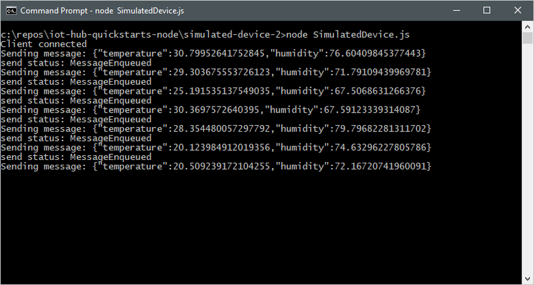
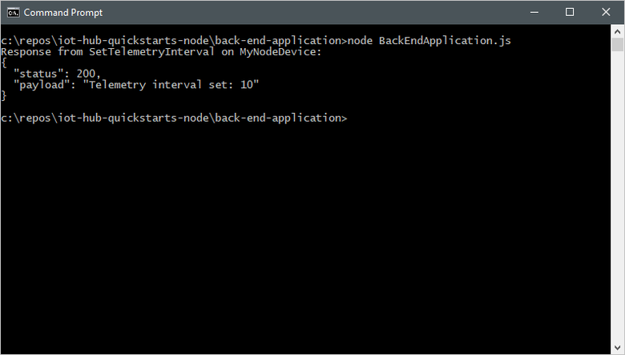
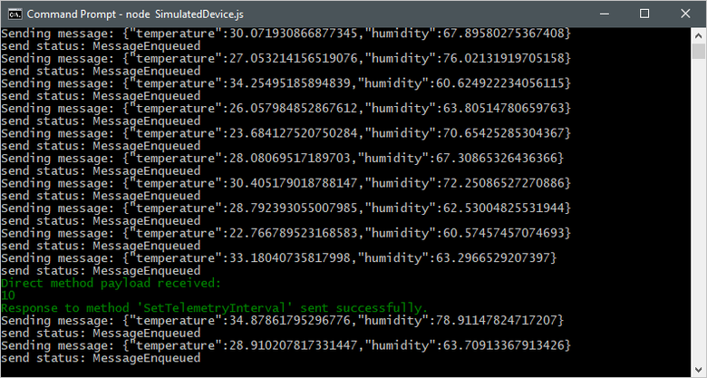

# Quickstart: Control a device connected to an IoT hub

In this quickstart, you use a *direct method* to control a simulated device connected to your IoT hub. You can use direct methods to remotely change the behavior of a device connected to your IoT hub. You run two sample applications in this quickstart:

* A simulated device application that responds to direct methods called from a back-end application. To receive the direct method calls, this application connects to a device-specific endpoint on your IoT hub.
* A back-end application that calls the direct methods on the simulated device. To call a direct method on a device, this application connects to service-side endpoint on your IoT hub.

[!INCLUDE [cloud-shell-try-it.md](../../includes/cloud-shell-try-it.md)]

If you don’t have an Azure subscription, create a [free account](https://azure.microsoft.com/free/?WT.mc_id=A261C142F) before you begin.

## Prerequisites

The two sample applications you run in this quickstart are written using Node.js. You need Node.js v4.x.x or later on your development machine.

You can download Node.js for multiple platforms from [nodejs.org](https://nodejs.org).

You can verify the current version of Node.js on your development machine using the following command:

```cmd/sh
node --version
```

## Create an IoT hub

If you completed the previous [Quickstart: Send telemetry from a device to an IoT hub](quickstart-send-telemetry-node.md), you can skip this step.

The first step is to use the Azure portal to create an IoT hub in your subscription. The IoT hub enables you to ingest high volumes of telemetry into the cloud from many devices. The hub then enables one or more back-end services running in the cloud to read and process that telemetry.

1. In a new browser window, sign in to the [Azure portal](http://portal.azure.com).

1. Select **Create a resource** > **Internet of Things** > **IoT Hub**.

    

1. To create your IoT hub, use the values in the following table:

    | Setting | Value |
    | ------- | ----- |
    | Name | A unique name for your hub |
    | Pricing and scale tier | F1 Free |
    | IoT Hub units | 1 |
    | Device-to-cloud partitions | 2 partitions |
    | Subscription | Your Azure subscription. |
    | Resource group | Create new. Enter a name for your resource group. |
    | Location | The location closest to you. |
    | Pin to dashboard | Yes |

1. Click **Create**.

    

1. Make a note of your IoT hub and resource group names. You use these values later in this quickstart.

## Register a device

If you completed the previous [Quickstart: Send telemetry from a device to an IoT hub](quickstart-send-telemetry-node.md), you can skip this step.

A device must be registered with your IoT hub before it can connect. In this quickstart, you use the Azure CLI to register a simulated device.

1. Add the IoT Hub CLI extension and create the device identity. Replace `{YourIoTHubName}` with the name of your IoT hub:

    ```azurecli-interactive
    az extension add --name azure-cli-iot-ext
    az iot hub device-identity create --hub-name {YourIoTHubName}--device-id MyNodeDevice
    ```

1. Run the following command to get the _device connection string_ for the device you just registered:

    ```azurecli-interactive
    az iot hub device-identity show-connection-string --hub-name {YourIoTHubName} --device-id MyNodeDevice --output table
    ```

    Make a note of the device connection string, which looks like `Hostname=...=`. You use this value later in the quickstart.

1. You also need a _service connection string_ to enable the back-end application to connect to your IoT hub and retrieve the messages. The following command retrieves the service connection string for your IoT hub:

    ```azurecli-interactive
    az iot hub show-connection-string --hub-name {YourIoTHubName} --output table
    ```

    Make a note of the service connection string, which looks like `Hostname=...=`. You use this value later in the quickstart.

## Download the sample

If you completed the previous [Quickstart: Send telemetry from a device to an IoT hub](quickstart-send-telemetry-node.md), you can skip this step.

Download the sample Node.js project from https://github.com/Azure-Samples/iot-hub-quickstarts/archive/master.zip and extract the ZIP archive.

## Run the simulated device application

The simulated device application connects to a device-specific endpoint on your IoT hub and listens for direct method calls from your hub. The simulated device sends an acknowledgement back to your hub after it executes the direct method.

1. In a terminal window, navigate to the root folder of the sample Node.js project. Then navigate to the **simulated-device-2** folder.

1. Open the **SimulatedDevice.js** file in a text editor of your choice.

    Replace the value of the `connectionString` variable with the device connection string you made a note of previously. Then save your changes to **SimulatedDevice.js** file.

1. In the terminal window, run the following commands to install the required libraries and run the simulated device application:

    ```cmd/sh
    npm install
    node SimulatedDevice.js
    ```

    The following screenshot shows some example output as the application sends simulated telemetry to your IoT hub:

    

## Run the back-end application

The back-end application connects to a service-side endpoint on your IoT Hub. The application makes direct method calls to a device through your IoT hub and listens for acknowledgements. An IoT Hub back-end application typically runs in the cloud.

1. In another terminal window, navigate to the root folder of the sample Node.js project. Then navigate to the **back-end-application** folder.

1. Open the **BackEndApplication.js** file in a text editor of your choice.

    Replace the value of the `connectionString` variable with the service connection string you made a note of previously. Then save your changes to the **BackEndApplication.js** file.

1. In the terminal window, run the following commands to install the required libraries and run the back-end application:

    ```cmd/sh
    npm install
    node BackEndApplication.js
    ```

    The following screenshot shows some example output as the application makes a direct method call to the device and receives an acknowledgement:

    

    After you run the back-end application, you see a message in the console window running the simulated device, and the rate at which it sends messages changes:

    

## Clean up resources

If you plan to move on to the tutorials, leave the resource group and IoT hub and reuse them later.

If you don't need the IoT hub any longer, delete it and the resource group in the portal. To do so, select the resource group that contains your IoT hub and click **Delete**.

## Next steps

In this quickstart, you've called a direct method on a device from a back-end application, and responded to the direct method call in a simulated device application. To learn how to route device-to-cloud messages to different destinations in the cloud, continue to the next tutorial.

> [!div class="nextstepaction"]
> [Tutorial: Route telemetry to different endpoints for processing](iot-hub-node-node-process-d2c.md)