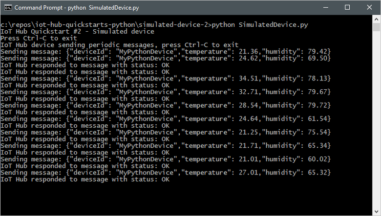
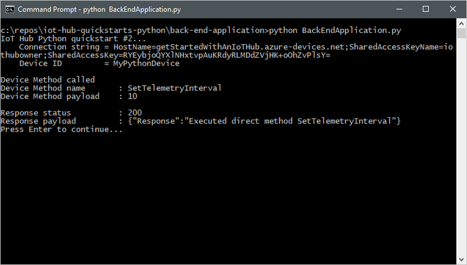
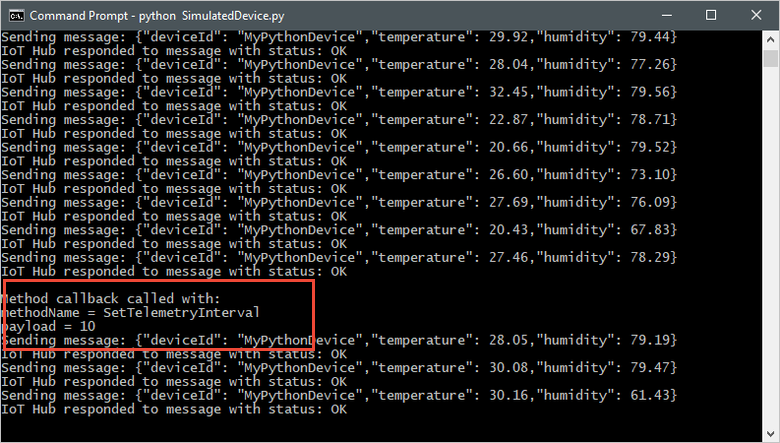

# Quickstart: Control a device connected to an IoT hub (Python)

[!INCLUDE [iot-hub-quickstarts-2-selector](../../includes/iot-hub-quickstarts-2-selector.md)]

IoT Hub is an Azure service that enables you to ingest high volumes of telemetry from your IoT devices into the cloud and manage your devices from the cloud. In this quickstart, you use a *direct method* to control a simulated device connected to your IoT hub. You can use direct methods to remotely change the behavior of a device connected to your IoT hub.

The quickstart uses two pre-written Python applications:

* A simulated device application that responds to direct methods called from a back-end application. To receive the direct method calls, this application connects to a device-specific endpoint on your IoT hub.

* A back-end application that calls the direct methods on the simulated device. To call a direct method on a device, this application connects to service-side endpoint on your IoT hub.

[!INCLUDE [cloud-shell-try-it.md](../../includes/cloud-shell-try-it.md)]

If you don’t have an Azure subscription, create a [free account](https://azure.microsoft.com/free/?WT.mc_id=A261C142F) before you begin.

## Prerequisites

The two sample applications you run in this quickstart are written using Python. Currently, the Microsoft Azure IoT SDKs for Python support only specific versions of Python for each platform. To learn more, see the [Python SDK Readme](https://github.com/Azure/azure-iot-sdk-python#important-installation-notes---dealing-with-importerror-issues).

This quickstart assumes you are using a Windows development machine. For Windows systems, only [Python 3.6.x](https://www.python.org/downloads/release/python-368/) is supported. The Python installer you choose should be based on the architecture of the system that you are working with. If your system CPU architecture is 32 bit, then download the x86 installer; for the 64bit architecture, download the x86-64 installer. Additionally, make sure the [Microsoft Visual C++ Redistributable for Visual Studio 2015, 2017, and 2019](https://support.microsoft.com/en-us/help/2977003/the-latest-supported-visual-c-downloads) is installed for your architecture (x86 or x64).

You can download Python for other platforms from [Python.org](https://www.python.org/downloads/).

You can verify the current version of Python on your development machine using one of the following commands:

```python
python --version
```

```python
python3 --version
```

Run the following command to add the Microsoft Azure IoT Extension for Azure CLI to your Cloud Shell instance. The IOT Extension adds IoT Hub, IoT Edge, and IoT Device Provisioning Service (DPS) specific commands to Azure CLI.

```azurecli-interactive
az extension add --name azure-cli-iot-ext
```

If you haven't already done so, download the sample Python project from https://github.com/Azure-Samples/azure-iot-samples-python/archive/master.zip and extract the ZIP archive.

## Create an IoT hub

If you completed the previous [Quickstart: Send telemetry from a device to an IoT hub](quickstart-send-telemetry-python.md), you can skip this step.

[!INCLUDE [iot-hub-include-create-hub](../../includes/iot-hub-include-create-hub.md)]

## Register a device

If you completed the previous [Quickstart: Send telemetry from a device to an IoT hub](quickstart-send-telemetry-python.md), you can skip this step.

A device must be registered with your IoT hub before it can connect. In this quickstart, you use the Azure Cloud Shell to register a simulated device.

1. Run the following command in Azure Cloud Shell to create the device identity.

    **YourIoTHubName** : Replace this placeholder below with the name you chose for your IoT hub.

    **MyPythonDevice** : This is the name given for the registered device. Use MyPythonDevice as shown. If you choose a different name for your device, you will also need to use that name throughout this article, and update the device name in the sample applications before you run them.

    ```azurecli-interactive
    az iot hub device-identity create --hub-name YourIoTHubName --device-id MyPythonDevice
    ```

2. Run the following commands in Azure Cloud Shell to get the _device connection string_ for the device you just registered:

    **YourIoTHubName** : Replace this placeholder below with the name you chose for your IoT hub.

    ```azurecli-interactive
    az iot hub device-identity show-connection-string --hub-name YourIoTHubName --device-id MyPythonDevice --output table
    ```

    Make a note of the device connection string, which looks like:

   `HostName={YourIoTHubName}.azure-devices.net;DeviceId=MyNodeDevice;SharedAccessKey={YourSharedAccessKey}`

    You use this value later in the quickstart.

3. You also need a _service connection string_ to enable the back-end application to connect to your IoT hub and retrieve the messages. The following command retrieves the service connection string for your IoT hub:

    **YourIoTHubName** : Replace this placeholder below with the name you choose for your IoT hub.

    ```azurecli-interactive
    az iot hub show-connection-string \
      --name YourIoTHubName \
      --policy-name service \
      --output table
    ```

    Make a note of the service connection string, which looks like:

   `HostName={YourIoTHubName}.azure-devices.net;SharedAccessKeyName=service;SharedAccessKey={YourSharedAccessKey}`

    You use this value later in the quickstart. The service connection string is different from the device connection string.

## Listen for direct method calls

The simulated device application connects to a device-specific endpoint on your IoT hub, sends simulated telemetry, and listens for direct method calls from your hub. In this quickstart, the direct method call from the hub tells the device to change the interval at which it sends telemetry. The simulated device sends an acknowledgement back to your hub after it executes the direct method.

1. In a local terminal window, navigate to the root folder of the sample Python project. Then navigate to the **iot-hub\Quickstarts\simulated-device-2** folder.

1. Open the **SimulatedDevice.py** file in a text editor of your choice.

    Replace the value of the `CONNECTION_STRING` variable with the device connection string you made a note of previously. Then save your changes to **SimulatedDevice.py** file.

1. In the local terminal window, run the following commands to install the required libraries for the simulated device application:

    ```cmd/sh
    pip install azure-iothub-device-client
    ```

1. In the local terminal window, run the following commands to run the simulated device application:

    ```cmd/sh
    python SimulatedDevice.py
    ```

    The following screenshot shows the output as the simulated device application sends telemetry to your IoT hub:

    

## Call the direct method

The back-end application connects to a service-side endpoint on your IoT Hub. The application makes direct method calls to a device through your IoT hub and listens for acknowledgements. An IoT Hub back-end application typically runs in the cloud.

1. In another local terminal window, navigate to the root folder of the sample Python project. Then navigate to the **iot-hub\Quickstarts\back-end-application** folder.

1. Open the **BackEndApplication.py** file in a text editor of your choice.

    Replace the value of the `CONNECTION_STRING` variable with the service connection string you made a note of previously. Then save your changes to the **BackEndApplication.py** file.

1. In the local terminal window, run the following commands to install the required libraries for the simulated device application:

    ```cmd/sh
    pip install azure-iothub-service-client future
    ```

1. In the local terminal window, run the following commands to run the back-end application:

    ```cmd/sh
    python BackEndApplication.py
    ```

    The following screenshot shows the output as the application makes a direct method call to the device and receives an acknowledgement:

    

    After you run the back-end application, you see a message in the console window running the simulated device, and the rate at which it sends messages changes:

    

## Clean up resources

[!INCLUDE [iot-hub-quickstarts-clean-up-resources](../../includes/iot-hub-quickstarts-clean-up-resources.md)]

## Next steps

In this quickstart, you've called a direct method on a device from a back-end application, and responded to the direct method call in a simulated device application.

To learn how to route device-to-cloud messages to different destinations in the cloud, continue to the next tutorial.

> [!div class="nextstepaction"]
> [Tutorial: Route telemetry to different endpoints for processing](tutorial-routing.md)