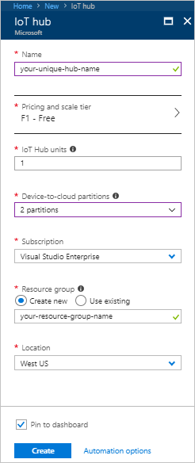
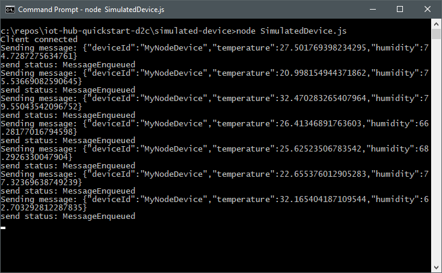
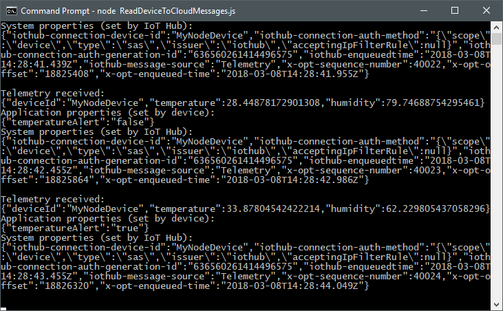

# Quickstart: Send telemetry from a device to an IoT hub

In this quickstart, you send telemetry from a simulated device, through IoT Hub, to a back-end application for processing. You complete the following steps in this quickstart:

- Use the Azure portal to create an IoT hub in your Azure subscription.
- Use the Azure CLI to register a simulated device in your IoT hub.
- Run a Node.js device application that sends simulated telemetry.
- Run a simple Node.js back-end application that reads and processes the telemetry.

[!INCLUDE [cloud-shell-try-it.md](../../includes/cloud-shell-try-it.md)]

If you don’t have an Azure subscription, create a [free account](https://azure.microsoft.com/free/?WT.mc_id=A261C142F) before you begin.

## Prerequisites

The two sample applications you run in this quickstart are written using Node.js. You need Node.js v4.x.x or later on your development machine.

You can download Node.js for multiple platforms from [nodejs.org](https://nodejs.org).

You can verify the current version of Node.js on your development machine using the following command:

```cmd/sh
node --version
```

## Create an IoT hub

The first step is to use the Azure portal to create an IoT hub in your subscription. The IoT hub enables you to ingest high volumes of telemetry into the cloud from many devices. The hub then enables one or more back-end services running in the cloud to read and process that telemetry.

1. In a new browser window, sign in to the [Azure portal](http://portal.azure.com).

1. Click **+ Create a resource**, then select **Internet of Things**, and then select **IoT Hub**:

    

1. To create your IoT hub, use the values in the following table:

    | Setting | Value |
    | ------- | ----- |
    | Name | A unique name for your hub |
    | Pricing and scale tier | F1 Free |
    | IoT Hub units | 1 |
    | Device-to-cloud partitions | 2 partitions |
    | Subscription | Your Azure subscription. |
    | Resource group | Create new. Enter a name for your resource group. |
    | Location | The location closest to you. |
    | Pin to dashboard | Yes |

    Then click **Create**.

    

1. Make a note of your IoT hub and resource group names. You use these values later in this quickstart.

## Register a device

A device must be registered with your IoT hub before it can connect. In this quickstart, you use the Azure CLI to register a device.

1. Add the the IoT Hub CLI extension and create the device identity. Replace `{YourIoTHubName}` with the name of your IoT hub:

    ```azurecli-interactive
    az extension add --name azure-cli-iot-ext
    az iot hub device-identity create --hub-name {YourIoTHubName}--device-id MyNodeDevice
    ```

1. You need the *device connection string* for your simulated device later in this tutorial. The device connection string enables the device to authenticate with your IoT hub. The following command retrieves the device connection string for the device you just registered:

    ```azurecli-interactive
    az iot hub device-identity show-connection-string --hub-name {YourIoTHubName} --device-id MyNodeDevice --output table
    ```

    Make a note of the device connection string, which looks like `Hostname=...=`. You use this value later in the quickstart.

    You can list all the devices registered with your IoT hub. Replace `{YourIoTHubName}` with the name of your IoT hub:

    ```azurecli-interactive
    az iot hub device-identity list --hub-name {YourIoTHubName} --output table
    ```

1. You also need a _service connection string_ to enable the back-end application to connect to your IoT hub and retrieve the messages. The following command retrieves the service connection string for your IoT hub:

    ```azurecli-interactive
    az iot hub show-connection-string --hub-name {YourIoTHubName} --output table
    ```

    Make a note of the service connection string, which looks like `Hostname=...=`. You use this value later in the quickstart.

## Download the sample

Download the sample Node.js project from https://github.com/Azure-Samples/iot-hub-quickstarts/archive/master.zip and extract the ZIP archive.

## Run the simulated device application

The simulated device application connects to a device-specific endpoint on your IoT hub and sends simulated temperature and humidity telemetry.

1. In a terminal window, navigate to the root folder of the sample Node.js project. Then navigate to the **simulated-device** folder.

1. Open the **SimulatedDevice.js** file in a text editor of your choice.

    Replace the value of the `connectionString` variable with the device connection string you made a note of previously. Then save your changes to **SimulatedDevice.js** file.

1. In the terminal window, run the following commands to install the required libraries and run the simulated device application:

    ```cmd/sh
    npm install
    node SimulatedDevice.js
    ```

    The following screenshot shows some example output as the application sends simulated telemetry to your IoT hub:

    

## Run the back-end application

The back-end application connects to the service-side **Events** endpoint on your IoT Hub. The application receives the device-to-cloud messages sent from your simulated device. An IoT Hub back-end application typically runs in the cloud to receive and process device-to-cloud messages.

1. In another terminal window, navigate to the root folder of the sample Node.js project. Then navigate to the **read-d2c-messages** folder.

1. Open the **ReadDeviceToCloudMessages.js** file in a text editor of your choice.

    Replace the value of the `connectionString` variable with the service connection string you made a note of previously. Then save your changes to the **ReadDeviceToCloudMessages.js** file.

1. In the terminal window, run the following commands to install the required libraries and run the back-end application:

    ```cmd/sh
    npm install
    node ReadDeviceToCloudMessages.js
    ```

    The following screenshot shows some example output as the application receives telemtry from your simulated device:

    

## Clean up resources

If you plan to complete the next quickstart, leave the resource group and IoT hub and reuse them later.

If you don't need the IoT hub any longer, delete it and the resource group in the portal. To do so, select the resource group that contains your IoT hub and click **Delete**.

## Next steps

In this quickstart, you've setup an IoT hub, registered a device, sent simulated telemetry to the hub using a Node.js application, and read the telemetry from the hub using a simple back-end app. To learn how to control your simulated device from a back-end app, continue to the next quickstart.

> [!div class="nextstepaction"]
> [Quickstart: Control a device connected to an IoT hub](quickstart-c2d-node.md)