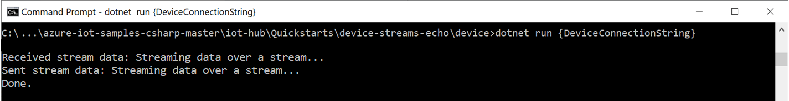
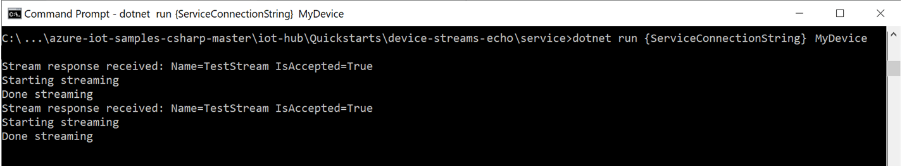

# Quickstart: Communicate to a device application in C# via IoT Hub device streams (preview)

[!INCLUDE [iot-hub-quickstarts-3-selector](../../includes/iot-hub-quickstarts-3-selector.md)]

Azure IoT Hub currently supports device streams as a [preview feature](https://azure.microsoft.com/support/legal/preview-supplemental-terms/).

[IoT Hub device streams](./iot-hub-device-streams-overview.md) allow service and device applications to communicate in a secure and firewall-friendly manner. This quickstart involves two C# applications that take advantage of device streams to send data back and forth (echo).

[!INCLUDE [cloud-shell-try-it.md](../../includes/cloud-shell-try-it.md)]

If you don’t have an Azure subscription, create a [free account](https://azure.microsoft.com/free/?WT.mc_id=A261C142F) before you begin.

## Prerequisites

* The preview of device streams is currently supported only for IoT hubs that are created in the following regions:
  * Central US
  * Central US EUAP

* The two sample applications that you run in this quickstart are written by using C#. You need the .NET Core SDK 2.1.0 or later on your development machine.
  * Download the [.NET Core SDK for multiple platforms from .NET](https://www.microsoft.com/net/download/all).
  * Verify the current version of C# on your development machine by using the following command:

   ```
   dotnet --version
   ```

* Add the Azure IoT Extension for Azure CLI to your Cloud Shell instance by running the following command. The IOT Extension adds IoT Hub, IoT Edge, and IoT Device Provisioning Service (DPS)-specific commands to the Azure CLI.

    ```azurecli-interactive
    az extension add --name azure-cli-iot-ext
    ```

* [Download the sample C# project](https://github.com/Azure-Samples/azure-iot-samples-csharp/archive/master.zip) and extract the ZIP archive. You need it on both the device side and the service side.

## Create an IoT hub

[!INCLUDE [iot-hub-include-create-hub-device-streams](../../includes/iot-hub-include-create-hub-device-streams.md)]

## Register a device

A device must be registered with your IoT hub before it can connect. In this section, you use Azure Cloud Shell to register a simulated device.

1. To create the device identity, run the following command in Cloud Shell:

   > [!NOTE]
   > * Replace the *YourIoTHubName* placeholder with the name you choose for your IoT hub.
   > * Use *MyDevice*, as shown. It's the name given for the registered device. If you choose a different name for your device, use that name throughout this article, and update the device name in the sample applications before you run them.

    ```azurecli-interactive
    az iot hub device-identity create --hub-name YourIoTHubName --device-id MyDevice
    ```

1. To get the *device connection string* for the device that you just registered, run the following command in Cloud Shell:

   > [!NOTE]
   > Replace the *YourIoTHubName* placeholder with the name you choose for your IoT hub.

    ```azurecli-interactive
    az iot hub device-identity show-connection-string --hub-name YourIoTHubName --device-id MyDevice --output table
    ```

    Note the device connection string for later use in this quickstart. It looks like the following example:

   `HostName={YourIoTHubName}.azure-devices.net;DeviceId=MyDevice;SharedAccessKey={YourSharedAccessKey}`

3. You also need the *service connection string* from your IoT hub to enable the service-side application to connect to your IoT hub and establish a device stream. The following command retrieves this value for your IoT hub:

   > [!NOTE]
   > Replace the *YourIoTHubName* placeholder with the name you choose for your IoT hub.

    ```azurecli-interactive
    az iot hub show-connection-string --policy-name service --name YourIoTHubName
    ```

    Note the returned value for later use in this quickstart. It looks like the following example:

   `"HostName={YourIoTHubName}.azure-devices.net;SharedAccessKeyName=service;SharedAccessKey={YourSharedAccessKey}"`

## Communicate between the device and the service via device streams

In this section, you run both the device-side application and the service-side application and communicate between the two.

### Run the service-side application

Go to the *iot-hub/Quickstarts/device-streams-echo/service* directory in your unzipped project folder. Keep the following information handy:

| Parameter name | Parameter value |
|----------------|-----------------|
| `ServiceConnectionString` | Provide the service connection string of your IoT hub. |
| `DeviceId` | Provide the ID of the device you created earlier (for example, *MyDevice*). |

Compile and run the code as follows:

```
cd ./iot-hub/Quickstarts/device-streams-echo/service/

# Build the application
dotnet build

# Run the application
# In Linux or macOS
dotnet run "<ServiceConnectionString>" "<MyDevice>"

# In Windows
dotnet run <ServiceConnectionString> <MyDevice>
```

> [!NOTE]
> A timeout occurs if the device-side application doesn't respond in time.

### Run the device-side application

Go to the *iot-hub/Quickstarts/device-streams-echo/device* directory in your unzipped project folder. Keep the following information handy:

| Parameter name | Parameter value |
|----------------|-----------------|
| `DeviceConnectionString` | Provide the device connection string of your IoT Hub. |

Compile and run the code as follows:

```
cd ./iot-hub/Quickstarts/device-streams-echo/device/

# Build the application
dotnet build

# Run the application
# In Linux or macOS
dotnet run "<DeviceConnectionString>"

# In Windows
dotnet run <DeviceConnectionString>
```

At the end of the last step, the service-side application initiates a stream to your device. After the stream is established, the application sends a string buffer to the service over the stream. In this sample, the service-side application simply echoes back the same data to the device, which demonstrates a successful bidirectional communication between the two applications.

Console output on the device side:



Console output on the service side:



The traffic being sent over the stream is tunneled through the IoT hub rather than sent directly. The benefits provided are detailed in [Device streams benefits](./iot-hub-device-streams-overview.md#benefits).

## Clean up resources

[!INCLUDE [iot-hub-quickstarts-clean-up-resources-device-streams](../../includes/iot-hub-quickstarts-clean-up-resources-device-streams.md)]

## Next steps

In this quickstart, you've set up an IoT hub, registered a device, established a device stream between C# applications on the device and service sides, and used the stream to send data back and forth between the applications.

To learn more about device streams, see:

> [!div class="nextstepaction"]
> [Device streams overview](./iot-hub-device-streams-overview.md)
