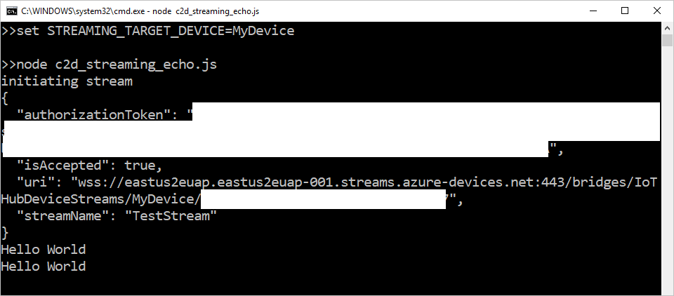

---
title: Communicate to device app in Node.js with Azure IoT Hub device streams
description: In this quickstart, you will run a Node.js service-side application that communicates with an IoT device via a device stream.
author: robinsh
ms.service: iot-hub
services: iot-hub
ms.devlang: nodejs
ms.topic: quickstart
ms.custom: mvc
ms.date: 03/14/2019
ms.author: robinsh
---

# Quickstart: Communicate to a device application in Node.js via IoT Hub device streams (preview)

[!INCLUDE [iot-hub-quickstarts-3-selector](../../includes/iot-hub-quickstarts-3-selector.md)]

In this quickstart, you run a service-side application and set up communication between a device and service by using device streams. Azure IoT Hub device streams allow service and device applications to communicate in a secure and firewall-friendly manner. During public preview, the Node.js SDK only supports device streams on the service side. As a result, this quickstart only covers instructions to run the service-side application.

## Prerequisites

* Completion of [Communicate to device apps in C via IoT Hub device streams](./quickstart-device-streams-echo-c.md) or [Communicate to device apps in C# via IoT Hub device streams](./quickstart-device-streams-echo-csharp.md).

* An Azure account with an active subscription. [Create one for free](https://azure.microsoft.com/free/?ref=microsoft.com&utm_source=microsoft.com&utm_medium=docs&utm_campaign=visualstudio).

* [Node.js 10+](https://nodejs.org).

* [A sample Node.js project](https://github.com/Azure-Samples/azure-iot-samples-node/archive/streams-preview.zip).

You can verify the current version of Node.js on your development machine using the following command:

```cmd/sh
node --version
```

Microsoft Azure IoT Hub currently supports device streams as a [preview feature](https://azure.microsoft.com/support/legal/preview-supplemental-terms/).

> [!IMPORTANT]
> The preview of device streams is currently only supported for IoT Hubs created in the following regions:
>
> * Central US
> * Central US EUAP
> * North Europe
> * Southeast Asia

[!INCLUDE [cloud-shell-try-it.md](../../includes/cloud-shell-try-it.md)]

### Add Azure IoT Extension

Run the following command to add the Microsoft Azure IoT Extension for Azure CLI to your Cloud Shell instance. The IoT Extension adds IoT Hub, IoT Edge, and IoT Device Provisioning Service (DPS) commands to Azure CLI.

```azurecli-interactive
az extension add --name azure-iot
```

[!INCLUDE [iot-hub-cli-version-info](../../includes/iot-hub-cli-version-info.md)]

## Create an IoT hub

If you completed the previous [Quickstart: Send telemetry from a device to an IoT hub](quickstart-send-telemetry-node.md), you can skip this step.

[!INCLUDE [iot-hub-include-create-hub](../../includes/iot-hub-include-create-hub.md)]

## Register a device

If you completed the previous [Quickstart: Send telemetry from a device to an IoT hub](quickstart-send-telemetry-node.md), you can skip this step.

A device must be registered with your IoT hub before it can connect. In this quickstart, you use the Azure Cloud Shell to register a simulated device.

1. Run the following command in Azure Cloud Shell to create the device identity.

   **YourIoTHubName**: Replace this placeholder below with the name you chose for your IoT hub.

   **MyDevice**: This is the name for the device you're registering. It's recommended to use **MyDevice** as shown. If you choose a different name for your device, you also need to use that name throughout this article, and update the device name in the sample applications before you run them.

    ```azurecli-interactive
    az iot hub device-identity create --hub-name {YourIoTHubName} --device-id MyDevice
    ```

2. You also need a *service connection string* to enable the back-end application to connect to your IoT hub and retrieve the messages. The following command retrieves the service connection string for your IoT hub:

    **YourIoTHubName**: Replace this placeholder below with the name you chose for your IoT hub.

    ```azurecli-interactive
    az iot hub show-connection-string --policy-name service --name {YourIoTHubName} --output table
    ```

    Note the returned service connection string for later use in this quickstart. It looks like the following example:

   `"HostName={YourIoTHubName}.azure-devices.net;SharedAccessKeyName=service;SharedAccessKey={YourSharedAccessKey}"`

## Communicate between device and service via device streams

In this section, you run both the device-side application and the service-side application and communicate between the two.

### Run the device-side application

As mentioned earlier, IoT Hub Node.js SDK only supports device streams on the service side. For a device-side application, use one of the accompanying device programs available in these quickstarts:

* [Communicate to device apps in C via IoT Hub device streams](./quickstart-device-streams-echo-c.md)

* [Communicate to device apps in C# via IoT Hub device streams](./quickstart-device-streams-echo-csharp.md)

Ensure the device-side application is running before proceeding to the next step.

### Run the service-side application

The service-side Node.js application in this quickstart has the following functionalities:

* Creates a device stream to an IoT device.
* Reads input from command line and sends it to the device application, which will echo it back.

The code will demonstrate the initiation process of a device stream, as well as how to use it to send and receive data.

Assuming the device-side application is running, follow the steps below in a local terminal window to run the service-side application in Node.js:

* Provide your service credentials and device ID as environment variables.
 
   ```cmd/sh
   # In Linux
   export IOTHUB_CONNECTION_STRING="{ServiceConnectionString}"
   export STREAMING_TARGET_DEVICE="MyDevice"

   # In Windows
   SET IOTHUB_CONNECTION_STRING={ServiceConnectionString}
   SET STREAMING_TARGET_DEVICE=MyDevice
   ```
  
   Change the ServiceConnectionString placeholder to match your service connection string, and **MyDevice** to match your device ID if you gave yours a different name.

* Navigate to `Quickstarts/device-streams-service` in your unzipped project folder and run the sample using node.

   ```cmd/sh
   cd azure-iot-samples-node-streams-preview/iot-hub/Quickstarts/device-streams-service
    
   # Install the preview service SDK, and other dependencies
   npm install azure-iothub@streams-preview
   npm install

   node echo.js
   ```

At the end of the last step, the service-side program will initiate a stream to your device and once established will send a string buffer to the service over the stream. In this sample, the service-side program simply reads the `stdin` on the terminal and sends it to the device, which will then echo it back. This demonstrates successful bidirectional communication between the two applications.



You can then terminate the program by pressing enter again.

## Clean up resources

[!INCLUDE [iot-hub-quickstarts-clean-up-resources-device-streams](../../includes/iot-hub-quickstarts-clean-up-resources-device-streams.md)]

## Next steps

In this quickstart, you set up an IoT hub, registered a device, established a device stream between applications on the device and service side, and used the stream to send data back and forth between the applications.

Use the links below to learn more about device streams:

> [!div class="nextstepaction"]
> [Device streams overview](./iot-hub-device-streams-overview.md) 