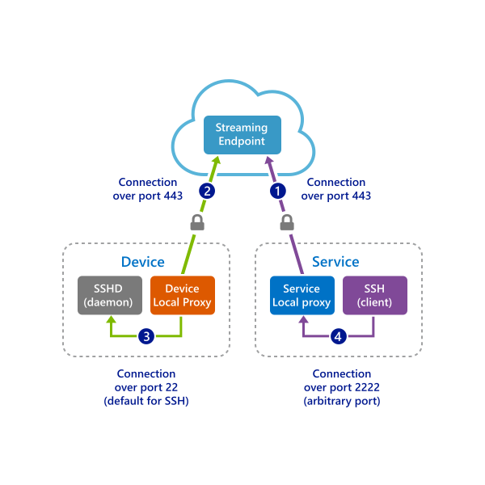

# Quickstart: Enable SSH and RDP over an IoT Hub device stream by using a C proxy application (preview)

[!INCLUDE [iot-hub-quickstarts-4-selector](../../includes/iot-hub-quickstarts-4-selector.md)]

Azure IoT Hub currently supports device streams as a [preview feature](https://azure.microsoft.com/support/legal/preview-supplemental-terms/).

[IoT Hub device streams](./iot-hub-device-streams-overview.md) allow service and device applications to communicate in a secure and firewall-friendly manner. For an overview of the setup, see [the Local Proxy Sample page](./iot-hub-device-streams-overview.md#local-proxy-sample-for-ssh-or-rdp).

This quickstart describes the setup for tunneling Secure Shell (SSH) traffic (using port 22) through device streams. The setup for Remote Desktop Protocol (RDP) traffic is similar and requires a simple configuration change. Because device streams are application- and protocol-agnostic, you can modify this quickstart to accommodate other types of application traffic.

## How it works

The following figure illustrates how the device- and service-local proxy programs enable end-to-end connectivity between the SSH client and SSH daemon processes. During public preview, the C SDK supports device streams on the device side only. As a result, this quickstart covers instructions to run only the device-local proxy application. You should run one of the following service-side quickstarts:

* [SSH/RDP over IoT Hub device streams using C# proxy](./quickstart-device-streams-proxy-csharp.md)
* [SSH/RDP over IoT Hub device streams using NodeJS proxy](./quickstart-device-streams-proxy-nodejs.md).



1. The service-local proxy connects to the IoT hub and starts a device stream to the target device.

2. The device-local proxy completes the stream initiation handshake and establishes an end-to-end streaming tunnel through the IoT hub's streaming endpoint to the service side.

3. The device-local proxy connects to the SSH daemon that's listening on port 22 on the device. This setting is configurable, as described in the "Run the device-local proxy application" section.

4. The service-local proxy waits for new SSH connections from a user by listening on a designated port, which in this case is port 2222. This setting is configurable, as described in the "Run the device-local proxy application" section. When the user connects via SSH client, the tunnel enables SSH application traffic to be transferred between the SSH client and server programs.

> [!NOTE]
> SSH traffic that's sent over a device stream is tunneled through the IoT hub's streaming endpoint rather than sent directly between service and device. For more information, see the [benefits of using Iot Hub device streams](iot-hub-device-streams-overview.md#benefits). Furthermore, the figure illustrates the SSH daemon that's running on the same device (or machine) as the device-local proxy. In this quickstart, providing the SSH daemon IP address allows the device-local proxy and the daemon to run on different machines as well.

[!INCLUDE [cloud-shell-try-it.md](../../includes/cloud-shell-try-it.md)]

If you don’t have an Azure subscription, create a [free account](https://azure.microsoft.com/free/?WT.mc_id=A261C142F) before you begin.

## Prerequisites

* The preview of device streams is currently supported only for IoT hubs that are created in the following regions:

  * Central US
  * Central US EUAP

* Install [Visual Studio 2019](https://www.visualstudio.com/vs/) with the [Desktop development with C++](https://www.visualstudio.com/vs/support/selecting-workloads-visual-studio-2017/) workload enabled.
* Install the latest version of [Git](https://git-scm.com/download/).

* Run the following command to add the Azure IoT Extension for Azure CLI to your Cloud Shell instance. The IOT Extension adds IoT Hub, IoT Edge, and IoT Device Provisioning Service (DPS)-specific commands to the Azure CLI.

   ```azurecli-interactive
   az extension add --name azure-cli-iot-ext
   ```

## Prepare the development environment

For this quickstart, you use the [Azure IoT device SDK for C](iot-hub-device-sdk-c-intro.md). You prepare a development environment used to clone and build the [Azure IoT C SDK](https://github.com/Azure/azure-iot-sdk-c) from GitHub. The SDK on GitHub includes the sample code that's used in this quickstart.

1. Download the [CMake build system](https://cmake.org/download/).

    It's important that the Visual Studio prerequisites (Visual Studio and the *Desktop development with C++* workload) are installed on your machine, *before* you start the CMake installation. After the prerequisites are in place and the download is verified, you can install the CMake build system.

1. Open a command prompt or Git Bash shell. Execute the following command to clone the [Azure IoT C SDK](https://github.com/Azure/azure-iot-sdk-c) GitHub repository:

    ```
    git clone https://github.com/Azure/azure-iot-sdk-c.git --recursive -b public-preview
    ```

    You should expect this operation to take a few minutes.

1. Create a *cmake* subdirectory in the root directory of the Git repository, as shown in the following command, and navigate to that folder.

    ```
    cd azure-iot-sdk-c
    mkdir cmake
    cd cmake
    ```

1. Run the following commands from the *cmake* directory to build a version of the SDK that's specific to your development client platform.

   * In Linux:

      ```bash
      cmake ..
      make -j
      ```

   * In Windows, run the following commands in Developer Command Prompt for Visual Studio 2015 or 2017. A Visual Studio solution for the simulated device will be generated in the *cmake* directory.

      ```cmd
      rem For VS2015
      cmake .. -G "Visual Studio 14 2015"

      rem Or for VS2017
      cmake .. -G "Visual Studio 15 2017"

      rem Then build the project
      cmake --build . -- /m /p:Configuration=Release
      ```

## Create an IoT hub

[!INCLUDE [iot-hub-include-create-hub-device-streams](../../includes/iot-hub-include-create-hub-device-streams.md)]

## Register a device

A device must be registered with your IoT hub before it can connect. In this section, you use Azure Cloud Shell with the [IoT extension](https://docs.microsoft.com/cli/azure/ext/azure-cli-iot-ext/iot?view=azure-cli-latest) to register a simulated device.

1. To create the device identity, run the following command in Cloud Shell:

   > [!NOTE]
   > * Replace the *YourIoTHubName* placeholder with the name you choose for your IoT hub.
   > * Use *MyDevice*, as shown. It's the name given for the registered device. If you choose a different name for your device, use that name throughout this article, and update the device name in the sample applications before you run them.

    ```azurecli-interactive
    az iot hub device-identity create --hub-name YourIoTHubName --device-id MyDevice
    ```

1. To get the *device connection string* for the device that you just registered, run the following commands in Cloud Shell:

   > [!NOTE]
   > Replace the *YourIoTHubName* placeholder with the name you choose for your IoT hub.

    ```azurecli-interactive
    az iot hub device-identity show-connection-string --hub-name YourIoTHubName --device-id MyDevice --output table
    ```

    Note the device connection string for later use in this quickstart. It looks like the following example:

   `HostName={YourIoTHubName}.azure-devices.net;DeviceId=MyDevice;SharedAccessKey={YourSharedAccessKey}`

## SSH to a device via device streams

In this section, you establish an end-to-end stream to tunnel SSH traffic.

### Run the device-local proxy application

1. Edit the source file *iothub_client_c2d_streaming_sample.c* in the folder *iothub_client/samples/iothub_client_c2d_streaming_sample*, and provide your device connection string, target device IP/hostname, and the SSH port 22:

   ```C
   /* Paste in your iothub connection string  */
   static const char* connectionString = "[Connection string of IoT Hub]";
   static const char* localHost = "[IP/Host of your target machine]"; // Address of the local server to connect to.
   static const size_t localPort = 22; // Port of the local server to connect to.
   ```

1. Compile the sample:

   ```bash
   # In Linux
   # Go to the sample's folder cmake/iothub_client/samples/iothub_client_c2d_streaming_proxy_sample
   make -j
   ```

   ```cmd
   rem In Windows
   rem Go to cmake at root of repository
   cmake --build . -- /m /p:Configuration=Release
   ```

1. Run the compiled program on the device:

   ```bash
   # In Linux
   # Go to the sample's folder cmake/iothub_client/samples/iothub_client_c2d_streaming_proxy_sample
   ./iothub_client_c2d_streaming_proxy_sample
   ```

   ```cmd
   rem In Windows
   rem Go to the sample's release folder cmake\iothub_client\samples\iothub_client_c2d_streaming_proxy_sample\Release
   iothub_client_c2d_streaming_proxy_sample.exe
   ```

### Run the service-local proxy application

As discussed in the "How it works" section, establishing an end-to-end stream to tunnel SSH traffic requires a local proxy at each end (on both the service and the device sides). During public preview, the IoT Hub C SDK supports device streams on the device side only. To build and run the service-local proxy, follow the instructions in one of the following quickstarts:

   * [SSH/RDP over IoT Hub device streams using C# proxy apps](./quickstart-device-streams-proxy-csharp.md)
   * [SSH/RDP over IoT Hub device streams using Node.js proxy apps](./quickstart-device-streams-proxy-nodejs.md)

### Establish an SSH session

After both the device- and service-local proxies are running, use your SSH client program and connect to the service-local proxy on port 2222 (instead of the SSH daemon directly).

```cmd/sh
ssh <username>@localhost -p 2222
```

At this point, the SSH sign-in window prompts you to enter your credentials.

The following image shows the console output on the device-local proxy, which connects to the SSH daemon at `IP_address:22`:


The following image shows the console output of the SSH client program. The SSH client communicates to the SSH daemon by connecting to port 22, which the service-local proxy is listening on:


## Clean up resources

[!INCLUDE [iot-hub-quickstarts-clean-up-resources](../../includes/iot-hub-quickstarts-clean-up-resources-device-streams.md)]

## Next steps

In this quickstart, you've set up an IoT hub, registered a device, deployed a device- and a service-local proxy program to establish a device stream through IoT Hub, and used the proxies to tunnel SSH traffic.

To learn more about device streams, see:

> [!div class="nextstepaction"]
> [Device streams overview](./iot-hub-device-streams-overview.md)
