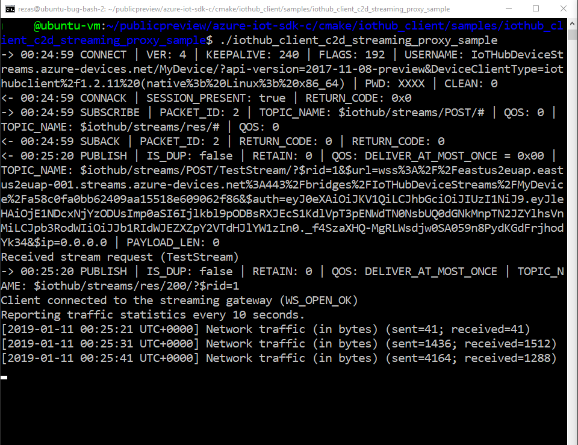

# Quickstart: SSH/RDP over IoT Hub device streams using C proxy application (preview)

[!INCLUDE [iot-hub-quickstarts-4-selector](../../includes/iot-hub-quickstarts-4-selector.md)]

[IoT Hub device streams](./iot-hub-device-streams-overview.md) allow service and device applications to communicate in a secure and firewall-friendly manner. See [this page](./iot-hub-device-streams-overview.md#local-proxy-sample-for-ssh-or-rdp) for an overview of the setup.

This document describes the setup for tunneling SSH traffic (using port 22) through device streams. The setup for RDP traffic is similar and requires a simple configuration change. Since device streams are application and protocol agnostic, the present quickstart can be modified (by changing the communication ports) to accommodate other types of application traffic.

## How it works?
Figure below illustrates the setup of how the device- and service-local proxy programs will enable end-to-end connectivity between SSH client and SSH daemon processes. During public preview, the C SDK only supports device streams on the device side. As a result, this quickstart only covers instructions to run the device-local proxy application. You should run an accompanying service-local proxy application which is available in [C# quickstart](./quickstart-device-streams-proxy-csharp.md) or [Node.js quickstart](./quickstart-device-streams-proxy-nodejs.md) guides.


1. Service-local proxy connects to IoT hub and initiates a device stream to the target device.

2. Device-local proxy completes the stream initiation handshake and establishes an end-to-end streaming tunnel through IoT Hub's streaming endpoint to the service side.

3. Device-local proxy connects to the SSH daemon (SSHD) listening on port 22 on the device (this is configurable, as described [below](#run-the device-local-proxy-application)).

4. Service-local proxy awaits for new SSH connections from the user by listening on a designated port which in this case is port 2222 (this is also configurable, as described [below](#run-the-device-local-proxy-application)). When user connects via SSH client, the tunnel enables SSH application traffic to be transferred between the SSH client and server programs.

> [!NOTE]
> SSH traffic being sent over a device stream will be tunneled through IoT Hub's streaming endpoint rather than being sent directly between service and device. This provides [these benefits](./iot-hub-device-streams-overview.md#benefits). Furthermore, the figure illustrates the SSH daemon running on the same device (or machine) as the device-local proxy. In this quickstart, providing the SSH daemon IP address allows device-local proxy and daemon to run on different machines as well.

[!INCLUDE [cloud-shell-try-it.md](../../includes/cloud-shell-try-it.md)]

If you don’t have an Azure subscription, create a [free account](https://azure.microsoft.com/free/?WT.mc_id=A261C142F) before you begin.

## Prerequisites

* Install [Visual Studio 2017](https://www.visualstudio.com/vs/) with the ['Desktop development with C++'](https://www.visualstudio.com/vs/support/selecting-workloads-visual-studio-2017/) workload enabled.
* Install the latest version of [Git](https://git-scm.com/download/).

## Prepare the development environment

For this quickstart, you will be using the [Azure IoT device SDK for C](iot-hub-device-sdk-c-intro.md). You will prepare a development environment used to clone and build the [Azure IoT C SDK](https://github.com/Azure/azure-iot-sdk-c) from GitHub. The SDK on GitHub includes the sample code used in this quickstart. 


1. Download the version 3.11.4 of the [CMake build system](https://cmake.org/download/) from [GitHub](https://github.com/Kitware/CMake/releases/tag/v3.11.4). Verify the downloaded binary using the corresponding cryptographic hash value. The following example used Windows PowerShell to verify the cryptographic hash for version 3.11.4 of the x64 MSI distribution:

    ```PowerShell
    PS C:\Downloads> $hash = get-filehash .\cmake-3.11.4-win64-x64.msi
    PS C:\Downloads> $hash.Hash -eq "56e3605b8e49cd446f3487da88fcc38cb9c3e9e99a20f5d4bd63e54b7a35f869"
    True
    ```
    
    The following hash values for version 3.11.4 were listed on the CMake site at the time of this writing:

    ```
    6dab016a6b82082b8bcd0f4d1e53418d6372015dd983d29367b9153f1a376435  cmake-3.11.4-Linux-x86_64.tar.gz
    72b3b82b6d2c2f3a375c0d2799c01819df8669dc55694c8b8daaf6232e873725  cmake-3.11.4-win32-x86.msi
    56e3605b8e49cd446f3487da88fcc38cb9c3e9e99a20f5d4bd63e54b7a35f869  cmake-3.11.4-win64-x64.msi
    ```

    It is important that the Visual Studio prerequisites (Visual Studio and the 'Desktop development with C++' workload) are installed on your machine, **before** starting the `CMake` installation. Once the prerequisites are in place, and the download is verified, install the CMake build system.

2. Open a command prompt or Git Bash shell. Execute the following command to clone the [Azure IoT C SDK](https://github.com/Azure/azure-iot-sdk-c) GitHub repository:
    
    ```
    git clone https://github.com/Azure/azure-iot-sdk-c.git --recursive -b public-preview
    ```
    The size of this repository is currently around 220 MB. You should expect this operation to take several minutes to complete.


3. Create a `cmake` subdirectory in the root directory of the git repository, and navigate to that folder. 

    ```
    cd azure-iot-sdk-c
    mkdir cmake
    cd cmake
    ```

4. Run the following command that builds a version of the SDK specific to your development client platform. In Windows, a Visual Studio solution for the simulated device will be generated in the `cmake` directory. 

```
    # In Linux
    cmake ..
    make -j
```

In Windows, run the following commands in Developer Command Prompt for your Visual Studio 2015 or 2017 prompt:

```
    rem In Windows
    rem For VS2015
    cmake .. -G "Visual Studio 15 2015"

    rem Or for VS2017
    cmake .. -G "Visual Studio 15 2017"

    rem Then build the project
    cmake --build . -- /m /p:Configuration=Release
```
    

## Create an IoT hub

[!INCLUDE [iot-hub-include-create-hub](../../includes/iot-hub-include-create-hub-device-streams.md)]

## Register a device

A device must be registered with your IoT hub before it can connect. In this section, you will use the Azure Cloud Shell with the [IoT extension](https://docs.microsoft.com/cli/azure/ext/azure-cli-iot-ext/iot?view=azure-cli-latest) to register a simulated device.

1. Run the following commands in Azure Cloud Shell to add the IoT Hub CLI extension and to create the device identity. 

   **YourIoTHubName**: Replace this placeholder below with the name you choose for your IoT hub.

   **MyDevice**: This is the name given for the registered device. Use MyDevice as shown. If you choose a different name for your device, you will also need to use that name throughout this article, and update the device name in the sample applications before you run them.

    ```azurecli-interactive
    az extension add --name azure-cli-iot-ext
    az iot hub device-identity create --hub-name YourIoTHubName --device-id MyDevice
    ```

2. Run the following commands in Azure Cloud Shell to get the _device connection string_ for the device you just    registered:

   **YourIoTHubName**: Replace this placeholder below with the name you choose for your IoT hub.

    ```azurecli-interactive
    az iot hub device-identity show-connection-string --hub-name YourIoTHubName --device-id MyDevice --output table
    ```

    Make a note of the device connection string, which looks like the following example:

   `HostName={YourIoTHubName}.azure-devices.net;DeviceId=MyDevice;SharedAccessKey={YourSharedAccessKey}`

    You use this value later in the quickstart.


## SSH to a device via device streams

### Run the device-local proxy application

- Edit the source file `iothub_client/samples/iothub_client_c2d_streaming_proxy_sample/iothub_client_c2d_streaming_proxy_sample.c` and provide your device connection string, target device IP/hostname as well as the RDP port 22:
```C
  /* Paste in the your iothub connection string  */
  static const char* connectionString = "[Connection string of IoT Hub]";
  static const char* localHost = "[IP/Host of your target machine]"; // Address of the local server to connect to.
  static const size_t localPort = 22; // Port of the local server to connect to.
```

- Compile the sample as follows:

```
    # In Linux
    # Go to the sample's folder cmake/iothub_client/samples/iothub_client_c2d_streaming_proxy_sample
    make -j
```

```
    rem In Windows
    rem Go to cmake at root of repository
    cmake --build . -- /m /p:Configuration=Release
```

- Run the compiled program on the device:
```
    # In Linux
    # Go to sample's folder cmake/iothub_client/samples/iothub_client_c2d_streaming_proxy_sample
    ./iothub_client_c2d_streaming_proxy_sample
```

```
    rem In Windows
    rem Go to sample's release folder cmake\iothub_client\samples\iothub_client_c2d_streaming_proxy_sample\Release
    iothub_client_c2d_streaming_proxy_sample.exe
```

### Run the service-local proxy application

As discussed [above](#how-it-works) establishing an end-to-end stream to tunnel SSH traffic requires a local proxy at each end (i.e., service and device). During public preview, IoT Hub C SDK only supports device streams on the device side however. For the service-local proxy, use the accompanying guides in [C# quickstart](./quickstart-device-streams-proxy-csharp.md) or [Node.js quickstart](./quickstart-device-streams-proxy-nodejs.md) instead.


### Establish an SSH session

Assuming that both the device- and service-local proxies are running, now use your SSH client program and connect to service-local proxy on port 2222 (instead of the SSH daemon directly). 

```
ssh <username>@localhost -p 2222
```

At this point, you will be presented with the SSH login prompt to enter your credentials.


Console output on the device-local proxy which connects to the SSH daemon at `IP_address:22`:


Console output of the SSH client program (SSH client communicates to SSH daemon by connecting to port 22 where service-local proxy is listening on):


## Clean up resources

[!INCLUDE [iot-hub-quickstarts-clean-up-resources](../../includes/iot-hub-quickstarts-clean-up-resources-device-streams.md)]

## Next steps

In this quickstart, you have set up an IoT hub, registered a device, deployed a device- and a service-local proxy program to establish a device stream through IoT Hub, and used the proxies to tunnel SSH traffic.

Use the links below to learn more about device streams:

> [!div class="nextstepaction"]
> [Device streams overview](./iot-hub-device-streams-overview.md)
