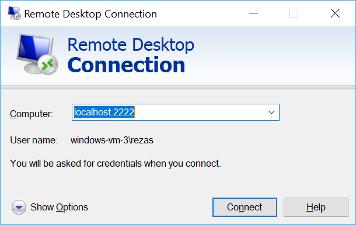

# Quickstart: SSH/RDP over IoT Hub device streams using C# proxy applications (preview)

[!INCLUDE [iot-hub-quickstarts-4-selector](../../includes/iot-hub-quickstarts-4-selector.md)]

Microsoft Azure IoT Hub currently supports device streams as a [preview feature](https://azure.microsoft.com/support/legal/preview-supplemental-terms/).

[IoT Hub device streams](./iot-hub-device-streams-overview.md) allow service and device applications to communicate in a secure and firewall-friendly manner. This quickstart guide involves two C# programs that enable client/server application traffic (such as SSH and RDP) to be sent over a device stream established through IoT Hub. See [here](./iot-hub-device-streams-overview.md#local-proxy-sample-for-ssh-or-rdp) for an overview of the setup.

We first describe the setup for SSH (using port 22). We then describe how to modify the setup's port for RDP. Since device streams are application and protocol agnostic, the same sample can be modified to accommodate other types of application traffic. This usually only involves changing the communication port to the one used by the intended application.

## How it works?

Figure below illustrates the setup of how the device- and service-local proxy programs in this sample will enable end-to-end connectivity between SSH client and SSH daemon. Here, we assume that the daemon is running on the same device as the device-local proxy.


1. Service-local proxy connects to IoT hub and initiates a device stream to the target device using its device ID.

2. Device-local proxy completes the stream initiation handshake and establishes an end-to-end streaming tunnel through IoT Hub's streaming endpoint to the service side.

3. Device-local proxy connects to the SSH daemon (SSHD) listening on port 22 on the device (this port is configurable, as described [below](#run-the-device-local-proxy)).

4. Service-local proxy awaits for new SSH connections from the user by listening on a designated port which in this case is port 2222 (this is also configurable, as described [below](#run-the-service-local-proxy)). When user connects via SSH client, the tunnel enables application traffic to be exchanged between the SSH client and server programs.

> [!NOTE]
> SSH traffic being sent over the stream will be tunneled through IoT Hub's streaming endpoint rather than being sent directly between service and device. This provides [these benefits](./iot-hub-device-streams-overview.md#benefits).

[!INCLUDE [cloud-shell-try-it.md](../../includes/cloud-shell-try-it.md)]

If you don’t have an Azure subscription, create a [free account](https://azure.microsoft.com/free/?WT.mc_id=A261C142F) before you begin.

## Prerequisites

The preview of device streams is currently only supported for IoT Hubs created in the following regions:

  - **Central US**
  - **Central US EUAP**

The two sample applications you run in this quickstart are written using C#. You need the .NET Core SDK 2.1.0 or greater on your development machine.

You can download the .NET Core SDK for multiple platforms from [.NET](https://www.microsoft.com/net/download/all).

You can verify the current version of C# on your development machine using the following command:

```
dotnet --version
```

Run the following command to add the Microsoft Azure IoT Extension for Azure CLI to your Cloud Shell instance. The IOT Extension adds IoT Hub, IoT Edge, and IoT Device Provisioning Service (DPS) specific commands to Azure CLI.

```azurecli-interactive
az extension add --name azure-cli-iot-ext
```

Download the sample C# project from https://github.com/Azure-Samples/azure-iot-samples-csharp/archive/master.zip and extract the ZIP archive.

## Create an IoT hub

[!INCLUDE [iot-hub-include-create-hub](../../includes/iot-hub-include-create-hub-device-streams.md)]

## Register a device

A device must be registered with your IoT hub before it can connect. In this quickstart, you use the Azure Cloud Shell to register a simulated device.

1. Run the following command in Azure Cloud Shell to create the device identity.

   **YourIoTHubName**: Replace this placeholder below with the name you choose for your IoT hub.

   **MyDevice**: This is the name given for the registered device. Use MyDevice as shown. If you choose a different name for your device, you will also need to use that name throughout this article, and update the device name in the sample applications before you run them.

    ```azurecli-interactive
    az iot hub device-identity create --hub-name YourIoTHubName --device-id MyDevice
    ```

2. Run the following commands in Azure Cloud Shell to get the _device connection string_ for the device you just registered:

   **YourIoTHubName**: Replace this placeholder below with the name you choose for your IoT hub.

    ```azurecli-interactive
    az iot hub device-identity show-connection-string --hub-name YourIoTHubName --device-id MyDevice --output table
    ```

    Make a note of the device connection string, which looks like the following example:

   `HostName={YourIoTHubName}.azure-devices.net;DeviceId=MyDevice;SharedAccessKey={YourSharedAccessKey}`

    You use this value later in the quickstart.

3. You also need the _service connection string_ from your IoT hub to enable the service-side application to connect to your IoT hub and establish a device stream. The following command retrieves this value for your IoT hub:

   **YourIoTHubName**: Replace this placeholder below with the name you choose for your IoT hub.

    ```azurecli-interactive
    az iot hub show-connection-string --policy-name service --name YourIoTHubName
    ```

    Make a note of the returned value, which looks like this:

   `"HostName={YourIoTHubName}.azure-devices.net;SharedAccessKeyName=service;SharedAccessKey={YourSharedAccessKey}"`
    

## SSH to a device via device streams

### Run the device-local proxy

Navigate to `device-streams-proxy/device` in your unzipped project folder. You will need the following information handy:

| Argument name | Argument value |
|----------------|-----------------|
| `deviceConnectionString` | The connection string of the device you created earlier. |
| `targetServiceHostName` | The IP address where SSH server listens on (this would be `localhost` if the same IP where device-local proxy is running). |
| `targetServicePort` | The port used by your application protocol (by default, this would be port 22 for SSH).  |

Compile and run the code as follows:

```
cd ./iot-hub/Quickstarts/device-streams-proxy/device/

# Build the application
dotnet build

# Run the application
# In Linux/MacOS
dotnet run $deviceConnectionString localhost 22

# In Windows
dotnet run %deviceConnectionString% localhost 22
```

### Run the service-local proxy

Navigate to `device-streams-proxy/service` in your unzipped project folder. You will need the following information handy:

| Parameter name | Parameter value |
|----------------|-----------------|
| `iotHubConnectionString` | The service connection string of your IoT Hub. |
| `deviceId` | The identifier of the device you created earlier. |
| `localPortNumber` | A local port where your SSH client will connect to. We use port 2222 in this sample, but you could modify this to other arbitrary numbers. |

Compile and run the code as follows:

```
cd ./iot-hub/Quickstarts/device-streams-proxy/service/

# Build the application
dotnet build

# Run the application
# In Linux/MacOS
dotnet run $serviceConnectionString MyDevice 2222

# In Windows
dotnet run %serviceConnectionString% MyDevice 2222
```

### Run SSH client

Now use your SSH client program and connect to service-local proxy on port 2222 (instead of the SSH daemon directly). 

```
ssh <username>@localhost -p 2222
```

At this point, you will be presented with the SSH login prompt to enter your credentials.

Console output on the service-side (the service-local proxy listens on port 2222):


Console output on the device-local proxy which connects to the SSH daemon at `IP_address:22`:


Console output of the SSH client program (SSH client communicates to SSH daemon by connecting to port 22 where service-local proxy is listening on):


## RDP to a device via device streams

The setup for RDP is very similar to SSH (described above). We basically need to use the RDP destination IP and port 3389 instead and use RDP client (instead of SSH client).

### Run the device-local proxy (RDP)

Navigate to `device-streams-proxy/device` in your unzipped project folder. You will need the following information handy:

| Argument name | Argument value |
|----------------|-----------------|
| `DeviceConnectionString` | The connection string of the device you created earlier. |
| `targetServiceHostName` | The hostname or IP address where RDP server runs (this would be `localhost` if the same IP where device-local proxy is running). |
| `targetServicePort` | The port used by your application protocol (by default, this would be port 3389 for RDP).  |

Compile and run the code as follows:

```
cd ./iot-hub/Quickstarts/device-streams-proxy/device

# Run the application
# In Linux/MacOS
dotnet run $DeviceConnectionString localhost 3389

# In Windows
dotnet run %DeviceConnectionString% localhost 3389
```

### Run the service-local proxy (RDP)

Navigate to `device-streams-proxy/service` in your unzipped project folder. You will need the following information handy:

| Parameter name | Parameter value |
|----------------|-----------------|
| `iotHubConnectionString` | The service connection string of your IoT Hub. |
| `deviceId` | The identifier of the device you created earlier. |
| `localPortNumber` | A local port where your SSH client will connect to. We use port 2222 in this sample, but you could modify this to other arbitrary numbers. |

Compile and run the code as follows:

```
cd ./iot-hub/Quickstarts/device-streams-proxy/service/

# Build the application
dotnet build

# Run the application
# In Linux/MacOS
dotnet run $serviceConnectionString MyDevice 2222

# In Windows
dotnet run %serviceConnectionString% MyDevice 2222
```

### Run RDP client

Now use your RDP client program and connect to service-local proxy on port 2222 (this was an arbitrary available port you chose earlier).



## Clean up resources

[!INCLUDE [iot-hub-quickstarts-clean-up-resources](../../includes/iot-hub-quickstarts-clean-up-resources-device-streams.md)]

## Next steps

In this quickstart, you have set up an IoT hub, registered a device, deployed a device- and a service-local proxy program to establish a device stream through IoT Hub, and used the proxies to tunnel SSH or RDP traffic. The same paradigm can accommodate other client/server protocols (where server runs on the device, e.g., SSH daemon).

Use the links below to learn more about device streams:

> [!div class="nextstepaction"]
> [Device streams overview](./iot-hub-device-streams-overview.md)
