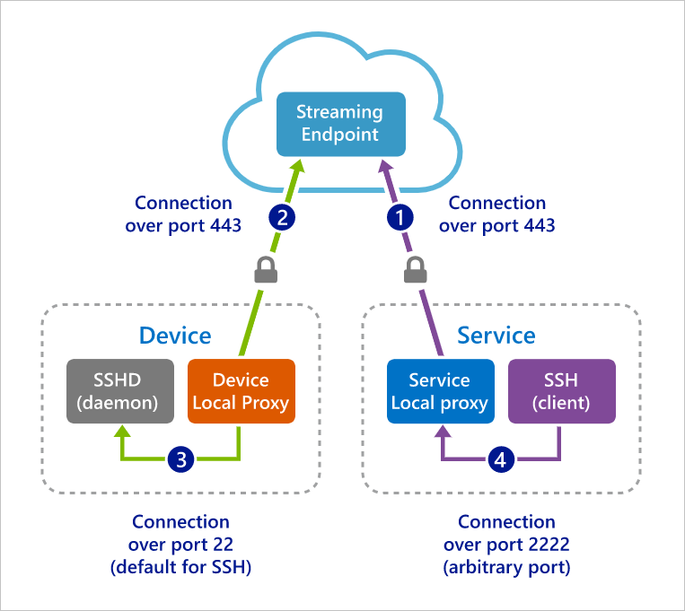
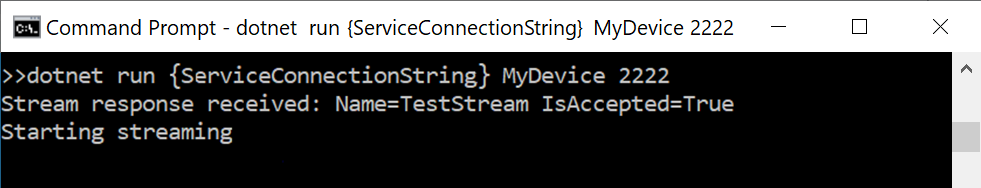
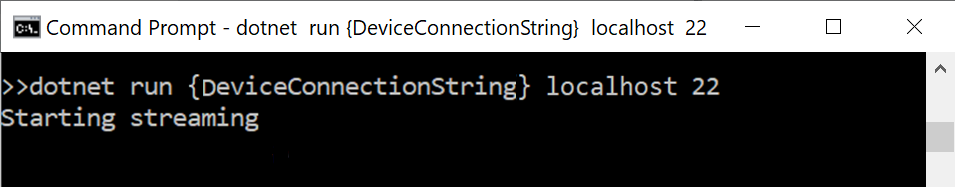
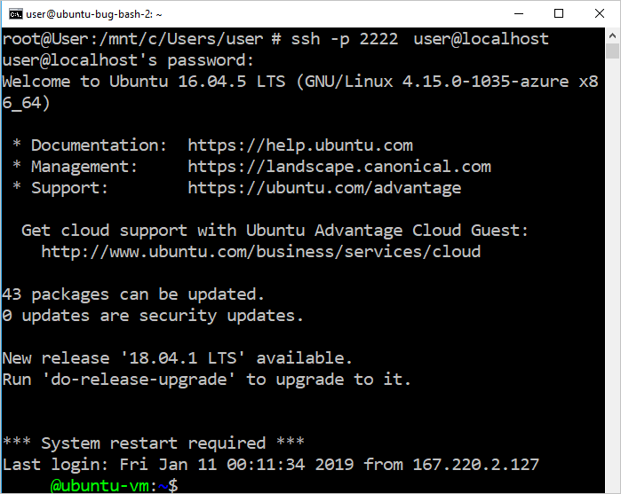
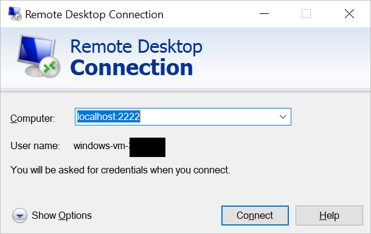

# Quickstart: Enable SSH and RDP over an IoT Hub device stream by using a C# proxy application (preview)

[!INCLUDE [iot-hub-quickstarts-4-selector](../../includes/iot-hub-quickstarts-4-selector.md)]

Microsoft Azure IoT Hub currently supports device streams as a [preview feature](https://azure.microsoft.com/support/legal/preview-supplemental-terms/).

[IoT Hub device streams](iot-hub-device-streams-overview.md) allow service and device applications to communicate in a secure and firewall-friendly manner. This quickstart guide involves two C# applications that enable client-server application traffic (such as Secure Shell [SSH] and Remote Desktop Protocol [RDP] to be sent over a device stream that's established through an IoT hub. For an overview of the setup, see [Local proxy application sample for SSH or RDP](iot-hub-device-streams-overview.md#local-proxy-sample-for-ssh-or-rdp).

This article first describes the setup for SSH (using port 22) and then describes how to modify the setup's port for RDP. Because device streams are application- and protocol-agnostic, the same sample can be modified to accommodate other types of application traffic. This modification usually involves only changing the communication port to the one that's used by the intended application.

## How it works

The following figure illustrates how the device-local and service-local proxy applications in this sample enable end-to-end connectivity between the SSH client and SSH daemon processes. Here, we assume that the daemon is running on the same device as the device-local proxy application.



1. The service-local proxy application connects to the IoT hub and initiates a device stream to the target device.

1. The device-local proxy application completes the stream initiation handshake and establishes an end-to-end streaming tunnel through the IoT hub's streaming endpoint to the service side.

1. The device-local proxy application connects to the SSH daemon that's listening on port 22 on the device. This setting is configurable, as described in the "Run the device-local proxy application" section.

1. The service-local proxy application waits for new SSH connections from a user by listening on a designated port, which in this case is port 2222. This setting is configurable, as described in the "Run the service-local proxy application" section. When the user connects via the SSH client, the tunnel enables SSH application traffic to be transferred between the SSH client and server application.

> [!NOTE]
> SSH traffic that's sent over a device stream is tunneled through the IoT hub's streaming endpoint rather than sent directly between service and device. For more information, see the [benefits of using Iot Hub device streams](iot-hub-device-streams-overview.md#benefits).

[!INCLUDE [cloud-shell-try-it.md](../../includes/cloud-shell-try-it.md)]

If you don't have an Azure subscription, create a [free account](https://azure.microsoft.com/free/?WT.mc_id=A261C142F) before you begin.

## Prerequisites

* The preview of device streams is currently supported only for IoT hubs that are created in the following regions:

  * Central US
  * Central US EUAP
  * Southeast Asia
  * North Europe

* The two sample applications that you run in this quickstart are written in C#. You need the .NET Core SDK 2.1.0 or later on your development machine.

  You can download the [.NET Core SDK for multiple platforms from .NET](https://www.microsoft.com/net/download/all).

* Verify the current version of C# on your development machine by using the following command:

    ```
    dotnet --version
    ```

* Run the following command to add the Azure IoT Extension for Azure CLI to your Cloud Shell instance. The IOT Extension adds IoT Hub, IoT Edge, and IoT Device Provisioning Service (DPS)-specific commands to the Azure CLI.

   ```azurecli-interactive
   az extension add --name azure-iot
   ```

   ```azurecli-interactive
   az extension add --name azure-iot
   ```
[!INCLUDE [iot-hub-cli-version-info](../../includes/iot-hub-cli-version-info.md)]

* [Download the Azure IoT C# samples](https://github.com/Azure-Samples/azure-iot-samples-csharp/archive/master.zip), and extract the ZIP archive.

* A valid user account and credential on the device (Windows or Linux) used to authenticate the user.

## Create an IoT hub

[!INCLUDE [iot-hub-include-create-hub](../../includes/iot-hub-include-create-hub.md)]

## Register a device

A device must be registered with your IoT hub before it can connect. In this quickstart, you use Azure Cloud Shell to register a simulated device.

1. To create the device identity, run the following command in Cloud Shell:

   > [!NOTE]
   > * Replace the *YourIoTHubName* placeholder with the name you chose for your IoT hub.
   > * For the name of the device you're registering, it's recommended to use *MyDevice* as shown. If you choose a different name for your device, use that name throughout this article, and update the device name in the sample applications before you run them.

    ```azurecli-interactive
    az iot hub device-identity create --hub-name {YourIoTHubName} --device-id MyDevice
    ```

1. To get the *device connection string* for the device that you just registered, run the following commands in Cloud Shell:

   > [!NOTE]
   > Replace the *YourIoTHubName* placeholder with the name you chose for your IoT hub.

    ```azurecli-interactive
    az iot hub device-identity show-connection-string --hub-name {YourIoTHubName} --device-id MyDevice --output table
    ```

    Note the returned device connection string for later use in this quickstart. It looks like the following example:

   `HostName={YourIoTHubName}.azure-devices.net;DeviceId=MyDevice;SharedAccessKey={YourSharedAccessKey}`

1. To connect to your IoT hub and establish a device stream, you also need the *service connection string* from your IoT hub to enable the service-side application. The following command retrieves this value for your IoT hub:

   > [!NOTE]
   > Replace the *YourIoTHubName* placeholder with the name you chose for your IoT hub.

    ```azurecli-interactive
    az iot hub show-connection-string --policy-name service --name {YourIoTHubName} --output table
    ```

    Note the returned service connection string for later use in this quickstart. It looks like the following example:

   `"HostName={YourIoTHubName}.azure-devices.net;SharedAccessKeyName=service;SharedAccessKey={YourSharedAccessKey}"`

## SSH to a device via device streams

In this section, you establish an end-to-end stream to tunnel SSH traffic.

### Run the device-local proxy application

In a local terminal window, navigate to the `device-streams-proxy/device` directory in your unzipped project folder. Keep the following information handy:

| Argument name | Argument value |
|----------------|-----------------|
| `DeviceConnectionString` | The device connection string of the device that you created earlier. |
| `targetServiceHostName` | The IP address where the SSH server listens. The address would be `localhost` if it were the same IP where the device-local proxy application is running. |
| `targetServicePort` | The port that's used by your application protocol (for SSH, by default, this would be port 22).  |

Compile and run the code with the following commands:

```
cd ./iot-hub/Quickstarts/device-streams-proxy/device/

# Build the application
dotnet build

# Run the application
# In Linux or macOS
dotnet run ${DeviceConnectionString} localhost 22

# In Windows
dotnet run {DeviceConnectionString} localhost 22
```

### Run the service-local proxy application

In another local terminal window, navigate to `iot-hub/quickstarts/device-streams-proxy/service` in your unzipped project folder. Keep the following information handy:

| Parameter name | Parameter value |
|----------------|-----------------|
| `ServiceConnectionString` | The service connection string of your IoT Hub. |
| `MyDevice` | The identifier of the device you created earlier. |
| `localPortNumber` | A local port that your SSH client will connect to. We use port 2222 in this sample, but you could use other arbitrary numbers. |

Compile and run the code with the following commands:

```
cd ./iot-hub/Quickstarts/device-streams-proxy/service/

# Build the application
dotnet build

# Run the application
# In Linux or macOS
dotnet run ${ServiceConnectionString} MyDevice 2222

# In Windows
dotnet run {ServiceConnectionString} MyDevice 2222
```

### Run the SSH client

Now use your SSH client application and connect to service-local proxy application on port 2222 (instead of the SSH daemon directly).

```
ssh {username}@localhost -p 2222
```

At this point, the SSH sign-in window prompts you to enter your credentials.

Console output on the service side (the service-local proxy application listens on port 2222):



Console output on the device-local proxy application, which connects to the SSH daemon at *IP_address:22*:



Console output of the SSH client application. The SSH client communicates to the SSH daemon by connecting to port 22, which the service-local proxy application is listening on:



## RDP to a device via device streams

The setup for RDP is similar to the setup for SSH (described above). You use the RDP destination IP and port 3389 instead and use the RDP client (instead of the SSH client).

### Run the device-local proxy application (RDP)

In a local terminal window, navigate to the `device-streams-proxy/device` directory in your unzipped project folder. Keep the following information handy:

| Argument name | Argument value |
|----------------|-----------------|
| `DeviceConnectionString` | The device connection string of the device that you created earlier. |
| `targetServiceHostName` | The hostname or IP address where RDP server runs. The address would be `localhost` if it were the same IP where the device-local proxy application is running. |
| `targetServicePort` | The port used by your application protocol (for RDP, by default, this would be port 3389).  |

Compile and run the code with the following commands:

```
cd ./iot-hub/Quickstarts/device-streams-proxy/device

# Run the application
# In Linux or macOS
dotnet run ${DeviceConnectionString} localhost 3389

# In Windows
dotnet run {DeviceConnectionString} localhost 3389
```

### Run the service-local proxy application (RDP)

In another local terminal window, navigate to `device-streams-proxy/service` in your unzipped project folder. Keep the following information handy:

| Parameter name | Parameter value |
|----------------|-----------------|
| `ServiceConnectionString` | The service connection string of your IoT Hub. |
| `MyDevice` | The identifier of the device you created earlier. |
| `localPortNumber` | A local port that your SSH client will connect to. We use port 2222 in this sample, but you could modify this to other arbitrary numbers. |

Compile and run the code with the following commands:

```
cd ./iot-hub/Quickstarts/device-streams-proxy/service/

# Build the application
dotnet build

# Run the application
# In Linux or macOS
dotnet run ${ServiceConnectionString} MyDevice 2222

# In Windows
dotnet run {ServiceConnectionString} MyDevice 2222
```

### Run RDP client

Now use your RDP client application and connect to the service-local proxy application on port 2222 (this was an arbitrary available port that you chose earlier).



## Clean up resources

[!INCLUDE [iot-hub-quickstarts-clean-up-resources](../../includes/iot-hub-quickstarts-clean-up-resources-device-streams.md)]

## Next steps

In this quickstart, you set up an IoT hub, registered a device, deployed device-local and service-local proxy applications to establish a device stream through the IoT hub, and used the proxy applications to tunnel SSH or RDP traffic. The same paradigm can accommodate other client-server protocols, where the server runs on the device (for example, the SSH daemon).

To learn more about device streams, see:

> [!div class="nextstepaction"]
> [Device streams overview](./iot-hub-device-streams-overview.md)
