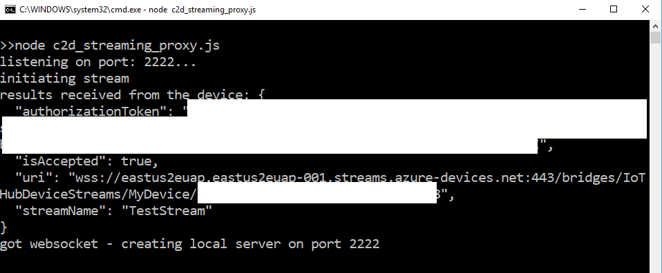

# Quickstart: SSH/RDP over IoT Hub device streams using Node.js proxy application (preview)

[!INCLUDE [iot-hub-quickstarts-4-selector](../../includes/iot-hub-quickstarts-4-selector.md)]

Microsoft Azure IoT Hub currently supports device streams as a [preview feature](https://azure.microsoft.com/support/legal/preview-supplemental-terms/).

[IoT Hub device streams](./iot-hub-device-streams-overview.md) allow service and device applications to communicate in a secure and firewall-friendly manner. This quickstart guide describes execution of a Node.js proxy application running on the service side to enable SSH and RDP traffic to be sent to the device over a device stream. See [here](./iot-hub-device-streams-overview.md#local-proxy-sample-for-ssh-or-rdp) for an overview of the setup. During public preview, Node.js SDK only supports device streams on the service side. As a result, this quickstart guide only covers instructions to run the service-local proxy. You should run an accompanying device-local proxy which is available in [C quickstart](./quickstart-device-streams-proxy-c.md) or [C# quickstart](./quickstart-device-streams-proxy-csharp.md) guides.

We first describe the setup for SSH (using port 22). We then describe how to modify the setup for RDP (which uses port 3389). Since device streams are application and protocol agnostic, the same sample can be modified to accommodate other types of client/server application traffic (usually by modifying the communication port).

[!INCLUDE [cloud-shell-try-it.md](../../includes/cloud-shell-try-it.md)]

If you don’t have an Azure subscription, create a [free account](https://azure.microsoft.com/free/?WT.mc_id=A261C142F) before you begin.

## Prerequisites

The preview of device streams is currently only supported for IoT Hubs created in the following regions:

  - **Central US**
  - **Central US EUAP**

To run the service-local application in this quickstart you need Node.js v4.x.x or later on your development machine.

You can download Node.js for multiple platforms from [nodejs.org](https://nodejs.org).

You can verify the current version of Node.js on your development machine using the following command:

```
node --version
```

Run the following command to add the Microsoft Azure IoT Extension for Azure CLI to your Cloud Shell instance. The IOT Extension adds IoT Hub, IoT Edge, and IoT Device Provisioning Service (DPS) specific commands to Azure CLI.

```azurecli-interactive
az extension add --name azure-cli-iot-ext
```

If you haven't already done so, download the sample Node.js project from https://github.com/Azure-Samples/azure-iot-samples-node/archive/streams-preview.zip and extract the ZIP archive.

## Create an IoT hub

If you completed the previous [Quickstart: Send telemetry from a device to an IoT hub](quickstart-send-telemetry-node.md), you can skip this step.

[!INCLUDE [iot-hub-include-create-hub](../../includes/iot-hub-include-create-hub-device-streams.md)]

## Register a device

If you completed the previous [Quickstart: Send telemetry from a device to an IoT hub](quickstart-send-telemetry-node.md), you can skip this step.

A device must be registered with your IoT hub before it can connect. In this quickstart, you use the Azure Cloud Shell to register a simulated device.

1. Run the following command in Azure Cloud Shell to create the device identity.

   **YourIoTHubName**: Replace this placeholder below with the name you chose for your IoT hub.

   **MyDevice**: This is the name given for the registered device. Use MyDevice as shown. If you choose a different name for your device, you will also need to use that name throughout this article, and update the device name in the sample applications before you run them.

    ```azurecli-interactive
    az iot hub device-identity create --hub-name YourIoTHubName --device-id MyDevice
    ```

2. You also need a _service connection string_ to enable the back-end application to connect to your IoT hub and retrieve the messages. The following command retrieves the service connection string for your IoT hub:

    **YourIoTHubName**: Replace this placeholder below with the name you chose for your IoT hub.

    ```azurecli-interactive
    az iot hub show-connection-string --policy-name service --name YourIoTHubName
    ```

    Make a note of the returned value, which looks like this:

   `"HostName={YourIoTHubName}.azure-devices.net;SharedAccessKeyName=service;SharedAccessKey={YourSharedAccessKey}"`

## SSH to a device via device streams

### Run the device-local proxy

As mentioned earlier, IoT Hub Node.js SDK only supports device streams on the service side. For device-local application, use the accompanying device proxy programs available in [C quickstart](./quickstart-device-streams-proxy-c.md) or [C# quickstart](./quickstart-device-streams-proxy-csharp.md) guides. Ensure the device-local proxy is running before proceeding to the next step.

### Run the service-local proxy

Assuming that the [device-local proxy](#run-the-device-local-proxy) is running, follow the steps below to run the service-local proxy written in Node.js.

- Provide your service credentials, the target device ID where SSH daemon runs, and the port number for the proxy running on the device as environment variables.
  ```
  # In Linux
  export IOTHUB_CONNECTION_STRING="<provide_your_service_connection_string>"
  export STREAMING_TARGET_DEVICE="MyDevice"
  export PROXY_PORT=2222

  # In Windows
  SET IOTHUB_CONNECTION_STRING=<provide_your_service_connection_string>
  SET STREAMING_TARGET_DEVICE=MyDevice
  SET PROXY_PORT=2222
  ```
  Change the values above to match your device ID and connection string.

- Navigate to `Quickstarts/device-streams-service` in your unzipped project folder and run the service-local proxy.
  ```
  cd azure-iot-samples-node-streams-preview/iot-hub/Quickstarts/device-streams-service

  # Install the preview service SDK, and other dependencies
  npm install azure-iothub@streams-preview
  npm install

  # Run the service-local proxy application
  node proxy.js
  ```

### SSH to your device via device streams

In Linux, run SSH using `ssh $USER@localhost -p 2222` on a terminal. In Windows, use your favorite SSH client (e.g., PuTTY).

Console output on the service-local after SSH session is established (the service-local proxy listens on port 2222):


Console output of the SSH client program (SSH client communicates to SSH daemon by connecting to port 22 where service-local proxy is listening on):


### RDP to your device via device streams

Now use your RDP client program and connect to service proxy on port 2222 (this was an arbitrary available port you chose earlier).

> [!NOTE]
> Ensure that your device proxy is configured correctly for RDP and configured with RDP port 3389.


## Clean up resources

[!INCLUDE [iot-hub-quickstarts-clean-up-resources](../../includes/iot-hub-quickstarts-clean-up-resources-device-streams.md)]

## Next steps

In this quickstart, you have set up an IoT hub, registered a device, and deployed a service proxy program to enable RDP and SSH to an IoT device. The RDP and SSH traffic will be tunneled through a device stream through IoT Hub. This eliminates the need for direct connectivity to the device.

Use the links below to learn more about device streams:

> [!div class="nextstepaction"]
> [Device streams overview](./iot-hub-device-streams-overview.md)
