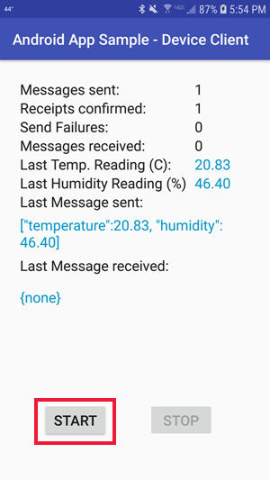

# Quickstart: Send IoT telemetry from an Android device

[!INCLUDE [iot-hub-quickstarts-1-selector](../../includes/iot-hub-quickstarts-1-selector.md)]

IoT Hub is an Azure service that enables you to ingest high volumes of telemetry from your IoT devices into the cloud for storage or processing. In this quickstart, you send telemetry to an IoT Hub from an Android application running on a physical or simulated device.

The quickstart uses a pre-written Android application to send the telemetry. The telemetry will be read from the IoT Hub using the Azure Cloud Shell. Before you run the application, you create an IoT hub and register a device with the hub.

[!INCLUDE [cloud-shell-try-it.md](../../includes/cloud-shell-try-it.md)]

If you don’t have an Azure subscription, create a [free account](https://azure.microsoft.com/free/?WT.mc_id=A261C142F) before you begin.

## Prerequisites

* Android studio from https://developer.android.com/studio/. For more information regarding Android Studio installation, see [android-installation](https://developer.android.com/studio/install).

* Android SDK 27 is used by the sample in this article.

* Run the following command to add the Microsoft Azure IoT Extension for Azure CLI to your Cloud Shell instance. The IOT Extension adds IoT Hub, IoT Edge, and IoT Device Provisioning Service (DPS) specific commands to Azure CLI.

   ```azurecli-interactive
   az extension add --name azure-cli-iot-ext
   ```

* The [sample Android application](https://github.com/Azure-Samples/azure-iot-samples-java/tree/master/iot-hub/Samples/device/AndroidSample) you run in this quickstart is part of the azure-iot-samples-java repository on GitHub. Download or clone the [azure-iot-samples-java](https://github.com/Azure-Samples/azure-iot-samples-java) repository.

## Create an IoT hub

[!INCLUDE [iot-hub-include-create-hub](../../includes/iot-hub-include-create-hub.md)]

## Register a device

A device must be registered with your IoT hub before it can connect. In this quickstart, you use the Azure Cloud Shell to register a simulated device.

1. Run the following command in Azure Cloud Shell to create the device identity.

   **YourIoTHubName**: Replace this placeholder below with the name you choose for your IoT hub.

   **MyAndroidDevice**: MyAndroidDevice is the name given for the registered device. Use MyAndroidDevice as shown. If you choose a different name for your device, you will also need to use that name throughout this article, and update the device name in the sample applications before you run them.

    ```azurecli-interactive
    az iot hub device-identity create --hub-name YourIoTHubName --device-id MyAndroidDevice
    ```

2. Run the following commands in Azure Cloud Shell to get the _device connection string_ for the device you just registered:

    **YourIoTHubName**: Replace this placeholder below with the name you choose for your IoT hub.

    ```azurecli-interactive
    az iot hub device-identity show-connection-string --hub-name YourIoTHubName --device-id MyAndroidDevice --output table
    ```

    Make a note of the device connection string, which looks like:

   `HostName={YourIoTHubName}.azure-devices.net;DeviceId=MyAndroidDevice;SharedAccessKey={YourSharedAccessKey}`

    You use this value later in this quickstart to send telemetry.

## Send telemetry

1. Open the GitHub sample Android project in Android Studio. The project is located in the following directory of your cloned or downloaded copy of [azure-iot-sample-java](https://github.com/Azure-Samples/azure-iot-samples-java) repository.

        \azure-iot-samples-java\iot-hub\Samples\device\AndroidSample

2. In Android Studio, open *gradle.properties* for the sample project and replace the **Device_Connection_String** placeholder with your device connection string you noted earlier.

    ```
    DeviceConnectionString=HostName={YourIoTHubName}.azure-devices.net;DeviceId=MyNodeDevice;SharedAccessKey={YourSharedAccessKey}
    ```

3. In Android Studio, click **File** > **Sync Project with Gradle Files**. Verify the build completes.

   > [!NOTE]
   > If the project sync fails, it may be for one of the following reasons:
   >
   > * The versions of the Android Gradle plugin and Gradle referenced in the project are out of date for your version of Android Studio. Follow [these instructions](https://developer.android.com/studio/releases/gradle-plugin) to reference and install the correct versions of the plugin and Gradle for your installation.
   > * The license agreement for the Android SDK has not been signed. Follow the instructions in the Build output to sign the license agreement and download the SDK.

4. Once the build has completed, click **Run** > **Run 'app'**. Configure the app to run on a physical Android device or an Android emulator. For more information on running an Android app on a physical device or emulator, see [Run your app](https://developer.android.com/training/basics/firstapp/running-app).

5. Once the app loads, click the **Start** button to start sending telemetry to your IoT Hub:

    


## Read the telemetry from your hub

In this section, you will use the Azure Cloud Shell with the [IoT extension](https://docs.microsoft.com/cli/azure/ext/azure-cli-iot-ext/iot?view=azure-cli-latest) to monitor the device messages that are sent by the Android device.

1. Using the Azure Cloud Shell, run the following command to connect and read messages from your IoT hub:

   **YourIoTHubName**: Replace this placeholder below with the name you choose for your IoT hub.

    ```azurecli-interactive
    az iot hub monitor-events --hub-name YourIoTHubName --output table
    ```

    The following screenshot shows the output as the IoT hub receives telemetry sent by the Android device:

      
## Clean up resources

[!INCLUDE [iot-hub-quickstarts-clean-up-resources](../../includes/iot-hub-quickstarts-clean-up-resources.md)]

## Next steps

In this quickstart, you've setup an IoT hub, registered a device, sent simulated telemetry to the hub using an Android application, and read the telemetry from the hub using the Azure Cloud Shell.

To learn how to control your simulated device from a back-end application, continue to the next quickstart.

> [!div class="nextstepaction"]
> [Quickstart: Control a device connected to an IoT hub](quickstart-control-device-android.md)