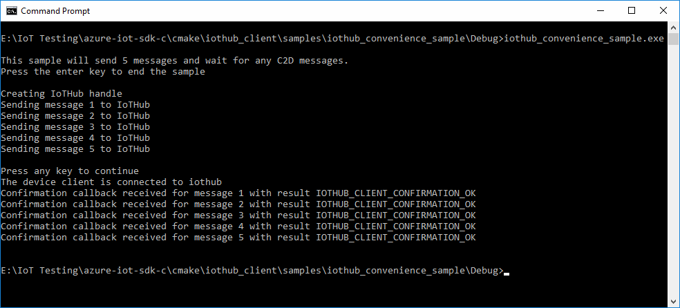
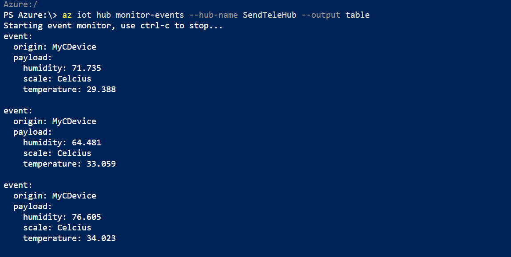

# Quickstart: Send telemetry from a device to an IoT hub and read the telemetry from the hub with a back-end application (C)

[!INCLUDE [iot-hub-quickstarts-1-selector](../../includes/iot-hub-quickstarts-1-selector.md)]

IoT Hub is an Azure service that enables you to ingest high volumes of telemetry from your IoT devices into the cloud for storage or processing. In this quickstart, you send telemetry from a simulated device application, through IoT Hub, to a back-end application for processing.

The quickstart uses a C sample application from the [Azure IoT device SDK for C](iot-hub-device-sdk-c-intro.md) to send telemetry to an IoT hub. The Azure IoT device SDKs are written in [ANSI C (C99)](https://wikipedia.org/wiki/C99) for portability and broad platform compatibility. Before running the sample code, you will create an IoT hub and register the simulated device with that hub.

This article written for Windows but you can complete this quickstart on Linux as well.

[!INCLUDE [cloud-shell-try-it.md](../../includes/cloud-shell-try-it.md)]

If you don’t have an Azure subscription, create a [free account](https://azure.microsoft.com/free/?WT.mc_id=A261C142F) before you begin.

## Prerequisites

* Install [Visual Studio 2017](https://www.visualstudio.com/vs/) with the ['Desktop development with C++'](https://www.visualstudio.com/vs/support/selecting-workloads-visual-studio-2017/) workload enabled.
* Install the latest version of [Git](https://git-scm.com/download/).

## Prepare the development environment

For this quickstart, you will be using the [Azure IoT device SDK for C](iot-hub-device-sdk-c-intro.md). 

You can use the SDK by installing the packages and libraries for the following environments:

* **Linux**: apt-get packages are available for Ubuntu 16.04 and 18.04 using the following CPU architectures: amd64, arm64, armhf and i386. For more information, see [Using apt-get to create a C device client project on Ubuntu](https://github.com/Azure/azure-iot-sdk-c/blob/master/doc/ubuntu_apt-get_sample_setup.md).

* **mbed**: For developers creating device applications on the mbed platform, we have published a library and samples that will get you started in minutes witH Azure IoT Hub. For more information, see [Use the mbed library](https://github.com/Azure/azure-iot-sdk-c/blob/master/iothub_client/readme.md#mbed).

* **Arduino**: If you are developing on Arduino, you can leverage the Azure IoT library available in the Arduino IDE library manager. For more information, see [The Azure IoT Hub library for Arduino](https://github.com/azure/azure-iot-arduino).

* **iOS**: The IoT Hub Device SDK is available as CocoaPods for Mac and iOS device development. For more information, see [iOS Samples for Microsoft Azure IoT](https://cocoapods.org/pods/AzureIoTHubClient).

However, in this quickstart, you will prepare a development environment used to clone and build the [Azure IoT C SDK](https://github.com/Azure/azure-iot-sdk-c) from GitHub. The SDK on GitHub includes the sample code used in this quickstart. 


1. Download the version 3.11.4 of the [CMake build system](https://cmake.org/download/). Verify the downloaded binary using the corresponding cryptographic hash value. The following example used Windows PowerShell to verify the cryptographic hash for version 3.11.4 of the x64 MSI distribution:

    ```PowerShell
    PS C:\Downloads> $hash = get-filehash .\cmake-3.11.4-win64-x64.msi
    PS C:\Downloads> $hash.Hash -eq "56e3605b8e49cd446f3487da88fcc38cb9c3e9e99a20f5d4bd63e54b7a35f869"
    True
    ```
    
    The following hash values for version 3.11.4 were listed on the CMake site at the time of this writing:

    ```
    6dab016a6b82082b8bcd0f4d1e53418d6372015dd983d29367b9153f1a376435  cmake-3.11.4-Linux-x86_64.tar.gz
    72b3b82b6d2c2f3a375c0d2799c01819df8669dc55694c8b8daaf6232e873725  cmake-3.11.4-win32-x86.msi
    56e3605b8e49cd446f3487da88fcc38cb9c3e9e99a20f5d4bd63e54b7a35f869  cmake-3.11.4-win64-x64.msi
    ```

    It is important that the Visual Studio prerequisites (Visual Studio and the 'Desktop development with C++' workload) are installed on your machine, **before** starting the `CMake` installation. Once the prerequisites are in place, and the download is verified, install the CMake build system.

2. Open a command prompt or Git Bash shell. Execute the following command to clone the [Azure IoT C SDK](https://github.com/Azure/azure-iot-sdk-c) GitHub repository:
    
    ```cmd/sh
    git clone https://github.com/Azure/azure-iot-sdk-c.git --recursive
    ```
    The size of this repository is currently around 220 MB. You should expect this operation to take several minutes to complete.


3. Create a `cmake` subdirectory in the root directory of the git repository, and navigate to that folder. 

    ```cmd/sh
    cd azure-iot-sdk-c
    mkdir cmake
    cd cmake
    ```

4. Run the following command that builds a version of the SDK specific to your development client platform. A Visual Studio solution for the simulated device will be generated in the `cmake` directory. 

    ```cmd
    cmake ..
    ```
    
    If `cmake` does not find your C++ compiler, you might get build errors while running the above command. If that happens, try running this command in the [Visual Studio command prompt](https://docs.microsoft.com/dotnet/framework/tools/developer-command-prompt-for-vs). 

    Once the build succeeds, the last few output lines will look similar to the following output:

    ```cmd/sh
    $ cmake ..
    -- Building for: Visual Studio 15 2017
    -- Selecting Windows SDK version 10.0.16299.0 to target Windows 10.0.17134.
    -- The C compiler identification is MSVC 19.12.25835.0
    -- The CXX compiler identification is MSVC 19.12.25835.0

    ...

    -- Configuring done
    -- Generating done
    -- Build files have been written to: E:/IoT Testing/azure-iot-sdk-c/cmake
    ```


## Create an IoT hub

[!INCLUDE [iot-hub-quickstarts-create-hub](../../includes/iot-hub-quickstarts-create-hub.md)]

## Register a device

A device must be registered with your IoT hub before it can connect. In this section, you will use the Azure CLI with the [IoT extension](https://docs.microsoft.com/cli/azure/ext/azure-cli-iot-ext/iot?view=azure-cli-latest) to register a simulated device.

1. Add the IoT Hub CLI extension and create the device identity. Replace `{YourIoTHubName}` with the name you chose for your IoT hub:

    ```azurecli-interactive
    az extension add --name azure-cli-iot-ext
    az iot hub device-identity create --hub-name {YourIoTHubName} --device-id MyCDevice
    ```

    If you choose a different name for your device, update the device name in the sample applications before you run them.

2. Run the following command to get the _device connection string_ for the device you just registered:

    ```azurecli-interactive
    az iot hub device-identity show-connection-string --hub-name {YourIoTHubName} --device-id MyCDevice --output table
    ```

    Make a note of the device connection string, which looks like `Hostname=...=`. You use this value later in the quickstart.


## Send simulated telemetry

The simulated device application connects to a device-specific endpoint on your IoT hub and sends a string as simulated telemetry.

1. Using a text editor, open the iothub_convenience_sample.c source file and review the sample code for sending telemetry. The file is located in the following location:

    ```
    \azure-iot-sdk-c\iothub_client\samples\iothub_convenience_sample\iothub_convenience_sample.c
    ```

2. Find the declaration of the `connectionString` constant:

    ```C
    /* Paste in your device connection string  */
    static const char* connectionString = "[device connection string]";
    ```
    Replace the value of the `connectionString` constant with the device connection string you made a note of previously. Then save your changes to **iothub_convenience_sample.c**.

3. In a terminal window, navigate to the *iothub_convenience_sample* project directory in the CMake directory that you created in the Azure IoT C SDK.

    ```
    cd /azure-iot-sdk-c/cmake/iothub_client/samples/iothub_convenience_sample
    ```

4. Run CMake using the following command line to build the sample with your updated `connectionString` value:

    ```cmd/sh
    cmake --build . --target iothub_convenience_sample --config Debug
    ```

5. In a command prompt, run the following command to run the simulated device application:

    ```cmd/sh
    Debug\iothub_convenience_sample.exe
    ```

    The following screenshot shows the output as the simulated device application sends telemetry to the IoT hub:

    

## Read the telemetry from your hub


In this section, you will use the Azure CLI with the [IoT extension](https://docs.microsoft.com/cli/azure/ext/azure-cli-iot-ext/iot?view=azure-cli-latest) to monitor the device messages that are sent by the simulated device.

1. Using the Azure CLI, run the following command to connect and read messages from your IoT hub:

    ```azurecli-interactive
    az iot hub monitor-events --hub-name {YourIoTHubName} --output table
    ```

    

    

## Clean up resources

[!INCLUDE [iot-hub-quickstarts-clean-up-resources](../../includes/iot-hub-quickstarts-clean-up-resources.md)]

## Next steps

In this quickstart, you've setup an IoT hub, registered a device, sent simulated telemetry to the hub using a C application, and read the telemetry from the hub using the Azure CLI.

To learn more about developing with the Azure IoT Hub C SDK, continue to the following How-to guide:

> [!div class="nextstepaction"]
> [Develop using Azure IoT Hub C SDK](iot-hub-devguide-develop-for-constrained-devices.md)